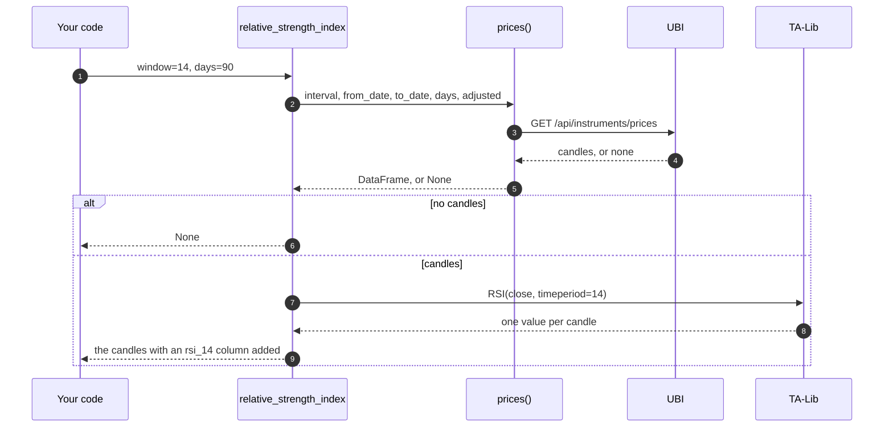
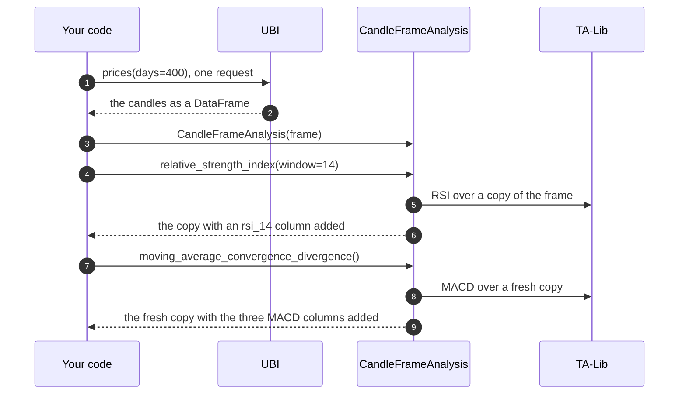

# Analysis

Every instrument object can analyse its own price history. A share, an index or a commodity future has 193 analysis methods: moving averages, oscillators, candlestick pattern detectors, summary statistics, crossover signals and a backtest runner. You call one on the instrument, such as `reliance.relative_strength_index(window=14, days=90)`, and it fetches the candles from UBI, runs the calculation and hands back the candles with the result added as a new column.

The methods are not written on `Instrument` itself. They live in thirteen small classes under `src/tradingmachine/assets/analysis/`, one per group of related calculations, and `Instrument` inherits all thirteen. So does [`CandleFrameAnalysis`](#analysing-candles-you-already-have), which runs the same methods over candles you already hold instead of fetching them from UBI. Most of the calculations come from [TA-Lib](https://ta-lib.org/), a widely used C library of technical indicators, and follow its function groups; the statistics, the signals and the backtest are this library's own.

## How a method works

Every analysis method that works on candles follows the same four steps, which the sequence diagram below traces for `relative_strength_index`.



Three things follow from this design, and each is worth knowing before you call the methods in a loop.

1. **Each call fetches its own candles.** Two indicators on the same instrument send two requests. That is deliberate: UBI runs on the same machine and keeps its own copy of the candles in Redis, so a repeated request is cheap, and the library keeps no cache of its own. When you need many indicators over the same candles, read them once and use [`CandleFrameAnalysis`](#analysing-candles-you-already-have).
2. **No candles means `None`, not an error.** When UBI has no candles for the range, `prices` returns `None`, and so does every method built on it. That is what happens for every instrument in a family UBI stores no candles for, as the [table below](#which-instruments-have-candles) shows.
3. **The early rows are empty.** An indicator needs a run of candles before it has a value, so the first rows of its column are `NaN`. A 14-candle RSI has nothing for its first 14 rows, and the Hilbert transform indicators need 32 to 63 candles before their first value. Ask for a longer range than the window you want to look at.

## The common arguments

Every method that fetches candles takes the same five arguments as [`prices`](../python-api/market-data.md#prices), after its own. The table below lists them. Give either `days`, or `from_date` and `to_date`, but not both.

| Name | Type | Default | Description |
|---|---|---|---|
| `interval` | `str` | `"day"` | The candle length, such as `day` or `5minute` |
| `from_date` | `datetime.date` or `str` | `None` | The first day of the range, as a date or `YYYY-MM-DD` |
| `to_date` | `datetime.date` or `str` | `None` | The last day of the range |
| `days` | `int` | `None` | The number of days to count back from today |
| `adjusted` | `bool` | `True` | Whether prices are adjusted for splits and bonuses, for the segments UBI adjusts |

Each method's own arguments use the library's spelled-out names rather than TA-Lib's. The window length is `window`, not TA-Lib's `timeperiod` and not `period`, and the candle column to work on is `column`, which defaults to `close`.

!!! warning "The window argument is `window`"
    Passing a name the method does not have fails in Python before any request is sent. The error below was captured on 2026-09-26 from `reliance.simple_moving_average(period=5)`.

    ```text
    TypeError: OverlapStudies.simple_moving_average() got an unexpected keyword argument 'period'
    ```

    The correct call is `reliance.simple_moving_average(window=5, days=90)`.

## The thirteen classes

The table below lists the thirteen analysis classes in the order `Instrument` inherits them, with the number of public methods in each. The counts were taken from the code with a short script on 2026-09-26, after `mulloy_triple_exponential_moving_average` was added, and add up to 193.

| Class | Module | Methods | What it holds | Each method returns | Page |
|---|---|--:|---|---|---|
| `PriceStatistics` | `price_statistics` | 39 | Highs, lows, means, spreads and quantiles of prices, volumes and returns | A number, a summary, a histogram or a narrowed frame | [Statistics](statistics.md#price-statistics) |
| `OverlapStudies` | `overlap_studies` | 13 | Moving averages, Bollinger bands, parabolic SAR | The candles with columns added | [Indicators](indicators.md#overlap-studies) |
| `MomentumIndicators` | `momentum_indicators` | 28 | MACD, RSI, ADX, stochastics and other oscillators | The candles with columns added | [Indicators](indicators.md#momentum-indicators) |
| `VolumeIndicators` | `volume_indicators` | 3 | Chaikin accumulation distribution, on balance volume | The candles with a column added | [Indicators](indicators.md#volume-indicators) |
| `CycleIndicators` | `cycle_indicators` | 6 | The Hilbert transform family | The candles with columns added | [Indicators](indicators.md#cycle-indicators) |
| `PriceTransforms` | `price_transforms` | 4 | Average, median and typical price, weighted close | The candles with a column added | [Statistics](statistics.md#price-transforms) |
| `VolatilityIndicators` | `volatility_indicators` | 3 | True range and average true range | The candles with a column added | [Indicators](indicators.md#volatility-indicators) |
| `StatisticFunctions` | `statistic_functions` | 8 | Beta, correlation, linear regression, standard deviation | The candles with columns added | [Statistics](statistics.md#statistic-functions) |
| `MathTransforms` | `math_transforms` | 15 | Trigonometric, logarithmic and rounding functions | The candles with a column added | [Statistics](statistics.md#math-transforms) |
| `MathOperators` | `math_operators` | 10 | Adding, dividing, rolling highs and lows | The candles with columns added | [Statistics](statistics.md#math-operators) |
| `CandlestickPatterns` | `candlestick_patterns` | 61 | TA-Lib's candlestick pattern recognisers | The candles with a column of 100, -100 or 0 | [Patterns](patterns.md) |
| `Signals` | `signals` | 2 | Crossovers and crossunders between two columns | A copy of your frame with a bool column | [Signals and backtests](signals-and-backtests.md#signals) |
| `StrategyBacktests` | `strategy_backtests` | 1 | A backtest of a `backtesting` strategy | A pandas Series of statistics | [Signals and backtests](signals-and-backtests.md#backtests) |

All thirteen inherit a small base class, `PriceAnalysis`, which declares `prices` and raises `NotImplementedError` from it. That lets each module be written and read on its own, without importing the instrument classes. `Instrument` supplies the real `prices`, which reads UBI, and `CandleFrameAnalysis` supplies one that hands back a copy of candles you gave it.

The chart below shows the same counts. Candlestick patterns and price statistics make up more than half of the total.

```vegalite
{
  "$schema": "https://vega.github.io/schema/vega-lite/v5.json",
  "description": "Number of public methods in each of the thirteen analysis classes.",
  "width": "container",
  "height": 340,
  "data": {
    "values": [
      {"class": "CandlestickPatterns", "methods": 61, "source": "TA-Lib"},
      {"class": "PriceStatistics", "methods": 39, "source": "pandas"},
      {"class": "MomentumIndicators", "methods": 28, "source": "TA-Lib"},
      {"class": "MathTransforms", "methods": 15, "source": "TA-Lib"},
      {"class": "OverlapStudies", "methods": 13, "source": "TA-Lib"},
      {"class": "MathOperators", "methods": 10, "source": "TA-Lib"},
      {"class": "StatisticFunctions", "methods": 8, "source": "TA-Lib"},
      {"class": "CycleIndicators", "methods": 6, "source": "TA-Lib"},
      {"class": "PriceTransforms", "methods": 4, "source": "TA-Lib"},
      {"class": "VolumeIndicators", "methods": 3, "source": "TA-Lib"},
      {"class": "VolatilityIndicators", "methods": 3, "source": "TA-Lib"},
      {"class": "Signals", "methods": 2, "source": "pandas"},
      {"class": "StrategyBacktests", "methods": 1, "source": "backtesting"}
    ]
  },
  "mark": {"type": "bar", "tooltip": true},
  "encoding": {
    "y": {"field": "class", "type": "nominal", "sort": "-x", "title": null},
    "x": {"field": "methods", "type": "quantitative", "title": "Public methods"},
    "color": {"field": "source", "type": "nominal", "title": "Calculated with", "legend": {"orient": "bottom"}}
  }
}
```

## Which instruments have candles

An analysis method can only work where UBI stores candles, and it stores them for a minority of segments. The table below lists what is known, family by family. [Asset classes](../asset-classes/index.md) has the full matrix.

| Family | Classes with candles | Classes without |
|---|---|---|
| [Equities](../asset-classes/equities.md) | `Equity` (adjusted, with `price_factor`), `EquityIndex` | The four derivative classes have not been checked |
| [Fixed income](../asset-classes/fixed-income.md) | none | all six |
| [Commodities](../asset-classes/commodities.md) | the four derivative classes | `Commodity`, `CommodityIndex` |
| [Currencies](../asset-classes/currencies.md) | none | all six |
| [Funds and trusts](../asset-classes/funds.md) | `ExchangeTradedFund` (adjusted, with `price_factor`) | `InvestmentTrust` |
| [Mutual funds](../asset-classes/mutual-funds.md) | none | `MutualFund` |

UBI's daily job loads only `day` candles. Intraday intervals such as `5minute` are loaded into UBI by hand, so an intraday call usually returns `None` unless someone has loaded that instrument; on 2026-09-26, `prices(interval="5minute", days=1)` on RELIANCE returned `None`. UBI's page on [price history](https://pramodathani.github.io/unified_broker_interface/pipelines/price-history/) explains what is loaded and from which broker.

## A first example

The example below adds a 20-day simple moving average to RELIANCE's candles and marks the days its close crossed above it. It was not run for this page, because it needs a live UBI; the calls are taken from the method signatures.

```python
from tradingmachine.assets import equities

reliance = equities.Equity(exchange="nse", symbol="RELIANCE")

frame = reliance.simple_moving_average(window=20, days=365)
crossings = reliance.is_cross_over(frame, "close", "sma_20")
print(crossings[crossings["cross_over"]][["datetime", "close", "sma_20"]])
```

The first call returns the candles with an `sma_20` column. The second marks, in a new `cross_over` column, each row where the close was at or below the average on the previous row and above it on this one.

## Analysing candles you already have

`CandleFrameAnalysis` runs every analysis method over one DataFrame of candles that you give it, instead of fetching candles from UBI for each call. It inherits the same thirteen classes in the same order as `Instrument`, so it has all 193 methods, with the same names, arguments and columns. It lives in `tradingmachine.assets.analysis.candle_frame_analysis`.

It exists for programs that compute many indicators over the same candles. A chart that shows twelve indicators would otherwise send twelve requests for the same candles, and a screener that computes eight figures for each of 750 shares would send 6,000. It also keeps a chart's warm-up history: a program can read extra candles before the range it shows, so that a 200-day average has values from the first candle on screen, compute everything over the longer frame, and then trim the extra rows away, which a method that fetches its own range cannot do.

The sequence diagram below shows the difference from [How a method works](#how-a-method-works): UBI is asked once, and every method after that works on a copy of the same candles.



The rules below govern what it accepts and returns.

- **The frame should look like the output of [`prices`](../python-api/market-data.md#prices).** The indicators read only `open`, `high`, `low`, `close` and `volume`, but the summaries, `beta` and `correlation_coefficient` also line rows up by `exchange`, `segment`, `interval` and `datetime`, so pass all of them. [`PricesDocument.frame`](../python-api/read-only-market-data.md#frame) builds exactly that shape from candles read by instrument id.
- **Your frame is never changed.** The constructor copies the frame, and each method call works on its own fresh copy, so one call's added columns never appear in another's result.
- **The range is fixed by the frame.** A method given `from_date`, `to_date` or `days` raises `ValueError`, rather than quietly answering for the whole frame. `interval` and `adjusted` are accepted and ignored, because the frame already has them.
- **An empty frame means every method returns `None`**, just as it does for an instrument with no candles.
- **Missing volume is yours to fill.** UBI stores some volumes as null, and TA-Lib carries a missing volume forward into every later value of on-balance volume, the accumulation/distribution line and its oscillator, and the money flow index. Fill missing volume with zero before building the frame if you want it counted as none traded.

The example below reads 400 days of RELIANCE's candles once and computes three indicators from them. It was not run for this page, but all 188 methods that need no argument were run on RELIANCE's 743 real daily candles on 2026-09-26, without error and without changing the frame.

```python
from tradingmachine.assets import equities
from tradingmachine.assets.analysis import candle_frame_analysis

reliance = equities.Equity(exchange="nse", symbol="RELIANCE")
frame = reliance.prices(days=400)
frame["volume"] = frame["volume"].fillna(0)

analysis = candle_frame_analysis.CandleFrameAnalysis(frame)
rsi = analysis.relative_strength_index(window=14)["rsi_14"]
macd = analysis.moving_average_convergence_divergence()
tema = analysis.mulloy_triple_exponential_moving_average(window=20)["tema_20"]
```

The five methods that need an argument still work. `beta` and `correlation_coefficient` take a benchmark, which can be another `CandleFrameAnalysis` over the benchmark's candles, `is_cross_over` and `is_cross_under` take a frame and two column names, and `run_backtest` takes a `backtesting` strategy.

## The pages in this section

Each page lists every method in its groups, with the method's own arguments and the column it adds.

<div class="grid cards" markdown>

-   :material-chart-bell-curve-cumulative:{ .lg .middle } **Indicators**

    ---

    Overlap studies, momentum, volume, volatility and cycle indicators: 53 methods.

    [:octicons-arrow-right-24: Indicators](indicators.md)

-   :material-candle:{ .lg .middle } **Candlestick patterns**

    ---

    The 61 pattern recognisers and what their 100, -100 and 0 values mean.

    [:octicons-arrow-right-24: Candlestick patterns](patterns.md)

-   :material-sigma:{ .lg .middle } **Statistics and transforms**

    ---

    Price statistics, statistic functions, math operators and transforms, and price transforms: 76 methods.

    [:octicons-arrow-right-24: Statistics and transforms](statistics.md)

-   :material-swap-vertical:{ .lg .middle } **Signals and backtests**

    ---

    Crossover detection and running a `backtesting` strategy over an instrument's candles.

    [:octicons-arrow-right-24: Signals and backtests](signals-and-backtests.md)

</div>
