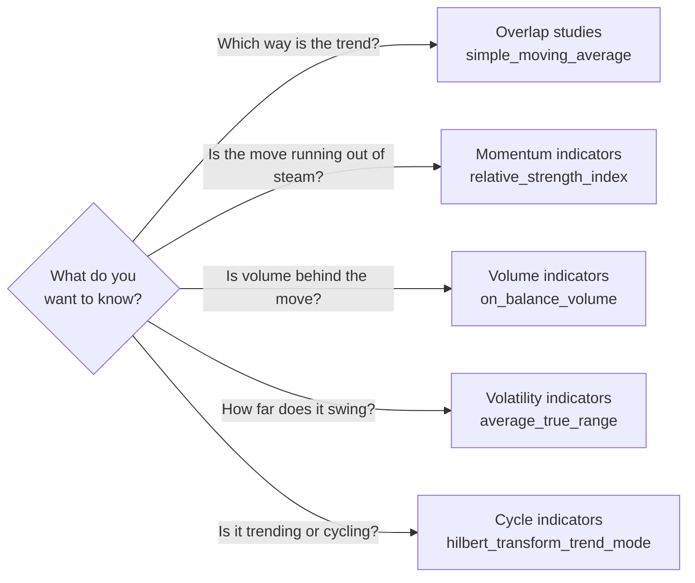

# Indicators

Technical indicators are calculations over a run of candles that traders read as signs of trend, momentum or volatility. This page lists the 53 indicator methods every instrument inherits, in five groups that follow TA-Lib's own grouping. Each method fetches the instrument's candles through [`prices`](../python-api/market-data.md#prices), runs one TA-Lib function over them, and returns the candles with one or more columns added, or `None` when UBI has no candles for the range.

The table below shows the five groups and what each is for.

| Group | Class | Methods | What it measures |
|---|---|--:|---|
| [Overlap studies](#overlap-studies) | `OverlapStudies` | 13 | Averages and bands drawn on the same scale as the price |
| [Momentum indicators](#momentum-indicators) | `MomentumIndicators` | 28 | How fast and how strongly the price is moving |
| [Volume indicators](#volume-indicators) | `VolumeIndicators` | 3 | Whether volume confirms the price's moves |
| [Volatility indicators](#volatility-indicators) | `VolatilityIndicators` | 3 | How far the price ranges from candle to candle |
| [Cycle indicators](#cycle-indicators) | `CycleIndicators` | 6 | Repeating cycles, found with the Hilbert transform |

The flowchart below is a rough guide to which group answers which question, with one commonly used method from each.



## Arguments every method shares

Every method on this page also takes the five range arguments of `prices`, which are `interval`, `from_date`, `to_date`, `days` and `adjusted`. They are left out of the tables below to keep them readable, and [Analysis](index.md#the-common-arguments) describes them. Pass every argument by keyword, as in `simple_moving_average(window=20, days=365)`, because the argument order is not the same from method to method.

The tables use the library's argument names, which spell out TA-Lib's. The table below maps the ones that differ most.

| This library | TA-Lib |
|---|---|
| `window` | `timeperiod` |
| `fast_period`, `slow_period`, `signal_period` | `fastperiod`, `slowperiod`, `signalperiod` |
| `moving_average_type` | `matype` |
| `fast_k_period`, `slow_k_period`, `slow_d_period`, `fast_d_period` | `fastk_period`, `slowk_period`, `slowd_period`, `fastd_period` |
| `standard_deviations_up`, `standard_deviations_down` | `nbdevup`, `nbdevdn` |
| `volume_factor` | `vfactor` |
| `fast_limit`, `slow_limit` | `fastlimit`, `slowlimit` |

Several methods take a moving average type, an integer that chooses which kind of average TA-Lib uses inside the calculation. The values are TA-Lib's own, as the table below lists; `0`, a simple moving average, is the default everywhere.

| Value | Moving average |
|--:|---|
| 0 | Simple |
| 1 | Exponential |
| 2 | Weighted |
| 3 | Double exponential |
| 4 | Triple exponential |
| 5 | Triangular |
| 6 | Kaufman adaptive |
| 7 | MESA adaptive |
| 8 | Triple generalised double exponential (T3) |

## The methods

The tabs below hold one table per group. The "Columns added" column gives each new column's name, in which a placeholder such as `<window>` is replaced by the argument's value, so `relative_strength_index(window=14)` adds `rsi_14`.

=== "Overlap studies"

    Overlap studies are drawn on the same scale as the price, so they can be plotted over the candles. Moving averages smooth the price, Bollinger bands put an envelope around it, and the parabolic SAR marks a trailing stop level.

    | Method | What it adds | Own arguments and defaults | TA-Lib function | Columns added |
    |---|---|---|---|---|
    | `simple_moving_average` | Adds the simple moving average of one candle column | `window=10`, `column='close'` | `SMA` | `sma_<window>` |
    | `exponential_moving_average` | Adds the exponential moving average of one candle column | `window=10`, `column='close'` | `EMA` | `ema_<window>` |
    | `bollinger_bands` | Adds the upper, middle and lower Bollinger bands of one candle column | `window=10`, `standard_deviations_up=2`, `standard_deviations_down=2`, `column='close'` | `BBANDS` | `bb_upper_<window>`, `bb_middle_<window>`, `bb_lower_<window>` |
    | `weighted_moving_average` | Adds the weighted moving average of one candle column | `window=10`, `column='close'` | `WMA` | `wma_<window>` |
    | `double_exponential_moving_average` | Adds the double exponential moving average of one candle column | `window=10`, `column='close'` | `DEMA` | `dema_<window>` |
    | `triple_exponential_moving_average` | Adds Tillson's T3 triple exponential moving average of one candle column | `window=10`, `volume_factor=0.7`, `column='close'` | `T3` | `t3_<window>` |
    | `mulloy_triple_exponential_moving_average` | Adds Patrick Mulloy's triple exponential moving average (TEMA) of one candle column | `window=10`, `column='close'` | `TEMA` | `tema_<window>` |
    | `kaufman_adaptive_moving_average` | Adds the Kaufman adaptive moving average of one candle column | `window=10`, `column='close'` | `KAMA` | `kama_<window>` |
    | `mesa_adaptive_moving_average` | Adds the MESA adaptive moving average and its following average of one candle column | `fast_limit=0.5`, `slow_limit=0.05`, `column='close'` | `MAMA` | `mama`, `fama` |
    | `triangular_moving_average` | Adds the triangular moving average of one candle column | `window=10`, `column='close'` | `TRIMA` | `trima_<window>` |
    | `parabolic_sar` | Adds the parabolic stop and reverse from the high and low columns | `acceleration=0.02`, `maximum=0.2` | `SAR` | `psar` |
    | `mid_point` | Adds the midpoint of the highest and lowest value of one candle column over each window | `window=10`, `column='close'` | `MIDPOINT` | `mid_point_<window>` |
    | `middle_price` | Adds the midpoint of the highest high and lowest low over each window | `window=10` | `MIDPRICE` | `middle_price_<window>` |

    !!! warning "`triple_exponential_moving_average` is Tillson's T3, not TEMA"
        Two different indicators go by the name "triple exponential moving average", and the method with that name computes the less common one. The table below tells them apart.

        | Method | Indicator | How it is calculated | TA-Lib function | Column |
        |---|---|---|---|---|
        | `triple_exponential_moving_average` | Tim Tillson's T3 | Six exponential moving averages in a row, blended by `volume_factor` | `T3` | `t3_<window>` |
        | `mulloy_triple_exponential_moving_average` | Patrick Mulloy's TEMA, the one most charting tools show | Three times an exponential moving average, less three times its double smoothing, plus its triple smoothing | `TEMA` | `tema_<window>` |

        The T3 method kept its name from the old project, because renaming it would break every caller, and `mulloy_triple_exponential_moving_average` was added on 2026-09-26 for the TEMA. When your numbers must match a charting tool's "TEMA" line, call the Mulloy method.

=== "Momentum indicators"

    Momentum indicators measure how fast the price is moving and whether that speed is growing or fading. Most of them are oscillators that move between fixed bounds, such as the relative strength index between 0 and 100.

    | Method | What it adds | Own arguments and defaults | TA-Lib function | Columns added |
    |---|---|---|---|---|
    | `moving_average_convergence_divergence` | Adds the moving average convergence divergence line, its signal line and their difference | `fast_period=12`, `slow_period=26`, `signal_period=9`, `column='close'` | `MACD` | `macd_<fast>_<slow>_<signal>`, `macd_<fast>_<slow>_<signal>_signal`, `macd_<fast>_<slow>_<signal>_hist` |
    | `average_directional_movement_index` | Adds the average directional movement index | `window=14` | `ADX` | `adx_<window>` |
    | `momentum` | Adds the momentum of one candle column, its change over each window | `window=14`, `column='close'` | `MOM` | `momentum_<window>` |
    | `commodity_channel_index` | Adds the commodity channel index | `window=14` | `CCI` | `cci_<window>` |
    | `average_directional_movement_index_rating` | Adds the average directional movement index rating | `window=10` | `ADXR` | `adxr_<window>` |
    | `absolute_price_oscillator` | Adds the absolute price oscillator, the difference between a fast and a slow moving average | `fast_period=12`, `slow_period=26`, `moving_average_type=0`, `column='close'` | `APO` | `apo_<fast>_<slow>` |
    | `aroon` | Adds the Aroon down and Aroon up lines | `window=10` | `AROON` | `aroon_down_<window>`, `aroon_up_<window>` |
    | `aroon_oscillator` | Adds the Aroon oscillator, Aroon up minus Aroon down | `window=10` | `AROONOSC` | `aroon_osc_<window>` |
    | `balance_of_power` | Adds the balance of power | none | `BOP` | `bop` |
    | `chande_momentum_oscillator` | Adds the Chande momentum oscillator of one candle column | `window=10`, `column='close'` | `CMO` | `cmo_<window>` |
    | `directional_movement_index` | Adds the directional movement index | `window=10` | `DX` | `dx_<window>` |
    | `moving_average_convergence_divergence_extended` | Adds the moving average convergence divergence with a chosen moving average type for each of its three averages | `fast_period=12`, `fast_moving_average_type=0`, `slow_period=26`, `slow_moving_average_type=0`, `signal_period=9`, `signal_moving_average_type=0`, `column='close'` | `MACDEXT` | `macd_<fast>_<slow>_<signal>`, `macd_signal_<fast>_<slow>_<signal>`, `macd_hist_<fast>_<slow>_<signal>` |
    | `money_flow_index` | Adds the money flow index, a relative strength index weighted by volume | `window=14` | `MFI` | `mfi_<window>` |
    | `minus_directional_indicator` | Adds the minus directional indicator | `window=14` | `MINUS_DI` | `minus_di_<window>` |
    | `minus_directional_movement` | Adds the minus directional movement | `window=14` | `MINUS_DM` | `minus_dm_<window>` |
    | `plus_directional_indicator` | Adds the plus directional indicator | `window=14` | `PLUS_DI` | `plus_di_<window>` |
    | `plus_directional_movement` | Adds the plus directional movement | `window=14` | `PLUS_DM` | `plus_dm_<window>` |
    | `percentage_price_oscillator` | Adds the percentage price oscillator, the gap between a fast and a slow moving average as a percentage | `fast_period=12`, `slow_period=26`, `moving_average_type=0`, `column='close'` | `PPO` | `ppo<fast>_<slow>` |
    | `rate_of_change` | Adds the rate of change of one candle column as a percentage | `window=14`, `column='close'` | `ROC` | `roc_<window>` |
    | `rate_of_change_percent` | Adds the rate of change of one candle column as a fraction | `window=14`, `column='close'` | `ROCP` | `rocp_<window>` |
    | `rate_of_change_ratio` | Adds the rate of change of one candle column as a ratio | `window=14`, `column='close'` | `ROCR` | `rocr_<window>` |
    | `relative_strength_index` | Adds the relative strength index of one candle column | `window=14`, `column='close'` | `RSI` | `rsi_<window>` |
    | `stochastic_oscillator` | Adds the slow stochastic oscillator's %K and %D lines | `fast_k_period=5`, `slow_k_period=3`, `slow_k_moving_average_type=0`, `slow_d_period=3`, `slow_d_moving_average_type=0` | `STOCH` | `slowk_<slow_k_period>`, `slowd_<slow_d_period>` |
    | `stochastic_fast_oscillator` | Adds the fast stochastic oscillator's %K and %D lines | `fast_k_period=5`, `fast_d_period=3`, `fast_d_moving_average_type=0` | `STOCHF` | `stochf_fastk<fast_k_period>`, `stochf_fastd<fast_d_period>` |
    | `stochastic_relative_strength_index` | Adds the stochastic relative strength index's %K and %D lines for one candle column | `window=14`, `fast_k_period=5`, `fast_d_period=3`, `fast_d_moving_average_type=0`, `column='close'` | `STOCHRSI` | `stochrsi_fastk<fast_k_period>`, `stochrsi_fastd<fast_d_period>` |
    | `trix` | Adds TRIX, the rate of change of a triple smoothed exponential moving average of one candle column | `window=15`, `column='close'` | `TRIX` | `trix_<window>` |
    | `ultimate_oscillator` | Adds the ultimate oscillator, which blends buying pressure over three windows | `fast_period=7`, `slow_period=14`, `signal_period=28` | `ULTOSC` | `ultosc_<fast>_<slow>_<signal>` |
    | `williams_percent_r` | Adds Williams %R | `window=14` | `WILLR` | `willr_<window>` |

    A few labels are irregular, and they are kept as the old project wrote them so that existing code reading the frames still works. The two MACD methods name their signal and histogram columns differently, `ppo`, `stochf_` and `stochrsi_` labels have no underscore before their numbers, and `ultimate_oscillator` calls its short, middle and long windows `fast_period`, `slow_period` and `signal_period`. The directional movement defaults also differ: `average_directional_movement_index` uses 14 candles, while `average_directional_movement_index_rating` and `directional_movement_index` use 10.

    `stochastic_relative_strength_index` takes a separate `window` for the length of the underlying RSI, 14 by default, and passes `fast_k_period` to TA-Lib's `fastk_period`. With its defaults it matches `talib.STOCHRSI` with TA-Lib's own defaults.

=== "Volume indicators"

    Volume indicators combine price and traded volume, to show whether buying or selling pressure is behind a move. They need a `volume` column, so they are only meaningful for instruments whose candles carry real volume.

    | Method | What it adds | Own arguments and defaults | TA-Lib function | Columns added |
    |---|---|---|---|---|
    | `chaikin_accumulation_distribution_line` | Adds the Chaikin accumulation distribution line | none | `AD` | `chaikin_ad` |
    | `chaikin_accumulation_distribution_oscillator` | Adds the Chaikin accumulation distribution oscillator | `fast_period=3`, `slow_period=10` | `ADOSC` | `chaikin_adosc<fast>_<slow>` |
    | `on_balance_volume` | Adds the on balance volume, measured against one candle column | `column='close'` | `OBV` | `obv` |

=== "Volatility indicators"

    Volatility indicators measure how far the price ranges. The true range of a candle is the largest of its high minus its low and the gaps from the previous close, and the average true range smooths it over a window.

    | Method | What it adds | Own arguments and defaults | TA-Lib function | Columns added |
    |---|---|---|---|---|
    | `average_true_range` | Adds the average true range | `window=14` | `ATR` | `atr_<window>` |
    | `normalized_average_true_range` | Adds the average true range as a percentage of the close | `window=14` | `NATR` | `natr<window>` |
    | `true_range` | Adds each candle's true range | none | `TRANGE` | `tr` |

    The normalised average true range's column is `natr<window>`, without the underscore that `atr_<window>` has.

=== "Cycle indicators"

    Cycle indicators use John Ehlers' Hilbert transform to find a repeating cycle in the price and say whether the market is trending or cycling. They take no window, because the transform chooses its own.

    | Method | What it adds | Own arguments and defaults | TA-Lib function | Columns added |
    |---|---|---|---|---|
    | `hilbert_transform_dominant_cycle_period` | Adds the Hilbert transform dominant cycle period of one candle column | `column='close'` | `HT_DCPERIOD` | `ht_dcperiod` |
    | `hilbert_transform_dominant_cycle_phase` | Adds the Hilbert transform dominant cycle phase of one candle column | `column='close'` | `HT_DCPHASE` | `ht_dcphase` |
    | `hilbert_transform_phasor_components` | Adds the Hilbert transform in-phase and quadrature phasor components of one candle column | `column='close'` | `HT_PHASOR` | `inphase`, `quadrature` |
    | `hilbert_transform_sine_wave` | Adds the Hilbert transform sine wave and lead sine wave of one candle column | `column='close'` | `HT_SINE` | `sine`, `lead_sine` |
    | `hilbert_transform_trend_mode` | Adds the Hilbert transform trend mode of one candle column, 1 in a trend and 0 in a cycle | `column='close'` | `HT_TRENDMODE` | `ht_trendmode` |
    | `hilbert_transform_trend_line` | Adds the Hilbert transform instantaneous trend line of one candle column | `column='close'` | `HT_TRENDLINE` | `ht_trendline` |

    These need a long run of candles before their first value. TA-Lib 0.6.8 reports a lookback of 32 candles for `HT_DCPERIOD` and `HT_PHASOR`, and 63 for the other four, so a short range gives columns that are mostly or entirely empty.

## A worked example

The example below computes a 14-day relative strength index for the nearest MCX gold future. It was run when the commodities module was checked on 2026-09-20, against a local UBI, and returned 61 rows. The output shows the three rows that check kept, with only the `datetime`, `close` and `rsi_14` columns.

=== "Python"

    ```python
    from tradingmachine.assets import commodities

    expiries = commodities.CommodityFutures.expiries(exchange="mcx", underlying_symbol="GOLD")
    gold = commodities.CommodityFutures(exchange="mcx", underlying_symbol="GOLD", expiry_date=expiries[0])

    frame = gold.relative_strength_index(window=14, days=90)
    print(frame[["datetime", "close", "rsi_14"]])
    ```

=== "Output"

    ```text
                     datetime    close    rsi_14
    2026-09-14 00:00:00+05:30 151230.0 44.259329
    2026-09-15 00:00:00+05:30 150809.0 43.351621
    2026-09-16 00:00:00+05:30 152470.0 47.892248
    ```

An RSI below 30 is conventionally read as oversold and one above 70 as overbought, so gold's readings in the mid-forties that week were neutral.

Because every method returns the candles, you can combine two indicators by joining their new columns. The next example, which was not run for this page, keeps the days on which a share closed below its lower Bollinger band while its RSI was under 30. Each method fetches the candles again, but both requests ask for the same range, so the rows line up.

```python
from tradingmachine.assets import equities

reliance = equities.Equity(exchange="nse", symbol="RELIANCE")

bands = reliance.bollinger_bands(window=20, days=365)
strength = reliance.relative_strength_index(window=14, days=365)

frame = bands.merge(strength[["datetime", "rsi_14"]], on="datetime")
oversold = frame[(frame["close"] < frame["bb_lower_20"]) & (frame["rsi_14"] < 30)]
print(oversold[["datetime", "close", "bb_lower_20", "rsi_14"]])
```

Remember that either call can return `None`, for an instrument or range with no candles, so real code checks for that before merging.
