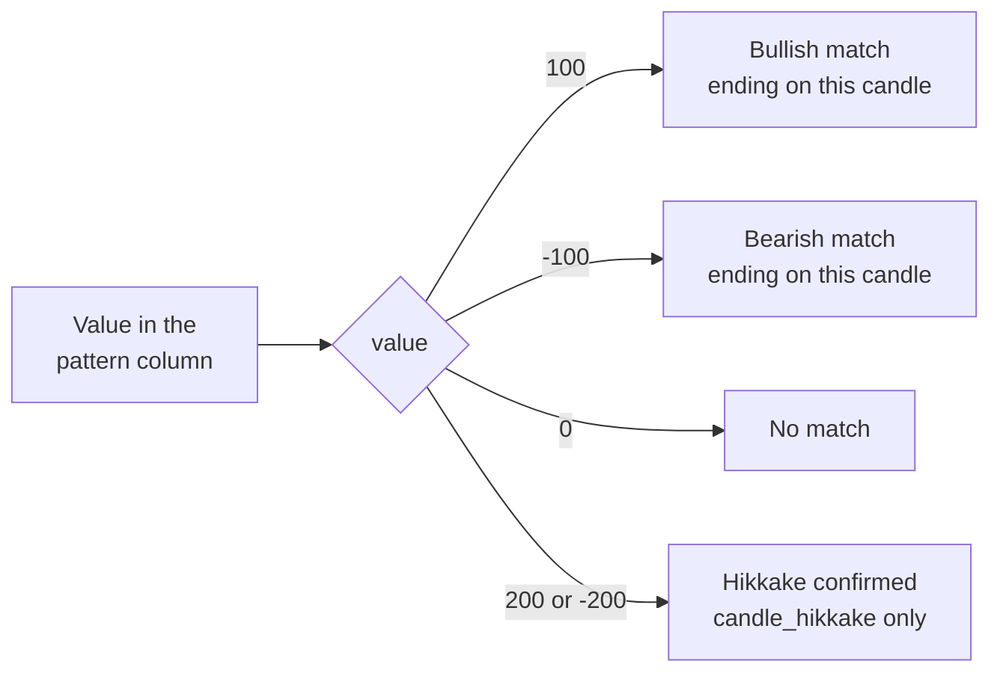

# Candlestick patterns

A candlestick pattern is a shape made by one to five consecutive candles that traders read as a sign the price may turn or carry on, such as a hammer after a fall or three black crows after a rise. Every instrument inherits 61 methods that look for these shapes, one per pattern, from the `CandlestickPatterns` class. Each is a thin wrapper around one of TA-Lib's pattern recognisers.

## How the methods work

Every pattern method takes only the five range arguments of [`prices`](../python-api/market-data.md#prices), which are `interval`, `from_date`, `to_date`, `days` and `adjusted`. It fetches the candles, passes their `open`, `high`, `low` and `close` columns to TA-Lib, and returns the candles with one new column, named after the pattern, or `None` when UBI has no candles for the range.

The new column holds an integer for each candle, and the flowchart below shows how to read it.



The value sits on the last candle of the pattern, so a three-candle pattern is marked on its third candle. Some patterns are bullish or bearish by definition and only ever produce one sign; others, such as the engulfing pattern, can go either way. `candle_hikkake` also reports 200 or -200 when a hikkake is later confirmed, which was seen over ten years of INFY candles on 2026-09-14, although its docstring describes only the common case.

## The full list

The table below lists all 61 methods in the order they appear in the code. The "Pattern" column names the shape TA-Lib actually recognises, which is not always what the method name suggests: `candle_side_by_side_white_lines`, for example, calls `CDLGAPSIDESIDEWHITE`, the up or down gap side by side white lines.

| Method | Pattern | TA-Lib function | Column added |
|---|---|---|---|
| `candle_two_crows` | Two crows | `CDL2CROWS` | `candle_two_crows` |
| `candle_three_black_crows` | Three black crows | `CDL3BLACKCROWS` | `candle_three_black_crows` |
| `candle_three_inside_up_down` | Three inside up or down | `CDL3INSIDE` | `candle_three_inside_up_down` |
| `candle_three_line_strike` | Three line strike | `CDL3LINESTRIKE` | `candle_three_line_strike` |
| `candle_three_outside_up_down` | Three outside up or down | `CDL3OUTSIDE` | `candle_three_outside_up_down` |
| `candle_three_stars_in_the_south` | Three stars in the south | `CDL3STARSINSOUTH` | `candle_three_stars_in_the_south` |
| `candle_three_white_soldiers` | Three white soldiers | `CDL3WHITESOLDIERS` | `candle_three_white_soldiers` |
| `candle_abandoned_baby` | Abandoned baby | `CDLABANDONEDBABY` | `candle_abandoned_baby` |
| `candle_advance_block` | Advance block | `CDLADVANCEBLOCK` | `candle_advance_block` |
| `candle_belt_hold` | Belt hold | `CDLBELTHOLD` | `candle_belt_hold` |
| `candle_breakaway` | Breakaway | `CDLBREAKAWAY` | `candle_breakaway` |
| `candle_closing_marubozu` | Closing marubozu | `CDLCLOSINGMARUBOZU` | `candle_closing_marubozu` |
| `candle_concealing_baby_swallow` | Concealing baby swallow | `CDLCONCEALBABYSWALL` | `candle_concealing_baby_swallow` |
| `candle_counter_attack` | Counterattack | `CDLCOUNTERATTACK` | `candle_counter_attack` |
| `candle_dark_cloud_cover` | Dark cloud cover | `CDLDARKCLOUDCOVER` | `candle_dark_cloud_cover` |
| `candle_doji` | Doji | `CDLDOJI` | `candle_doji` |
| `candle_doji_star` | Doji star | `CDLDOJISTAR` | `candle_doji_star` |
| `candle_dragonfly_doji` | Dragonfly doji | `CDLDRAGONFLYDOJI` | `candle_dragonfly_doji` |
| `candle_engulfing` | Engulfing | `CDLENGULFING` | `candle_engulfing` |
| `candle_evening_doji_star` | Evening doji star | `CDLEVENINGDOJISTAR` | `candle_evening_dojistar` (see below) |
| `candle_evening_star` | Evening star | `CDLEVENINGSTAR` | `candle_evening_star` |
| `candle_side_by_side_white_lines` | Up or down gap side by side white lines | `CDLGAPSIDESIDEWHITE` | `candle_side_by_side_white_lines` |
| `candle_gravestone_doji` | Gravestone doji | `CDLGRAVESTONEDOJI` | `candle_gravestone_doji` |
| `candle_hammer` | Hammer | `CDLHAMMER` | `candle_hammer` |
| `candle_hanging_man` | Hanging man | `CDLHANGINGMAN` | `candle_hangingman` (see below) |
| `candle_harami` | Harami | `CDLHARAMI` | `candle_harami` |
| `candle_harami_cross` | Harami cross | `CDLHARAMICROSS` | `candle_harami_cross` |
| `candle_high_wave` | High wave | `CDLHIGHWAVE` | `candle_high_wave` |
| `candle_hikkake` | Hikkake | `CDLHIKKAKE` | `candle_hikkake` |
| `candle_modified_hikkake` | Modified hikkake | `CDLHIKKAKEMOD` | `candle_modified_hikkake` |
| `candle_homing_pigeon` | Homing pigeon | `CDLHOMINGPIGEON` | `candle_homing_pigeon` |
| `candle_identical_three_crows` | Identical three crows | `CDLIDENTICAL3CROWS` | `candle_identical_three_crows` |
| `candle_in_neck` | In-neck | `CDLINNECK` | `candle_in_neck` |
| `candle_inverted_hammer` | Inverted hammer | `CDLINVERTEDHAMMER` | `candle_inverted_hammer` |
| `candle_kicking` | Kicking | `CDLKICKING` | `candle_kicking` |
| `candle_kicking_by_length` | Kicking, with bull or bear decided by the longer marubozu | `CDLKICKINGBYLENGTH` | `candle_kicking_by_length` |
| `candle_ladder_bottom` | Ladder bottom | `CDLLADDERBOTTOM` | `candle_ladder_bottom` |
| `candle_long_legged_doji` | Long legged doji | `CDLLONGLEGGEDDOJI` | `candle_long_legged_doji` |
| `candle_long_line` | Long line | `CDLLONGLINE` | `candle_long_line` |
| `candle_marubozu` | Marubozu | `CDLMARUBOZU` | `candle_marubozu` |
| `candle_matching_low` | Matching low | `CDLMATCHINGLOW` | `candle_matching_low` |
| `candle_mat_hold` | Mat hold | `CDLMATHOLD` | `candle_mat_hold` |
| `candle_morning_star` | Morning star | `CDLMORNINGSTAR` | `candle_morning_star` |
| `candle_morning_star_doji` | Morning doji star | `CDLMORNINGDOJISTAR` | `candle_morning_star_doji` |
| `candle_on_neck` | On-neck | `CDLONNECK` | `candle_on_neck` |
| `candle_piercing` | Piercing | `CDLPIERCING` | `candle_piercing` |
| `candle_rickshaw_man` | Rickshaw man | `CDLRICKSHAWMAN` | `candle_rickshaw_man` |
| `candle_rise_fall_three_methods` | Rising or falling three methods | `CDLRISEFALL3METHODS` | `candle_rise_fall_three_methods` |
| `candle_separating_lines` | Separating lines | `CDLSEPARATINGLINES` | `candle_separating_lines` |
| `candle_shooting_star` | Shooting star | `CDLSHOOTINGSTAR` | `candle_shooting_star` |
| `candle_short_line` | Short line | `CDLSHORTLINE` | `candle_short_line` |
| `candle_spinning_top` | Spinning top | `CDLSPINNINGTOP` | `candle_spinning_top` |
| `candle_stalled_pattern` | Stalled | `CDLSTALLEDPATTERN` | `candle_stalled_pattern` |
| `candle_stick_sandwich` | Stick sandwich | `CDLSTICKSANDWICH` | `candle_stick_sandwich` |
| `candle_takuri` | Takuri, a dragonfly doji with a very long lower shadow | `CDLTAKURI` | `candle_takuri` |
| `candle_tasuki_gap` | Tasuki gap | `CDLTASUKIGAP` | `candle_tasuki_gap` |
| `candle_thrusting_pattern` | Thrusting | `CDLTHRUSTING` | `candle_thrusting_pattern` |
| `candle_tristar` | Tristar | `CDLTRISTAR` | `candle_tristar` |
| `candle_unique_three_river` | Unique three river | `CDLUNIQUE3RIVER` | `candle_unique_three_river` |
| `candle_up_side_gap_two_crows` | Upside gap two crows | `CDLUPSIDEGAP2CROWS` | `candle_up_side_gap_two_crows` |
| `candle_up_side_down_side_gap_three_methods` | Upside or downside gap three methods | `CDLXSIDEGAP3METHODS` | `candle_up_side_gap_three_methods` (see below) |

Three column labels differ from their method names, because the methods were renamed to separate their words while the labels were kept so that code reading the frames still works. The table below lists them.

| Method | Column label | Why |
|---|---|---|
| `candle_evening_doji_star` | `candle_evening_dojistar` | The method was renamed from `candle_evening_dojistar` |
| `candle_hanging_man` | `candle_hangingman` | The method was renamed from `candle_hangingman` |
| `candle_up_side_down_side_gap_three_methods` | `candle_up_side_gap_three_methods` | The old label dropped "down_side", and the mismatch was carried over |

## An example

The example below looks for engulfing patterns in a year of RELIANCE's daily candles and keeps the days a match was found. It was not run for this page, because it needs a live UBI; the column name comes from the code. All 61 methods ran without error over 270 INFY daily candles when they were ported on 2026-09-14.

```python
from tradingmachine.assets import equities

reliance = equities.Equity(exchange="nse", symbol="RELIANCE")
frame = reliance.candle_engulfing(days=365)

matches = frame[frame["candle_engulfing"] != 0]
bullish = matches[matches["candle_engulfing"] > 0]
bearish = matches[matches["candle_engulfing"] < 0]
print(len(bullish), "bullish and", len(bearish), "bearish engulfing days")
```

Each pattern method fetches the candles afresh, so scanning for many patterns sends one request per pattern. That is cheap against a local UBI, which caches candles in Redis, but if you want every pattern at once it is simpler to fetch the candles once with `prices` and call TA-Lib's functions yourself on the frame, using the TA-Lib names in the table above.
