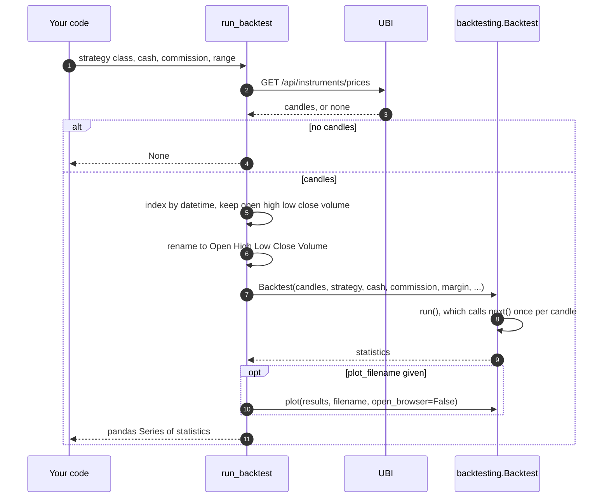

# Signals and backtests

Indicators describe the market; signals and backtests turn that description into decisions. This page covers the last three analysis methods. Two of them, from the `Signals` class, mark where one column of a frame crosses another, which is how most simple trading rules are written. The third, from `StrategyBacktests`, runs a trading strategy over an instrument's past candles with the [`backtesting`](https://kernc.github.io/backtesting.py/) package and reports how it would have done.

The table below lists the three methods.

| Kind | Member | Description |
|---|---|---|
| <span class="member method">method</span> | [`is_cross_over`](#is_cross_over) | Marks the rows where one column rises above another |
| <span class="member method">method</span> | [`is_cross_under`](#is_cross_under) | Marks the rows where one column falls below another |
| <span class="member method">method</span> | [`run_backtest`](#run_backtest) | Runs a `backtesting` strategy over the instrument's candles and returns its statistics |

## Signals

The two signal methods are different from every other analysis method in one way: they do not fetch candles. They work on a frame you already have, usually the result of an indicator method, so you choose the range once and then look for crossings in it. Neither method changes the frame you pass in; each returns a copy with a fresh index and one new column of booleans.

The two tests compare the columns on the previous row and on this row. The table below states them exactly.

| Method | On the previous row | On this row | Column added |
|---|---|---|---|
| `is_cross_over` | first column at or below the second | first column above the second | `cross_over` |
| `is_cross_under` | first column at or above the second | first column below the second | `cross_under` |

The first row is never marked, because it has no previous row. This is the textbook test, and it replaced the old project's version, which compared the previous first value with the current second value and could disagree when the second column moved sharply. On 400 days of INFY closes against a 20-candle simple moving average, the corrected methods marked 16 crossovers and 17 crossunders on 2026-09-14.

### is_cross_over

<div class="endpoint" markdown><span class="member method">method</span> `is_cross_over(data, first_column, second_column)`</div>

This method marks each row where the first column rises above the second. A typical use is the close crossing above a moving average, or a fast average crossing above a slow one.

#### Parameters

| Name | Type | Required | Default | Description |
|---|---|---|---|---|
| `data` | `pandas.DataFrame` | Yes | | The frame holding both columns. It is not changed. |
| `first_column` | `str` | Yes | | The name of the column that crosses |
| `second_column` | `str` | Yes | | The name of the column that is crossed |

#### Example

The example below was not run for this page, because it needs a live UBI. It finds the days in the last year on which RELIANCE closed above its 20-day simple moving average after closing at or below it the day before.

```python
from tradingmachine.assets import equities

reliance = equities.Equity(exchange="nse", symbol="RELIANCE")
frame = reliance.simple_moving_average(window=20, days=365)

crossings = reliance.is_cross_over(frame, "close", "sma_20")
print(crossings[crossings["cross_over"]][["datetime", "close", "sma_20"]])
```

#### Returns

A `pandas.DataFrame` copy of `data` with a fresh index and an added bool `cross_over` column.

#### Raises

| Exception | When |
|---|---|
| `KeyError` | `data` has no column named `first_column` or `second_column` |

### is_cross_under

<div class="endpoint" markdown><span class="member method">method</span> `is_cross_under(data, first_column, second_column)`</div>

This method marks each row where the first column falls below the second. It is the mirror image of `is_cross_over`.

#### Parameters

| Name | Type | Required | Default | Description |
|---|---|---|---|---|
| `data` | `pandas.DataFrame` | Yes | | The frame holding both columns. It is not changed. |
| `first_column` | `str` | Yes | | The name of the column that crosses |
| `second_column` | `str` | Yes | | The name of the column that is crossed |

#### Example

The example below, which was not run for this page, marks the days RELIANCE's MACD line fell below its signal line. The column names come from `moving_average_convergence_divergence` with its default periods of 12, 26 and 9.

```python
frame = reliance.moving_average_convergence_divergence(days=365)
crossings = reliance.is_cross_under(frame, "macd_12_26_9", "macd_12_26_9_signal")
print(crossings[crossings["cross_under"]][["datetime", "close"]])
```

#### Returns

A `pandas.DataFrame` copy of `data` with a fresh index and an added bool `cross_under` column.

#### Raises

| Exception | When |
|---|---|
| `KeyError` | `data` has no column named `first_column` or `second_column` |

## Backtests

A backtest replays a trading strategy over past candles as though it had been running then, and reports the trades it would have made and what they would have earned. `run_backtest` does this with the `backtesting` package, version 0.6.5, which the library declares as a dependency. You write the strategy as a subclass of `backtesting.Strategy`; the method supplies the candles and runs it.

The sequence diagram below shows what happens inside one call.



The method selects the five candle columns by name and renames them to the capitalised names `backtesting` requires, so the extra columns UBI's candles carry, such as `oi` and `price_factor`, are dropped. The candles' `datetime` becomes the index, still in India time with its time zone, which `backtesting` accepts.

### run_backtest

<div class="endpoint" markdown><span class="member method">method</span> `run_backtest(strategy, cash=10000, commission=0.0, margin=1.0, trade_on_close=False, hedging=False, exclusive_orders=False, plot_filename=None, interval="day", from_date=None, to_date=None, days=None, adjusted=True)`<span class="route"><span class="method get">GET</span> `/api/instruments/prices`</span></div>

This method runs a strategy over the instrument's candles in a range and returns the backtest's statistics. It sends no orders; it only reads candles. When `plot_filename` is given, it also writes the interactive `backtesting` chart to that HTML file without opening it.

#### Parameters

| Name | Type | Required | Default | Description |
|---|---|---|---|---|
| `strategy` | `type[backtesting.Strategy]` | Yes | | The strategy class to run, not an instance of it |
| `cash` | `float` | No | `10000` | The starting cash |
| `commission` | `float` | No | `0.0` | The commission on each trade, as a fraction of its value |
| `margin` | `float` | No | `1.0` | The margin required, as a fraction, where 1.0 means no leverage |
| `trade_on_close` | `bool` | No | `False` | True to fill market orders at the current candle's close rather than the next candle's open |
| `hedging` | `bool` | No | `False` | True to allow long and short trades at the same time |
| `exclusive_orders` | `bool` | No | `False` | True to close the open trade whenever a new order is placed |
| `plot_filename` | `str` | No | `None` | The path of an HTML file to write the plot to, or None for no plot |
| `interval`, `from_date`, `to_date`, `days`, `adjusted` | | No | as in `prices` | The candle range, as described in [Analysis](index.md#the-common-arguments) |

#### Example

The example below defines the classic moving average crossover strategy, which buys when a 10-candle average crosses above a 30-candle one and sells on the reverse, and runs it over two years of RELIANCE with 100,000 rupees. It was not run for this page, because it needs a live UBI. The same strategy over 730 days of INFY reported 9 trades when the method was checked on 2026-09-14, and the plotted version wrote an 82,745-byte HTML file.

```python
import backtesting
from backtesting import lib
import pandas as pd

from tradingmachine.assets import equities


class SmaCross(backtesting.Strategy):
    fast = 10
    slow = 30

    def init(self):
        close = pd.Series(self.data.Close)
        self.fast_average = self.I(lambda: close.rolling(self.fast).mean())
        self.slow_average = self.I(lambda: close.rolling(self.slow).mean())

    def next(self):
        if lib.crossover(self.fast_average, self.slow_average):
            self.position.close()
            self.buy()
        elif lib.crossover(self.slow_average, self.fast_average):
            self.position.close()
            self.sell()


reliance = equities.Equity(exchange="nse", symbol="RELIANCE")
statistics = reliance.run_backtest(
    SmaCross,
    cash=100000,
    commission=0.001,
    days=730,
    plot_filename="sma_cross.html",
)
print(statistics[["Return [%]", "# Trades", "Win Rate [%]", "Max. Drawdown [%]"]])
```

The strategy's methods are `backtesting`'s own interface, `init` and `next`, so they follow that package's names. The statistics labels in the last line are `backtesting`'s too; its documentation lists them all.

#### Returns

A `pandas.Series` of the backtest's statistics, as `backtesting.Backtest.run` returns it, or `None` when UBI has no candles for the range. The trades themselves are in the Series under `_trades`.

#### Raises

| Exception | When |
|---|---|
| `UnifiedBrokerInterfaceError` | UBI refused the candle request or could not be reached |

??? note "Under the hood"
    The old project always called `backtest.plot()`, which wrote an HTML file named after the strategy into the current directory and opened a browser tab on every run. The plot is now optional and never opens anything by itself. When it is drawn, `results=statistics` is passed so that the chart shows the run just made rather than running the strategy a second time.

A backtest is only as good as its candles. Run it on an instrument that has them, which today means shares, equity indices, exchange traded funds and commodity derivatives, as [Which instruments have candles](index.md#which-instruments-have-candles) explains. Shares and funds are adjusted for splits and bonuses by default, which is what a backtest over several years needs.
