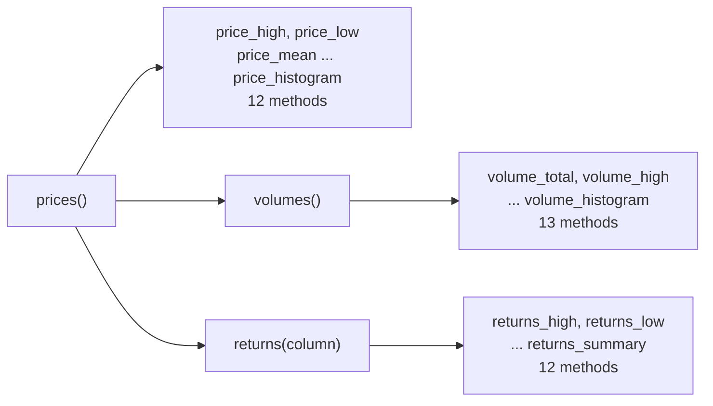
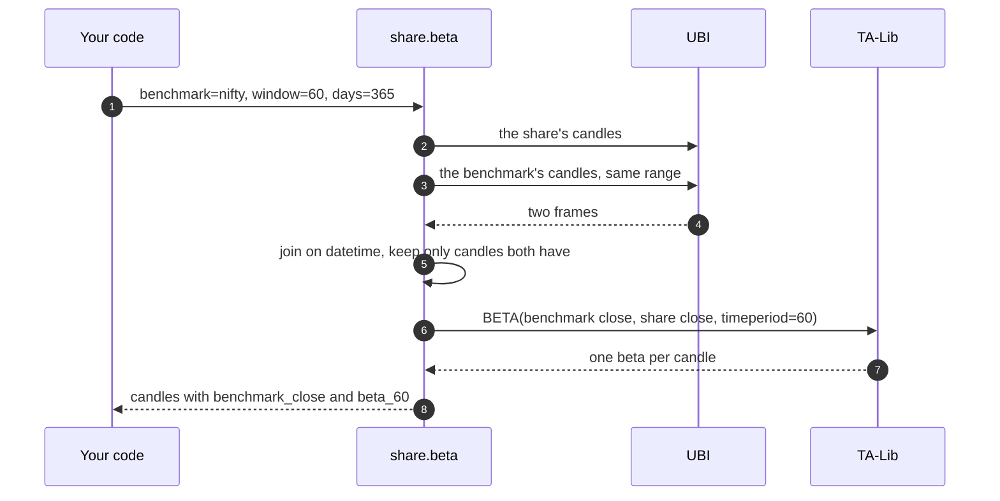

# Statistics and transforms

This page covers the 76 analysis methods that are not indicators or patterns. They fall into five classes: summary statistics of a range of candles, rolling statistic functions such as beta and linear regression, arithmetic between candle columns, mathematical transforms of one column, and the four price transforms that combine a candle's open, high, low and close into one figure.

The table below shows the five groups and how their results differ, which matters more here than on the other pages: the summary statistics return a single number, while the other four return the candles with a column added.

| Group | Class | Methods | Returns |
|---|---|--:|---|
| [Price statistics](#price-statistics) | `PriceStatistics` | 39 | Mostly a single float for the whole range |
| [Statistic functions](#statistic-functions) | `StatisticFunctions` | 8 | The candles with a rolling column added |
| [Math operators](#math-operators) | `MathOperators` | 10 | The candles with a column added |
| [Math transforms](#math-transforms) | `MathTransforms` | 15 | The candles with a column added |
| [Price transforms](#price-transforms) | `PriceTransforms` | 4 | The candles with a column added |

Every method on this page also takes the five range arguments of `prices`, which are `interval`, `from_date`, `to_date`, `days` and `adjusted`, and returns `None` when UBI has no candles for the range. [Analysis](index.md#the-common-arguments) describes those arguments, and the tables below leave them out.

## Price statistics

`PriceStatistics` answers questions about a whole range at once, such as "what was the highest high this year" or "how skewed were the daily returns". Its 39 methods form three families, each built on the one before, as the diagram below shows.



`volumes` and `returns` are themselves methods, and they return a narrowed frame of `exchange`, `segment`, `datetime`, `interval` and one value column. `returns` uses pandas' `pct_change`, so its value is the fractional change from one candle to the next, 0.01 for a one per cent rise, and its first row is always empty. `price_high` and `price_low` always read the `high` and `low` columns and take no `column` argument.

The table below lists all 39 methods.

| Method | What it does | Own arguments and defaults | Returns |
|---|---|---|---|
| `price_high` | Finds the highest high in the range | none | The highest high as a float |
| `price_low` | Finds the lowest low in the range | none | The lowest low as a float |
| `price_mean` | Finds the mean of one candle column in the range | `column='close'` | The mean as a float |
| `price_median` | Finds the median of one candle column in the range | `column='close'` | The median as a float |
| `price_standard_deviation` | Finds the standard deviation of one candle column in the range | `column='close'` | The standard deviation as a float |
| `price_variance` | Finds the variance of one candle column in the range | `column='close'` | The variance as a float |
| `price_mean_absolute_deviation` | Finds the mean absolute deviation of one candle column from its mean in the range | `column='close'` | The mean absolute deviation as a float |
| `price_skewness` | Finds the skewness of one candle column in the range | `column='close'` | The skewness as a float |
| `price_kurtosis` | Finds the kurtosis of one candle column in the range | `column='close'` | The kurtosis as a float |
| `price_quantile` | Finds a quantile of one candle column in the range | `quantile=0.5`, `column='close'` | The quantile as a float |
| `price_summary` | Summarises one candle column in the range with count, mean, spread and quartiles | `column='close'` | A pandas.Series of summary statistics |
| `price_histogram` | Draws a histogram of one candle column in the range with matplotlib | `bins=50`, `column='close'` | The matplotlib Axes the histogram was drawn on |
| `volumes` | Fetches the traded volume of each candle in the range | none | A pandas.DataFrame with `exchange`, `segment`, `datetime`, `interval` and `volume` columns |
| `volume_total` | Finds the total volume traded in the range | none | The total volume as a float |
| `volume_high` | Finds the highest volume of any candle in the range | none | The highest volume as a float |
| `volume_low` | Finds the lowest volume of any candle in the range | none | The lowest volume as a float |
| `volume_mean` | Finds the mean volume per candle in the range | none | The mean volume as a float |
| `volume_median` | Finds the median volume per candle in the range | none | The median volume as a float |
| `volume_standard_deviation` | Finds the standard deviation of volume per candle in the range | none | The standard deviation as a float |
| `volume_variance` | Finds the variance of volume per candle in the range | none | The variance as a float |
| `volume_mean_absolute_deviation` | Finds the mean absolute deviation of volume per candle from its mean in the range | none | The mean absolute deviation as a float |
| `volume_kurtosis` | Finds the kurtosis of volume per candle in the range | none | The kurtosis as a float |
| `volume_skewness` | Finds the skewness of volume per candle in the range | none | The skewness as a float |
| `volume_quantile` | Finds a quantile of volume per candle in the range | `quantile=0.5` | The quantile as a float |
| `volume_summary` | Summarises volume per candle in the range with count, mean, spread and quartiles | none | A pandas.Series of summary statistics |
| `volume_histogram` | Draws a histogram of volume per candle in the range with matplotlib | `bins=50` | The matplotlib Axes the histogram was drawn on |
| `returns` | Calculates the fractional change of one candle column from each candle to the next | `column='close'` | A pandas.DataFrame with `exchange`, `segment`, `datetime`, `interval` and `returns` columns |
| `returns_high` | Finds the highest return of one candle column in the range | `column='close'` | The highest return as a float |
| `returns_low` | Finds the lowest return of one candle column in the range | `column='close'` | The lowest return as a float |
| `returns_mean` | Finds the mean return of one candle column in the range | `column='close'` | The mean return as a float |
| `returns_median` | Finds the median return of one candle column in the range | `column='close'` | The median return as a float |
| `returns_standard_deviation` | Finds the standard deviation of returns of one candle column in the range | `column='close'` | The standard deviation as a float |
| `returns_variance` | Finds the variance of returns of one candle column in the range | `column='close'` | The variance as a float |
| `returns_mean_absolute_deviation` | Finds the mean absolute deviation of returns of one candle column from their mean in the range | `column='close'` | The mean absolute deviation as a float |
| `returns_skewness` | Finds the skewness of returns of one candle column in the range | `column='close'` | The skewness as a float |
| `returns_kurtosis` | Finds the kurtosis of returns of one candle column in the range | `column='close'` | The kurtosis as a float |
| `returns_quantile` | Finds a quantile of returns of one candle column in the range | `quantile=0.5`, `column='close'` | The quantile as a float |
| `returns_histogram` | Draws a histogram of returns of one candle column in the range with matplotlib | `bins=50`, `column='close'` | The matplotlib Axes the histogram was drawn on |
| `returns_summary` | Summarises returns of one candle column in the range with count, mean, spread and quartiles | `column='close'` | A pandas.Series of summary statistics |

!!! note "The histogram methods need matplotlib"
    `price_histogram`, `volume_histogram` and `returns_histogram` draw with matplotlib through pandas and return the matplotlib `Axes`. matplotlib is not one of the library's declared dependencies, so install it yourself before calling them, and choose a backend, such as `Agg`, when there is no display.

The example below, which was not run for this page, summarises a year of RELIANCE's daily returns.

```python
from tradingmachine.assets import equities

reliance = equities.Equity(exchange="nse", symbol="RELIANCE")
print(reliance.returns_standard_deviation(days=365))
print(reliance.returns_summary(days=365))
```

## Statistic functions

`StatisticFunctions` holds TA-Lib's eight rolling statistic functions. Each works over a moving window and adds a column with one value per candle. The table below lists them.

| Method | What it adds | Own arguments and defaults | TA-Lib function | Columns added |
|---|---|---|---|---|
| `beta` | Adds the rolling beta of the instrument against a benchmark, such as an index | `benchmark`, `window=14`, `column='close'` | `BETA` | `benchmark_<column>`, `beta_<window>` |
| `correlation_coefficient` | Adds the rolling Pearson correlation of the instrument's returns with a benchmark's returns | `benchmark`, `window=14`, `column='close'` | `CORREL` | `benchmark_<column>`, `corr_<window>` |
| `linear_regression` | Adds the end value of a rolling linear regression line through one candle column | `window=14`, `column='close'` | `LINEARREG` | `lin_regr_<window>` |
| `linear_regression_slope` | Adds the slope of a rolling linear regression line through one candle column | `window=14`, `column='close'` | `LINEARREG_SLOPE` | `lin_regr_slope_<window>` |
| `linear_regression_intercept` | Adds the intercept of a rolling linear regression line through one candle column | `window=14`, `column='close'` | `LINEARREG_INTERCEPT` | `lin_regr_int_<window>` |
| `linear_regression_angle` | Adds the angle in degrees of a rolling linear regression line through one candle column | `window=14`, `column='close'` | `LINEARREG_ANGLE` | `lin_regr_angle_<window>` |
| `standard_deviation` | Adds the rolling standard deviation of one candle column | `window=14`, `standard_deviations=1`, `column='close'` | `STDDEV` | `std_dev_<window>` |
| `variance` | Adds the rolling variance of one candle column | `window=14`, `standard_deviations=1`, `column='close'` | `VAR` | `var_<window>` |

`variance` passes `standard_deviations` to TA-Lib as it always has, but TA-Lib's variance does not use it, so the argument has no effect there.

### Beta and correlation against a benchmark

`beta` and `correlation_coefficient` compare the instrument with a second one, the benchmark, which is their first and required argument. The benchmark is usually an index, such as an `EquityIndex` for NIFTY, but any object with a `prices` method works. The sequence below shows how the two sets of candles are matched.



A candle that only one side has, such as a day the stock was suspended while the index traded, is left out rather than filled in. The benchmark's column is kept as `benchmark_<column>`, so you can see what was compared.

Two details make the numbers right. TA-Lib's `BETA(x, y)` returns the beta of `y` measured against `x`, which is the reverse of what its documentation suggests, so the method passes the benchmark first; a check on 2026-09-14 found 2.171 for INFY against NIFTY this way, matching a hand calculation, against 0.167 the other way round. And `correlation_coefficient` correlates returns rather than price levels, because two unrelated prices that both rise would otherwise look highly correlated.

The example below, which was not run for this page, measures RELIANCE's 60-day rolling beta against NIFTY.

```python
from tradingmachine.assets import equities

reliance = equities.Equity(exchange="nse", symbol="RELIANCE")
nifty = equities.EquityIndex(exchange="nse", symbol="NIFTY")

frame = reliance.beta(benchmark=nifty, window=60, days=365)
print(frame[["datetime", "close", "benchmark_close", "beta_60"]].tail())
```

## Math operators

`MathOperators` holds TA-Lib's ten math operators: arithmetic between two candle columns, and the highest and lowest values of one column over a rolling window. The table below lists them.

| Method | What it adds | Own arguments and defaults | TA-Lib function | Columns added |
|---|---|---|---|---|
| `add` | Adds the sum of two candle columns | `first_column='high'`, `second_column='low'` | `ADD` | `sum` |
| `subtract` | Adds the second candle column subtracted from the first | `first_column='high'`, `second_column='low'` | `SUB` | `difference` |
| `multiply` | Adds the product of two candle columns | `first_column='high'`, `second_column='low'` | `MULT` | `product` |
| `divide` | Adds the first candle column divided by the second | `first_column='high'`, `second_column='low'` | `DIV` | `quotient` |
| `maximum` | Adds the highest value of one candle column over each window | `column='close'`, `window=10` | `MAX` | `max` |
| `minimum` | Adds the lowest value of one candle column over each window | `column='close'`, `window=10` | `MIN` | `min` |
| `maximum_index` | Adds the row position of the highest value of one candle column over each window | `column='close'`, `window=10` | `MAXINDEX` | `maxindex` |
| `minimum_index` | Adds the row position of the lowest value of one candle column over each window | `column='close'`, `window=10` | `MININDEX` | `minindex` |
| `minimum_maximum` | Adds the lowest and highest values of one candle column over each window | `column='close'`, `window=10` | `MINMAX` | `min`, `max` |
| `minimum_maximum_index` | Adds the row positions of the lowest and highest values of one candle column over each window | `column='close'`, `window=10` | `MINMAXINDEX` | `minindex`, `maxindex` |

Three details are worth knowing. The two-column methods default to `high` and `low`, so `subtract()` with no arguments gives each candle's range. The rolling methods take `column` before `window`, the reverse of most analysis methods, so call them by keyword. And the index methods give row positions counted from the first candle of the fetched range, not labels from the frame's index. `minimum_maximum` writes the same `min` and `max` columns as `minimum` and `maximum`, which only matters if you combine their frames by hand.

## Math transforms

`MathTransforms` holds TA-Lib's fifteen mathematical transforms of a single column. The table below lists them.

| Method | What it adds | Own arguments and defaults | TA-Lib function | Columns added |
|---|---|---|---|---|
| `arc_cosine` | Adds the arc cosine of one candle column | `column='close'` | `ACOS` | `acos` |
| `arc_sine` | Adds the arc sine of one candle column | `column='close'` | `ASIN` | `asin` |
| `arc_tangent` | Adds the arc tangent of one candle column | `column='close'` | `ATAN` | `atan` |
| `ceiling` | Adds the ceiling of one candle column | `column='close'` | `CEIL` | `ceil` |
| `cosine` | Adds the cosine of one candle column | `column='close'` | `COS` | `cos` |
| `hyperbolic_cosine` | Adds the hyperbolic cosine of one candle column | `column='close'` | `COSH` | `cosh` |
| `exponential` | Adds the exponential of one candle column | `column='close'` | `EXP` | `exp` |
| `floor` | Adds the floor of one candle column | `column='close'` | `FLOOR` | `floor` |
| `natural_logarithm` | Adds the natural logarithm of one candle column | `column='close'` | `LN` | `ln` |
| `logarithm_base_10` | Adds the base 10 logarithm of one candle column | `column='close'` | `LOG10` | `log10` |
| `sine` | Adds the sine of one candle column | `column='close'` | `SIN` | `sin` |
| `hyperbolic_sine` | Adds the hyperbolic sine of one candle column | `column='close'` | `SINH` | `sinh` |
| `square_root` | Adds the square root of one candle column | `column='close'` | `SQRT` | `sqrt` |
| `tangent` | Adds the tangent of one candle column | `column='close'` | `TAN` | `tan` |
| `hyperbolic_tangent` | Adds the hyperbolic tangent of one candle column | `column='close'` | `TANH` | `tanh` |

!!! warning "Most of these are meaningless on raw prices"
    Arc cosine and arc sine are defined only between -1 and 1, so on a price of about a thousand rupees their columns are entirely empty. `exponential`, `hyperbolic_cosine` and `hyperbolic_sine` overflow to infinity for any value above about 710: over ten years of INFY's adjusted closes, 1,586 of 1,654 rows were infinite. The transforms are meant for columns that are already small. Note that `column` must name a column of the candles themselves, so a transform of returns needs the returns added to the frame first.

## Price transforms

`PriceTransforms` holds TA-Lib's four price transforms, each of which combines a candle's prices into one representative figure. They take no arguments of their own. The table below lists them.

| Method | What it adds | Own arguments and defaults | TA-Lib function | Columns added |
|---|---|---|---|---|
| `average_price` | Adds the average of each candle's open, high, low and close | none | `AVGPRICE` | `avg_price` |
| `median_price` | Adds the midpoint of each candle's high and low | none | `MEDPRICE` | `med_price` |
| `typical_price` | Adds the average of each candle's high, low and close | none | `TYPPRICE` | `typ_price` |
| `weighted_close` | Adds each candle's weighted close, which counts the close twice alongside the high and low | none | `WCLPRICE` | `wght_close` |

`average_price` here is TA-Lib's average of each candle's open, high, low and close. It is unrelated to the `average_price` field in UBI's quote, which is the day's volume weighted average price and is read through `TradeableInstrument.volume_weighted_average_price`. On 2026-09-26 that property returned 1220.44 for RELIANCE.
