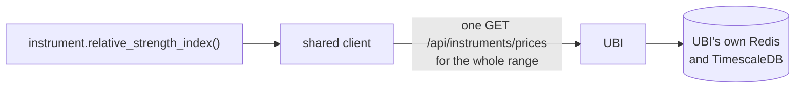
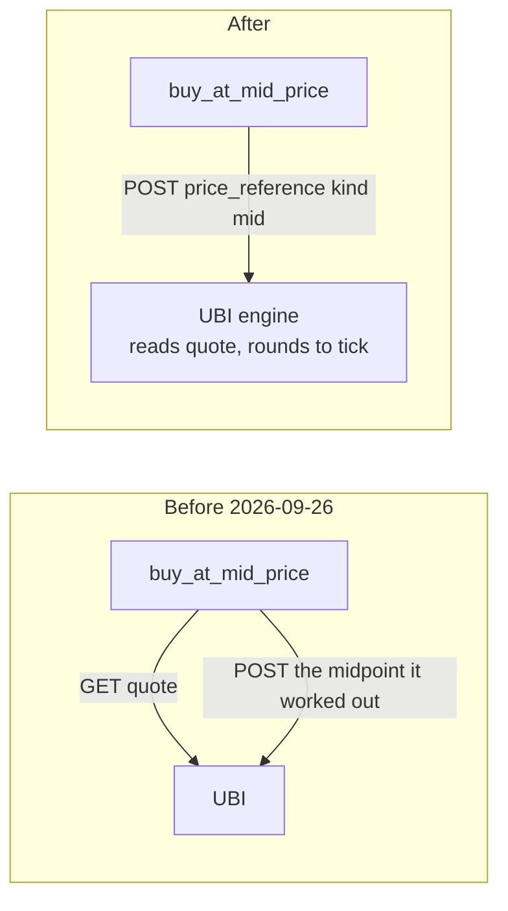
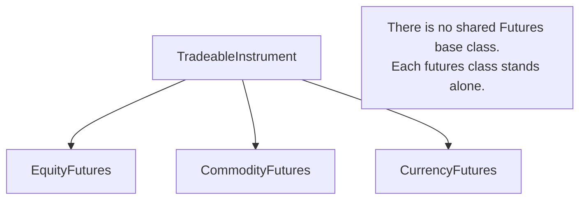

# Design choices

This page records the decisions that shape the library. Each record says what problem the decision solves, what was chosen, why, and what it costs, and it names the files where you can see the decision in the code. Most of them come down to one idea: UBI already holds the rules and the data, so this library should pass requests through to it rather than keep a second copy that could drift.

## The decisions at a glance

The table below lists every record on this page with its main benefit and its main cost.

| Decision | What it buys | What it costs |
|---|---|---|
| [Value members are properties](#value-members-are-properties) | Code reads as what a value means, `share.last_price` | Each read is a request, with no brackets to warn you |
| [No caching or date-range batching around UBI](#no-caching-or-date-range-batching-around-ubi) | A value is never stale, and there is no cache to invalidate | Repeated reads repeat requests |
| [No local tick or lot validation](#no-local-tick-or-lot-validation) | One source of truth for exchange rules | A bad price is found by a round trip, not before it |
| [Plain strings rather than enums](#plain-strings-rather-than-enums) | No second list of allowed values to keep in step | A typo is caught by UBI, not by your editor |
| [Row lists become DataFrames](#row-lists-become-dataframes) | Orders, trades and candles filter and sort directly | Callers need pandas, and "no rows" is None rather than an empty frame |
| [Order types are built in UBI, not here](#order-types-are-built-in-ubi-not-here) | One implementation of each order type | These orders need UBI in engine mode, and a probe to prove it |
| [One self-contained class per case](#one-self-contained-class-per-case) | Each class can be read, fixed and changed alone | The same code is repeated across classes |
| [A derivative does not hold its underlying](#a-derivative-does-not-hold-its-underlying) | No extra request per contract and no fragile join | The caller builds the underlying when it wants one |
| [Discovery reads the master rather than search](#discovery-reads-the-master-rather-than-search) | Live contracts are always found | A whole segment is downloaded on each call |
| [`inherited_members: false` in the docs](#inherited_members-false-in-the-docs) | A 13 MB site that builds in seconds | Class reference pages do not repeat inherited methods |

## Value members are properties

**The problem.** Some members of an instrument only report a value, such as the last price or the open orders, while others take arguments or act on the market. Until 2026-09-22 the rule was that anything fetched over HTTP was a method, because Google style guide rule 2.13 allows a property only for a cheap computation. That left half the live values as properties and half as methods, and the split followed how a value was fetched rather than what it meant.

**The choice.** Any member that only reports a value is a `@property`. A member is a method only when it takes an argument, such as `prices(interval, days)`, or when it writes to the market, such as `place_order` or `cancel_open_orders`. The user decided this on 2026-09-22. When a method with an optional filter became a property, the filter was dropped: `orders(status=None)` became the `orders` property, and a caller who wants one status filters the `status` column.

**Why.** The caller should read what a member means. `share.last_price` is the share's last price, and the fact that it comes over HTTP from a service on the same machine is a detail. UBI answers from its own Redis, so the cost argument was weaker than it looked, and the members that report what the account owns, such as `net_positions`, were already properties.

**The cost.** A loop that reads the same property twice sends two requests, and there are no brackets to hint at it. Code that needs a value more than once binds it to a local variable.

**In the code.** `src/tradingmachine/assets/instruments.py`, where `quote`, `last_price`, `ohlc`, the eleven order-book values, the order and trade readers and the position readers are all properties, and `src/tradingmachine/assets/equities.py` for the holdings readers.

## No caching or date-range batching around UBI

**The problem.** The old tradingmachine project cached candles in Redis for five minutes and quotes for five seconds, kept the cache warm with a poller, and split long date ranges into batches. Each indicator method fetches its own candles, so the same candles can be fetched many times.

**The choice.** Every call goes straight to UBI. There is no cache, in Redis or in memory, no poller and no batching of date ranges. The user decided this on 2026-09-14.



**Why.** UBI runs on the same machine and already caches in its own Redis, and its `/prices` route serves any date range in one request. A second cache here would add a second place for a value to go stale, and a stale expiry list or quote is a worse failure than a slow one.

**The cost.** Repeated reads repeat requests. Asking a derivative class for its expiries and then for a chain downloads the segment master twice, about four seconds for single-stock options. The members that need two values from one moment, `bid_offer_spread` and `mid_price`, read both from a single quote so that they never mix two moments. If the cost ever matters, the answer is a measurement first, not a cache added in advance.

**In the code.** `src/tradingmachine/assets/instruments.py`, whose module docstring says every call goes straight to UBI's REST API. The reasoning is under "No caching and no batching" in `.claude/notes/src/tradingmachine/assets/instruments.py.md`.

## No local tick or lot validation

**The problem.** An order whose price is not a multiple of the tick size, or whose quantity is not a whole number of lots, will be refused. The library could check this before sending, or round the price itself.

**The choice.** Prices and quantities are sent exactly as the caller gave them, with no tick rounding, no lot-multiple check and no expiry check. The user chose this on 2026-09-20 over both raising locally and rounding silently.

**Why.** UBI and the broker behind it hold the authoritative rules, and UBI reports `lot_size` and `tick_size` as None whenever its brokers disagree, so a local check would sometimes have nothing to check against. A refusal from the broker is the correct and informative failure. Where a price is worked out rather than given, UBI now rounds it to the tick itself, towards the passive side.

**The cost.** A malformed order costs a round trip to be refused, instead of failing before it leaves your process. On commodities in particular, `quantity=1` on an MCX gold future is refused with HTTP 400, because the quantity is counted in quotation units and one lot is 100.

**In the code.** `TradeableInstrument.place_order` in `src/tradingmachine/assets/instruments.py`, whose docstring says the values are sent exactly as given, and `SyntheticOrder` in `src/tradingmachine/orders/synthetic_order.py`, which says nothing is checked before sending.

## Plain strings rather than enums

**The problem.** Orders use a fixed vocabulary: `buy` or `sell`, `market` or `limit`, `cnc`, `mis` or `nrml`. It could be wrapped in named constants or enums, such as `instruments.BUY`.

**The choice.** Vocabulary that UBI already validates is passed as plain strings, such as `"buy"`, `"limit"` and `"mis"`. The same holds for `exchange`, `segment`, `option_type` and the candle `interval`. The user confirmed this on 2026-09-20.

**Why.** UBI rejects an unknown value with a clear message. A local enum would be a second list of allowed values that has to be kept in step with UBI's, and it would drift the first time UBI added a value.

**The cost.** A typo is caught by UBI at run time rather than by your editor. The [Vocabulary](../python-api/vocabulary.md) page lists every accepted string.

**In the code.** Module constants are still used for values this project itself chooses and reuses, such as `INDEX_SEGMENT_SUFFIX` in `src/tradingmachine/assets/instruments.py` and the segment names such as `EQUITY_SEGMENT` in `src/tradingmachine/assets/equities.py`. The rule is about mirroring UBI's vocabulary, not about avoiding constants.

## Row lists become DataFrames

**The problem.** Several UBI routes return many rows of the same shape: candles, the order book, the trade book, positions, the instrument master. They could be returned as lists of dictionaries.

**The choice.** A member that wraps such a route returns a `pandas.DataFrame`. A member that returns a single record, such as one holding, still returns a plain `dict`. When UBI has no rows at all, the member returns None rather than an empty frame. The user chose this on 2026-09-20.

**Why.** It is consistent with `Instrument.prices`, which already built a DataFrame from UBI's candles, and a table of orders or trades is far easier to filter, sort and inspect as a frame. A one-row frame would be awkward to read a single value from, which is why single records stay dictionaries.

**The cost.** Callers need pandas, which is a dependency of the library anyway, and must check for None before using a frame.

**In the code.** `prices`, `orders`, `trades`, `net_positions` and the other readers in `src/tradingmachine/assets/instruments.py`, and the discovery calls `search`, `contracts` and `chain` in each family module.

## Order types are built in UBI, not here

**The problem.** Until 2026-09-26 the price wrappers read the order book themselves, worked out a price and sent it, and the position methods read the position and worked out the side and size. On 2026-09-23 UBI gained an order engine that can do all of this itself, plus 42 synthetic order types.

**The choice.** Anything UBI can work out is sent as a description: a `price_reference`, a `quantity_reference` or a `synthetic` object. The user decided this on 2026-09-26, saying that the order types being created here no longer needed to be, because they had been added in UBI. The wrappers kept their names and signatures and stopped reading the book, and `tradingmachine.orders` holds one thin class per synthetic type that only describes the order and sends it.



**Why.** Keeping each order type in one place avoids two implementations that diverge. It also fixed two real faults: the price is now read immediately before the order is placed rather than one request earlier, and a midpoint is rounded to the tick instead of landing between ticks where the exchange refuses it.

**The cost.** These orders need UBI in engine mode, and UBI in direct mode would silently ignore the descriptions. So `place_order` probes the mode with a dry run before the first such order, as [Placement modes](placement-modes.md#the-placement-mode-probe) describes. An empty or shallow order book now comes back as UBI's HTTP 503, `ServiceUnavailableError`, and the old local `OrderError` was deleted.

**In the code.** `place_order` and the wrappers in `src/tradingmachine/assets/instruments.py`, and every module in `src/tradingmachine/orders/`. When a new order convenience is wanted, the first question is whether UBI already offers it; if it does not, it belongs in UBI.

## One self-contained class per case

**The problem.** The six classes of an asset family differ only in a segment constant, a base class and an error class, and the 42 synthetic order types differ only in their settings. Each group could be one parameterised class, or a hierarchy of intermediate bases such as `Futures` and `Option`.

**The choice.** Each case is its own class, written out in full. The family classes inherit directly from `TradeableInstrument` or `NonTradeableInstrument` with no intermediate base, and each asset-class module is copied from `equities.py` rather than sharing code with it, even the roughly 180 lines of holdings logic. Each synthetic order type is its own class in its own module, over a shallow `SyntheticOrder` base that holds only what is truly identical: storing the template, building the `synthetic` object and sending it.



**Why.** A reader can open one file and see everything one kind of contract does, and a change to one class cannot break another. The user prefers some duplication over a shared abstraction that every case has to be read through.

**The cost.** The same code is repeated, so a fix to the holdings logic has to be made in five classes. Errors are flat siblings under `InstrumentError`, so there is no single `except` for "anything in the equity family"; catch the contract's own error, or `InstrumentError` for any instrument problem.

**In the code.** The six family modules in `src/tradingmachine/assets/`, `src/tradingmachine/assets/exceptions.py`, and `src/tradingmachine/orders/`. The mechanism that is truly identical, such as the discovery helpers, sits on `Instrument` as protected class methods.

## A derivative does not hold its underlying

**The problem.** A future or option is written on a share or an index, and it would be convenient for `option.underlying` to return that object.

**The choice.** No futures or option class builds or holds an object for its underlying, and there is no `underlying` attribute. The user asked for one at first and then reversed the decision on 2026-09-20. A derivative carries only its `underlying_symbol` string.

**Why.** Building the underlying would add one request per contract, doubling the cost of building an option chain. More importantly, UBI has no reliable join: there is no foreign key and no `underlying_instrument_id`, only the `underlying_symbol` string matching a cash or index instrument's `symbol`. That holds for shares, rests on an alias table for NSE indices such as `NIFTY` and `BANKNIFTY`, and is not guaranteed for every index.

**The cost.** A caller that wants the underlying builds it itself, for example `equities.EquityIndex("nse", option.underlying_symbol)`, and decides what to do when it does not exist.

**In the code.** The module docstring of `src/tradingmachine/assets/equities.py`, and the same pattern in every other family module.

## Discovery reads the master rather than search

**The problem.** To find a contract you do not already know, such as this week's NIFTY options, you need UBI's list of instruments. UBI's `/api/instruments/search` route sorts by expiry ascending, caps its answer at 200 rows and takes no offset. Asked for NIFTY index options on 2026-09-20, it returned 200 rows that all shared an expiry four weeks in the past.

**The choice.** `search` on a cash or index class uses `/api/instruments/search`, which ranks exact and prefix matches first and is right for finding a name. `expiries`, `contracts`, `strikes` and `chain` on the derivative classes read `/api/instruments/master`, which streams the whole segment with no cap, and filter it here. Expired contracts are left out unless `include_expired=True`, and a contract expiring today, in India time, still counts as live.

The chart below shows how much of each segment the master had to stream on 2026-09-20, and how long it took.

```vegalite
{
  "$schema": "https://vega.github.io/schema/vega-lite/v5.json",
  "description": "Rows streamed by /api/instruments/master per segment on 2026-09-20",
  "width": "container",
  "height": 140,
  "data": {
    "values": [
      {"segment": "nse_equity_index_futures", "rows": 23, "seconds": 0.0},
      {"segment": "nse_equity_index_options", "rows": 14826, "seconds": 0.2},
      {"segment": "nse_equity_options", "rows": 125967, "seconds": 1.3}
    ]
  },
  "mark": {"type": "bar", "color": "#ff7043"},
  "encoding": {
    "y": {"field": "segment", "type": "nominal", "sort": "x", "title": null},
    "x": {"field": "rows", "type": "quantitative", "title": "Rows in the segment master"},
    "tooltip": [
      {"field": "segment", "type": "nominal"},
      {"field": "rows", "type": "quantitative", "format": ","},
      {"field": "seconds", "type": "quantitative", "title": "Seconds"}
    ]
  }
}
```

**Why.** With search, every live contract in a busy segment sits permanently behind thousands of expired ones. The master is complete, and because UBI runs on the same machine even 125,967 rows arrive in about 1.3 seconds.

**The cost.** Each discovery call downloads its whole segment again, with no cache. The calls return a DataFrame of identities rather than instrument objects, because a 214-contract chain as objects would mean 214 lookups; the caller builds the few contracts it wants.

**In the code.** The protected helpers `_search_catalogue`, `_master_catalogue`, `_contracts_for`, `_expiry_dates` and `_identity_frame` on `Instrument` in `src/tradingmachine/assets/instruments.py`, and the public class methods on each family class. [Finding instruments](../python-api/discovery.md) documents the public calls.

## `inherited_members: false` in the docs

**The problem.** `Instrument` inherits thirteen analysis classes, about 190 methods, and all 27 family classes inherit from it. With mkdocstrings' `inherited_members: true`, which the sibling UBI site uses, every family class reprinted the whole analysis surface on its own reference page.

**The choice.** `mkdocs.yml` sets `inherited_members: false`. The analysis methods are documented once each, on the reference pages of the modules that define them, and each class page names its base classes.

The table below shows the measurements taken on 2026-09-20 on the same content with each setting.

| `inherited_members` | Whole site | Build time | Largest page |
|---|---:|---:|---|
| `true` | 151 MB | 112 seconds | 23.8 MB, the `fixed_income` reference page |
| `false` | 13 MB | 5.9 seconds | 1.0 MB, the `candlestick_patterns` reference page |

**Why.** A 24 MB HTML page cannot be used in a browser, and a 112-second build makes every edit slow to check. Nothing is lost except the repetition. The sibling site can afford `true` because its classes have shallow inheritance.

**The cost.** A reader on a family class's reference page follows a link to the analysis modules to see the inherited methods. The hand-written [Analysis](../analysis/index.md) tab covers them by topic instead.

**In the code.** The `mkdocstrings` options in `mkdocs.yml`, with the reasoning in `.claude/notes/mkdocs.yml.md`. [Writing these docs](../project/writing-docs.md#why-inherited_members-is-false) has more.
