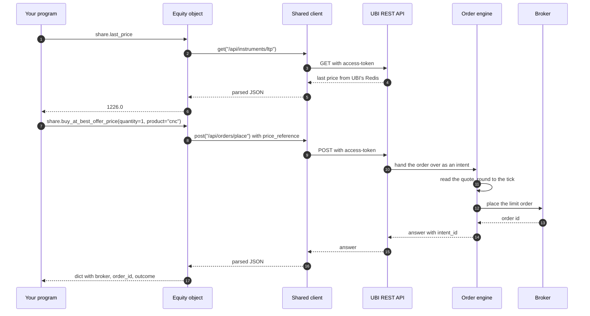

# Architecture

This tab explains how the library is put together and why. The short version is that `tradingmachine` is a thin layer of Python objects over one REST client, and everything that knows about brokers, prices and order types lives in the [Unified Broker Interface](https://pramodathani.github.io/unified_broker_interface/) (UBI), a separate service that runs on the same machine.

A useful way to picture it is a restaurant. Your program is the diner, the instrument objects are the menu, the shared client is the one waiter every table uses, UBI is the kitchen, and the ten brokers are the suppliers: the menu never cooks anything, it only tells the waiter what to ask the kitchen for.

## From your program down to the brokers

The animation below shows the five layers between your program and a broker's server. The orange dots are reads, such as a quote, a set of candles or the positions, travelling up to your program. The blue dot is an order travelling down, through UBI's order engine, to one broker.

<figure class="diagram">
--8<-- "docs/assets/diagrams/layers.svg"
<figcaption>Orange dots are reads coming up from UBI's stores to your program. The blue dot is an order going down through the shared client, the REST API and the order engine to a broker.</figcaption>
</figure>

The numbered list below describes each layer from the top, with where it lives.

1. **Instrument, order and account objects** are what your program builds and calls. An `Equity`, an `EquityIndexOption` or a `CommodityFutures` is one instrument; a `BracketOrder` or a `TrailingStopOrder` describes one synthetic order; an `Account` stands for the whole trading account. They live in `tradingmachine.assets`, `tradingmachine.orders` and `tradingmachine.accounts`. None of them holds any market data between calls; each read is a fresh request.
2. **The shared client**, `UnifiedBrokerInterface` in `tradingmachine.ubi_client.client`, is the only code that speaks HTTP. Every object in a process sends its requests through the same client, because UBI holds a single access token for the whole application and a second client would log the first one out. The client connects on first use, reconnects and retries once on HTTP 401, turns each failure status into its own exception class, and remembers which [placement mode](placement-modes.md) UBI was last seen in.
3. **UBI's REST API** listens on `http://127.0.0.1:8080`. It answers almost every read from its own Redis and TimescaleDB, which its background scripts keep filled from the brokers, so a read never waits for a broker. It is documented route by route on the [UBI site](https://pramodathani.github.io/unified_broker_interface/rest-api/).
4. **UBI's order engine** is a separate UBI process that places orders on the REST API's behalf when UBI runs with `UNIFIED_BROKER_INTERFACE_API_ORDER_PLACEMENT=engine`. It works out prices and quantities that were described rather than stated, and it runs the 42 synthetic order types, some of which keep placing orders long after your call has returned. See [Order engine](https://pramodathani.github.io/unified_broker_interface/rest-api/order-engine/) on the UBI site.
5. **The ten brokers** are Dhan, Flattrade, Fyers, Groww, INDmoney, Kotak, Shoonya, Stoxkart, Wisdom Capital and Zerodha. UBI logs in to each of them and chooses which one sends a given order; this library never names a broker and never talks to one.

!!! note "What the library does not do"
    The library keeps no cache, batches no date ranges, rounds no prices to the tick and checks no quantities against the lot size. UBI already does each of those, or holds the rule, and doing it again here would create a second copy that could drift. [Design choices](design-choices.md) records each decision.

## Which layer may talk to which

The rules below keep the layers independent. The table shows, for each part, what it is allowed to call.

| Part | Calls the shared client | Calls UBI over HTTP | Calls a broker | Keeps state between calls |
|---|:---:|:---:|:---:|---|
| Your program | :material-minus: through the objects, or directly for a route no object wraps | :material-close: | :material-close: | Whatever it chooses |
| Instrument, order and account objects | :material-check: | :material-close: only through the client | :material-close: | Only the instrument's identity, lot size and tick size, read once at construction |
| Shared client, `UnifiedBrokerInterface` | :material-minus: it is the client | :material-check: the only code that does | :material-close: | The access token, its expiry and `placement_mode` |
| UBI REST API | :material-close: | :material-minus: it is the API | :material-check: for orders in direct mode, and for a quote when no fresh one is cached | Everything, in Redis, TimescaleDB and MongoDB |
| UBI order engine | :material-close: | :material-close: | :material-check: every placement in engine mode | Armed and working synthetic orders |
| Brokers | :material-close: | :material-close: | :material-minus: | The real orders, trades, positions and holdings |

The one rule that matters most for a caller is the second row. An instrument object never opens its own connection, so any number of instruments, synthetic orders and an `Account` can live in one process and share one login. [The instrument model](instrument-model.md#one-shared-client) explains how the client is shared.

## A read and an order, side by side

The sequence below shows the two kinds of request the layers carry: a read of the last price, which UBI answers from memory, and an order that carries a price reference, which the order engine resolves and sends to a broker.

The first time an order like the second one is sent, `place_order` sends it once as a dry run before the real one, to prove that UBI's order engine is running. [Placement modes](placement-modes.md#the-placement-mode-probe) describes that probe.

## Where to go next

The pages in this tab go deeper into each part of the design.

-   :material-family-tree:{ .lg .middle } **The instrument model**

    ---

    The class hierarchy from `Instrument` to the 27 family classes, what lives at each level, and how the synthetic orders and the account relate to it.

    [:octicons-arrow-right-24: The instrument model](instrument-model.md)

-   :material-swap-vertical:{ .lg .middle } **Placement modes**

    ---

    UBI's direct and engine modes, what the library sends as descriptions rather than values, and the dry-run probe that protects the first such order.

    [:octicons-arrow-right-24: Placement modes](placement-modes.md)

-   :material-scale-balance:{ .lg .middle } **Design choices**

    ---

    Ten decisions that shape the library, each with its problem, its reasoning, its cost and where to see it in the code.

    [:octicons-arrow-right-24: Design choices](design-choices.md)

-   :material-folder-outline:{ .lg .middle } **Repository structure**

    ---

    Every package and module, how many there are, and which package imports which.

    [:octicons-arrow-right-24: Repository structure](../project/structure.md)

