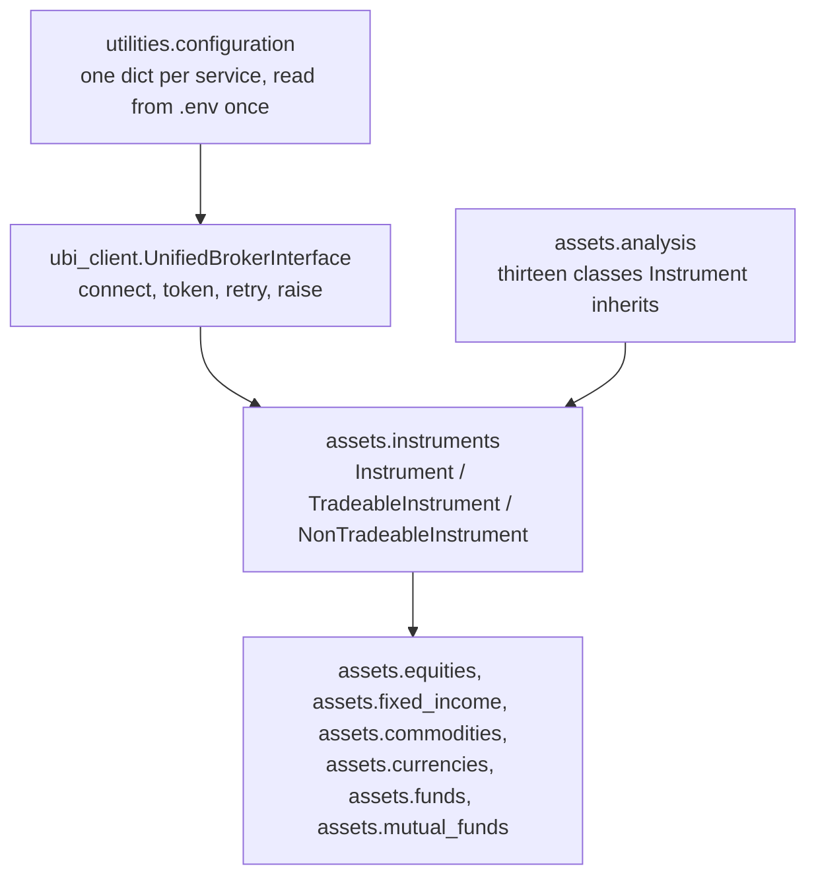

# Architecture

The project is four layers deep and each one has a single job. Reading them from the bottom up
explains why the top one looks the way it does.

| Layer | Job | What it deliberately does not do |
| --- | --- | --- |
| `utilities.configuration` | Read `.env` once and hand out one dictionary per service | Nothing else. It has no classes and no logic beyond assembling the MongoDB connection string |
| `ubi_client` | Hold the session with UBI and turn every failed response into a typed exception | Interpret any payload. It returns parsed JSON and nothing more |
| `assets.instruments` | Be one instrument: identity, candles, quotes, order book, orders, positions | Cache, batch, round prices or check quantities |
| `assets.analysis` | Turn candles into indicators, patterns and statistics | Fetch anything. It calls `prices` and is given it by the instrument |
| The six family modules | Put a named class on each UBI segment, and add what only that family has | Share a base class between families, even where the code is identical |

## Three decisions that shape everything above

**There is no caching anywhere.** An instrument looks itself up in UBI once, in its constructor,
and keeps the identity that comes back. Everything else, from a year of daily candles down to the
last traded price, is fetched at the moment it is asked for. UBI runs on the same machine and
caches in its own Redis, so a cache here would be a second copy of a cache that is already warm,
with its own staleness to reason about. Date ranges are not batched either, because UBI serves any
range in one request.

**Duplication between families is on purpose.** `assets.fixed_income` was copied from
`assets.equities` rather than sharing a base with it, and the six holdings members appear
separately in `assets.equities`, `assets.funds` and `assets.mutual_funds`. Each family then reads
as one self-contained file, and a fact that turns out to be true only of bonds can be written into
the bond file without anyone checking what else inherits it. The shared mechanism that genuinely
is identical lives in `assets.instruments`.

**The order vocabulary is plain strings.** `"buy"`, `"limit"`, `"cnc"` and `"day"` are passed
through as they are written, with no enums and no constants, because UBI validates them and would
have to be asked anyway. The same reasoning applies to prices and quantities, which reach UBI
exactly as given. See [Orders](../guides/orders.md).

## Where to go next

| Page | What it covers |
| --- | --- |
| [The instrument model](instrument-model.md) | What a single instrument object holds, fetches and refuses |
| [The UBI client](ubi-client.md) | The single access token, the one retry, and the shared client |
| [Errors](errors.md) | Both exception hierarchies and which one to catch when |
