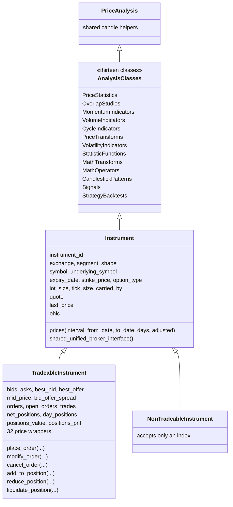
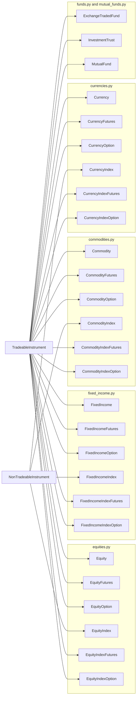
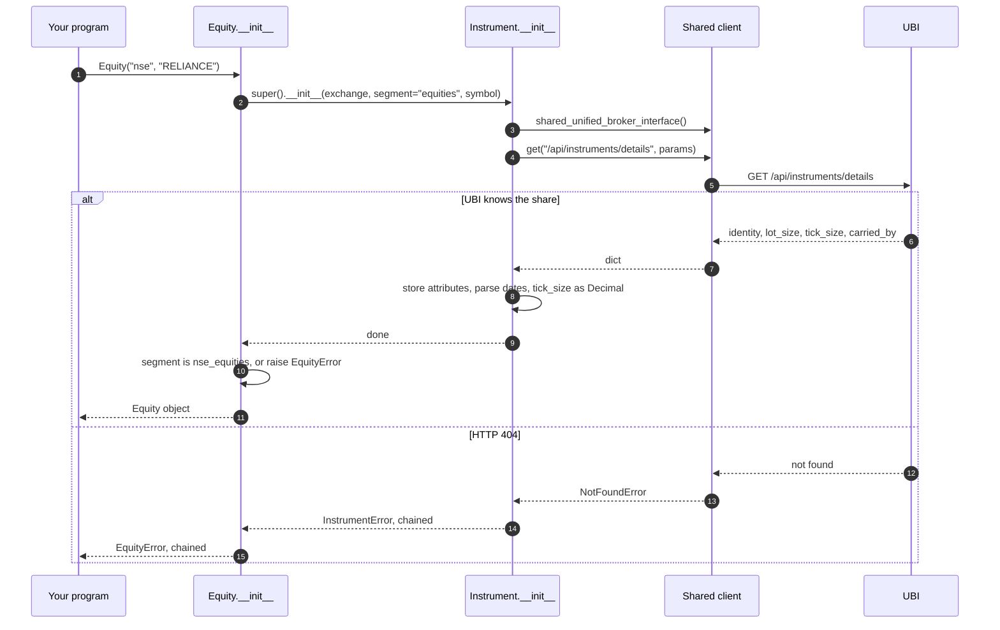
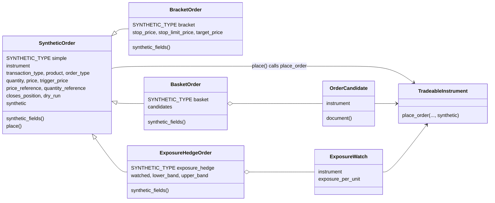

# The instrument model

Every instrument in the library is an object of one class, and the class says what kind of contract it is. This page shows how those classes are layered, what each layer adds, how an instrument is looked up in UBI, and how the synthetic order classes and the account sit beside the instruments rather than inside them.

## Three levels of class

The instrument classes form three levels. The base, `Instrument`, holds everything any instrument can do, including about 190 analysis methods it inherits from thirteen analysis classes. The middle level splits instruments into those that can be traded and indices, which cannot. The bottom level is 27 family classes, one per UBI segment, which is what you actually construct.

The class diagram below shows the first two levels with their main members. The thirteen analysis classes are drawn as one box to keep the diagram readable; each is a separate class in `tradingmachine.assets.analysis`, and all thirteen share the base `PriceAnalysis`.



The diagram lists only the main members of `TradeableInstrument`. The [Python API](../python-api/index.md) tab documents every one of them, and [Analysis](../analysis/index.md) documents the inherited analysis methods.

## The 27 family classes

The flowchart below shows the bottom level, grouped by the module each class lives in. Every family class inherits directly from `TradeableInstrument` or `NonTradeableInstrument`, with no intermediate "futures" or "option" base, and the four index classes are the only ones built on `NonTradeableInstrument`.



The table below counts the classes in each module and says what the module's cash class can do that the others cannot.

| Module | Classes | On `TradeableInstrument` | On `NonTradeableInstrument` | Holdings members on |
|---|---:|---:|---:|---|
| `equities.py` | 6 | 5 | 1 | `Equity` |
| `fixed_income.py` | 6 | 5 | 1 | `FixedIncome` |
| `commodities.py` | 6 | 5 | 1 | none |
| `currencies.py` | 6 | 5 | 1 | none |
| `funds.py` | 2 | 2 | 0 | `ExchangeTradedFund`, `InvestmentTrust` |
| `mutual_funds.py` | 1 | 1 | 0 | `MutualFund` |
| **Total** | **27** | **23** | **4** | five classes |

Commodities and currencies have no holdings members because UBI can only report a holding for a segment in its `CASH_SEGMENTS`, which excludes both. The [Asset classes](../asset-classes/index.md) tab covers each family's own traps.

## What lives at each level

Each level adds only what is true of every class below it. The table below lists what each level holds and why it sits there rather than higher or lower.

| Level | Holds | Why here |
|---|---|---|
| `PriceAnalysis` and the thirteen analysis classes | TA-Lib indicators, candlestick patterns, statistics, crossovers and a backtest, about 190 methods | Every instrument with candles can be analysed, including an index |
| `Instrument` | Identity attributes, `lot_size`, `tick_size`, `carried_by`; `prices`, `quote`, `last_price`, `ohlc`; the protected discovery helpers; the shared client | UBI quotes indices too, and an index's last price is one of the most used values |
| `TradeableInstrument` | The eleven order-book values, the order and trade readers, `place_order`, `modify_order`, `cancel_order`, `cancel_open_orders`, the 32 price wrappers, the position readers, totals and the four position methods | An index has no order book, no orders and no position |
| `NonTradeableInstrument` | Nothing new; it only refuses a segment that does not end in `_indices` | The refusal is its whole job |
| Family class | A fixed segment, a constructor taking exactly that segment's identity fields, its own error class, its discovery class methods, and on five classes the holdings members | The kind of contract is the class, not a segment string passed by hand |

The discovery calls follow the same pattern in every six-class module. The table below shows which class methods each kind of class offers.

| Kind of class | Examples | Discovery class methods |
|---|---|---|
| A cash security or an index | `Equity`, `EquityIndex`, `Commodity`, `MutualFund` | `search` |
| A futures class | `EquityFutures`, `CurrencyIndexFutures` | `expiries`, `contracts` |
| An option class | `EquityOption`, `FixedIncomeIndexOption` | `expiries`, `strikes`, `chain` |

All of them read `/api/instruments/master` rather than `/api/instruments/search`, for the reason given in [Design choices](design-choices.md#discovery-reads-the-master-rather-than-search).

## Properties and methods

A member that only reports a value is a property, and a member is a method only when it takes an argument or writes to the market. The user decided this on 2026-09-22, so that a caller reads what a member means, such as `share.last_price`, rather than how it is fetched. The table below sorts the instrument surface by that rule.

| Kind | Badge | Members |
|---|---|---|
| Reads a value | <span class="member property">property</span> | `quote`, `last_price`, `ohlc`; `bids`, `asks`, `best_bid`, `best_offer`, `bid_offer_spread`, `mid_price`, `volume_weighted_average_price`, `last_quantity`, `total_traded_volume`, `open_interest`, `last_trade_time`; `orders`, `open_orders`, `completed_orders`, `rejected_orders`, `cancelled_orders`, `trades`; `net_positions`, `day_positions`, `positions_value`, `positions_pnl`; `holdings`, `holdings_value`, `holdings_pnl` |
| Takes arguments, only reads | <span class="member method">method</span> | `prices` and every analysis method |
| Finds instruments | <span class="member function">classmethod</span> | `search`, `expiries`, `contracts`, `strikes`, `chain` |
| Sends orders | <span class="member writes">places orders</span> | `place_order`, `modify_order`, `cancel_order`, `cancel_open_orders`, the 32 price wrappers, `add_to_position`, `reduce_position`, `liquidate_position`, `liquidate_all_positions`, `add_to_holdings`, `reduce_holdings`, `liquidate_holdings` |

!!! warning "A property is still a request"
    Every read of a property sends its own request to UBI, and nothing is cached. Code that needs a value twice, such as `share.net_positions` checked and then used, should bind it to a local variable first, or the two reads may see two different moments.

The identity attributes, such as `exchange`, `symbol` and `lot_size`, are plain attributes rather than properties. They are read once, when the object is built, and never change.

## How an instrument is looked up

Building an instrument sends exactly one request, `GET /api/instruments/details`. Every later request names the instrument only by the `instrument_id` that answer carried, which is a UUID UBI computes from the identity and which is the same at every broker. The sequence below shows the lookup for `Equity("nse", "RELIANCE")`, including the two ways it can fail.



The table below lists what the constructor does with each part of UBI's answer.

| From `/details` | Stored as | Note |
|---|---|---|
| `instrument_id` | `instrument_id`, a `str` | Used alone in every later request, and by `__eq__` and `__hash__` |
| `exchange`, `segment` | lower case, segment prefixed such as `nse_equities` | UBI accepts a bare segment but always returns it prefixed |
| `expiry_date`, `mapping_date`, `first_seen_date`, `last_seen_date` | `datetime.date` or None | |
| `lot_size` | `int` or None | None when UBI's brokers disagree |
| `tick_size` | `decimal.Decimal` or None | Decimal so a step like 0.05 stays exact |
| `carried_by` | a list of dicts, one per broker | Each broker's own token, order symbol, lot size and tick size, raw |

The output below shows the public attributes of a real lookup, captured from a local UBI on 2026-09-26. The `carried_by` list has one entry for each of nine brokers, and it was trimmed here to its first two entries, marked with `...`.

=== "Python"

    ```python
    from tradingmachine.assets import equities

    reliance = equities.Equity("nse", "RELIANCE")
    print(repr(reliance))
    attributes = {}
    for key, value in vars(reliance).items():
        if not key.startswith("_"):
            attributes[key] = value
    print(repr(attributes))
    ```

=== "Output"

    ```text
    Equity(exchange='nse', segment='nse_equities', symbol='RELIANCE')
    {'instrument_id': '3f92570a-9924-5bf5-9f9d-e006cd9f4202', 'exchange': 'nse', 'segment': 'nse_equities', 'shape': 'security', 'symbol': 'RELIANCE', 'underlying_symbol': None, 'expiry_date': None, 'strike_price': None, 'option_type': None, 'mapping_date': datetime.date(2026, 9, 26), 'first_seen_date': datetime.date(2026, 8, 7), 'last_seen_date': datetime.date(2026, 9, 26), 'lot_size': 1, 'tick_size': Decimal('0.1'), 'carried_by': [{'broker': 'dhan', 'broker_token': '2885', 'lot_size': '1.0', 'order_symbol': None, 'tick_size': '0.1'}, {'broker': 'flattrade', 'broker_token': '2885', 'lot_size': '1.0', 'order_symbol': 'RELIANCE-EQ', 'tick_size': None}, ...]}
    ```

!!! tip "Two objects for one instrument are equal"
    Equality and hashing use `instrument_id`, so two objects built separately for the same contract compare equal and can be used as the same dictionary key.

A family class refuses anything else. Its constructor takes only the identity fields its shape needs, all required, so a missing expiry date is a `TypeError` at the call site rather than an HTTP 400 a round trip later. A UBI 404 becomes the class's own error, such as `EquityOptionError`, chained to the `InstrumentError` underneath. [Errors](../python-api/errors.md) lists every one.

## One shared client

Every instrument, synthetic order and `Account` in a process sends its requests through one `UnifiedBrokerInterface`, which `Instrument.shared_unified_broker_interface()` creates on first use. UBI holds a single access token for the whole application and every connect replaces it, so two clients would keep logging each other out and each would pay a reconnect on its next call.

The client is stored on `Instrument` by name rather than through `cls`. Assigning through `cls` would give each subclass its own attribute and therefore its own client, which is exactly what the sharing is meant to prevent. A caller can still pass a client of its own to any constructor, but then it owns the token clash that follows. [The UBI client](../python-api/client.md) documents the client's own members.

## Synthetic orders sit beside the instrument

A synthetic order, such as a bracket, a trailing stop or an iceberg, is not a member of the instrument. It is an object of its own, in `tradingmachine.orders`, that holds an instrument and an order template and sends both through the instrument's `place_order`. The class diagram below shows how the pieces relate.



The three subclasses in the diagram stand for all 42. Every type is its own class in its own module, and each adds only its settings and a `synthetic_fields` method that names them the way UBI does. The base class builds the `synthetic` object, `{"type": ..., **settings}`, and `place()` calls `place_order` with it, so a synthetic order is placed exactly like a plain one and goes through the same [placement-mode probe](placement-modes.md#the-placement-mode-probe).

Five types take a list of instruments rather than one. `BasketOrder`, `OneCancelsAllOrder`, `LeggedSpreadOrder` and `StrategyStopOrder` take a list of `OrderCandidate` objects, and the first candidate's instrument anchors the request. `ExposureHedgeOrder` is built on the hedge instrument and takes a list of `ExposureWatch` objects for the instruments it watches. [Synthetic orders](../python-api/synthetic-orders.md) documents every type.

## The account sits above the instruments

`Account`, in `tradingmachine.accounts.account`, stands for the whole trading account rather than one instrument. It takes the same shared client, and its one member, `flatten`, sends `POST /api/orders/flatten`, which cancels every open order at every broker and then closes every position. The caller must pass `confirm="FLATTEN"`. The table below compares it with the closest per-instrument member.

| | `TradeableInstrument.liquidate_all_positions` | `Account.flatten` |
|---|---|---|
| Scope | This instrument's positions | Every position and open order in the account |
| Open orders | Left alone | Cancelled first, at every broker |
| UBI route | One `POST /api/orders/place` per product held | One `POST /api/orders/flatten` |
| Armed synthetic orders | Left alone | Left alone, so they can still trade afterwards |
| Timeout | The client's 30 seconds per request | 120 seconds by default, through `post(..., timeout_seconds=...)` |

[The account](../python-api/account.md) documents `flatten` in full.
