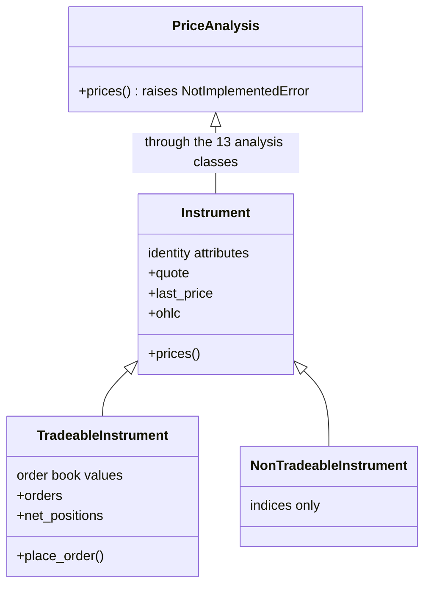

# The instrument model

`tradingmachine.assets.instruments` holds three classes, and every one of the twenty-seven classes in the six
family modules is a subclass of one of them.



## What the constructor does

You name the instrument; the object finds it. The constructor sends one request to
`/api/instruments/details` and keeps what comes back. That is the only lookup in the object's
lifetime.

```python
from tradingmachine.assets import instruments

infosys = instruments.TradeableInstrument(
    exchange="nse",
    segment="equities",
    symbol="INFY",
)
```

Which identity fields you have to give depends on the segment's shape, and UBI answers HTTP 400
when they do not fit.

| Shape | Give | Example |
| --- | --- | --- |
| `security` | `symbol` | a share, a bond, an index, a fund |
| `future` | `underlying_symbol`, `expiry_date` | an index future |
| `option` | `underlying_symbol`, `expiry_date`, `strike_price`, `option_type` | an equity option |

An `instrument_id` on its own is also accepted, and then no other field is needed. It is the UUID
UBI computes for the instrument, and it is the same at every broker.

## What the object keeps

The identity attributes below are set once at construction and never refreshed.

| Attribute | Type | What it is |
| --- | --- | --- |
| `instrument_id` | `str` | UBI's UUID for the instrument |
| `exchange` | `str` | Lower case, such as `nse` or `mcx` |
| `segment` | `str` | Exchange-prefixed, such as `nse_equities` |
| `shape` | `str` | `security`, `future` or `option` |
| `symbol` | `str` or `None` | Set for a security, `None` for a future or an option |
| `underlying_symbol`, `expiry_date`, `strike_price`, `option_type` | mixed | Set for a derivative, `None` for a security |
| `mapping_date`, `first_seen_date`, `last_seen_date` | `datetime.date` or `None` | When UBI mapped and last saw the instrument |
| `lot_size` | `int` or `None` | `None` when UBI's brokers do not agree |
| `tick_size` | `decimal.Decimal` or `None` | `None` when UBI's brokers do not agree |
| `carried_by` | `list[dict]` | One entry per broker carrying it, with that broker's own token, order symbol, lot size and tick size |

Two of these are traps rather than conveniences. `lot_size` is the plurality of what the brokers
report and is **not** the figure an order's quantity is measured against, which matters most in
the [currency](../asset-classes/currencies.md) and [commodity](../asset-classes/commodities.md)
families. `tick_size` is a `decimal.Decimal` rather than a float, so that 0.05 is exactly 0.05, but
nothing in this project rounds a price to it.

Two instruments are equal when their `instrument_id` matches, and the hash follows the same field,
so instruments can go into a set or be used as dictionary keys. The representation shows only the
fields that are set:

```
Equity(exchange='nse', segment='nse_equities', symbol='INFY')
EquityIndexOption(exchange='nse', segment='nse_equity_index_options', underlying_symbol='NIFTY', expiry_date='2026-09-29', strike_price=25000.0, option_type='CE')
```

## What it fetches, and when

Everything except the identity is fetched at the moment you ask for it.

| Member | Route | Returns |
| --- | --- | --- |
| `prices(...)` | `/api/instruments/prices` | A `pandas.DataFrame` of candles, or `None` |
| `quote` | `/api/instruments/quote` | The full unified quote as a `dict` |
| `last_price` | `/api/instruments/ltp` | A `float`, or `None` |
| `ohlc` | `/api/instruments/ohlc` | The day's open, high, low, last and previous close |

There is no caching between calls and no batching of date ranges. Asking for the last price twice
sends two requests. This is deliberate: UBI runs on the same machine and caches in its own Redis,
so the second request is cheap and never stale, and a cache here would be a second copy with its
own expiry rules to get wrong.

## The trading split

`TradeableInstrument` adds everything that assumes a live, orderable contract: the order book,
`place_order` and its twenty-eight wrappers, the order and trade readers, and the position
members. Its constructor raises `TradeableInstrumentError` when the segment ends in `_indices`.

`NonTradeableInstrument` is the mirror image. It adds nothing, and its constructor raises
`NonTradeableInstrumentError` when the segment does **not** end in `_indices`.

```python
from tradingmachine.assets import equities

equities.Equity(exchange="nse", symbol="NIFTY")
# InstrumentError, because NIFTY is not in the equities segment

equities.EquityIndex(exchange="nse", symbol="NIFTY")
# fine, and it has last_price but no place_order
```

!!! note "Being a `TradeableInstrument` does not mean an order will succeed"

    The class only checks that the instrument is not an index. A `Commodity` or a `Currency` is a
    `TradeableInstrument` and carries every order method, but UBI refuses every order in those two
    segments, because their rows are the exchange's reference records rather than contracts anyone
    can buy. See [Commodities](../asset-classes/commodities.md).

## The shared client

Instruments share one `tradingmachine.ubi_client.client.UnifiedBrokerInterface` by default, held on `Instrument` itself
rather than on the subclass, so that every class in every family uses the same one. UBI keeps a
single access token for the whole application, so two clients would sit there replacing each
other's token. Pass `unified_broker_interface=` to a constructor to use your own instead, which is
mainly useful for pointing one instrument at a different UBI.

See [The UBI client](ubi-client.md) for what that single token means in practice.
