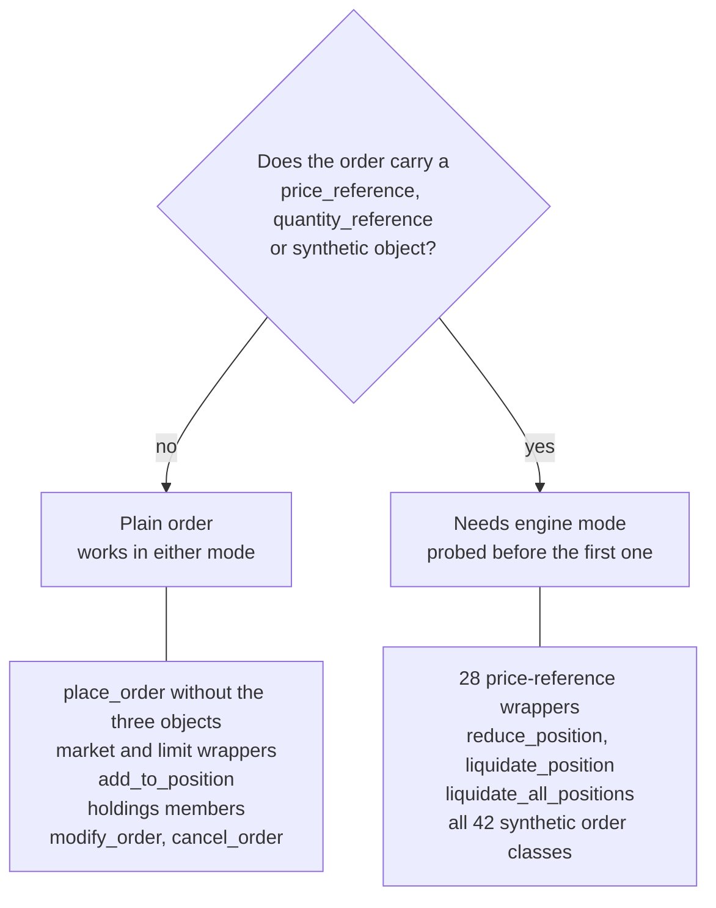
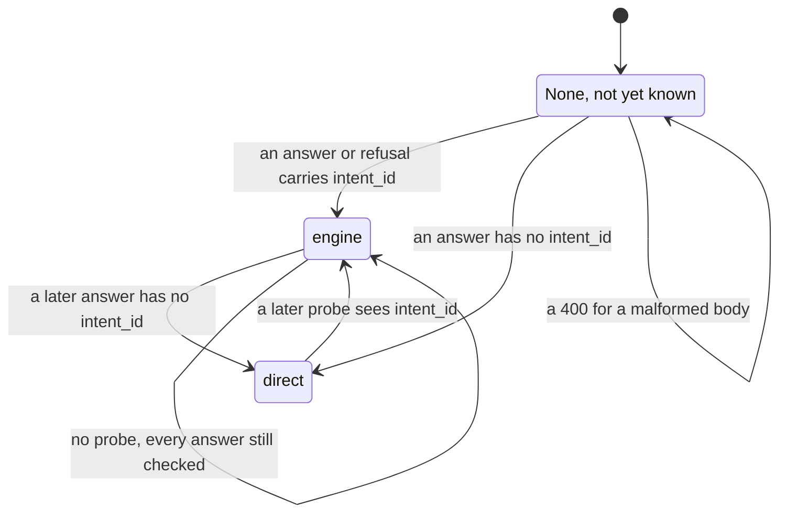

# Placement modes

UBI can place an order in one of two ways, and the difference decides whether some of this library's orders do what their names say. This page explains the two modes, lists what the library sends as a description for UBI to work out rather than as a finished value, and shows the check `place_order` makes before the first such order so that a misconfigured UBI cannot quietly turn a bracket into a plain order.

## Direct mode and engine mode

UBI reads its placement mode from `UNIFIED_BROKER_INTERFACE_API_ORDER_PLACEMENT` when it starts. In **direct** mode, which is UBI's default, the API worker that receives `POST /api/orders/place` sends the order to the broker itself. In **engine** mode, the worker hands the order to UBI's order engine, a separate long-running process, and waits for its answer. The library assumes engine mode, which the user's UBI `.env` sets.

The table below compares what each mode does with the parts of an order this library can send.

| What the order carries | Direct mode | Engine mode |
|---|---|---|
| A plain order: side, type, quantity, price | :material-check: sent to the broker | :material-check: sent to the broker, as the `simple` type |
| `price_reference` | :material-close: shape-checked, then ignored, so a limit order goes out with a price of 0 | :material-check: resolved from the live quote and rounded to the tick |
| `quantity_reference` | :material-close: shape-checked, then ignored, so the order goes out with a quantity of 0 | :material-check: resolved from the positions, with the side chosen to close |
| `synthetic` | :material-close: ignored, so a bracket or an iceberg goes out as one plain order | :material-check: run as one of 42 synthetic types |
| Extra keys in the answer | none | `intent_id`, and `parent_id` for an order the engine recorded |

!!! warning "Direct mode refuses none of this"
    UBI in direct mode accepts an order carrying a reference or a synthetic object and sends something else without any error. The only sign is that the answer has no `intent_id`. That is why the library checks before the first such order, as described below. UBI's own page, [Direct mode and engine mode](https://pramodathani.github.io/unified_broker_interface/rest-api/order-engine/#direct-mode-and-engine-mode), has the full comparison.

## What the library sends as a description

The user decided on 2026-09-26 that order types are built in UBI rather than here. So wherever UBI can now work a value out itself, the library sends a small dictionary describing the value instead of computing it. `place_order` accepts three such objects as its last three arguments, and the table below lists them and the members that send each one.

| Object | Describes | Example | Sent by |
|---|---|---|---|
| `price_reference` | Where the price comes from | `{"kind": "offer_level", "level": 1}` | 28 of the 32 price wrappers, such as `buy_at_best_offer_price` and `sell_at_mid_price` |
| `quantity_reference` | How big the order is, from the position held | `{"kind": "liquidate_position", "product": "intraday"}` | `reduce_position`, `liquidate_position` and so `liquidate_all_positions` |
| `synthetic` | Which synthetic order type works the order, with its settings | `{"type": "bracket", "stop_price": 990, "stop_limit_price": 988, "target_price": 1010}` | Every class in `tradingmachine.orders`, and the two position methods above, which send `{"type": "simple", "closes_position": true}` |

The four price wrappers that do not send a reference are `buy_at_market_price`, `sell_at_market_price`, `buy_at_limit_price` and `sell_at_limit_price`. They send a plain price, or none, so they work in either mode. The holdings members only call those four, so they work in either mode too, and so does `add_to_position`, which still works its direction out locally. The flowchart below sorts every order-sending member by whether it depends on engine mode.



`modify_order` and `cancel_order` go straight to the broker in both modes, because UBI's modify and cancel routes never pass through the engine. UBI documents how each reference becomes a number on [Price and quantity references](https://pramodathani.github.io/unified_broker_interface/rest-api/price-quantity-references/).

## The placement-mode probe

UBI has no route that reports its placement mode. What engine mode does do is add an `intent_id` to every answer from `POST /api/orders/place`, including dry runs and the engine's own refusals, and direct mode never adds one. UBI hands an order to the engine before it reads `dry_run`, so a dry run passes through the engine too. That makes a dry run a free and reliable test, and `place_order` uses it as one.

The animation below follows the first order in a process that carries a reference. The dry run goes out first, its answer comes back with an `intent_id`, the shared client records the mode, and only then does the real order go out.

<figure class="diagram">
--8<-- "docs/assets/diagrams/placement-probe.svg"
<figcaption>Orange dots are the call and the dry-run probe, green dots are answers carrying intent_id, and blue dots are the real order, which leaves only after the probe has shown engine mode.</figcaption>
</figure>

The numbered steps below are what `TradeableInstrument.place_order` does, in order, for a live order that carries any of the three objects.

1. It builds the order body, leaving out every optional field that is None.
2. It looks at `placement_mode` on the shared client. If the value is already `"engine"`, it skips straight to step 5.
3. Otherwise it copies the body, sets `dry_run` to True and sends the copy. This is the probe.
4. It reads the probe's answer.
    - An answer carrying `intent_id` sets `placement_mode` to `"engine"`.
    - An answer without one sets `placement_mode` to `"direct"` and raises `DirectPlacementError` with the message `UBI is placing orders directly, without its order engine, so it would ignore this order's price reference, quantity reference or synthetic object; nothing was sent`. The real order is never sent.
    - A refusal is re-raised as it is, because the real order would have been refused the same way. If the refusal's body carries an `intent_id`, `placement_mode` is set to `"engine"` first.
5. It sends the real order.
6. It checks the real answer the same way. If it has no `intent_id`, UBI must have been switched to direct mode after the probe, and the order has already gone out as a plain order, so it sets `placement_mode` to `"direct"` and raises `DirectPlacementError` with a message ending `read the order book before doing anything else`. That is a backstop: it cannot undo the order, but it stops your program carrying on as if a stop were protecting a position.

The state diagram below shows how `placement_mode` on the shared client moves between its three values.



The table below lists what each kind of order costs in requests.

| Order | Probe sent first | Answer checked | Requests to UBI |
|---|:---:|:---:|---|
| Plain order, in any mode | :material-close: | :material-close: | 1 |
| First order with a reference or synthetic object | :material-check: | :material-check: | 2: the dry run, then the order |
| Later orders once `placement_mode` is `engine` | :material-close: | :material-check: | 1 |
| Any order after `placement_mode` became `direct` | :material-check: | :material-check: | 1 if UBI is still in direct mode, because the probe raises; 2 if it is back in engine mode |
| A dry run with a reference or synthetic object | :material-close:, it is its own probe | :material-check: | 1 |

The mode is kept on the shared client rather than on the instrument, because every instrument in a process shares one client and the mode belongs to the server. So the probe costs one dry run per process, not one per order and not one per instrument.

### A real probe, captured

The example below is a dry run of a limit buy of one RELIANCE share, priced at the best offer by a `price_reference`, captured from a local UBI on Saturday 2026-09-26. Because it is already a dry run, it is its own probe: it was sent once, and its `intent_id` set `placement_mode` to `'engine'`. The answer shows the request UBI would have sent to Stoxkart, the broker it chose, with the price 1226.0 worked out from the best offer. It contains no account identifier.

=== "Python"

    ```python
    from tradingmachine.assets import equities

    reliance = equities.Equity("nse", "RELIANCE")
    answer = reliance.place_order(
        "buy",
        "limit",
        1,
        "cnc",
        price_reference={"kind": "offer_level", "level": 1},
        dry_run=True,
    )
    print(repr(answer))
    client = reliance.shared_unified_broker_interface()
    print("placement_mode:", repr(client.placement_mode))
    ```

=== "Output"

    ```text
    {'broker': 'stoxkart', 'dry_run': True, 'instrument_id': '3f92570a-9924-5bf5-9f9d-e006cd9f4202', 'intent_id': '584e0a7f6cb84dc18fe0e64da9f4db69', 'request': {'json': {'action': 'BUY', 'algo_id': '99999', 'disclose_quantity': '0', 'exchange': 'NSE', 'order_type': 'LIMIT', 'price': '1226.0', 'product_type': 'DELIVERY', 'quantity': '1', 'stop_loss_price': '0', 'token': '2885', 'trailing_stop_loss': '0', 'trigger_price': '0', 'validity': 'DAY'}, 'method': 'POST', 'url': 'https://openapi.stoxkart.com/orders/normal'}, 'skipped': [], 'tag': None, 'timing_ms': {'preparation': 1.98}}
    placement_mode: 'engine'
    ```

!!! tip "Probe on purpose at start-up"
    A program that will place engine orders can send one such dry run when it starts, as above. That settles `placement_mode` before the first real order, so the first real order costs one request instead of two, and a UBI in direct mode is found before the market opens rather than at the first trade.

### Timeouts

Three different clocks can run out around an engine order, and each ends differently. The table below lists them, what each raises, and what it leaves `placement_mode` as.

| Clock | Default | What happens | Raised in your program | `placement_mode` afterwards |
|---|---|---|---|---|
| UBI waiting for its engine, `UNIFIED_BROKER_INTERFACE_API_ORDER_ENGINE_TIMEOUT_SECONDS` | 5 seconds | UBI answers <span class="status s5">504</span> with `outcome: unknown` and the message in `status_message`: `the order engine did not answer within 5.0 seconds, so this order may still be placed` | `OrderOutcomeUnknownError`, with that message | `engine`, because the body carries an `intent_id` |
| No engine running at all | none | UBI answers <span class="status s5">503</span> `the order engine is not running, so the order was not placed; start unified-orders@order_engine.service` before queueing anything | `ServiceUnavailableError` | Unchanged, unless the body carries an `intent_id` |
| The client's own wait for any response | 30 seconds per request | No response arrives, and `requests` raises its timeout | `UnreachableError`, chained to the `requests` error | Unchanged |

When the 504 happens on the probe, the probe's error is re-raised and the real order is not sent. The dry run itself may still be sitting in UBI's queue, which is harmless: it is a dry run, and UBI's engine refuses any intent it reads more than 30 seconds after the caller stopped waiting. When the 504 happens on the real order, the order may still be placed, so read `orders` before sending it again.

UBI's 504 puts its explanation in `status_message` rather than in `error`, and the client falls back to `status_message` for the exception's message, which it has done since 2026-09-26. Before that the message read only `UBI returned HTTP 504`.

!!! note "Why there is a probe at all"
    The cleaner fix would be one field on an authenticated UBI route that reports the mode, which would turn the probe into a single read. UBI has no such route today; `placement_mode` exists in UBI only as an attribute of its orders blueprint and is never served.

??? note "Under the hood"
    The probe lives in three private methods of `TradeableInstrument` in `src/tradingmachine/assets/instruments.py`: `_probe_placement_mode` sends the dry-run copy, `_record_placement_mode` reads an answer for `intent_id` and raises `DirectPlacementError`, and `_record_engine_refusal` reads a refusal's `detail` for `intent_id`. `placement_mode` is a public attribute of `UnifiedBrokerInterface` in `src/tradingmachine/unified_broker_interface/client.py`, set to None in its constructor. The per-request timeout is `DEFAULT_TIMEOUT_SECONDS` in the same file, and only `post` accepts a `timeout_seconds` override, which `Account.flatten` uses with a default of 120 seconds. The reasoning is in `.claude/notes/src/tradingmachine/assets/instruments.py.md` and `.claude/notes/src/tradingmachine/unified_broker_interface/client.py.md`.

The members involved are documented in the Python API tab: [`place_order`](../python-api/orders.md#place_order), [`DirectPlacementError`](../python-api/errors.md#directplacementerror) and [the UBI client](../python-api/client.md).
