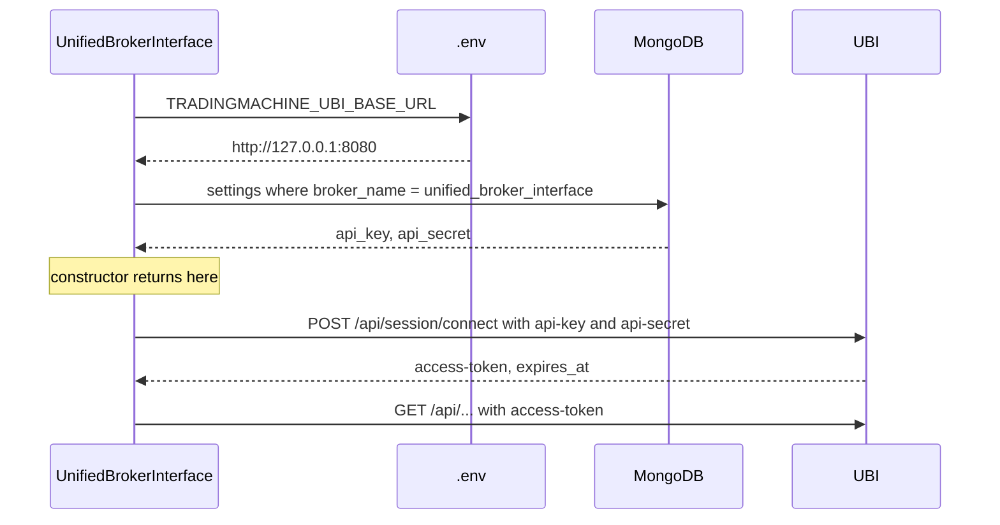

# The UBI client

`ubi_client.UnifiedBrokerInterface` is a thin REST client and nothing more. It finds its
credentials, holds an access token, sends requests with that token, retries once when the token is
refused, and turns every failed response into a typed exception. It never interprets a payload;
what it returns is parsed JSON exactly as UBI sent it.

```python
from ubi_client import client

unified_broker_interface = client.UnifiedBrokerInterface()
brokers = unified_broker_interface.get("/api/brokers/details")
```

## Starting up

Two things have to be in place before the constructor returns, and each has its own failure.



| Step | Raises when it fails |
| --- | --- |
| Reading the base url | `ValueError`, naming `TRADINGMACHINE_UBI_BASE_URL` |
| Reading the settings document | `ValueError`, naming the document or the missing field |
| Connecting | `AuthenticationError` if the key or secret is refused |

The connect call is lazy. The constructor only fetches credentials; the first request that needs a
token is what sends `POST /api/session/connect`.

## The single token, and why it bites

!!! warning "UBI holds one access token for the whole application"

    Every `connect` replaces the token currently in force, which logs out whoever was using it.
    That includes UBI's own REST API test page in a browser tab, and any other script of yours
    that is connected at the same time. If a long-running job suddenly starts getting 401s, the
    usual cause is that something else connected.

This is also why `assets.instruments` gives every instrument the same client by default. Two
clients in one process would take turns invalidating each other's token, and each request would
pay for a reconnect.

The token expires after a day by default, and `token_expires_at` holds the server's own statement
of when.

## The one retry

`_request` handles a refused token without the caller seeing it.

1. Send the request with the current token. If there is no token yet, connect first.
2. If the response is HTTP 401 and this is not already the retry, drop the token and send the
   whole request again. Sending it again connects, because the token is now `None`.
3. If the response is still not `ok`, raise the exception class that matches its status code.
4. Otherwise return the parsed body.

The retry happens once and only for 401. Every other failure, including a second 401, is raised.
`connect` itself never retries, because a 401 from `connect` means the key or secret is wrong and
trying again would only loop.

The client does not look at `token_expires_at` before sending. Since another client can invalidate
the token at any moment, an expiry check would not make a refused token less likely; sending and
recovering is both simpler and more reliable.

## The surface

| Member | What it does |
| --- | --- |
| `connect()` | Exchanges the key and secret for a new token, and returns it |
| `disconnect()` | Revokes the token on the server and forgets it locally |
| `status()` | Asks the server whether the session is connected and when the token expires |
| `get(path, params=None)` | A `GET` with query parameters |
| `post(path, body=None, params=None)` | A `POST` with an optional JSON body |
| `put`, `patch`, `delete` | The same shape as `post` |
| `token_expires_at` | The server's expiry time for the current token, or `None` before the first connect |

The body parameter is called `body` rather than `json` so that it does not shadow the standard
library's `json` module; it is handed to `requests` as `json=`. `delete` takes a body too, because
UBI's order routes read the query string and the JSON body as one, so an order can be cancelled
either way. `patch` exists for symmetry: UBI has no `PATCH` route today, so a `PATCH` gets HTTP 405
from Flask and is raised as `ServerError`.

Every request carries a timeout, 30 seconds unless the constructor is told otherwise, and a
request that never gets a response at all raises `UnreachableError` rather than a status-code
error. See [Errors](errors.md).

## Why the credentials live in MongoDB

They could have been two more lines in `.env`. They are in MongoDB because UBI itself reads the
matching pair out of its own MongoDB, so the two projects agree by both consulting a database
rather than by someone remembering to update two `.env` files. The document is seeded by hand and
no code in either project creates it; see [Configuration](../getting-started/configuration.md).
