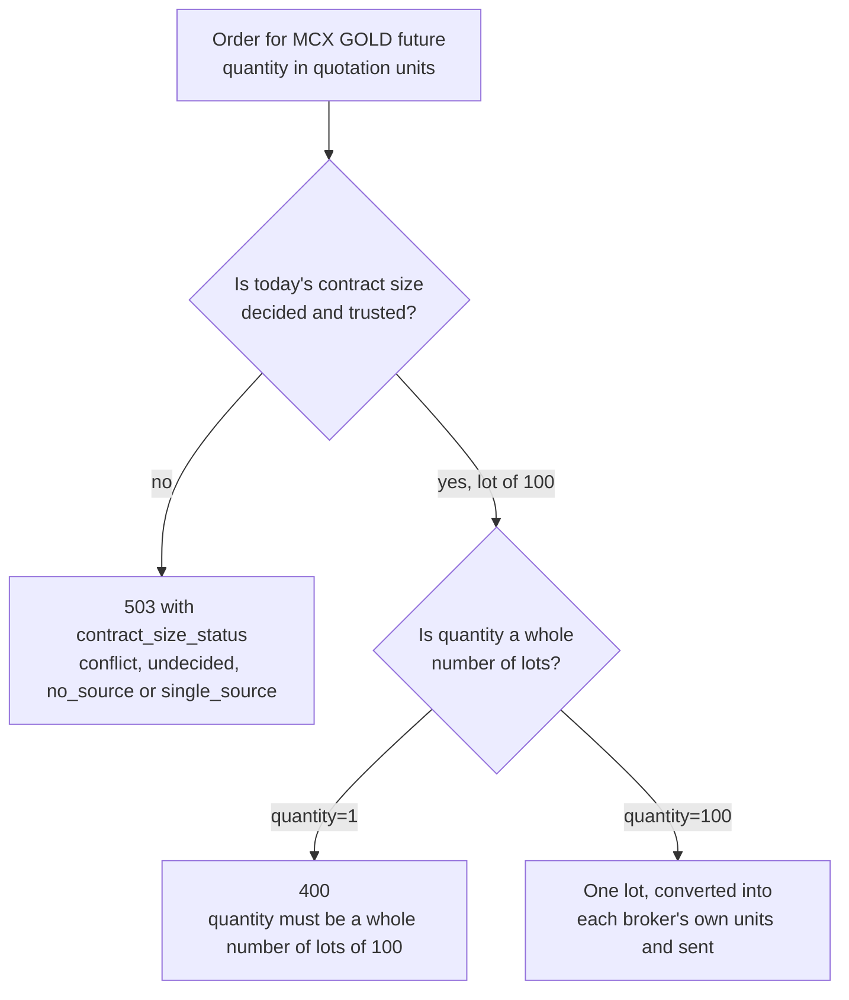

# Commodities

The commodity family covers commodities such as gold and crude oil, the exchanges' commodity indices, and the futures and options written on each of them. It lives in `tradingmachine.assets.commodities` and has six classes built like the [equity classes](equities.md). In practice only the four derivative classes are real contracts: they are quoted, they have candles, and they can be ordered, but an order's quantity follows different rules from a share's.

The table below lists the six classes.

| Kind | Class | What it is | UBI segment | Named by |
|---|---|---|---|---|
| <span class="member class">class</span> | [`Commodity`][tradingmachine.assets.commodities.Commodity] | The exchange's reference record for a commodity, such as GOLD | `commodities` | `exchange`, `symbol` |
| <span class="member class">class</span> | [`CommodityFutures`][tradingmachine.assets.commodities.CommodityFutures] | A commodity future | `commodity_futures` | `exchange`, `underlying_symbol`, `expiry_date` |
| <span class="member class">class</span> | [`CommodityOption`][tradingmachine.assets.commodities.CommodityOption] | A commodity option | `commodity_options` | those three, plus `strike_price`, `option_type` |
| <span class="member class">class</span> | [`CommodityIndex`][tradingmachine.assets.commodities.CommodityIndex] | A commodity index, such as MCXBULLDEX | `commodity_indices` | `exchange`, `symbol` |
| <span class="member class">class</span> | [`CommodityIndexFutures`][tradingmachine.assets.commodities.CommodityIndexFutures] | A future on a commodity index | `commodity_index_futures` | `exchange`, `underlying_symbol`, `expiry_date` |
| <span class="member class">class</span> | [`CommodityIndexOption`][tradingmachine.assets.commodities.CommodityIndexOption] | An option on a commodity index | `commodity_index_options` | those three, plus `strike_price`, `option_type` |

## Exchanges and symbols

UBI carries commodities on three exchanges, `mcx`, `ncdex` and `nse`, and the commodity indices and their derivatives on `mcx` and `ncdex` only. There is no commodity market on the `bse`. Symbols are readable tickers, such as `GOLD`, `CRUDEOIL` and `ALUMINIUM` for a commodity and `MCXBULLDEX` or `MCXCOMDEX` for an index, and a derivative's `underlying_symbol` is exactly its underlying's `symbol`.

The library does not check the exchange against this list. Asking for a commodity on the `bse` simply finds nothing and raises the class's own error, which is how every other unknown contract fails.

## A gold future

The example below finds the live expiries of MCX gold futures, builds the nearest one and reads its lot size, tick size and last price. The output was captured from a local UBI on Saturday 2026-09-26, when the market was closed, so the price is Friday's close.

=== "Python"

    ```python
    from tradingmachine.assets import commodities

    expiries = commodities.CommodityFutures.expiries("mcx", "GOLD")
    gold = commodities.CommodityFutures("mcx", "GOLD", expiries[0])

    print(expiries)
    print(repr(gold))
    print((gold.lot_size, gold.tick_size))
    print(gold.last_price)
    ```

=== "Output"

    ```text
    [datetime.date(2026, 10, 5), datetime.date(2026, 12, 4), datetime.date(2027, 2, 5), datetime.date(2027, 4, 5), datetime.date(2027, 6, 4), datetime.date(2027, 8, 5)]
    CommodityFutures(exchange='mcx', segment='mcx_commodity_futures', underlying_symbol='GOLD', expiry_date='2026-10-05')
    (100, Decimal('1'))
    150734.0
    ```

The lot size of 100 comes from Groww, which UBI treats as the authority on MCX lot sizes; the other eight brokers that carry the contract report 1. The quantity rule in the next section shows why that figure matters.

## Quantity is counted in quotation units, in whole lots

This is the most important difference from equities, and the easiest to get wrong. A share order's quantity is a count of shares. A commodity order's quantity is a count of quotation units, and UBI refuses it unless it is an exact multiple of the contract's lot. The flowchart below shows the check UBI makes when a commodity order arrives.



UBI converts the quantity into whatever each broker counts in before sending it, so the same number works whichever broker takes the order. On the `ncdex` the quotation unit is tonnes, although prices there are quoted in quintals.

!!! warning "This rule is UBI's stated contract, not an observed one"
    UBI opened these markets on 2026-09-15 before any live order confirmed the rule. Zerodha answered that MCX is disabled for the account, and Dhan recorded a quantity and then rejected the order for lack of funds, so no order has gone all the way through. The library does not check the quantity itself, in keeping with its rule that quantities reach UBI exactly as given.

UBI's page on [contract sizes, lots and ticks](https://pramodathani.github.io/unified_broker_interface/rest-api/orders/#contract-sizes-lots-and-ticks) describes the check from UBI's side.

## A 503 that is not about UBI being down

UBI decides each contract's size once every morning, from the exchanges' own fields rather than from what the brokers say. When its sources disagree, or there is only one of them, the contract is not tradeable that day. An order for it is answered with HTTP <span class="status s5">503</span> and a `contract_size_status` of `conflict`, `undecided`, `no_source` or `single_source`.

So a 503 on a commodity order usually means UBI does not trust the contract's size today, not that UBI is unavailable. On 2026-09-15, twelve SILVER100 futures were in that state, and NCDEX contracts trade on a single source, Stoxkart, alone. The library raises [`ServiceUnavailableError`](../python-api/errors.md#serviceunavailableerror) for both kinds of 503, so read its message to tell them apart.

## No holdings, and two classes that cannot be ordered

No class in this family has holdings members. UBI reports holdings only for its cash segments, and commodities are not one of them, so a commodity can never appear in the account's holdings. Positions do cover this family, so the position members inherited from `TradeableInstrument` work normally on the four derivative classes.

`Commodity` is built on `TradeableInstrument`, because its segment name does not end in `_indices`, so it inherits `place_order` and all thirty-two price wrappers. Every one of them fails. Its rows are the exchange's underlying reference records rather than tradeable spot contracts; no broker offers a cash market for commodities, so UBI finds no broker to send the order to; and UBI's contract size check refuses any commodity order that is not a future or an option. `CommodityIndex` cannot be ordered either, because it is an index.

## Quotes and candles

A `Commodity` and a `CommodityIndex` have no quote, because every broker's live feed maps the commodity exchanges to derivative segments only, so a price tick can never land on a reference record. `quote`, `last_price`, `ohlc` and the order-book values raise `ServiceUnavailableError` for those two classes.

The four derivative classes are quoted normally, and they have candles. That makes them the only instruments outside the equity family and exchange traded funds on which the [analysis methods](../analysis/index.md) return anything. The output below was recorded on 2026-09-20 by the check of this module, for `relative_strength_index(window=14, days=90)` on the MCX gold future then nearest. The call returned 61 rows, of which the note kept three.

```text
                 datetime    close    rsi_14
2026-09-14 00:00:00+05:30 151230.0 44.259329
2026-09-15 00:00:00+05:30 150809.0 43.351621
2026-09-16 00:00:00+05:30 152470.0 47.892248
```

MCX and NCDEX derivatives are the only instruments in UBI allowed a negative price, which matters for spread contracts.

The table below shows the six contracts checked on 2026-09-20. The prices are that day's, and "Candles" is the number of daily rows `prices` returned.

| Class | Contract | Segment | `lot_size` | `tick_size` | `last_price` | Candles |
|---|---|---|---|---|---|---|
| `Commodity` | mcx GOLD | `mcx_commodities` | 1 | 100 | no quote | None |
| `CommodityFutures` | GOLD 2026-10-05 | `mcx_commodity_futures` | 100 | 1 | 154263.0 | 40 |
| `CommodityOption` | GOLD 2026-09-25 173500 CE | `mcx_commodity_options` | 100 | 0.5 | 0.5 | 40 |
| `CommodityIndex` | mcx MCXBULLDEX | `mcx_commodity_indices` | 1 | 0.05 | no quote | None |
| `CommodityIndexFutures` | MCXBULLDEX 2026-09-25 | `mcx_commodity_index_futures` | 30 | 1 | 34837.0 | 40 |
| `CommodityIndexOption` | MCXBULLDEX 2026-09-25 34900 CE | `mcx_commodity_index_options` | 30 | 0.05 | 154.15 | 40 |

The tick size of 100 on the `Commodity` row is a raw broker value that UBI does not convert for this segment, so it is much less trustworthy than a derivative's.

## Finding contracts

The discovery class methods work as they do for equities. The table below shows what they returned on 2026-09-20.

| Call | Result |
|---|---|
| `Commodity.search(exchange="mcx", term="GOLD")` | 34 rows: `GOLD`, `GOLDAHM`, `GOLDDEL`, `GOLDGLOBAL`, `GOLDGUINEA` and more |
| `CommodityIndex.search(exchange="mcx", term="DEX")` | 13 rows, the whole MCX index family from `MCXALUMDEX` to `MCXZINCDEX` |
| `CommodityOption.strikes` and `chain` for GOLD on 2026-09-25 | 1,074 strikes and 2,148 rows |
| `CommodityIndexFutures.contracts(exchange="mcx")` | 8 rows |
| `CommodityIndexOption.strikes` for MCXBULLDEX | 118 strikes |

## Errors

The table below lists what the constructors and the order methods can raise in this family.

| Exception | When |
|---|---|
| `TypeError` | A required identity argument is missing. Python raises it before any request. |
| `CommodityError` | UBI has no commodity with that exchange and symbol, including an index asked for as a commodity. |
| `CommodityFuturesError` | UBI has no future with that underlying and expiry. |
| `CommodityOptionError` | UBI has no option with those five fields. |
| `CommodityIndexError` | UBI has no index with that symbol, including a commodity asked for as an index. |
| `CommodityIndexFuturesError` | UBI has no index future with that underlying and expiry. |
| `CommodityIndexOptionError` | UBI has no index option with those five fields. |
| `BadRequestError` | An order's quantity is not a whole number of lots. |
| `ServiceUnavailableError` | A quote is read on `Commodity` or `CommodityIndex`, or UBI does not trust the contract's size today. |
