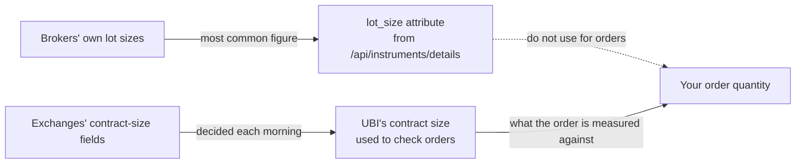

# Currencies

The currency family covers currency pairs such as USDINR and the futures and options written on them. It lives in `tradingmachine.assets.currencies` and has six classes built like the [commodity classes](commodities.md), which it resembles closely: only the derivatives are real contracts, and an order's quantity must be a whole number of lots. It is also the thinnest family. Half its classes find nothing, nothing has candles, and the `lot_size` attribute is not the figure an order is measured against.

The table below lists the six classes and how many instruments UBI held in each on 2026-09-20.

| Kind | Class | What it is | UBI segment | Named by | Instruments in UBI |
|---|---|---|---|---|---|
| <span class="member class">class</span> | [`Currency`][tradingmachine.assets.currencies.Currency] | The exchange's reference record for a pair | `currencies` | `exchange`, `symbol` | nse 7, bse 15 |
| <span class="member class">class</span> | [`CurrencyFutures`][tradingmachine.assets.currencies.CurrencyFutures] | A currency future | `currency_futures` | `exchange`, `underlying_symbol`, `expiry_date` | nse 261, bse 879 |
| <span class="member class">class</span> | [`CurrencyOption`][tradingmachine.assets.currencies.CurrencyOption] | A currency option | `currency_options` | those three, plus `strike_price`, `option_type` | nse 23,527, bse 104,769 |
| <span class="member class">class</span> | [`CurrencyIndex`][tradingmachine.assets.currencies.CurrencyIndex] | A currency index | `currency_indices` | `exchange`, `symbol` | none |
| <span class="member class">class</span> | [`CurrencyIndexFutures`][tradingmachine.assets.currencies.CurrencyIndexFutures] | A future on a currency index | `currency_index_futures` | `exchange`, `underlying_symbol`, `expiry_date` | none |
| <span class="member class">class</span> | [`CurrencyIndexOption`][tradingmachine.assets.currencies.CurrencyIndexOption] | An option on a currency index | `currency_index_options` | those three, plus `strike_price`, `option_type` | none |

## Seven pairs, and the bse's variants

Currencies trade on the `nse` and the `bse` only. UBI carries seven pairs on the nse, and the bse adds over-the-counter variants of them, such as `USDINROTC` and `USDINROTCD`. Symbols are the readable pair names, and a derivative's `underlying_symbol` is exactly its pair's `symbol`. The table below lists the seven nse pairs.

| Pair | What it prices |
|---|---|
| `USDINR` | US dollar in rupees |
| `EURINR` | Euro in rupees |
| `GBPINR` | Pound sterling in rupees |
| `JPYINR` | Japanese yen in rupees |
| `EURUSD` | Euro in US dollars |
| `GBPUSD` | Pound sterling in US dollars |
| `USDJPY` | US dollar in Japanese yen |

On 2026-09-20, `Currency.search(exchange="nse", term="INR")` returned the four rupee pairs, and `Currency.search(exchange="bse", term="USD")` returned nine rows, including the over-the-counter variants.

## Half the family is empty

`currency_indices`, `currency_index_futures` and `currency_index_options` are names in UBI's list of segments, but they hold no rows on any exchange and no broker maps anything into them. India has no traded currency index to fill them, so unlike the empty fixed income segment they are unlikely ever to fill.

The three classes exist anyway, so that every family with derivatives has the same shape. They fail cleanly: building one raises the class's own error, and the discovery methods return an empty list or `None` without raising. The table below shows what each call returned on 2026-09-20.

| Call | Result |
|---|---|
| `CurrencyIndex.search(exchange="nse", term="USD")` | `None` |
| `CurrencyIndexFutures.expiries` | `[]` |
| `CurrencyIndexFutures.contracts` | `None` |
| `CurrencyIndexOption.expiries` | `[]` |
| `CurrencyIndexOption.strikes` | `[]` |
| `CurrencyIndexOption.chain` | `None` |

## The lot size trap

A currency order's quantity is counted in quotation units and must be a whole number of lots, as for commodities. The trap is that the `lot_size` attribute on the instrument and the lot UBI measures an order against come from two different places, and for currencies they disagree. The diagram below shows the two sources.



`lot_size` is the figure most brokers report. For NSE `USDINR` that is 1, because five brokers count in lots while Stoxkart counts 1000 units. On the bse the same pair shows a `lot_size` of 1000, from Stoxkart alone. UBI's own notes record that the brokers disagreed on 99% of live NSE currency options, which is exactly why UBI checks orders against its morning contract size decision instead.

!!! warning "Never compute an order quantity from `lot_size` here"
    In this family, `lot_size` does not tell you the lot an order must be a multiple of. The figure to trust is the one UBI's refusal names when a quantity is not a whole number of lots. [Contract sizes, lots and ticks](https://pramodathani.github.io/unified_broker_interface/rest-api/orders/#contract-sizes-lots-and-ticks) on UBI's site describes the check.

An order can also be refused with HTTP <span class="status s5">503</span> and a `contract_size_status` of `conflict`, `undecided`, `no_source` or `single_source`. That means UBI does not trust the contract's size that day, not that UBI is unavailable. On 2026-09-15, nine GBPINR and JPYINR options were in that state, and 302 NSE currency options carried only by Flattrade had no contract size at all. The [Commodities](commodities.md#a-503-that-is-not-about-ubi-being-down) page describes the same refusal.

## What works where

Coverage in this family differs by exchange as well as by class, which no earlier family does. The table below summarises it.

| Class | Quote on the nse | Quote on the bse | Candles | Can be ordered |
|---|:-:|:-:|:-:|:-:|
| `Currency` | :material-close: | :material-close: | :material-close: | :material-close: |
| `CurrencyFutures` | :material-check: | :material-close: | :material-close: | :material-check: |
| `CurrencyOption` | :material-check: | :material-close: | :material-close: | :material-check: |
| the three index classes | :material-minus: | :material-minus: | :material-minus: | :material-minus: |

A `Currency` has no quote, because every broker's live feed maps the currency venues to derivative segments only, so a price tick can never land on a pair's reference record. It cannot be ordered either: no broker offers a cash market for currencies, and UBI's contract size check refuses any currency order that is not a future or an option. It still has the order-book members, because it is built on `TradeableInstrument`, but reading them raises `ServiceUnavailableError`.

The nse derivatives are quoted and the bse ones are not. Fyers' currency derivatives are also left out of UBI's live feeds on purpose, because Fyers' fixed price divisor is a hundred times wrong for pairs quoted to four decimals. UBI stores no candles for any currency segment, so `prices` returns `None` throughout and the [analysis methods](../analysis/index.md) have nothing to work on.

No class in this family has holdings members, for the same reason as commodities: UBI reports holdings only for its cash segments, and currencies are not one of them. Positions do cover the family.

## An example

The example below finds the nearest USDINR future on the nse, builds it, and finds the option chain for the same expiry. It is the module's own usage example. It was not run for this page, so no output is shown; the table after it gives what the same contracts showed when the module was checked on 2026-09-20.

```python
from tradingmachine.assets import currencies

expiries = currencies.CurrencyFutures.expiries(exchange="nse", underlying_symbol="USDINR")
contract = currencies.CurrencyFutures(
    exchange="nse",
    underlying_symbol="USDINR",
    expiry_date=expiries[0],
)
rate = contract.last_price

chain = currencies.CurrencyOption.chain(
    exchange="nse",
    underlying_symbol="USDINR",
    expiry_date=expiries[0],
)
```

The table below shows the four contracts checked on 2026-09-20. The prices are that day's. The two `CurrencyFutures` rows are the same pair on two exchanges, and their different `lot_size` values are the trap described above.

| Class | Contract | Segment | `lot_size` | `tick_size` | Brokers | `last_price` |
|---|---|---|---|---|---|---|
| `Currency` | nse USDINR | `nse_currencies` | 1 | None | 2 | no quote |
| `CurrencyFutures` | nse USDINR 2026-09-25 | `nse_currency_futures` | 1 | 0.0025 | 6 | 96.0325 |
| `CurrencyOption` | nse USDINR 2026-09-25 95.625 CE | `nse_currency_options` | 1 | 0.0025 | 5 | 1.32 |
| `CurrencyFutures` | bse USDINR 2026-09-25 | `bse_currency_futures` | 1000 | 0.0025 | 1 | no quote |

On that day the nse USDINR futures had weekly expiries, and `CurrencyFutures.contracts(exchange="nse")` returned 129 rows. The USDINR option chain for 2026-09-25 had 88 strikes over 176 rows, and a row from its middle, `USDINR 2026-09-25 95.625 CE`, rebuilt into a `CurrencyOption` with the same `instrument_id`.

## Errors

The table below lists what the constructors raise in this family.

| Exception | When |
|---|---|
| `TypeError` | A required identity argument is missing. Python raises it before any request. |
| `CurrencyError` | UBI has no pair with that exchange and symbol. |
| `CurrencyFuturesError` | UBI has no future with that underlying and expiry. |
| `CurrencyOptionError` | UBI has no option with those five fields. |
| `CurrencyIndexError`, `CurrencyIndexFuturesError`, `CurrencyIndexOptionError` | Always, today, because the three segments are empty. |
| `ServiceUnavailableError` | A quote is read on `Currency` or on a bse derivative, or UBI does not trust a contract's size today. |
