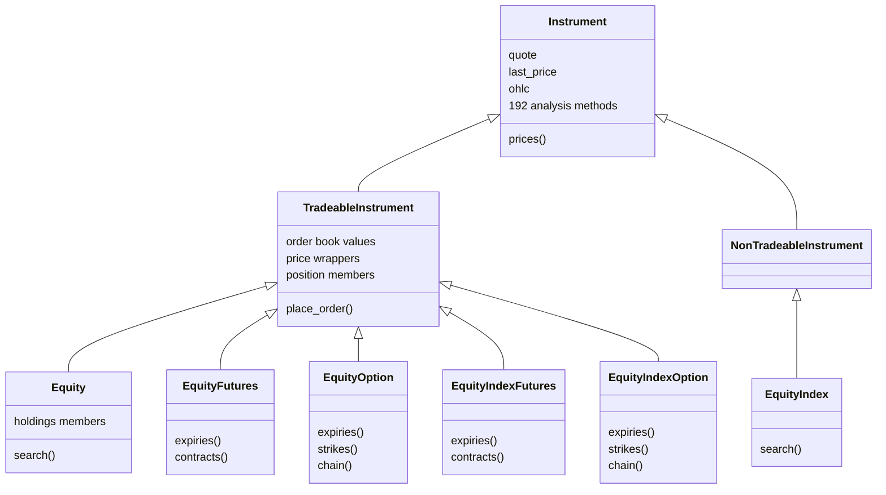
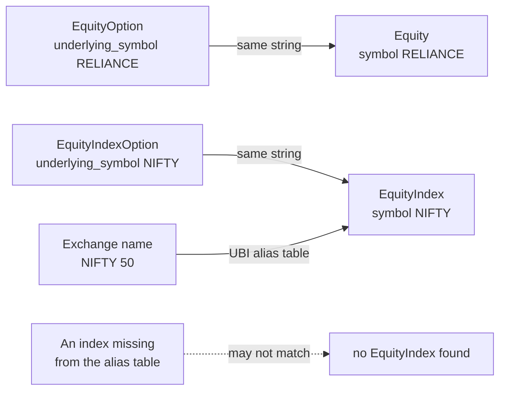

# Equities

The equity family covers shares, stock market indices, and the futures and options written on each of them. It lives in `tradingmachine.assets.equities` and has six classes, one for each of UBI's equity segments. It is the family where the most works: every class that resolves an instrument has a live quote, shares and indices have candles, five of the six classes can be ordered, and `Equity` can be held.

The table below lists the six classes and what identifies one contract of each.

| Kind | Class | What it is | UBI segment | Named by |
|---|---|---|---|---|
| <span class="member class">class</span> | [`Equity`](#a-share) | A share, such as RELIANCE | `equities` | `exchange`, `symbol` |
| <span class="member class">class</span> | [`EquityFutures`](#futures-and-options) | A future on a share | `equity_futures` | `exchange`, `underlying_symbol`, `expiry_date` |
| <span class="member class">class</span> | [`EquityOption`](#futures-and-options) | An option on a share | `equity_options` | `exchange`, `underlying_symbol`, `expiry_date`, `strike_price`, `option_type` |
| <span class="member class">class</span> | [`EquityIndex`](#an-index) | A stock market index, such as NIFTY | `equity_indices` | `exchange`, `symbol` |
| <span class="member class">class</span> | [`EquityIndexFutures`](#futures-and-options) | A future on an index | `equity_index_futures` | `exchange`, `underlying_symbol`, `expiry_date` |
| <span class="member class">class</span> | [`EquityIndexOption`](#futures-and-options) | An option on an index | `equity_index_options` | `exchange`, `underlying_symbol`, `expiry_date`, `strike_price`, `option_type` |

## How the six classes are built

`EquityIndex` is built on `NonTradeableInstrument`, because an index is a number the exchange publishes rather than something you can buy. The other five are built on `TradeableInstrument`, so they carry the order book, the order methods, the price wrappers and the position members. Only `Equity` adds the holdings members. The class diagram below shows this, with the discovery class methods each class adds.



## Naming a contract

Every constructor argument is required, and the constructor accepts only the fields that identify one of its own contracts. A share takes an exchange and a symbol, a future adds nothing to that but swaps the symbol for its underlying's symbol and an expiry date, and an option also takes a strike price and an option type, `CE` for a call or `PE` for a put. The exchange is written in lower case, such as `nse` or `bse`.

Leaving out a field fails at once, in Python, before any request is sent. Asking for something UBI does not have fails one request later with the class's own error, such as `EquityOptionError`, whose `__cause__` is the general `InstrumentError` carrying UBI's own message. Asking one class for another's instrument, such as `Equity(exchange="nse", symbol="NIFTY")`, fails the same way, because the class fixes its segment and UBI finds no share called NIFTY.

The code below builds one contract of each kind. It is the module's own usage example, extended to the futures classes.

```python
from tradingmachine.assets import equities

share = equities.Equity(exchange="nse", symbol="RELIANCE")
nifty = equities.EquityIndex(exchange="nse", symbol="NIFTY")

future = equities.EquityFutures(
    exchange="nse",
    underlying_symbol="RELIANCE",
    expiry_date="2026-09-29",
)
option = equities.EquityIndexOption(
    exchange="nse",
    underlying_symbol="NIFTY",
    expiry_date="2026-09-29",
    strike_price=25000,
    option_type="CE",
)
```

## A share

An [`Equity`][tradingmachine.assets.equities.Equity] is a share on the nse or the bse. The example below builds RELIANCE and reads its attributes, its last ten days of candles and its last price. The output was captured from a local UBI on Saturday 2026-09-26, when the market was closed, so the price is Friday's close. The `carried_by` list, which names every broker that carries the share, has been trimmed from nine entries to two.

=== "Python"

    ```python
    from tradingmachine.assets import equities

    reliance = equities.Equity("nse", "RELIANCE")
    print(repr(reliance))
    print({key: value for key, value in vars(reliance).items() if not key.startswith("_")})
    print(reliance.prices(days=10))
    print(reliance.last_price)
    ```

=== "Output"

    ```text
    Equity(exchange='nse', segment='nse_equities', symbol='RELIANCE')

    {'instrument_id': '3f92570a-9924-5bf5-9f9d-e006cd9f4202', 'exchange': 'nse', 'segment': 'nse_equities',
     'shape': 'security', 'symbol': 'RELIANCE', 'underlying_symbol': None, 'expiry_date': None,
     'strike_price': None, 'option_type': None, 'mapping_date': datetime.date(2026, 9, 26),
     'first_seen_date': datetime.date(2026, 8, 7), 'last_seen_date': datetime.date(2026, 9, 26),
     'lot_size': 1, 'tick_size': Decimal('0.1'),
     'carried_by': [{'broker': 'dhan', 'broker_token': '2885', 'lot_size': '1.0', 'order_symbol': None, 'tick_size': '0.1'},
                    {'broker': 'zerodha', 'broker_token': '738561', 'lot_size': '1.0', 'order_symbol': 'RELIANCE', 'tick_size': '0.1'}]}

    DataFrame shape=(6, 11)
      exchange       segment interval                  datetime    open    high     low   close    volume    oi  price_factor
    0      nse  nse_equities      day 2026-09-16 00:00:00+05:30  1243.0  1255.0  1240.0  1240.0  10023997  None           1.0
    1      nse  nse_equities      day 2026-09-17 00:00:00+05:30  1244.8  1253.4  1238.5  1243.9   7752895  None           1.0
    2      nse  nse_equities      day 2026-09-18 00:00:00+05:30  1245.0  1247.3  1226.4  1226.4  15122715  None           1.0
    3      nse  nse_equities      day 2026-09-21 00:00:00+05:30  1234.1  1249.1  1232.5  1247.4  10007218  None           1.0
    4      nse  nse_equities      day 2026-09-22 00:00:00+05:30  1247.6  1251.9  1237.4  1240.4  10684376  None           1.0

    1226.0
    ```

The attribute dictionary has been wrapped across lines for reading. The capture script printed each frame's shape and first five rows rather than the whole frame, and that is what the third block shows. The candles carry a `price_factor` column because a share's prices are adjusted for splits and bonuses by default; [`prices`](../python-api/market-data.md#prices) explains the columns and UBI's page on [adjusted and unadjusted prices](https://pramodathani.github.io/unified_broker_interface/rest-api/historical-data/#adjusted-unadjusted-and-as-served) explains the adjustment. The same capture asked for `prices(interval="5minute", days=1)` and got `None`, because intraday candles are loaded into UBI by hand and none had been loaded for RELIANCE.

### Holding a share

`Equity` is the only class in this family with the holdings members, because a share is the only equity contract that can be kept in the demat account. A future or an option leaves a position rather than a holding, and an index cannot be held at all. The table below lists the six members, which are documented in full on the [Holdings](../python-api/holdings.md) page.

| Kind | Member | Description |
|---|---|---|
| <span class="member property">property</span> | `holdings` | This share's row from the account's holdings, or None when it is not held |
| <span class="member property">property</span> | `holdings_value` | What the holding is worth, as UBI prices it |
| <span class="member property">property</span> | `holdings_pnl` | The holding's `day_change`, `day_change_percentage` and `unrealized` profit |
| <span class="member writes">places orders</span> | `add_to_holdings` | Buys more, always as a `cnc` order |
| <span class="member writes">places orders</span> | `reduce_holdings` | Sells part of the shares that are free to sell |
| <span class="member writes">places orders</span> | `liquidate_holdings` | Sells every share that is free to sell |

Two details matter in practice. The three order methods always send the `cnc` product, because selling a holding as `mis` would open an intraday short position beside the shares instead of selling them. And the shares free to sell are the holding minus any shares pledged as collateral, so `reduce_holdings` refuses a quantity larger than that with `HoldingError`. The RELIANCE capture above found RELIANCE not held, so `holdings` returned `None`.

## An index

An [`EquityIndex`][tradingmachine.assets.equities.EquityIndex] has a live level and candles, so every analysis method works on it, but it has no order book and no order methods. It is also the usual benchmark for [`beta`](../analysis/statistics.md), which the library checked against NIFTY's candles on 2026-09-14. The example below searches the nse's indices for names containing NIFTY, with `limit=5`. The output was captured from a local UBI on 2026-09-26.

=== "Python"

    ```python
    matches = equities.EquityIndex.search("nse", "NIFTY", limit=5)
    print(matches)
    ```

=== "Output"

    ```text
    DataFrame shape=(5, 9)
      exchange expiry_date                         instrument_id option_type             segment     shape strike_price          symbol underlying_symbol
    0      nse        None  dba60324-760b-53cc-aeae-a4bb4defd1bc        None  nse_equity_indices  security         None           NIFTY              None
    1      nse        None  e7c51261-0da7-5d34-a06d-061555b29f34        None  nse_equity_indices  security         None       NIFTY 100              None
    2      nse        None  2973b7d0-71ad-5fff-9a76-61fa8b76ac15        None  nse_equity_indices  security         None       NIFTY 200              None
    3      nse        None  fcffdd52-23c3-53ba-8035-f34ab407a7ab        None  nse_equity_indices  security         None       NIFTY 500              None
    4      nse        None  66d42d85-1805-5259-b2af-10132873f608        None  nse_equity_indices  security         None  NIFTY ALPHA 50              None
    ```

The index the exchange publishes as "NIFTY 50" is stored by UBI as `NIFTY`, which is the name its futures and options use as their underlying symbol. The section on [why a derivative does not hold its underlying](#why-a-derivative-does-not-hold-its-underlying) explains why that matters.

The same search on shares, `Equity.search("nse", "RELI", limit=5)`, returned four rows in the same capture: RELIABLE, RELIANCE, RELIGARE and RELINFRA.

## Futures and options

The four derivative classes are named by their underlying symbol, their expiry date and, for options, a strike and an option type. You rarely know those by heart, so each class offers discovery class methods that read UBI's full instrument list for its own segment and return what is live. [Finding instruments](../python-api/discovery.md) documents them; the table below says which class has which.

| Class | `expiries` | `contracts` | `strikes` | `chain` |
|---|:-:|:-:|:-:|:-:|
| `EquityFutures`, `EquityIndexFutures` | :material-check: | :material-check: | :material-close: | :material-close: |
| `EquityOption`, `EquityIndexOption` | :material-check: | :material-close: | :material-check: | :material-check: |

The example below walks from the NIFTY index to its option chain for the nearest expiry. The output was captured from a local UBI on 2026-09-26. The expiry list is shown in full, while the strike list has been trimmed from 269 strikes to its first and last few, and the chain printed only its first five of 538 rows, which are the 269 strikes as calls and puts.

=== "Python"

    ```python
    expiries = equities.EquityIndexOption.expiries("nse", "NIFTY")
    strikes = equities.EquityIndexOption.strikes("nse", "NIFTY", expiries[0])
    chain = equities.EquityIndexOption.chain("nse", "NIFTY", expiries[0])

    print(equities.EquityFutures.expiries("nse", "RELIANCE"))
    ```

=== "Output"

    ```text
    [datetime.date(2026, 9, 29), datetime.date(2026, 10, 6), datetime.date(2026, 10, 13), datetime.date(2026, 10, 19),
     datetime.date(2026, 10, 27), datetime.date(2026, 11, 3), datetime.date(2026, 11, 23), datetime.date(2026, 12, 29),
     datetime.date(2027, 3, 30), datetime.date(2027, 6, 29), datetime.date(2027, 12, 28), datetime.date(2028, 6, 27),
     datetime.date(2028, 12, 26), datetime.date(2029, 6, 26), datetime.date(2029, 12, 24), datetime.date(2030, 6, 25),
     datetime.date(2030, 12, 31), datetime.date(2031, 6, 24)]

    [1500.0, 3000.0, 4500.0, 6000.0, 7500.0, ..., 43500.0, 45000.0, 46500.0, 48000.0, 49500.0]

    DataFrame shape=(538, 9)
                              instrument_id exchange                   segment   shape symbol underlying_symbol expiry_date  strike_price option_type
    0  1c39032e-270b-51e0-aa0b-fa0e1072928d      nse  nse_equity_index_options  option   None             NIFTY  2026-09-29        1500.0          CE
    1  f44aa598-4ad7-54bb-b93d-d1dfc3426a45      nse  nse_equity_index_options  option   None             NIFTY  2026-09-29        1500.0          PE
    2  29f59c8a-8a7b-5acf-a019-17521f4c44f7      nse  nse_equity_index_options  option   None             NIFTY  2026-09-29        3000.0          CE
    3  01725b1b-6e9e-551a-9eb2-abeddaaf5e3a      nse  nse_equity_index_options  option   None             NIFTY  2026-09-29        3000.0          PE
    4  b987116e-93b3-54df-af89-68a725d35d10      nse  nse_equity_index_options  option   None             NIFTY  2026-09-29        4500.0          CE

    [datetime.date(2026, 9, 29), datetime.date(2026, 10, 27), datetime.date(2026, 11, 23)]
    ```

The discovery methods return rows of identities, not instrument objects. Building 538 objects would send 538 lookups to UBI, so you take the two or three rows you want and build those. A row's identity fields rebuild the same instrument: on 2026-09-20 a row from the middle of the RELIANCE chain was turned into an `EquityOption`, and UBI returned the very `instrument_id` the row carried.

Single-stock options are slower to discover than index options. Each call downloads the whole `nse_equity_options` segment, which held 125,967 rows on 2026-09-20 and took about two seconds, against a quarter of a second for the 14,826 rows of index options.

The six contracts below were built and checked against UBI on 2026-09-20, which shows the lot and tick sizes you can expect. The prices are that day's and are here only to show that each class was quoted.

| Class | Contract | Segment | `lot_size` | `tick_size` | `last_price` |
|---|---|---|---|---|---|
| `Equity` | RELIANCE | `nse_equities` | 1 | 0.1 | 1226.4 |
| `EquityFutures` | RELIANCE 2026-09-29 | `nse_equity_futures` | 500 | 0.1 | 1242.0 |
| `EquityOption` | RELIANCE 2026-09-29 1250 CE | `nse_equity_options` | 500 | 0.05 | 11.95 |
| `EquityIndex` | NIFTY | `nse_equity_indices` | 1 | 0.05 | 23346.4 |
| `EquityIndexFutures` | NIFTY 2026-09-29 | `nse_equity_index_futures` | 65 | 0.1 | 23380.0 |
| `EquityIndexOption` | NIFTY 2026-09-29 23350 CE | `nse_equity_index_options` | 65 | 0.05 | 171.1 |

An equity order is a securities-market order, so its quantity is a plain count of shares, and for a derivative it must be a whole number of the chosen broker's lot size. [Orders](../python-api/orders.md#place_order) explains the rest.

## Why a derivative does not hold its underlying

It would be convenient if a RELIANCE option carried a RELIANCE `Equity` object, but it deliberately does not. The first reason is cost: building the underlying would send one more lookup per contract, doubling the cost of building anything from a chain. The second reason is that UBI gives no reliable way to make the link. It has no key joining a derivative to its underlying. The two are matched only by the derivative's `underlying_symbol` string being equal to a share's or an index's `symbol`.

The flowchart below shows how that string match works for a share and for an index, and where it can fail.



For shares the match holds, because UBI strips the exchange's series suffix, such as `-EQ`, from NSE symbols when it builds its instrument list. For indices it depends on an alias table in UBI that rewrites the published names onto the derivative names, so Zerodha's `NIFTY 50` row is stored as `NIFTY` and its `NIFTYBANK` row as `BANKNIFTY`. The table covers NIFTY, BANKNIFTY, FINNIFTY, MIDCPNIFTY and NIFTYNXT50. An index outside it may not match, so a caller that wants the underlying builds it and decides what to do when it is not found.

## Errors

The table below lists what each constructor raises. Every error is a subclass of `InstrumentError`, so `except InstrumentError` catches them all, and [Errors](../python-api/errors.md) documents each class.

| Exception | When |
|---|---|
| `TypeError` | A required identity argument is missing. Python raises it before any request. |
| `EquityError` | UBI has no share with that exchange and symbol, including an index asked for as a share. |
| `EquityFuturesError` | UBI has no share future with that underlying and expiry. |
| `EquityOptionError` | UBI has no share option with those five fields, such as an impossible strike. |
| `EquityIndexError` | UBI has no index with that exchange and symbol, including a share asked for as an index. |
| `EquityIndexFuturesError` | UBI has no index future with that underlying and expiry. |
| `EquityIndexOptionError` | UBI has no index option with those five fields. |
