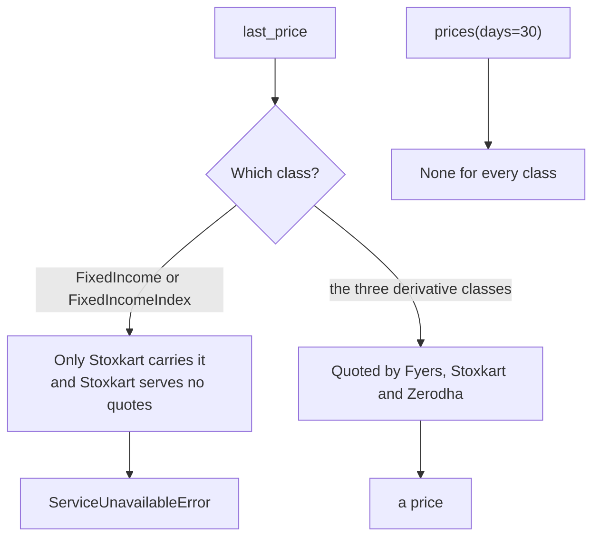
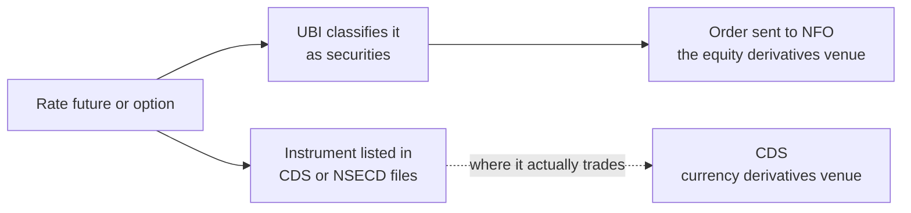

# Fixed income

The fixed income family covers bonds, interest rate indices, and the futures and options written on each of them. It lives in `tradingmachine.assets.fixed_income` and has six classes built exactly like the [equity classes](equities.md), with the same required identity fields and the same discovery class methods. What differs is what UBI knows about these instruments: a bond is named by its ISIN rather than a ticker, a cash bond has no quote, and nothing in the family has candles.

The table below lists the six classes.

| Kind | Class | What it is | UBI segment | Named by |
|---|---|---|---|---|
| <span class="member class">class</span> | [`FixedIncome`][tradingmachine.assets.fixed_income.FixedIncome] | A bond, debenture, government security or sovereign gold bond | `fixed_income` | `exchange`, `symbol` |
| <span class="member class">class</span> | [`FixedIncomeFutures`][tradingmachine.assets.fixed_income.FixedIncomeFutures] | An interest rate future on a government security | `fixed_income_futures` | `exchange`, `underlying_symbol`, `expiry_date` |
| <span class="member class">class</span> | [`FixedIncomeOption`][tradingmachine.assets.fixed_income.FixedIncomeOption] | An interest rate option on a government security | `fixed_income_options` | those three, plus `strike_price`, `option_type` |
| <span class="member class">class</span> | [`FixedIncomeIndex`][tradingmachine.assets.fixed_income.FixedIncomeIndex] | A rate index, such as ONMIBOR | `fixed_income_indices` | `exchange`, `symbol` |
| <span class="member class">class</span> | [`FixedIncomeIndexFutures`][tradingmachine.assets.fixed_income.FixedIncomeIndexFutures] | A future on a rate index | `fixed_income_index_futures` | `exchange`, `underlying_symbol`, `expiry_date` |
| <span class="member class">class</span> | [`FixedIncomeIndexOption`][tradingmachine.assets.fixed_income.FixedIncomeIndexOption] | An option on a rate index, which no broker lists today | `fixed_income_index_options` | those three, plus `strike_price`, `option_type` |

The cash segment is spelled `fixed_income`, not pluralised as `equities` is. That is UBI's own name for it and the class uses it as it is.

## A bond is named by its ISIN

Almost every bond in UBI has an ISIN as its symbol, such as `IN000126C010`, rather than a ticker. This is the one place in UBI where that is so. The reason is that India's one-off corporate bonds and non-convertible debentures have tickers too inconsistent across brokers to match on, and the ISIN is the only identity that reconciles them.

The exception is about eighty interest rate underlyings on the nse, which are named by a rate code such as `633GS2035`. They are few, but they matter most, because they are what the futures and options are written on. The table below shows the split as measured on 2026-09-20.

| Segment | Rows | Named by ISIN | Named by rate code |
|---|---|---|---|
| `nse_fixed_income` | 6,816 | 6,737 | 79 |
| `bse_fixed_income` | 14,614 | 14,614 | 0 |

Sovereign gold bonds are in this family too, named by their ISIN, rather than with commodities. `FixedIncome.search` is the easiest way to get from a half-remembered ISIN or rate code to a whole one, as the example below shows.

```python
from tradingmachine.assets import fixed_income

by_isin = fixed_income.FixedIncome.search(exchange="bse", term="IN0001")
by_rate_code = fixed_income.FixedIncome.search(exchange="nse", term="GS2035")

bond = fixed_income.FixedIncome(exchange="nse", symbol="IN000126C010")
underlying = fixed_income.FixedIncome(exchange="nse", symbol="633GS2035")
```

On 2026-09-20 the first search returned six rows starting with `IN000126C010`, and the second returned six rows including `633GS2035`, `664GS2035`, `667GS2035` and `R633GS2035`. The rate underlyings carry no tick size from any broker, so their `tick_size` is `None`, as the table further down shows.

## What UBI does not have for this family

Two gaps are large enough that the module states them in its own docstring, so that a raised error is not mistaken for a bug in the library. The flowchart below shows what happens when you ask each kind of fixed income instrument for its price.



**A cash bond and a rate index have no quote.** Only Stoxkart carries them, and Stoxkart does not serve quotes, so `quote`, `last_price`, `ohlc` and every order-book value raise [`ServiceUnavailableError`](../python-api/errors.md#serviceunavailableerror). Stoxkart's order symbol for a cash bond is also empty, so there is no broker to send an order to either. Today `FixedIncome` is useful for identity, discovery and holdings, and not for prices or trading.

**Nothing in this family has candles.** `prices(days=30)` returned `None` for all seven contracts checked on 2026-09-20, including the derivatives that do have live quotes. The analysis methods are still present, because they come with `Instrument`, but they have nothing to work on here and return `None`. They will start working if UBI begins storing fixed income candles.

The table below shows the seven contracts checked on 2026-09-20. The prices are that day's.

| Class | Contract | Segment | `lot_size` | `tick_size` | Brokers | `last_price` |
|---|---|---|---|---|---|---|
| `FixedIncome` | nse IN000126C010 | `nse_fixed_income` | 1 | 0.01 | stoxkart | no quote |
| `FixedIncome` | nse 633GS2035 | `nse_fixed_income` | 1 | None | stoxkart | no quote |
| `FixedIncome` | bse IN000126C010 | `bse_fixed_income` | 1 | 0.01 | stoxkart | no quote |
| `FixedIncomeFutures` | 633GS2035 2026-09-24 | `nse_fixed_income_futures` | 1 | 0.0025 | fyers, stoxkart, zerodha | 97.81 |
| `FixedIncomeOption` | 633GS2035 2026-09-24 97.25 CE | `nse_fixed_income_options` | None | 0.0025 | stoxkart, zerodha | 1.58 |
| `FixedIncomeIndex` | ONMIBOR | `nse_fixed_income_indices` | 1 | None | stoxkart | no quote |
| `FixedIncomeIndexFutures` | ONMIBOR 2026-09-30 | `nse_fixed_income_index_futures` | 1 | 0.0025 | fyers, stoxkart, zerodha | 5.3 |

The option's `lot_size` is `None` because the brokers do not agree on one.

## The empty options segment

`fixed_income_index_options` is a name in UBI's list of segments that no broker fills, and nothing in UBI can currently put a row in it. `FixedIncomeIndexOption` exists anyway, so that the family has the same six classes as every other family with derivatives and so that it works the moment UBI gains a rule for it.

It fails cleanly rather than strangely. Building one raises `FixedIncomeIndexOptionError`, like any contract UBI does not have, and its discovery methods return empty results without raising, as the example below shows.

```python
fixed_income.FixedIncomeIndexOption.expiries(exchange="nse", underlying_symbol="ONMIBOR")  # []
fixed_income.FixedIncomeIndexOption.strikes(exchange="nse", underlying_symbol="ONMIBOR", expiry_date="2026-09-30")  # []
fixed_income.FixedIncomeIndexOption.chain(exchange="nse", underlying_symbol="ONMIBOR", expiry_date="2026-09-30")  # None
```

## Finding derivative contracts

The derivative classes find their contracts the same way the equity ones do. The table below shows what the discovery calls returned on 2026-09-20.

| Call | Result |
|---|---|
| `FixedIncomeIndex.search(exchange="nse", term="MIBOR")` | 1 row, `ONMIBOR` |
| `FixedIncomeFutures.expiries(underlying_symbol="633GS2035")` | 2026-09-24, 10-29, 11-26, 12-31 and 2027-03-25 |
| `FixedIncomeOption.expiries(underlying_symbol="633GS2035")` | 2026-09-24, 10-29, 11-26 and 12-31 |
| `FixedIncomeOption.strikes(expiry_date=2026-09-24)` | 47 strikes, from 91.5 upward in steps of 0.25 |
| `FixedIncomeOption.chain(expiry_date=2026-09-24)` | 94 rows, the 47 strikes as calls and puts |
| `FixedIncomeIndexFutures.expiries(underlying_symbol="ONMIBOR")` | six dates, 2026-09-30 to 2027-06-30 |

A row from the middle of that option chain, `633GS2035 2026-09-24 97.25 PE`, was rebuilt into a `FixedIncomeOption`, and UBI returned the same `instrument_id` the row carried.

## Holding a bond

`FixedIncome` carries the same six holdings members as [`Equity`](equities.md#holding-a-share), copied into the class rather than shared, and no other class in this family has them. `fixed_income` is one of UBI's cash segments, so a bond is reported in the account's holdings exactly as a share is. The members always use the `cnc` product and sell only units that are not pledged. [Holdings](../python-api/holdings.md) documents them.

Two differences from a share are worth knowing. A holding row's `symbol` and `isin` hold the same string here, because the symbol already is the ISIN, which makes matching a holding to its bond more reliable than it is for a share. And a bond held only at Groww is not reported at all, because UBI looks a Groww holding up by the broker's ticker among symbols that are ISINs, and never finds it.

No bond was held in the account when this was checked, so only the not-held path has been seen live. The three order methods were exercised against a recorder with invented holdings rows, and no order was sent.

## A routing problem in UBI

UBI's own order routing for fixed income derivatives looks wrong, and it is recorded here so that the first person to place such an order knows where to start. It was found by reading UBI's source on 2026-09-20 and has not been confirmed with a real order.

UBI classifies `fixed_income_futures`, `fixed_income_options` and `fixed_income_index_futures` as securities, so it sends their orders to the equity derivatives venue, `NFO` at Zerodha. But the instruments come from the currency derivatives files, `CDS` at Zerodha and `NSECD` elsewhere, and Zerodha's own market table has a `CDS` entry that would be correct. The diagram below shows the mismatch.



The same classification has two further effects. The quantity is sent in plain units rather than lots, although rate futures are traded in lots, and UBI's session window for these contracts closes at 16:00 although they trade until 17:00. The library does not work around any of this, because the fix belongs in UBI. Rate indices themselves are missing from UBI's list of tradeable segments, which agrees with `FixedIncomeIndex` being built on `NonTradeableInstrument`.

## Errors

The table below lists what each constructor raises. Each error is a subclass of `InstrumentError` and carries UBI's own message as its `__cause__`.

| Exception | When |
|---|---|
| `TypeError` | A required identity argument is missing. Python raises it before any request. |
| `FixedIncomeError` | UBI has no bond with that exchange and symbol, including a rate index asked for as a bond. |
| `FixedIncomeFuturesError` | UBI has no rate future with that underlying and expiry. |
| `FixedIncomeOptionError` | UBI has no rate option with those five fields. |
| `FixedIncomeIndexError` | UBI has no rate index with that symbol, including a bond asked for as an index. |
| `FixedIncomeIndexFuturesError` | UBI has no rate index future with that underlying and expiry. |
| `FixedIncomeIndexOptionError` | Always, today, because the segment is empty. |
| `ServiceUnavailableError` | A quote or order-book value is read on `FixedIncome` or `FixedIncomeIndex`. |
