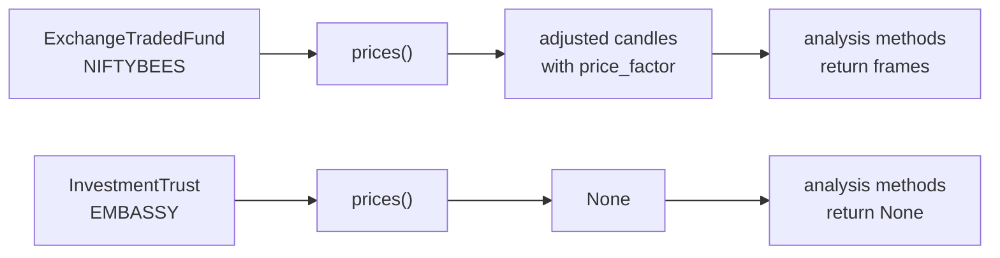

# Funds and trusts

This family covers exchange traded funds, such as NIFTYBEES, and investment trusts, such as the real estate trust EMBASSY and the infrastructure trusts whose names end in INVIT. It lives in `tradingmachine.assets.funds` and has two classes rather than six, because UBI carries no futures or options on a fund or a trust. Both behave like shares in every way that matters: they are quoted continuously, they take ordinary market and limit orders with the quantity as a plain count of units, and they can be held.

The table below lists the two classes and how many instruments UBI held in each on 2026-09-20.

| Kind | Class | What it is | UBI segment | Named by | Instruments in UBI |
|---|---|---|---|---|---|
| <span class="member class">class</span> | [`ExchangeTradedFund`][tradingmachine.assets.funds.ExchangeTradedFund] | A fund listed and traded on an exchange | `exchange_traded_funds` | `exchange`, `symbol` | nse 353, bse 273 |
| <span class="member class">class</span> | [`InvestmentTrust`][tradingmachine.assets.funds.InvestmentTrust] | A real estate or infrastructure investment trust | `investment_trusts` | `exchange`, `symbol` | nse 27, bse 27 |

A mutual fund is a different thing and has its own page, [Mutual funds](mutual-funds.md), because it is subscribed to at its net asset value rather than traded.

## The one difference between them

A fund and a trust work identically in this library except for one thing, which is what UBI stores for them. A fund's candles are adjusted for splits and bonuses, like a share's, and carry a `price_factor` column. A trust's candles are not stored at all yet, so `prices` returns `None` for an `InvestmentTrust` and the [analysis methods](../analysis/index.md) have nothing to work on, even though the trust is quoted and traded normally. The flowchart below shows the two paths.



The example below shows the difference through `relative_strength_index`. The fund's output was recorded on 2026-09-20 when the module was checked; that call returned 63 rows, of which the note kept two. The same call on the trust returned `None`.

=== "Python"

    ```python
    from tradingmachine.assets import funds

    fund = funds.ExchangeTradedFund(exchange="nse", symbol="NIFTYBEES")
    print(fund.relative_strength_index(window=14, days=90))

    trust = funds.InvestmentTrust(exchange="nse", symbol="EMBASSY")
    print(trust.relative_strength_index(window=14, days=90))
    ```

=== "Output"

    ```text
                     datetime  close    rsi_14
    2026-09-17 00:00:00+05:30 266.08 29.018966
    2026-09-18 00:00:00+05:30 266.53 31.299985

    None
    ```

The fund's frame is shown with only its `datetime`, `close` and `rsi_14` columns, as the note recorded it; the real frame carries every candle column as well.

## Listed on both exchanges

Both classes are listed on the `nse` and the `bse`, and the same fund is quoted separately on each. The table below shows the three instruments checked on 2026-09-20. The prices are that day's, and "Candles" is the number of daily rows `prices` returned.

| Class | Instrument | Segment | `lot_size` | `tick_size` | Brokers | `last_price` | Candles |
|---|---|---|---|---|---|---|---|
| `ExchangeTradedFund` | nse NIFTYBEES | `nse_exchange_traded_funds` | 1 | 0.01 | 10 | 266.53 | 42, with `price_factor` |
| `ExchangeTradedFund` | bse NIFTYBEES | `bse_exchange_traded_funds` | 1 | 0.01 | 10 | 266.6 | 41, with `price_factor` |
| `InvestmentTrust` | nse EMBASSY | `nse_investment_trusts` | 1 | 0.01 | 9 | 441.07 | None |

The small gap between 266.53 and 266.6 is the ordinary difference between two exchanges' last trades, not something to correct.

## Finding a fund or a trust

Both classes have a `search` class method that finds symbols containing a term. The table below shows what it returned on 2026-09-20. Searching by a word such as GOLD or INVIT is often quicker than remembering a fund's exact ticker.

| Call | Result |
|---|---|
| `ExchangeTradedFund.search(exchange="nse", term="NIFTYBEE")` | 1 row, `NIFTYBEES` |
| `ExchangeTradedFund.search(exchange="nse", term="GOLD")` | 26 rows: `GOLD1`, `GOLD360`, `GOLDADD`, `GOLDAXIS`, `GOLDBEES`, `GOLDBETA` and more |
| `InvestmentTrust.search(exchange="nse", term="EMBAS")` | 1 row, `EMBASSY` |
| `InvestmentTrust.search(exchange="nse", term="INVIT")` | 9 rows: `CAPINVIT`, `CUBEINVIT`, `INDUSINVIT`, `IRBINVIT`, `NDRINVIT`, `PGINVIT` and more |

## Holding a fund or a trust

Both classes carry the same six holdings members as [`Equity`](equities.md#holding-a-share), copied into each class rather than shared. `exchange_traded_funds` and `investment_trusts` are both cash segments in UBI, so a holding in either is reported exactly as a share's is, and `cnc` is the right product for both. The table below lists the members, which [Holdings](../python-api/holdings.md) documents in full.

| Kind | Member | Description |
|---|---|---|
| <span class="member property">property</span> | `holdings` | This instrument's row from the account's holdings, or None when it is not held |
| <span class="member property">property</span> | `holdings_value` | What the holding is worth, as UBI prices it |
| <span class="member property">property</span> | `holdings_pnl` | The holding's `day_change`, `day_change_percentage` and `unrealized` profit |
| <span class="member writes">places orders</span> | `add_to_holdings` | Buys more units as a `cnc` order |
| <span class="member writes">places orders</span> | `reduce_holdings` | Sells part of the units that are not pledged |
| <span class="member writes">places orders</span> | `liquidate_holdings` | Sells every unit that is not pledged |

Neither NIFTYBEES nor EMBASSY was held when the module was checked, so only the not-held path has been seen live. The three order methods were exercised against a recorder with invented holdings rows, and no order was sent.

## Errors

The table below lists what the two constructors raise.

| Exception | When |
|---|---|
| `TypeError` | The `exchange` or `symbol` argument is missing. Python raises it before any request. |
| `ExchangeTradedFundError` | UBI has no fund with that exchange and symbol, including a share asked for as a fund. |
| `InvestmentTrustError` | UBI has no trust with that exchange and symbol, including a fund asked for as a trust. |
