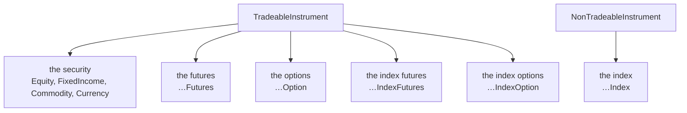

# Asset classes

Six modules cover every asset class UBI carries, in twenty-seven classes. The shape repeats: an
asset class with derivatives gets six classes, one per UBI segment, and the two fund modules get
fewer because UBI has no derivatives on a fund.

| Module | Classes | Segments |
| --- | --- | --- |
| [`assets.equities`](equities.md) | 6 | `equities`, `equity_futures`, `equity_options`, `equity_indices`, `equity_index_futures`, `equity_index_options` |
| [`assets.fixed_income`](fixed-income.md) | 6 | `fixed_income`, `fixed_income_futures`, `fixed_income_options`, `fixed_income_indices`, `fixed_income_index_futures`, `fixed_income_index_options` |
| [`assets.commodities`](commodities.md) | 6 | `commodities`, `commodity_futures`, `commodity_options`, `commodity_indices`, `commodity_index_futures`, `commodity_index_options` |
| [`assets.currencies`](currencies.md) | 6 | `currencies`, `currency_futures`, `currency_options`, `currency_indices`, `currency_index_futures`, `currency_index_options` |
| [`assets.funds`](funds.md) | 2 | `exchange_traded_funds`, `investment_trusts` |
| [`assets.mutual_funds`](mutual-funds.md) | 1 | `mutual_funds` |

The one segment left unported is UBI's `uncategorised` catch-all, which UBI does not accept orders
for.

## The pattern every family follows

Within a family with derivatives, the six classes always divide the same way.

The constructor of each class asks for exactly what identifies one of its own contracts, so there
is never a segment string to pass and never a field to leave as `None`.

| Class kind | Constructor takes |
| --- | --- |
| The security, the index | `exchange`, `symbol` |
| The futures, the index futures | `exchange`, `underlying_symbol`, `expiry_date` |
| The options, the index options | `exchange`, `underlying_symbol`, `expiry_date`, `strike_price`, `option_type` |

A derivative never holds an object for its underlying. UBI links the two only by the underlying
symbol matching a security's symbol, with no key joining them, and that match is not guaranteed
for every index, so the caller builds the underlying itself when it wants one.

## What UBI actually carries

This is the table to read before writing code against a family you have not used before. A method
can be present on a class and still have nothing to work on.

| Family | Candles | Quotes | Orders | Holdings |
| --- | --- | --- | --- | --- |
| Equities | :material-check: yes | :material-check: yes | :material-check: quantity in units | :material-check: `Equity` only |
| Fixed income | :material-close: none, anywhere | :material-check: derivatives only | :material-check: quantity in units | :material-check: `FixedIncome` only |
| Commodities | :material-check: the four derivative classes | :material-check: derivatives only | :material-alert: whole lots only, derivatives only | :material-close: never |
| Currencies | :material-close: none, anywhere | :material-alert: nse derivatives only | :material-alert: whole lots only, derivatives only | :material-close: never |
| Funds and trusts | :material-check: funds only | :material-check: both | :material-check: quantity in units | :material-check: both |
| Mutual funds | :material-close: none | :material-close: none | :material-check: `cnc` only, and give a limit price | :material-check: yes |

Three of the six currency segments and one fixed income segment hold no rows at all on any
exchange, so their classes resolve nothing today and exist so that the family has the same shape
as every other one. They fail cleanly: a lookup raises the class's own error, and the discovery
calls return an empty list or `None`.

| Segment with no rows | Class |
| --- | --- |
| `currency_indices` | `CurrencyIndex` |
| `currency_index_futures` | `CurrencyIndexFutures` |
| `currency_index_options` | `CurrencyIndexOption` |
| `fixed_income_index_options` | `FixedIncomeIndexOption` |

## Three traps that cost money

!!! danger "A commodity or currency quantity is a whole number of lots"

    `quantity=1` on an MCX gold future is refused with HTTP 400 and the message
    `quantity must be a whole number of lots of 100`. `quantity=100` is one lot. This is not true
    of shares, funds or bonds, where the quantity is a plain count of units.

!!! danger "`lot_size` is not the figure to compute that quantity from"

    The `lot_size` attribute is the plurality of what the brokers report, which gives NSE `USDINR`
    a lot of 1 while the bse reports 1000. Orders are measured against UBI's own morning decision
    about the contract's size, which is a different number. Never divide by `lot_size` to work out
    an order quantity.

!!! danger "Three position products cannot be closed through UBI"

    A position held under `margin_trading`, `cover` or `bracket` is invisible to
    `reduce_position` and `liquidate_position`. Only `liquidate_all_positions` sees it, and it
    reports it as ignored rather than closing it. See [Positions](../guides/positions.md).
