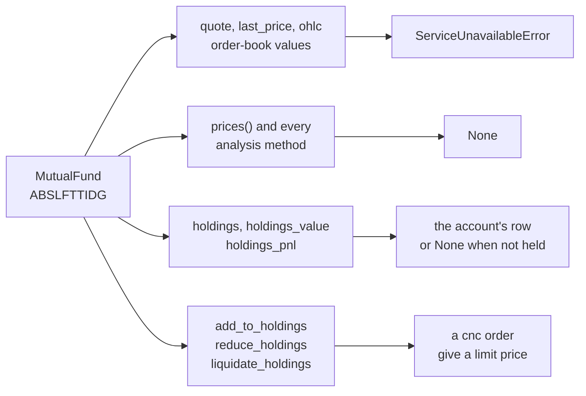

# Mutual funds

A mutual fund is unlike everything else in this library. It is not bought and sold in a continuous market; you subscribe to it and redeem it at the day's net asset value, the price the fund house publishes once a day. UBI has no quote for one and stores no candles, so a mutual fund is not something to analyse or trade on price. What does work is holding it, and that is what [`MutualFund`][tradingmachine.assets.mutual_funds.MutualFund] is for.

The table below describes the one class in `tradingmachine.assets.mutual_funds`.

| Kind | Class | UBI segment | Named by | Instruments in UBI |
|---|---|---|---|---|
| <span class="member class">class</span> | [`MutualFund`][tradingmachine.assets.mutual_funds.MutualFund] | `mutual_funds` | `exchange`, `symbol` | 279, on the `nse` only |

There is one class because UBI has no futures or options on a mutual fund and carries the segment on a single exchange. It is kept apart from [Funds and trusts](funds.md), because an exchange traded fund and an investment trust do trade like shares, and putting a mutual fund beside them would suggest it does too.

## A scheme is named by its exchange code

A mutual fund scheme's symbol is the exchange's short code for it, such as `ABSLFTTIDG`, not the scheme's published name. The code usually begins with the fund house's prefix, so the practical way to find one is to search by that prefix, as the example below does.

```python
from tradingmachine.assets import mutual_funds

matches = mutual_funds.MutualFund.search(exchange="nse", term="ABSL")
fund = mutual_funds.MutualFund(exchange="nse", symbol="ABSLFTTIDG")
```

On 2026-09-20 that search returned 18 rows, beginning `ABSLFTTIDG`, `ABSLFTTIDN`, `ABSLFTTIRG`, `ABSLFTTIRN` and `ABSLFTTJDG`.

## What works and what does not

Only one broker, Stoxkart, carries the segment, and no broker that serves quotes does. The diagram below shows which members of a `MutualFund` return something and which raise or come back empty.



The module was checked against UBI on 2026-09-20. The block below is the check's own summary of the instrument, as recorded then.

```text
MutualFund(exchange='nse', segment='nse_mutual_funds', symbol='ABSLFTTIDG')
  segment    nse_mutual_funds   shape security   lot 1   tick 0.01
  brokers    ['stoxkart']
  last_price ServiceUnavailableError
  candles    None
  holdings   None
```

## Holding a mutual fund

`mutual_funds` is one of UBI's cash segments, so a scheme is reported in the account's holdings exactly as a share is, and `MutualFund` carries the same six holdings members as [`Equity`](equities.md#holding-a-share). [Holdings](../python-api/holdings.md) documents them. The old tradingmachine project gave mutual funds the three reading members only, and this library gives them the three order methods as well, so that no holdable class is an exception you have to remember.

The three order methods send ordinary `cnc` orders, which is the product UBI accepts for this segment. Two things follow from that.

- **Give a price.** With no quote, there is nothing for a market order to be priced against, so a limit price is the only sensible form. The methods still send a market order if you pass no price, because the library does not second-guess what UBI will accept, but the docstrings ask for a price.
- **Whether it becomes a subscription is up to the broker.** No live order has been sent through these methods, so it is not known how the broker treats a `cnc` order for a mutual fund.

!!! danger "These are real orders"
    `add_to_holdings`, `reduce_holdings` and `liquidate_holdings` send real orders to a real broker, with real money. The example below would buy ten units at a limit price of 25.00 if you ran it.

```python
fund = mutual_funds.MutualFund(exchange="nse", symbol="ABSLFTTIDG")
fund.add_to_holdings(quantity=10, price=25.0)
```

As with every holdable class, `reduce_holdings` and `liquidate_holdings` sell only units that are not pledged as collateral, and raise `HoldingError` when the scheme is not held or every unit is pledged. No scheme was held when the module was checked, so the live check proved only the not-held case, and the order methods were exercised against a recorder rather than a broker.

## Errors

The table below lists what this class raises.

| Exception | When |
|---|---|
| `TypeError` | The `exchange` or `symbol` argument is missing. Python raises it before any request. |
| `MutualFundError` | UBI has no scheme with that exchange and code, including a share asked for as a scheme. |
| `ServiceUnavailableError` | A quote or an order-book value is read. |
| `HoldingError` | `reduce_holdings` or `liquidate_holdings` is called when nothing free is held, or `reduce_holdings` asks for more than is free. |
