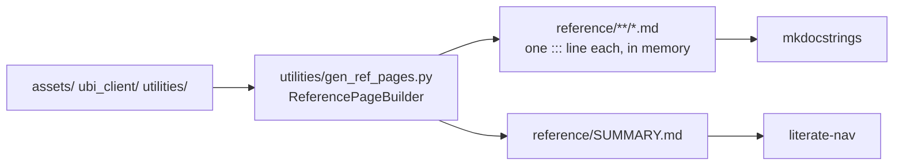

# Writing docs

The site is [Material for MkDocs](https://squidfunk.github.io/mkdocs-material/), built from `docs/`
in this repository. The documentation lives with the code, so a change and its documentation travel
in the same commit.

```bash
.venv/bin/mkdocs serve          # http://127.0.0.1:8000, live reload
.venv/bin/mkdocs build --strict # what to run before committing
```

The MkDocs packages are pinned in `requirements.txt` with everything else, so a plain install of
the requirements is enough. `mkdocs.yml` watches `assets`, `ubi_client` and `utilities`, so editing
a docstring rebuilds the affected reference page while `serve` is running.

## Two kinds of page

**Narrative pages** are hand-written Markdown under `docs/`. They explain why something is shaped
the way it is and how the pieces fit, and they are listed explicitly in the `nav` in `mkdocs.yml`.

**Reference pages** are generated at build time by `utilities/gen_ref_pages.py`, one page per
module, straight from the docstrings. Nothing is written to disk in the project: `mkdocs-gen-files`
holds the pages in memory for the build, and the section's navigation is written to a
`reference/SUMMARY.md` that `mkdocs-literate-nav` reads. That is why `mkdocs.yml` says
`- API reference: reference/` rather than listing pages.

A module added to `assets`, `ubi_client` or `utilities` therefore appears in the reference with no
edit anywhere. The generator itself is excluded, being part of the documentation build rather than
part of the project being documented.



## Inherited members are not repeated

`inherited_members` is turned off in `mkdocs.yml`, so each class's reference page shows the
members it defines itself and names its base classes rather than reprinting everything it
inherits. That is not a stylistic preference; with it turned on, every one of the twenty-seven
family classes reprinted all 190 analysis methods, and the four family pages came out at 24 MB
each.

| `inherited_members` | Whole site | Build time | Largest page |
| --- | --- | --- | --- |
| `true` | 151 MB | 112 seconds | 23.8 MB |
| `false` | 13 MB | 6 seconds | 1.0 MB |

The analysis methods are documented once each, on the `assets/analysis/*` pages where they are
defined, which is also where someone looking for them would think to go.

## Where the reasoning lives

This project keeps no explanatory comments in source files. Reasoning, context, trade-offs and
history go into a sidecar Markdown file under `.claude/notes/`, one per source file, mirroring the
source tree: `assets/equities.py` is documented by `.claude/notes/assets/equities.py.md`.

Those notes are not part of this site, and they are more detailed than it is. They hold the
measurements, the dated live checks and the record of which alternative was turned down. A
narrative page here should say what someone needs to use the code; the note says why the code is
that way. When a page states a surprising fact, pointing at the note that establishes it is
usually worth a line.

## Docstrings

Every function, method and class in this project has a Google-style docstring with `Args:`,
`Returns:` and `Raises:` sections, including each parameter's type and the return type, so the
reference pages are complete without anyone writing Markdown for them.

The handler is configured with `returns_named_value: false`, because docstrings here write
`Returns:\n    A pandas.DataFrame ...`, which is a type rather than a named value. Without that
setting, griffe reads the type as a name, warns that the return has no type, and `--strict` turns
the warning into a failed build.

## Linking into the API reference

Cross-reference any documented object by its dotted path in square brackets:

```markdown
[`TradeableInstrument`][assets.instruments.TradeableInstrument]
[`place_order`][assets.instruments.TradeableInstrument.place_order]
```

Under `--strict` an unresolvable reference fails the build, which is what keeps these honest.

## Conventions used here

- **Admonitions** for asides: `!!! note`, `!!! tip`, `!!! warning`, and `!!! danger` reserved for
  anything that can place a live order or lose data.
- **Content tabs** (`=== "Label"`) for the same idea across platforms or variants, rather than a
  section each.
- **Mermaid** fenced as ```` ```mermaid ```` for flow, sequence and class diagrams. No plugin is
  needed; the superfences configuration handles it.
- **Tables** for anything with more than three parallel facts, with the name in the first column.
- **Complete sentences** before every table, diagram and list, saying what it shows.

## Publishing

```bash
.venv/bin/mkdocs gh-deploy
```

That builds the site and pushes it to a `gh-pages` branch, so the generated HTML never lands on the
source branch. Add `site/` to `.gitignore` for the same reason before running it.
