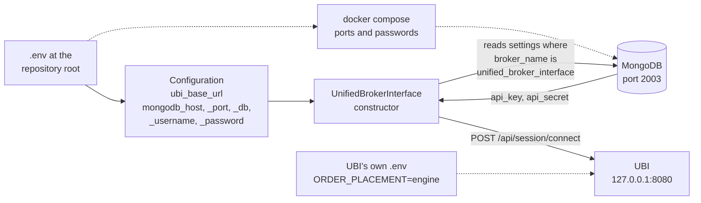

# Configuration

The library needs to know three things: where UBI is, where this project's MongoDB is, and UBI's api key and secret. The first two come from environment variables, usually written in a `.env` file at the repository root. The third comes from a document in MongoDB. UBI itself must also be set to engine mode, which is configured in UBI, not here.

## Where each setting is read

The diagram below shows every setting and the code or container that reads it. Solid arrows are read by the library; dashed arrows are read by Docker Compose or by UBI.



## How the variables are read

`Configuration`, in `tradingmachine.utilities.configuration`, is the only place in the library that reads the environment, and it reads nothing until a value is first asked for. At that moment it loads `.env`, searching the working directory and then its parents, and reads the variables from the process environment. Importing the library therefore never touches the file system.

Three rules follow from that, and they explain most surprises.

1. A variable already exported in the shell wins over the same variable in `.env`, because loading the file never overrides a value that is set. When a change to `.env` seems to have no effect, check for an exported value.
2. The file is loaded once per `Configuration` object. A long-running process that needs a changed `.env` calls `reload()` on it.
3. A missing variable is `None`, not an error. The client raises `ValueError` when it needs a value that is missing.

[The UBI client](../python-api/client.md#configuration) shows how to point a `Configuration` at a different file, or at no file at all.

## The environment variables

`.env` is gitignored and must never be committed. The table below lists every variable in it, whether the library reads it, whether the Docker containers read it, and the default Compose falls back to.

| Variable | Read by the library | Read by the containers | Compose default | What it is |
|---|:---:|:---:|---|---|
| `TRADINGMACHINE_UBI_BASE_URL` | :material-check: | | | UBI's address, `http://127.0.0.1:8080` |
| `TRADINGMACHINE_MONGODB_HOST` | :material-check: | | | The host MongoDB is reachable on |
| `TRADINGMACHINE_MONGODB_PORT` | :material-check: | :material-check: | `2003` | The published MongoDB port |
| `TRADINGMACHINE_MONGODB_DB` | :material-check: | | | The database holding the `settings` collection |
| `TRADINGMACHINE_MONGODB_USERNAME` | :material-check: | :material-check: | `tradingmachine` | The MongoDB root user |
| `TRADINGMACHINE_MONGODB_PASSWORD` | :material-check: | :material-check: | | The MongoDB root password |
| `TRADINGMACHINE_REDIS_HOST` | | | | Redis's host, for future code |
| `TRADINGMACHINE_REDIS_PORT` | | :material-check: | `2002` | The published Redis port |
| `TRADINGMACHINE_REDIS_DB` | | | | The Redis database number, for future code |
| `TRADINGMACHINE_REDIS_USERNAME` | | | | `default`, the user Redis's password belongs to |
| `TRADINGMACHINE_REDIS_PASSWORD` | | :material-check: | | Set with `--requirepass` on every start |
| `TRADINGMACHINE_TIMESCALEDB_HOST` | | | | TimescaleDB's host, for future code |
| `TRADINGMACHINE_TIMESCALEDB_PORT` | | :material-check: | `2004` | The published TimescaleDB port |
| `TRADINGMACHINE_TIMESCALEDB_DB` | | :material-check: | `tradingmachine` | The database created at first start |
| `TRADINGMACHINE_TIMESCALEDB_USERNAME` | | :material-check: | `tradingmachine` | The superuser |
| `TRADINGMACHINE_TIMESCALEDB_PASSWORD` | | :material-check: | | The superuser's password |

The library reads exactly six variables, all through `Configuration`. The Redis and TimescaleDB variables exist for the containers and for code that has not been written yet. The file also holds a leftover `PYTHONPATH` line from before the project became an installable library; it does nothing, and it is the cause of the harmless Compose warning shown on [Installation](installation.md#4-start-the-containers).

A `.env` with placeholder values is shown below. The hosts are illustrative: on the development machine the databases are reached through the machine's local network address, while UBI is always reached on `127.0.0.1`, because it binds only there.

```bash
TRADINGMACHINE_UBI_BASE_URL=http://127.0.0.1:8080

TRADINGMACHINE_MONGODB_HOST=127.0.0.1
TRADINGMACHINE_MONGODB_PORT=2003
TRADINGMACHINE_MONGODB_DB=tradingmachine
TRADINGMACHINE_MONGODB_USERNAME=tradingmachine
TRADINGMACHINE_MONGODB_PASSWORD=<a password>

TRADINGMACHINE_REDIS_HOST=127.0.0.1
TRADINGMACHINE_REDIS_PORT=2002
TRADINGMACHINE_REDIS_DB=0
TRADINGMACHINE_REDIS_USERNAME=default
TRADINGMACHINE_REDIS_PASSWORD=<a password>

TRADINGMACHINE_TIMESCALEDB_HOST=127.0.0.1
TRADINGMACHINE_TIMESCALEDB_PORT=2004
TRADINGMACHINE_TIMESCALEDB_DB=tradingmachine
TRADINGMACHINE_TIMESCALEDB_USERNAME=tradingmachine
TRADINGMACHINE_TIMESCALEDB_PASSWORD=<a password>
```

The library builds its MongoDB address from those values as `mongodb://<username>:<password>@<host>:<port>/?authSource=admin`. The `authSource=admin` part is needed because the container creates its root user in the `admin` database, and the username and password are escaped, so a generated password containing `@` or `/` is safe.

## The MongoDB settings document

UBI's api key and secret are not environment variables. The client reads them from this project's MongoDB, in the database named by `TRADINGMACHINE_MONGODB_DB`, from the `settings` collection document whose `broker_name` is `unified_broker_interface`. The values must match the same document in UBI's own MongoDB, which is what UBI checks a login against; [The `settings` documents](https://pramodathani.github.io/unified_broker_interface/get-started/configuration/#the-settings-documents) on the UBI site describes UBI's side.

The document looks like the one below. The values here are placeholders.

```json
{
  "broker_name": "unified_broker_interface",
  "api_key": "<the key UBI has in its own settings>",
  "api_secret": "<the secret UBI has in its own settings>"
}
```

No code in the library creates this document; it is seeded by hand once. One way to do that from the project's own environment is the snippet below, which upserts the document so that running it twice does no harm. It uses the library's own `Configuration` to find MongoDB.

```python
import pymongo

from tradingmachine.utilities import configuration

project_configuration = configuration.Configuration()
with pymongo.MongoClient(
    project_configuration.mongodb_connection_string
) as mongo_client:
    database = mongo_client[project_configuration.mongodb_database_name]
    database["settings"].update_one(
        {
            "broker_name": "unified_broker_interface",
        },
        {
            "$set": {
                "api_key": "<the key UBI has in its own settings>",
                "api_secret": "<the secret UBI has in its own settings>",
            },
        },
        upsert=True,
    )
```

If UBI's key or secret ever changes, this document must be changed to match. Until it is, every request fails with [`AuthenticationError`](../python-api/errors.md#authenticationerror) after its one retry.

The table below lists what goes wrong when part of this configuration is missing, and when you find out.

| What is missing | What you see | When |
|---|---|---|
| `TRADINGMACHINE_UBI_BASE_URL` | `ValueError: UBI base url is not configured: TRADINGMACHINE_UBI_BASE_URL` | The first instrument is built |
| The `settings` document | `ValueError: No settings document with broker_name='unified_broker_interface' in MongoDB database ...` | The first instrument is built |
| `api_key` or `api_secret` in it | `ValueError: Settings document 'unified_broker_interface' is missing api_key or api_secret` | The first instrument is built |
| The right key or secret | [`AuthenticationError`](../python-api/errors.md#authenticationerror) | The first request |
| UBI itself | [`UnreachableError`](../python-api/errors.md#unreachableerror) | The first request |

## Engine mode is configured in UBI

UBI decides whether orders go straight from its API to a broker, which it calls direct mode, or through its order engine, which it calls engine mode. The setting lives in UBI's own `.env`, not in this project, and the library assumes it is `engine`.

```bash
UNIFIED_BROKER_INTERFACE_API_ORDER_PLACEMENT=engine
```

The table below shows which parts of the library depend on it. Nothing here can change UBI's mode; the library can only notice it and refuse.

| Part of the library | Direct mode | Engine mode |
|---|---|---|
| Candles, quotes, discovery, positions and holdings reads | Works | Works |
| `place_order` with a plain price and quantity, and the market and limit wrappers | Works | Works |
| The other price wrappers, which send a `price_reference` | Refused with `DirectPlacementError`, nothing sent | Works |
| `reduce_position`, `liquidate_position` and `liquidate_all_positions`, which send a `quantity_reference` | Refused with `DirectPlacementError`, nothing sent | Works |
| Every class in `tradingmachine.orders`, which sends a `synthetic` object | Refused with `DirectPlacementError`, nothing sent | Works |

UBI has no route that reports its mode, so the library learns it from the first order that needs the engine, by sending that order once as a dry run. [The placement-mode probe](../architecture/placement-modes.md#the-placement-mode-probe) explains how, and [First steps](first-steps.md#rehearse-an-order-with-a-dry-run) shows it happening.
