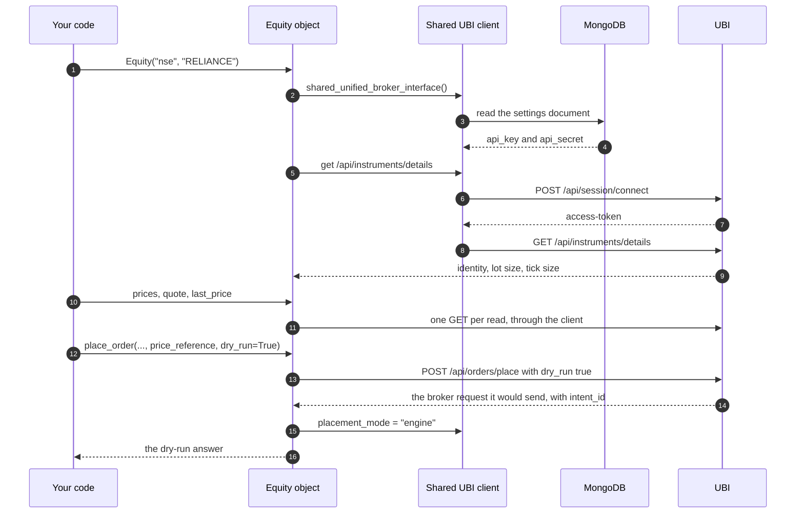

# First steps

This page walks through a first session in Python: look up a share, read its candles, its quote and its last price, search for instruments, read an option chain, and rehearse an order without sending it. Every output on this page was captured from a local UBI on Saturday 2026-09-26, when the market was closed, so the prices are Friday's close.

Start Python from the project's virtual environment, from the repository root so that `.env` is found.

```bash
.venv/bin/python
```

## What happens underneath

The sequence below shows the requests the session on this page makes, in order. The first line of code does the most work, because it creates the shared client, reads UBI's key and secret from MongoDB and logs in before it can look the share up.



## Look up a share

An instrument is built by naming it. `Equity` takes an exchange and a symbol, looks the share up in UBI once, and keeps what it learns as plain attributes.

=== "Python"

    ```python
    from tradingmachine.assets import equities

    reliance = equities.Equity("nse", "RELIANCE")
    print(repr(reliance))
    ```

=== "Output"

    ```text
    Equity(exchange='nse', segment='nse_equities', symbol='RELIANCE')
    ```

The same capture read the object's attributes: its `instrument_id` was `'3f92570a-9924-5bf5-9f9d-e006cd9f4202'`, its `lot_size` was `1` and its `tick_size` was `Decimal('0.1')`. The `instrument_id` is UBI's own id for the share, the same at every broker, and every later request sends only that. [Instruments](../python-api/instruments.md#the-attributes-set-on-lookup) lists every attribute with its captured value.

## Read candles

`prices` returns candles as a pandas DataFrame. `days=10` counts back ten days from today. The call returned six rows; the output shows the first five.

=== "Python"

    ```python
    daily = reliance.prices(days=10)
    print(daily.shape)
    print(daily.head(5).to_string())
    ```

=== "Output"

    ```text
    (6, 11)
      exchange       segment interval                  datetime    open    high     low   close    volume    oi  price_factor
    0      nse  nse_equities      day 2026-09-16 00:00:00+05:30  1243.0  1255.0  1240.0  1240.0  10023997  None           1.0
    1      nse  nse_equities      day 2026-09-17 00:00:00+05:30  1244.8  1253.4  1238.5  1243.9   7752895  None           1.0
    2      nse  nse_equities      day 2026-09-18 00:00:00+05:30  1245.0  1247.3  1226.4  1226.4  15122715  None           1.0
    3      nse  nse_equities      day 2026-09-21 00:00:00+05:30  1234.1  1249.1  1232.5  1247.4  10007218  None           1.0
    4      nse  nse_equities      day 2026-09-22 00:00:00+05:30  1247.6  1251.9  1237.4  1240.4  10684376  None           1.0
    ```

The same call with `interval="5minute", days=1` returned `None`, because UBI had no five-minute candles stored for that range. `prices` answers `None` rather than an empty DataFrame whenever there is nothing, so check for it before using the result. [Market data](../python-api/market-data.md#prices) has a chart of these candles and every column's type.

## Read the quote and the last price

`last_price` is a property, so it has no parentheses, but it is still a request to UBI each time it is read. `quote` returns the whole unified quote, which is long; it is reproduced in full on [Market data](../python-api/market-data.md#quote), and here it is enough to know it came from Zerodha's data in UBI's cache, with a previous close of 1219.2. The three order-book values below each read the quote once more.

=== "Python"

    ```python
    print(reliance.last_price)
    print(reliance.best_offer)
    print(reliance.best_bid)
    print(reliance.mid_price)
    ```

=== "Output"

    ```text
    1226.0
    {'orders': 11, 'price': 1226.0, 'quantity': 855}
    None
    None
    ```

The last two lines show a Saturday trap worth knowing early. The book the broker last reported had sellers but no buyers, so `best_bid` is `None`, and `mid_price`, which needs a best bid, is `None` too. Any arithmetic on order-book values has to allow for that.

## Search for instruments

`search` is called on the class, not on an object, and finds names containing a term. It returns rows describing instruments, not instrument objects, so it costs one request however many rows come back.

=== "Python"

    ```python
    shares = equities.Equity.search("nse", "RELI", limit=5)
    print(shares.to_string())
    ```

=== "Output"

    ```text
      exchange expiry_date                         instrument_id option_type       segment     shape strike_price    symbol underlying_symbol
    0      nse        None  a063ac67-1b07-5632-9cc5-4ad1b564a50d        None  nse_equities  security         None  RELIABLE              None
    1      nse        None  3f92570a-9924-5bf5-9f9d-e006cd9f4202        None  nse_equities  security         None  RELIANCE              None
    2      nse        None  e8af359c-57c2-5fb3-b425-e421e487de3f        None  nse_equities  security         None  RELIGARE              None
    3      nse        None  343a2c89-5bdf-551c-b409-943dc687fc58        None  nse_equities  security         None  RELINFRA              None
    ```

Only four shares matched, so the limit of five was not reached. [Finding instruments](../python-api/discovery.md#search) explains the ranking.

## Read an option chain

The option classes can list their own expiries and chains. The session below finds NIFTY's expiries, reads the chain for the nearest one, and prints its first five rows. The capture returned eighteen expiries, of which the output shows the first three with the rest elided, and a chain of 538 rows, a call and a put at each of 269 strikes.

=== "Python"

    ```python
    expiries = equities.EquityIndexOption.expiries("nse", "NIFTY")
    print(expiries)
    chain = equities.EquityIndexOption.chain("nse", "NIFTY", expiries[0])
    print(chain.shape)
    print(chain.head(5).to_string())
    ```

=== "Output"

    ```text
    [datetime.date(2026, 9, 29), datetime.date(2026, 10, 6), datetime.date(2026, 10, 13), ...]
    (538, 9)
                              instrument_id exchange                   segment   shape symbol underlying_symbol expiry_date  strike_price option_type
    0  1c39032e-270b-51e0-aa0b-fa0e1072928d      nse  nse_equity_index_options  option   None             NIFTY  2026-09-29        1500.0          CE
    1  f44aa598-4ad7-54bb-b93d-d1dfc3426a45      nse  nse_equity_index_options  option   None             NIFTY  2026-09-29        1500.0          PE
    2  29f59c8a-8a7b-5acf-a019-17521f4c44f7      nse  nse_equity_index_options  option   None             NIFTY  2026-09-29        3000.0          CE
    3  01725b1b-6e9e-551a-9eb2-abeddaaf5e3a      nse  nse_equity_index_options  option   None             NIFTY  2026-09-29        3000.0          PE
    4  b987116e-93b3-54df-af89-68a725d35d10      nse  nse_equity_index_options  option   None             NIFTY  2026-09-29        4500.0          CE
    ```

To trade or quote one of these, pass a row's identity to the class. That sends one lookup, and returns a full object with its lot size, tick size and order book.

```python
row = chain.iloc[0]
option = equities.EquityIndexOption(
    row["exchange"],
    row["underlying_symbol"],
    row["expiry_date"],
    row["strike_price"],
    row["option_type"],
)
```

## Rehearse an order with a dry run

!!! danger "These are real orders"
    `place_order` sends real orders to real brokers with real money unless `dry_run=True` is passed. Every call in this section passes it. With a dry run, UBI chooses a broker and builds that broker's request, then hands it back without sending it.

The first rehearsal is a plain limit order: buy one share for delivery at 1000 rupees. The answer shows the broker UBI chose and the exact form it would have posted. The account identifiers in the form have been replaced with `XX000000`.

=== "Python"

    ```python
    answer = reliance.place_order("buy", "limit", 1, "cnc", price=1000, dry_run=True)
    print(answer)
    print(reliance.shared_unified_broker_interface().placement_mode)
    ```

=== "Output"

    ```text
    {'broker': 'shoonya', 'dry_run': True, 'instrument_id': '3f92570a-9924-5bf5-9f9d-e006cd9f4202', 'intent_id': '520360eee8e9494ab580e96e093d715c', 'request': {'form': {'actid': 'XX000000', 'amo': 'NO', 'dscqty': '0', 'exch': 'NSE', 'ordersource': 'API', 'prc': '1000', 'prctyp': 'LMT', 'prd': 'C', 'qty': '1', 'ret': 'DAY', 'trantype': 'B', 'trgprc': '0', 'tsym': 'RELIANCE-EQ', 'uid': 'XX000000'}, 'method': 'POST', 'url': 'https://api.shoonya.com/NorenWClientAPI/PlaceOrder'}, 'skipped': [], 'tag': None, 'timing_ms': {'preparation': 1.594}}
    None
    ```

The answer carries an `intent_id`, which is the mark UBI's order engine leaves on every answer. Even so, `placement_mode` is still `None`, because a plain order works in either mode and the library never checks the mode for one.

The second rehearsal was captured in a separate run the same morning, in a fresh Python process, so its client started with `placement_mode` at `None` too. It replaces the price with a description of it: buy at the best offer, level 1, and let UBI's engine read the price from the live book and round it to the tick. This is what the price wrappers such as `buy_at_best_offer_price` send.

=== "Python"

    ```python
    answer = reliance.place_order(
        "buy",
        "limit",
        1,
        "cnc",
        price_reference={
            "kind": "offer_level",
            "level": 1,
        },
        dry_run=True,
    )
    print(answer)
    print(repr(reliance.shared_unified_broker_interface().placement_mode))
    ```

=== "Output"

    ```text
    {'broker': 'stoxkart', 'dry_run': True, 'instrument_id': '3f92570a-9924-5bf5-9f9d-e006cd9f4202', 'intent_id': '584e0a7f6cb84dc18fe0e64da9f4db69', 'request': {'json': {'action': 'BUY', 'algo_id': '99999', 'disclose_quantity': '0', 'exchange': 'NSE', 'order_type': 'LIMIT', 'price': '1226.0', 'product_type': 'DELIVERY', 'quantity': '1', 'stop_loss_price': '0', 'token': '2885', 'trailing_stop_loss': '0', 'trigger_price': '0', 'validity': 'DAY'}, 'method': 'POST', 'url': 'https://openapi.stoxkart.com/orders/normal'}, 'skipped': [], 'tag': None, 'timing_ms': {'preparation': 1.98}}
    'engine'
    ```

Two things changed. The engine resolved the reference to a price of `1226.0`, which is the best offer the quote showed earlier on this page. And because this order carried a reference and its answer carried an `intent_id`, the library recorded that UBI is in engine mode, so `placement_mode` is now `'engine'` on the shared client. A live order with a reference would now go straight through, without the extra dry run the library sends first when it does not yet know the mode. The two answers also chose different brokers, Shoonya and Stoxkart; UBI chooses the broker for each order itself.

[The placement-mode probe](../architecture/placement-modes.md#the-placement-mode-probe) explains the check, and [Orders](../python-api/orders.md#place_order) documents `place_order` in full.

## Where to go next

The cards below point at the pages that pick up from here.

<div class="grid cards" markdown>

-   :material-chart-line:{ .lg .middle } **Market data**

    ---

    Every price member, including the eleven order-book values and what each returns on an empty book.

    [:octicons-arrow-right-24: Market data](../python-api/market-data.md)

-   :material-magnify:{ .lg .middle } **Finding instruments**

    ---

    Search, expiries, contracts, strikes and chains, and why they return rows rather than objects.

    [:octicons-arrow-right-24: Finding instruments](../python-api/discovery.md)

-   :material-cart-arrow-right:{ .lg .middle } **Orders**

    ---

    Placing, modifying and cancelling orders, and reading them back.

    [:octicons-arrow-right-24: Orders](../python-api/orders.md)

-   :material-alert-circle-outline:{ .lg .middle } **Errors**

    ---

    Every exception the library raises, and what to do about each.

    [:octicons-arrow-right-24: Errors](../python-api/errors.md)

</div>
