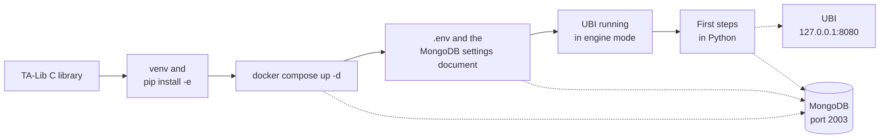

# Get started

This tab takes you from an empty machine to a Python session that looks up a share, reads its prices and rehearses an order. It is written for someone who wants to use the library, and it assumes no knowledge of how the library is built inside.

The library does not talk to brokers itself. Every price and every order goes through the Unified Broker Interface (UBI), the sibling project that runs on the same machine and speaks to ten Indian brokers. So getting started means two things: installing this library, and having a UBI it can reach.

## What you need before you start

The table below lists what the machine needs, and why each piece is there.

| You need | Why |
|---|---|
| Python 3.14 | `pyproject.toml` requires it, and the project's `.venv` is built with it |
| The TA-Lib C library | The `TA-Lib` Python package wraps it, and `pip` cannot install the C part |
| Docker with Compose | `docker-compose.yml` runs this project's Redis, MongoDB and TimescaleDB |
| A running UBI on `127.0.0.1:8080` | Every candle, quote and order comes from it |
| UBI in engine mode, with its order engine running | The price wrappers, the position methods and every synthetic order depend on it |
| UBI's api key and secret | The client logs in with them, reading them from this project's MongoDB |

!!! warning "UBI trades with real money"
    UBI is connected to live broker accounts, and there is no paper trading mode. Nothing in this tab places an order: the one order in [First steps](first-steps.md) is a dry run, which UBI builds and hands back without sending.

## The path through this tab

Setting up happens in a fixed order, because each step needs the one before it. The numbered list below is that order.

1. **Install the software.** You install the TA-Lib C library, create the virtual environment, install the library, and start the three containers. This is on [Installation](installation.md).
2. **Configure it.** You write the `.env` file that says where UBI and MongoDB are, and put UBI's api key and secret into MongoDB. This is on [Configuration](configuration.md).
3. **Use it.** You look up a share, read its candles and quote, search for instruments, read an option chain and rehearse an order. This is on [First steps](first-steps.md).

The diagram below shows the same path, with the place each step writes to or reads from.

## The pages

Each card below opens one page of this tab.

-   :material-download:{ .lg .middle } **Installation**

    ---

    The TA-Lib C library, the virtual environment, the editable install, the three containers and their ports, and the UBI this library needs.

    [:octicons-arrow-right-24: Install it](installation.md)

-   :material-tune:{ .lg .middle } **Configuration**

    ---

    Every environment variable the code and the containers read, the MongoDB document holding UBI's key and secret, and the engine-mode requirement.

    [:octicons-arrow-right-24: Configure it](configuration.md)

-   :material-play-circle:{ .lg .middle } **First steps**

    ---

    A first session built on real output: a share, its candles and quote, a search, an option chain and a dry-run order.

    [:octicons-arrow-right-24: Try it](first-steps.md)

-   :material-api:{ .lg .middle } **Python API**

    ---

    Every class and member, one page per group, in the style of a broker's API reference.

    [:octicons-arrow-right-24: Read the reference](../python-api/index.md)

