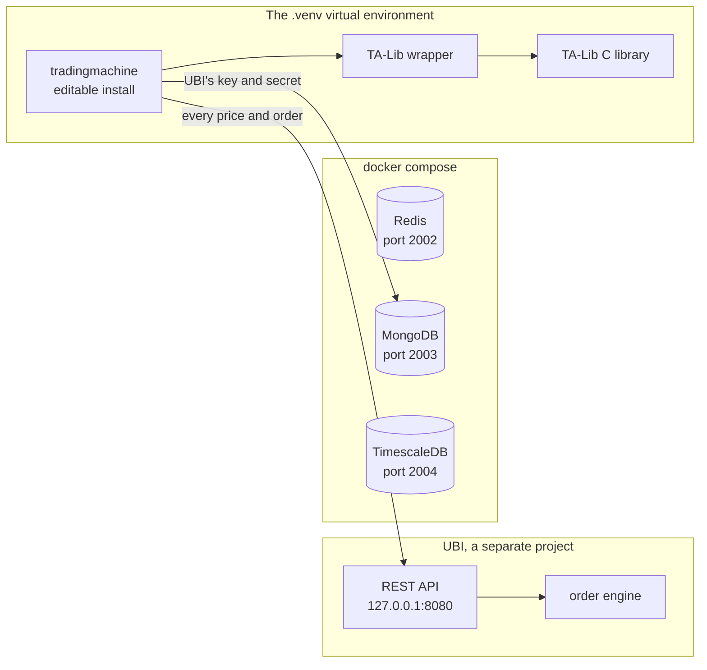

# Installation

This page installs the library and the services around it, in the order they depend on each other. The TA-Lib C library comes first because the Python package fails to build without it; the library comes next; the containers after that; and last comes the UBI that every call goes to.

The table below summarises the steps and what each one leaves behind.

| Step | What you run | What you end up with |
|---|---|---|
| [1. The TA-Lib C library](#1-install-the-ta-lib-c-library) | Your system's package manager or a source build | The native library the `TA-Lib` package wraps |
| [2. The virtual environment](#2-create-the-virtual-environment) | `python3.14 -m venv .venv` | A private Python 3.14 in `.venv/` |
| [3. The library](#3-install-the-library) | `pip install -e ".[docs,development]"` | `tradingmachine` importable from anywhere, with its seven dependencies |
| [4. The containers](#4-start-the-containers) | `docker compose up -d` | Redis, MongoDB and TimescaleDB on ports 2002 to 2004 |
| [5. UBI](#5-make-sure-ubi-is-running-in-engine-mode) | UBI's own services | UBI answering on `127.0.0.1:8080`, placing orders through its engine |

The diagram below shows what is running on the machine once every step is done, and which of those pieces the library talks to.



The `.env` file that steps 4 and 5 read is described on [Configuration](configuration.md). Write it before step 4 if you are setting up from nothing.

## 1. Install the TA-Lib C library

The `TA-Lib` Python package, which the analysis methods use, is a wrapper around a native C library, and `pip` can install only the wrapper. Without the C library the install fails with an error about a missing header or symbol rather than about a missing package, which is confusing the first time.

On macOS, `brew install ta-lib` installs it. On Debian and Ubuntu, build the newest source release from [the TA-Lib releases page](https://github.com/ta-lib/ta-lib/releases).

## 2. Create the virtual environment

The project uses a virtual environment in `.venv/` at the repository root, and every command on this site calls the tools inside it directly rather than any system-wide Python. The library requires Python 3.14.

```bash
cd ~/Projects/tradingmachine
python3.14 -m venv .venv
.venv/bin/python -m pip install --upgrade pip
```

## 3. Install the library

The library is installed in editable mode, which points the environment at `src/tradingmachine` where it sits, so an edit to a source file takes effect at once. The two extras add the documentation toolchain and the development tools.

```bash
.venv/bin/python -m pip install -e ".[docs,development]"
```

The table below lists what the install brings in. `pyproject.toml` declares only the packages the library's code imports; everything else the project may one day want is pinned in `requirements.txt` instead and is not a dependency.

| Group | Packages |
|---|---|
| The library itself | `backtesting`, `numpy`, `pandas`, `pymongo`, `python-dotenv`, `requests`, `TA-Lib` |
| `docs` extra | `mkdocs`, `mkdocs-material`, `mkdocstrings[python]`, `mkdocs-charts-plugin`, `mkdocs-gen-files`, `mkdocs-literate-nav`, `mkdocs-section-index`, `pymdown-extensions` |
| `development` extra | `ruff`, `build` |

A quick check that the Python version, the TA-Lib wrapper and the library are all in place is shown below. Importing the library touches nothing outside the process, because its configuration is read only when first used. The output was captured on the development machine on 2026-09-26.

=== "Command"

    ```bash
    .venv/bin/python -c "import sys, talib; print(sys.version.split()[0], talib.__version__)"
    .venv/bin/python -m pip show tradingmachine | head -2
    ```

=== "Output"

    ```text
    3.14.4 0.6.8
    Name: tradingmachine
    Version: 0.1.0
    ```

!!! note "The repository root is not importable"
    All library code lives under `src/tradingmachine`, so `from tradingmachine.assets import equities` works only once the library is installed. The offline test suite in `tests/` runs with `.venv/bin/python -m pytest` once the `development` extra is installed. It never places an order, because it talks to a fake UBI server on a local port.

## 4. Start the containers

Docker Compose runs three data stores for this project, each in its own container. It reads their ports and passwords from the same `.env` file as the library.

```bash
docker compose up -d
docker compose ps
```

The table below lists the three services. Only MongoDB is read by the library today, for UBI's key and secret; Redis and TimescaleDB are running for code that has not been written yet.

| Service | Image | Host port | Container port | Volume | Used by the library |
|---|---|---|---|---|---|
| `redis` | `redis:trixie` | 2002 | 6379 | `tradingmachine_redis_volume` | :material-close: |
| `mongodb` | `mongo:8.0.4` | 2003 | 27017 | `tradingmachine_mongodb_volume` | :material-check: |
| `timescaledb` | `timescale/timescaledb:latest-pg18` | 2004 | 5432 | `tradingmachine_timescaledb_volume` | :material-close: |

The output below is `docker compose ps` on the development machine on 2026-09-26. The three warnings about `PYTHONPATH` are harmless: a leftover line in `.env` refers to a variable that is not set, and no container uses it.

```text
time="2026-09-26T09:55:16+05:30" level=warning msg="The \"PYTHONPATH\" variable is not set. Defaulting to a blank string."
time="2026-09-26T09:55:16+05:30" level=warning msg="The \"PYTHONPATH\" variable is not set. Defaulting to a blank string."
time="2026-09-26T09:55:16+05:30" level=warning msg="The \"PYTHONPATH\" variable is not set. Defaulting to a blank string."
NAME                           IMAGE                               COMMAND                  SERVICE       CREATED       STATUS                 PORTS
tradingmachine-mongodb-1       mongo:8.0.4                         "docker-entrypoint.s…"   mongodb       11 days ago   Up 8 hours (healthy)   0.0.0.0:2003->27017/tcp
tradingmachine-redis-1         redis:trixie                        "docker-entrypoint.s…"   redis         11 days ago   Up 8 hours (healthy)   0.0.0.0:2002->6379/tcp
tradingmachine-timescaledb-1   timescale/timescaledb:latest-pg18   "docker-entrypoint.s…"   timescaledb   11 days ago   Up 8 hours (healthy)   0.0.0.0:2004->5432/tcp
```

Ports 2002 to 2004 were chosen so this project can run beside UBI, whose own containers use ports 1002 to 1005 on the same machine. The ports are bound on `0.0.0.0`, so other machines on the local network can reach them too.

!!! danger "`docker compose down -v` deletes the data"
    `docker compose down` stops the containers and keeps their volumes. Adding `-v` also deletes the three `tradingmachine_*_volume` volumes and everything in them, including the MongoDB document holding UBI's key and secret.

The usernames, passwords and database names in `.env` are read only when a container starts with an empty volume. Changing them later does not change the existing database; change the credential inside the database, or delete the volume and start again.

## 5. Make sure UBI is running in engine mode

UBI is a separate project with its own installation, documented on [its own site](https://pramodathani.github.io/unified_broker_interface/get-started/). This library needs three things from it, listed below.

1. **UBI's REST API answers on `http://127.0.0.1:8080`.** UBI binds to `127.0.0.1` by default, so it is reachable only from the same machine, unlike the databases.
2. **UBI runs in engine mode.** UBI's own `.env` must set `UNIFIED_BROKER_INTERFACE_API_ORDER_PLACEMENT=engine`. In UBI's default direct mode, the library's plain orders still work, but anything carrying a price reference, a quantity reference or a synthetic order is refused by the library with [`DirectPlacementError`](../python-api/errors.md#directplacementerror) before it is sent.
3. **UBI's order engine service is running.** Engine mode hands every order to a separate process, `unified-orders@order_engine.service`. If the setting says `engine` but the process is stopped, every order is refused, or waits and fails with [`OrderOutcomeUnknownError`](../python-api/errors.md#orderoutcomeunknownerror); that happened on this machine on 2026-09-26 before the engine was started.

The output below shows the three checks on the development machine on 2026-09-26. UBI's greeting route needs no token, so `curl` can call it directly.

=== "Command"

    ```bash
    curl http://127.0.0.1:8080/api/
    grep ORDER_PLACEMENT ~/Projects/unified_broker_interface/.env
    systemctl --user is-active unified-rest-api.service unified-orders@order_engine.service
    ```

=== "Output"

    ```text
    {"message":"Welcome to the Unified Broker Interface API"}
    UNIFIED_BROKER_INTERFACE_API_ORDER_PLACEMENT=engine
    active
    active
    ```

UBI's [Services](https://pramodathani.github.io/unified_broker_interface/operations/services/#the-order-engine-and-the-synthetic-order-book) page shows how to start the order engine, and its [Order engine](https://pramodathani.github.io/unified_broker_interface/rest-api/order-engine/) page explains what it does.

!!! danger "The order engine places real orders"
    Once the engine runs, a synthetic order can place real orders long after the call that created it has returned. Stopping UBI's REST API does not stop the engine.

## What comes next

With everything installed, [Configuration](configuration.md) writes the `.env` file and the MongoDB document the library reads, and [First steps](first-steps.md) makes the first calls.
