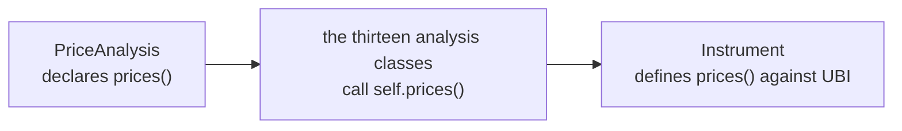

# Analysis

`tradingmachine.assets.analysis` holds thirteen classes, and `Instrument` inherits every one of them. That means
about 190 analysis methods are available on any instrument object, in any family, with no import
and no separate library call.

```python
from tradingmachine.assets import equities

share = equities.Equity(exchange="nse", symbol="RELIANCE")

frame = share.relative_strength_index(window=14, days=365)
frame = share.bollinger_bands(window=20, days=365)
high = share.price_high(days=365)
```

## The thirteen classes

| Class | Module | Methods | What it adds |
| --- | --- | --- | --- |
| `CandlestickPatterns` | `candlestick_patterns` | 61 | One method per TA-Lib pattern, such as the hammer or the engulfing pattern |
| `PriceStatistics` | `price_statistics` | 39 | Highs, lows, means, medians, deviations, returns and histograms |
| `MomentumIndicators` | `momentum_indicators` | 28 | MACD, ADX, CCI, RSI, the oscillators |
| `MathTransforms` | `math_transforms` | 15 | TA-Lib's element-wise mathematics, such as the trigonometric functions |
| `OverlapStudies` | `overlap_studies` | 12 | Moving averages and bands drawn on the price scale |
| `MathOperators` | `math_operators` | 10 | Add, subtract, multiply, divide, maximum, minimum |
| `StatisticFunctions` | `statistic_functions` | 8 | Beta, correlation and the linear regressions |
| `CycleIndicators` | `cycle_indicators` | 6 | The Hilbert transform family |
| `PriceTransforms` | `price_transforms` | 4 | Average, median, typical and weighted close prices |
| `VolatilityIndicators` | `volatility_indicators` | 3 | True range and its two averages |
| `VolumeIndicators` | `volume_indicators` | 3 | On-balance volume and the Chaikin pair |
| `Signals` | `signals` | 2 | Crossings between two columns of a frame you already have |
| `StrategyBacktests` | `strategy_backtests` | 1 | `run_backtest` |

A fourteenth class, `PriceAnalysis`, is the shared base rather than a source of methods. It
declares `prices` and raises `NotImplementedError`, so every analysis class is written against a
source of candles it does not have to know anything about. `Instrument` is what supplies the real
`prices`, and that is the whole of the arrangement.



## What a method does

Almost every one follows the same three steps: fetch the candles for the range, add one or more
columns, return the frame. The range arguments are the same ones
[`prices`](prices-and-quotes.md#candles) takes, so any method can work on a different interval, a
different window of history, or unadjusted prices.

```python
frame = share.simple_moving_average(
    window=20,
    column="close",
    interval="day",
    days=365,
    adjusted=True,
)
```

The added column is named after the indicator and its window, such as `sma_20`, `ema_50` or
`rsi_14`, so several indicators can be added to separate frames and joined without a collision.

The methods in `PriceStatistics` are the exception: they reduce a column to a number rather than
adding one, so `price_high(days=365)` returns a `float`.

!!! warning "Every one of them returns `None` when there are no candles"

    An analysis method fetches candles and gives up if there are none. That is the normal outcome
    for whole families, as the [coverage table](../asset-classes/index.md#what-ubi-actually-carries)
    shows, so `frame["rsi_14"]` on a bond raises `TypeError` on a `None` rather than a `KeyError`.

## Crossovers work on a frame, not on the instrument

The two methods in `Signals` are different from the rest: they take a frame you already have
rather than fetching anything, because the whole point is to compare two columns that may have
come from different indicators.

```python
frame = share.simple_moving_average(window=20, days=365)
crossings = share.is_cross_over(frame, "close", "sma_20")
crossings[crossings["cross_over"]]
```

`is_cross_over` marks each row where the first column was at or below the second on the previous
row and is above it on this one. `is_cross_under` is the mirror image. Both return a copy with a
fresh index and a new boolean column, so the frame you passed in is unchanged, and the first row is
never marked because it has no previous row to compare with.

## Backtests

`run_backtest` runs a `backtesting.Strategy` over the candles in a range.

```python
import backtesting

class SimpleMovingAverageCross(backtesting.Strategy):
    ...

statistics = share.run_backtest(
    SimpleMovingAverageCross,
    cash=100000,
    commission=0.002,
    days=730,
    plot_filename="sma_cross.html",
)
```

It takes the strategy class, the usual `backtesting` settings for cash, commission, margin and
order handling, the same range arguments as everything else, and an optional filename to save the
plot to. It returns the `pandas.Series` of statistics that `backtesting` produces, or `None` when
there are no candles.
