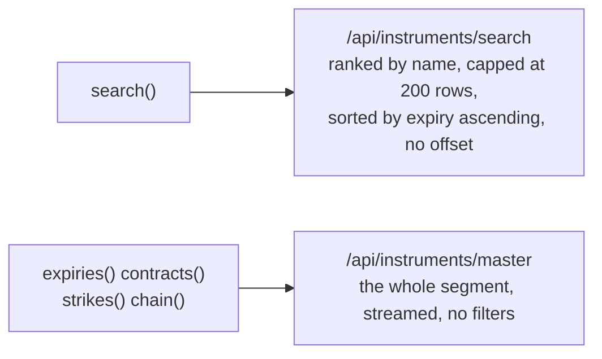

# Finding instruments

An instrument can be found rather than only named. Five class methods do this, each supplying its
own segment, so there is never a segment string to pass.

| Call | Available on | Returns |
| --- | --- | --- |
| `search(exchange, term, limit=50)` | the security and index classes | A `DataFrame` of identities, or `None` |
| `expiries(exchange, underlying_symbol)` | the four derivative classes | A list of `datetime.date`, soonest first |
| `contracts(exchange, underlying_symbol=None)` | the futures classes | A `DataFrame` of identities, or `None` |
| `strikes(exchange, underlying_symbol, expiry_date)` | the option classes | A list of `float`, lowest first |
| `chain(exchange, underlying_symbol, expiry_date)` | the option classes | A `DataFrame` of every option for one expiry |

All of them are class methods, so nothing has to be built before searching.

```python
from tradingmachine.assets import equities

matches = equities.Equity.search(exchange="nse", term="RELI")

expiries = equities.EquityOption.expiries(exchange="nse", underlying_symbol="NIFTY")
strikes = equities.EquityOption.strikes(
    exchange="nse",
    underlying_symbol="NIFTY",
    expiry_date=expiries[0],
)
chain = equities.EquityOption.chain(
    exchange="nse",
    underlying_symbol="NIFTY",
    expiry_date=expiries[0],
)
```

## They return rows, not objects

This is the one thing to know before using them. A `chain` of 214 contracts comes back as 214 rows
of identity, not 214 instrument objects, because building an object looks the instrument up in UBI
and a chain would mean 214 requests.

| Column | Present for |
| --- | --- |
| `instrument_id`, `exchange`, `segment`, `shape` | every row |
| `symbol` | a security or an index |
| `underlying_symbol`, `expiry_date` | a future or an option |
| `strike_price`, `option_type` | an option |

Build the few you actually want from the rows, most conveniently by `instrument_id`, which is
enough on its own.

```python
row = chain.iloc[100]
option = equities.EquityOption(
    exchange=row["exchange"],
    underlying_symbol=row["underlying_symbol"],
    expiry_date=row["expiry_date"],
    strike_price=row["strike_price"],
    option_type=row["option_type"],
)
```

## Why `search` is not used for contracts

`search` and the other four calls read different UBI routes, and the reason is a limitation worth
understanding, because it explains why `chain` fetches a whole segment.



UBI's search route sorts by expiry ascending, caps the answer at 200 rows and offers no way to page
past them. In a segment with years of expired contracts, every one of those 200 rows comes from the
oldest expiry, so a live contract is unreachable through it no matter what you search for.

The master route has no limit and UBI streams it, so even the largest segment arrives in a second
or two. It takes no filters, so the narrowing by underlying and expiry happens here in Python after
the whole segment has arrived.

`search` is still the right call for a security or an index, where names are what you are matching
and there are no expiries to bury the answer. UBI ranks an exact match first, then names starting
with the term, then names containing it, so a partial name such as `RELI` finds `RELIANCE` near the
top.

## Expired contracts are left out

Every one of the four contract calls takes `include_expired`, which defaults to `False`. A contract
expiring today counts as live, because it can still be traded until the market closes.

```python
everything = equities.EquityFutures.contracts(
    exchange="nse",
    underlying_symbol="RELIANCE",
    include_expired=True,
)
```

## Empty is not an error

An empty segment answers cleanly rather than raising, which is what makes the classes on UBI's
empty segments usable:

| Call | Answer when nothing matches |
| --- | --- |
| `expiries`, `strikes` | `[]` |
| `search`, `contracts`, `chain` | `None` |

Only a segment or exchange UBI does not recognise raises, as a `BadRequestError`. See
[Asset classes](../asset-classes/index.md) for which segments are permanently empty.
