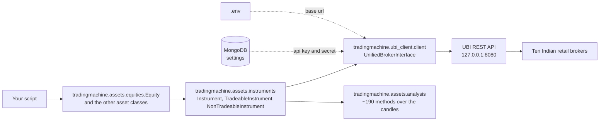

# Trading Machine

An Indian market instrument is a Python object here. You name a share, a futures contract or an
option once, and from that one object you get its candles, its live quote, its order book, about
190 analysis methods, the orders you have placed in it, the positions you hold in it and the
shares of it sitting in your demat account.

Nothing in this project talks to a broker. Every call goes to the sibling project
[Unified Broker Interface](architecture/ubi-client.md), which runs on the same machine, speaks to
ten Indian retail brokers and normalises what they say. This project is the layer above that,
where the vocabulary stops being HTTP routes and starts being instruments.

<div class="grid cards" markdown>

-   :material-rocket-launch: **Getting started**

    ---

    Install the dependencies, fill in the environment, seed the credentials and bring up the
    databases.

    [:octicons-arrow-right-24: Getting started](getting-started/index.md)

-   :material-sitemap: **Architecture**

    ---

    How one instrument object is built, what it caches and what it does not, and how failures from
    UBI arrive as exceptions.

    [:octicons-arrow-right-24: Architecture](architecture/index.md)

-   :material-shape: **Asset classes**

    ---

    Equities, fixed income, commodities, currencies, funds and mutual funds, and what UBI actually
    carries for each.

    [:octicons-arrow-right-24: Coverage](asset-classes/index.md)

-   :material-code-braces: **API reference**

    ---

    Generated from the source tree, one page per module, on every build.

    [:octicons-arrow-right-24: Reference](reference/)

</div>

## What the project does

You build an instrument by naming it. The object looks itself up in UBI once, keeps its identity,
and from then on every price, order and position it reports is fetched fresh.

```python
from tradingmachine.assets import equities

infosys = equities.Equity(exchange="nse", symbol="INFY")

candles = infosys.prices(days=365)
strength = infosys.relative_strength_index(window=14, days=365)
spread = infosys.bid_offer_spread()

placed = infosys.buy_at_limit_price(quantity=1, price=1450.0, product="cnc")
waiting = infosys.open_orders()
infosys.cancel_open_orders()
```

The picture below shows where each of those calls ends up.



| Layer | Where | What it gives you |
| --- | --- | --- |
| Asset classes | `tradingmachine.assets.equities`, `tradingmachine.assets.fixed_income`, `tradingmachine.assets.commodities`, `tradingmachine.assets.currencies`, `tradingmachine.assets.funds`, `tradingmachine.assets.mutual_funds` | One named class per UBI segment, with a constructor that asks for exactly the fields that identify one of its own contracts. See [Asset classes](asset-classes/index.md) |
| Instrument model | `tradingmachine.assets.instruments` | Identity, candles, quotes, the order book, orders, trades and positions. See [The instrument model](architecture/instrument-model.md) |
| Analysis | `tradingmachine.assets.analysis` | TA-Lib indicators, candlestick patterns, statistics, crossovers and a backtest, all inherited as methods. See [Analysis](guides/analysis.md) |
| REST client | `ubi_client` | The authenticated connection to UBI, and one exception class per failure it reports. See [The UBI client](architecture/ubi-client.md) |
| Configuration | `tradingmachine.utilities.configuration` | The UBI base url and the MongoDB connection string, read lazily from the environment and `.env`. See [Configuration](getting-started/configuration.md) |

## The three ideas worth knowing first

**The class is the contract type.** There is no `segment="equity_options"` string passed by hand.
`EquityOption` is a class, and its constructor asks for an exchange, an underlying symbol, an
expiry date, a strike price and an option type, because that is what identifies one equity option.
A class that cannot be traded, such as `EquityIndex`, simply does not offer the order methods. See
[Asset classes](asset-classes/index.md).

**Nothing is cached and nothing is validated locally.** An instrument looks itself up once, at
construction, and after that every candle, quote, order and position is fetched from UBI at the
moment you ask. Prices and quantities are sent to UBI exactly as you give them, with no rounding
to the tick size and no checking against the lot size, because UBI and the broker behind it hold
those rules and this layer would only be guessing. See [The instrument model](architecture/instrument-model.md).

**What UBI carries varies a lot by asset class.** Equities have everything. Fixed income has no
candles at all and no quotes for cash bonds. Three of the six currency segments contain no rows.
Commodity derivatives have candles but commodities themselves have no quote. The
[coverage table](asset-classes/index.md#what-ubi-actually-carries) says which is which, and it is
worth reading before writing code against a family you have not used yet.

!!! danger "These classes place real orders"

    `place_order` and every wrapper around it send a live order to a real broker account with real
    money. There is no paper trading mode and no simulator. `place_order(dry_run=True)` asks UBI to
    build the broker's request and hand it back without sending it, which is the closest thing to a
    rehearsal that exists here.
