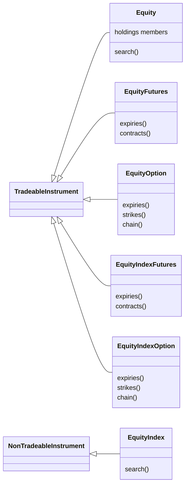

# Adding an asset class

An asset class in this library is one module under `src/tradingmachine/assets/` that puts a named class on each of UBI's segments for that family. Seven modules exist today, and every asset class the old project had is ported. This page is the checklist for the next one, written from how those seven were built, so that a new module has the same shape and a reader never has to remember which family is the exception.

## The shape every module has

Every family module follows the same pattern. The table below shows what each existing module holds, which is what a new one should be compared against.

| Module | Classes | Why that many | Holdings members | Main surprise, kept in its note |
|---|---:|---|---|---|
| `equities.py` | 6 | UBI has six equity segments | `Equity` | none, it is the template |
| `fixed_income.py` | 6 | Six segments, one never filled by any broker | `FixedIncome` | Bonds are named by ISIN, and nothing in the family has candles |
| `commodities.py` | 6 | Six segments | none | Quantity is in quotation units and must be whole lots |
| `currencies.py` | 6 | Six segments, three of them empty on every exchange | none | `lot_size` is not the lot an order is measured against |
| `funds.py` | 2 | UBI has no futures or option segment on a fund or a trust | `ExchangeTradedFund`, `InvestmentTrust` | A trust has no candles |
| `mutual_funds.py` | 1 | One segment, subscribed to rather than traded | `MutualFund` | No quote, so orders need a limit price |

The class diagram below shows the six-class shape of a full family, using the equity family. Each class inherits directly from `TradeableInstrument` or `NonTradeableInstrument`, the index class is the only one on `NonTradeableInstrument`, and each raises its own error.



## The checklist

The steps below are in the order they are best done. Each one names the file it touches.

1. **Find the family's segments in UBI.** UBI's canonical segment names are in `stock_brokers/instruments/mapping/utilities/segments.py` in the sibling project. Write down, for each segment, its shape (`security`, `future` or `option`), how many rows each exchange has, whether it is quoted, and whether UBI stores candles for it. Check whether the cash segment is in UBI's `CASH_SEGMENTS`, because only those can ever be reported as a holding.
2. **Decide the number of classes from UBI, not from what is populated.** Write one class for every segment UBI's vocabulary has for the family, even one no broker fills today; an empty segment fails cleanly on its own. Write fewer only when the segments do not exist at all, as with funds.
3. **Create the module by copying `equities.py`.** Copy it to `src/tradingmachine/assets/<family>.py` and rename, rather than factoring anything out of it into a shared base. The working modules are never touched when a new one is added. Rewrite the module docstring, including its "Typical usage example", for the new family.
4. **Declare the segment constants.** Put one bare segment name per class at module level, such as `EQUITY_FUTURES_SEGMENT = "equity_futures"`. These are values this project chooses and reuses, so constants are right here even though UBI's vocabulary is otherwise passed as plain strings.
5. **Write one class per segment.** Inherit directly from `instruments.TradeableInstrument`, or from `instruments.NonTradeableInstrument` for an index. Do not add an intermediate `Futures`, `Option` or `ListedSecurity` base.
6. **Make the constructor take exactly the identity fields.** A security or an index takes `exchange` and `symbol`, a future adds `underlying_symbol` and `expiry_date` in place of `symbol`, and an option adds `strike_price` and `option_type` as well. Every identity argument is required with no default, and the only optional argument is `unified_broker_interface`. There is no `instrument_id` argument, so there is exactly one way to name a contract.
7. **Re-raise UBI's not-found as the class's own error, and check the segment.** Wrap `super().__init__` in `try`, catch `exceptions.InstrumentError`, and raise the class's own error `from error` with a self-contained message. After it, compare `self.segment` with `f"{self.exchange}_{SEGMENT}"`, the whole prefixed name UBI returns.
8. **Add the error classes.** Add one class per new family class to `src/tradingmachine/assets/exceptions.py`, named `<ClassName>Error`, each a flat sibling directly under `InstrumentError`. Do not root the family's errors in the cash class's error, because an index future is not a kind of the cash instrument.
9. **Add the discovery class methods.** A cash or index class gets `search`, calling `cls._search_catalogue`. A futures class gets `expiries` and `contracts`, calling `cls._expiry_dates` and `cls._contracts_for`. An option class gets `expiries`, `strikes` and `chain`. Each passes its own segment constant, so a caller never types a segment string.
10. **Add holdings members only where UBI can report a holding.** If the cash segment is in `CASH_SEGMENTS`, copy the six holdings members from `Equity` into the cash class: the `holdings`, `holdings_value` and `holdings_pnl` properties and the `add_to_holdings`, `reduce_holdings` and `liquidate_holdings` methods, with the `cnc` product fixed. Give every holdable class all six, even when one of them is awkward for the family, and say so in its docstring rather than leaving it out. Never put holdings on a derivative or an index class.
11. **Add no local validation.** Do not reject an exchange UBI has no rows for, round a price, or check a lot. UBI's not-found already raises the class's own error, and its order validation is the single source of truth.
12. **Write complete docstrings.** Every class, method and property has a Google-style docstring with `Args:`, `Returns:` and `Raises:`, giving each type. A member that raises nothing says `Raises:` followed by `Nothing.`. No explanatory comments go into the source; the reasoning goes into the note in step 14.
13. **Check it against the real UBI.** From a scratchpad script, not from the repository, build one contract of every class and record its segment, shape, `lot_size`, `tick_size`, number of brokers in `carried_by`, `last_price` and whether `prices` returns candles. Send no order. Run `.venv/bin/ruff check .` and `.venv/bin/ruff format .`.
14. **Write the sidecar note.** Create `.claude/notes/src/tradingmachine/assets/<family>.py.md` with the table of class, base class, UBI segment, shape and constructor arguments; a section for everything that differs from the earlier families and why; and a "Verified on" section holding the table from step 13. Add a sentence to `.claude/notes/src/tradingmachine/assets/exceptions.py.md` naming the new error classes.
15. **Update `CLAUDE.md`.** Add the module to the list of source files and write its paragraph in the same form as the others, naming its traps.
16. **Add the documentation page.** Write `docs/asset-classes/<family>.md` following the existing family pages, add it to the Asset classes section of `nav` in `mkdocs.yml`, and add a card to `docs/asset-classes/index.md`. Update the class counts on [The instrument model](../architecture/instrument-model.md) and [Repository structure](structure.md), and add the error classes to [Errors](../python-api/errors.md). The reference page for the new module is generated with no edit. Finish with `.venv/bin/mkdocs build --strict`.
17. **Deliver it on its own branch and pull request.** One module per pull request, and a second module is started only after the first is merged, so the shared `exceptions.py` and `CLAUDE.md` never conflict.

## A skeleton to start from

The block below is one futures class written the way the checklist asks, for an imaginary family called "example", with its constant and its error. It is a template to rename, not code that exists in the library.

```python
EXAMPLE_FUTURES_SEGMENT = "example_futures"


class ExampleFutures(instruments.TradeableInstrument):
    """One futures contract on an example underlying."""

    def __init__(
        self,
        exchange: str,
        underlying_symbol: str,
        expiry_date: datetime.date | str,
        unified_broker_interface: client.UnifiedBrokerInterface | None = None,
    ):
        """Looks the contract up in UBI's example futures segment and keeps its details.

        Args:
            exchange: The str exchange the contract is listed on, such as `nse`.
            underlying_symbol: The str symbol of the underlying.
            expiry_date: The expiry as a datetime.date or a `YYYY-MM-DD` str.
            unified_broker_interface: The client.UnifiedBrokerInterface to send requests through, or None to share one client among all instruments.

        Raises:
            ExampleFuturesError: UBI has no such contract, or the instrument it returned is not in the example futures segment.
            UnifiedBrokerInterfaceError: Any other failure reported by, or on the way to, UBI.
        """
        try:
            super().__init__(
                exchange=exchange,
                segment=EXAMPLE_FUTURES_SEGMENT,
                underlying_symbol=underlying_symbol,
                expiry_date=expiry_date,
                unified_broker_interface=unified_broker_interface,
            )
        except exceptions.InstrumentError as error:
            raise exceptions.ExampleFuturesError(
                f"UBI has no {exchange} example futures contract on {underlying_symbol} expiring {expiry_date}"
            ) from error
        if self.segment != f"{self.exchange}_{EXAMPLE_FUTURES_SEGMENT}":
            raise exceptions.ExampleFuturesError(
                f"An instrument outside the {EXAMPLE_FUTURES_SEGMENT} segment is not an ExampleFutures: {self!r}"
            )
```

The matching error class in `src/tradingmachine/assets/exceptions.py` is a class line and a one-line docstring, placed beside the others and worded the same way:

```python
class ExampleFuturesError(InstrumentError):
    """An example futures contract UBI does not know, or one that is not in the example futures segment."""
```

## What is left to port

Every asset class the old project had is now ported. The one UBI segment without a class is `uncategorised`, a catch-all that UBI does not accept orders for, so it has no family module.

!!! warning "Test with care"
    A module with holdings members can place real orders through `add_to_holdings`, `reduce_holdings` and `liquidate_holdings`, and those members have no `dry_run` argument. Check them against a recording client offline rather than against the real UBI, unless you intend to trade.
