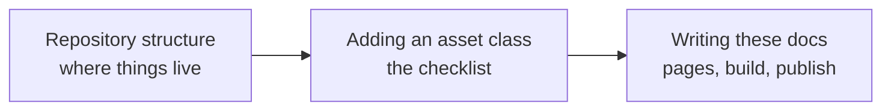

# Project

This tab is for people working on the library itself rather than using it. It explains where everything lives in the repository, how to add a new asset class the way the existing seven modules were built, and how to write and publish these documentation pages.

The flowchart below shows the order in which the three pages are usually needed: first finding your way around, then adding code, then documenting it.

-   :material-folder-outline:{ .lg .middle } **Repository structure**

    ---

    An annotated tree of the repository, how many modules each package holds, and which package imports which.

    [:octicons-arrow-right-24: Repository structure](structure.md)

-   :material-playlist-plus:{ .lg .middle } **Adding an asset class**

    ---

    A numbered checklist for a new family module, from the segment constants and the error classes to the sidecar note and the documentation page.

    [:octicons-arrow-right-24: Adding an asset class](adding-an-asset-class.md)

-   :material-book-edit-outline:{ .lg .middle } **Writing these docs**

    ---

    Previewing and building the site, how it is published on GitHub Pages, how the reference is generated, and the visual conventions every page uses.

    [:octicons-arrow-right-24: Writing these docs](writing-docs.md)

Everything in this tab follows the project's standing rules for code: every function, method and class has a complete Google-style docstring, names are spelled out in full, source files carry no explanatory comments, and the reasoning behind each file lives in a sidecar note under `.claude/notes/` instead.
