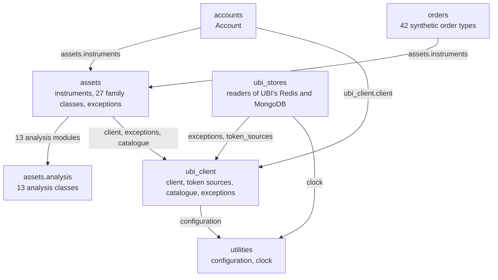

# Repository structure

The repository is an installable Python library with its documentation, its local database containers and the notes that explain it. All library code lives under `src/tradingmachine`, so the repository root is not importable and the library must be installed, with `pip install -e ".[docs,development]"`, before it can be used.

## The tree

The annotated tree below shows every directory and the files that matter. The 42 synthetic order modules and the 13 analysis modules are summarised rather than listed one by one.

```text
tradingmachine/
├── pyproject.toml                 the library's metadata, its 8 dependencies, the docs and development extras
├── requirements.txt               the pinned development environment, not read by the library
├── README.md
├── docker-compose.yml             Redis, MongoDB and TimescaleDB on host ports 2002 to 2004
├── mkdocs.yml                     this site's configuration: theme, nav, plugins, mkdocstrings options
├── CLAUDE.md                      a dense description of the library for AI assistants
├── .github/workflows/docs.yml     builds the site on every push and pull request, publishes from main
├── scripts/                       documentation build tooling, deliberately outside the package
│   ├── gen_ref_pages.py           writes one reference page per module at build time
│   └── documentation_hooks.py     filters the one griffe warning a strict build would fail on
├── docs/                          this site
│   ├── index.md                   Home
│   ├── get-started/               installation, configuration, first steps
│   ├── python-api/                one page per group of members, Kite Connect style
│   ├── asset-classes/             one page per family module
│   ├── analysis/                  indicators, patterns, statistics, signals and backtests
│   ├── architecture/              layers, the instrument model, placement modes, design choices
│   ├── project/                   this tab
│   ├── assets/diagrams/           the animated SVG diagrams, included with snippets
│   └── stylesheets/extra.css      every custom class the pages use
├── tests/                         the offline pytest suite, run against a fake UBI server on a local port
├── .claude/notes/                 one sidecar note per file, mirroring the tree, holding the reasoning
└── src/tradingmachine/
    ├── __init__.py                the package docstring and __version__, imports nothing else
    ├── accounts/
    │   └── account.py             Account, whose flatten is UBI's account-wide kill switch
    ├── assets/
    │   ├── instruments.py         Instrument, TradeableInstrument, NonTradeableInstrument
    │   ├── equities.py            6 equity-family classes
    │   ├── fixed_income.py        6 fixed income classes
    │   ├── commodities.py         6 commodity classes
    │   ├── currencies.py          6 currency classes
    │   ├── funds.py               ExchangeTradedFund, InvestmentTrust
    │   ├── mutual_funds.py        MutualFund
    │   ├── exceptions.py          InstrumentError and its 31 subclasses
    │   └── analysis/
    │       ├── price_analysis.py  PriceAnalysis, the shared base
    │       ├── candle_frame_analysis.py   CandleFrameAnalysis, every method over candles you already have
    │       └── 13 modules         one analysis class each, inherited by Instrument
    ├── orders/
    │   ├── __init__.py            the table of UBI type, module and class
    │   ├── synthetic_order.py     SyntheticOrder, the shared base
    │   ├── order_candidate.py     OrderCandidate, one leg of a multi-instrument order
    │   ├── exposure_watch.py      ExposureWatch, one watched instrument of an exposure hedge
    │   └── 42 modules             one synthetic order type each, such as bracket.py
    ├── ubi_client/
    │   ├── client.py              UnifiedBrokerInterface, the only code that speaks HTTP
    │   ├── token_sources.py       TokenSource, CredentialTokenSource, MongoCredentialTokenSource
    │   ├── instrument_catalogue.py    InstrumentCatalogue, read-only data by instrument id
    │   ├── prices_document.py     PricesDocument, UBI's whole answer from the prices route
    │   ├── instrument_master_stream.py    InstrumentMasterStream, the master read in batches
    │   ├── json_array_stream_parser.py    the parser behind InstrumentMasterStream
    │   └── exceptions.py          one error class per HTTP status UBI returns, and two of the library's own
    ├── ubi_stores/                reads UBI's own Redis and MongoDB, never writes
    │   ├── store_settings.py      RedisSettings, MongoSettings
    │   ├── stored_login.py        StoredLogin, UBI's token and its expiry
    │   ├── stored_login_reader.py StoredLoginReader
    │   ├── stored_login_token_source.py   StoredLoginTokenSource
    │   └── live_quote_reader.py   LiveQuoteReader, many live quotes in one round trip
    └── utilities/
        ├── configuration.py       Configuration, which reads the environment and .env lazily
        └── clock.py               SystemClock, the current time, replaceable in tests
```

`site/`, `.venv/`, `.env` and the build outputs are also present on a working machine, and `.gitignore` keeps all of them out of git.

## Module counts

The table below counts the Python files and lines in each package, measured on 2026-09-26 after the read-only market data classes were added. The counts include each package's `__init__.py`.

| Package | Python files | Lines | What it holds | Third-party imports |
|---|---:|---:|---|---|
| `tradingmachine` | 1 | 17 | The package docstring and `__version__` | none |
| `tradingmachine.accounts` | 2 | 89 | `Account` | none |
| `tradingmachine.assets` | 9 | 7,852 | The instrument classes, the 27 family classes and their errors | `pandas` |
| `tradingmachine.assets.analysis` | 16 | 7,962 | `PriceAnalysis`, the 13 analysis classes and `CandleFrameAnalysis` | `talib`, `backtesting`, `numpy`, `pandas` |
| `tradingmachine.orders` | 46 | 5,381 | `SyntheticOrder`, two helper classes and 42 order types | none |
| `tradingmachine.ubi_client` | 8 | 1,482 | `UnifiedBrokerInterface`, its token sources, the read-only catalogue classes and 15 exception classes | `requests`, `pymongo`, `pandas` |
| `tradingmachine.ubi_stores` | 6 | 728 | The read-only readers of UBI's Redis and MongoDB, and `StoredLoginTokenSource` | `redis`, `pymongo` |
| `tradingmachine.utilities` | 3 | 156 | `Configuration` and `SystemClock` | `dotenv` |
| **Total** | **91** | **23,667** | | |

The chart below shows the same line counts, which makes it plain that the library's weight is in its instruments and their analysis, not in its plumbing.

```vegalite
{
  "$schema": "https://vega.github.io/schema/vega-lite/v5.json",
  "description": "Lines of Python in each package of tradingmachine on 2026-09-26",
  "width": "container",
  "height": 200,
  "data": {
    "values": [
      {"package": "assets.analysis", "lines": 7962},
      {"package": "assets", "lines": 7852},
      {"package": "orders", "lines": 5381},
      {"package": "ubi_client", "lines": 1482},
      {"package": "ubi_stores", "lines": 728},
      {"package": "utilities", "lines": 156},
      {"package": "accounts", "lines": 89},
      {"package": "tradingmachine", "lines": 17}
    ]
  },
  "mark": {"type": "bar", "color": "#ff7043"},
  "encoding": {
    "y": {"field": "package", "type": "nominal", "sort": "-x", "title": null},
    "x": {"field": "lines", "type": "quantitative", "title": "Lines of Python"},
    "tooltip": [
      {"field": "package", "type": "nominal"},
      {"field": "lines", "type": "quantitative", "format": ","}
    ]
  }
}
```

`.claude/notes/` holds 95 notes. Every source module has one except the six `__init__.py` files that hold no reasoning worth recording: the top-level one and those of `assets`, `assets.analysis`, `ubi_client`, `ubi_stores` and `utilities`. The `ubi_stores` package has a `README.md` note of its own that explains why it exists. The other nine notes cover `mkdocs.yml`, `pyproject.toml`, `docker-compose.yml`, the two scripts, the documentation workflow and the three test helpers `conftest.py`, `fake_ubi_server.py` and `fakes.py`.

## Which package imports which

The diagram below shows every import from one package of the library into another, read from the `import` lines in the source. An arrow means "imports". The dependencies run one way only, from the objects you use down to the client and the configuration, so there are no import cycles.



Four details of the graph are worth knowing.

- `orders` does not import `ubi_client`. A synthetic order sends itself through `TradeableInstrument.place_order`, so the placement-mode probe and the shared client apply to it without any code of its own.
- `accounts` imports `assets.instruments` only to call `Instrument.shared_unified_broker_interface()`, so that an `Account` shares the instruments' client instead of logging them out with a second one.
- Nothing imports `ubi_stores` except your own program. `ubi_client` refers to `StoredLoginTokenSource` only in documentation, so importing the REST client never imports `redis`.
- Inside `assets`, every family module imports `instruments` and `exceptions`, and `instruments` alone imports the thirteen analysis modules. Inside `orders`, every type imports `synthetic_order`, and the multi-instrument types also import `order_candidate` or `exposure_watch`.

The package `__init__.py` files import nothing from the library, and the top-level one imports only `importlib.metadata` to read the version, so `import tradingmachine` never reaches for the network, the databases or the `.env` file. Import the module you need, such as `from tradingmachine.assets import equities`.
