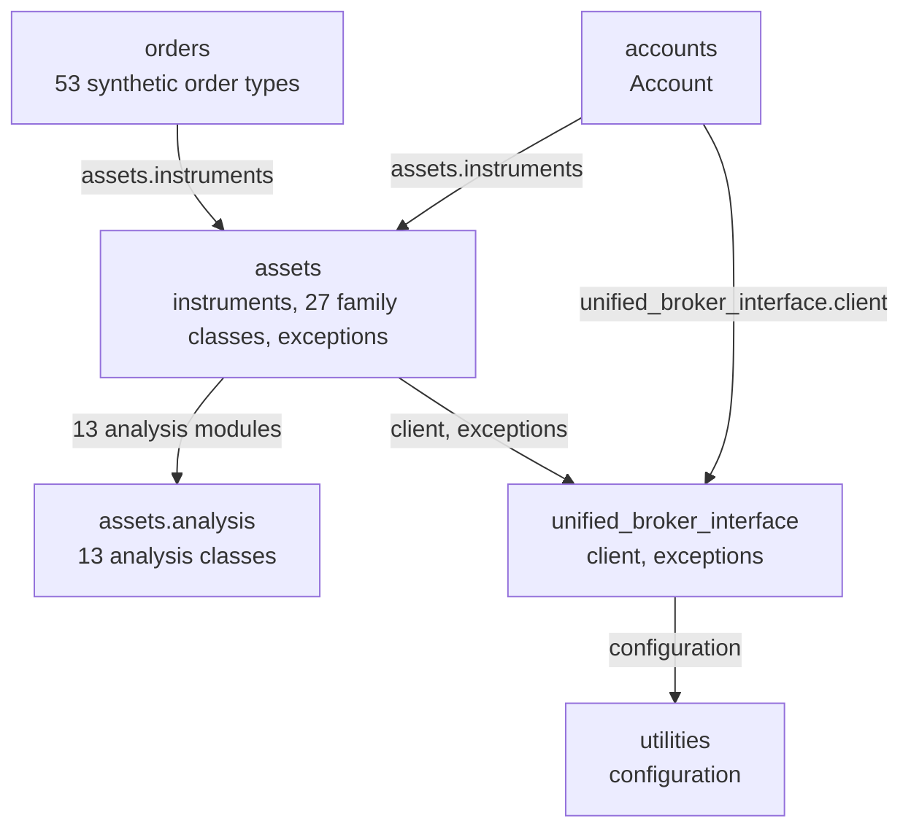

# Repository structure

The repository is an installable Python library with its documentation, its local database containers and the notes that explain it. All library code lives under `src/tradingmachine`, so the repository root is not importable and the library must be installed, with `pip install -e ".[docs,development]"`, before it can be used.

## The tree

The annotated tree below shows every directory and the files that matter. The 53 synthetic order modules and the 13 analysis modules are summarised rather than listed one by one.

```text
tradingmachine/
├── pyproject.toml                 the library's metadata, its 7 dependencies, the docs and development extras
├── requirements.txt               the pinned development environment, not read by the library
├── README.md
├── docker-compose.yml             Redis, MongoDB and TimescaleDB on host ports 2002 to 2004
├── mkdocs.yml                     this site's configuration: theme, nav, plugins, mkdocstrings options
├── CLAUDE.md                      a dense description of the library for AI assistants
├── .github/workflows/docs.yml     builds the site on every push and pull request, publishes from main
├── scripts/                       documentation build tooling, deliberately outside the package
│   ├── gen_ref_pages.py           writes one reference page per module at build time
│   └── documentation_hooks.py     filters the one griffe warning a strict build would fail on
├── docs/                          this site
│   ├── index.md                   Home
│   ├── get-started/               installation, configuration, first steps
│   ├── python-api/                one page per group of members, Kite Connect style
│   ├── asset-classes/             one page per family module
│   ├── analysis/                  indicators, patterns, statistics, signals and backtests
│   ├── architecture/              layers, the instrument model, the order engine, design choices
│   ├── project/                   this tab
│   ├── assets/diagrams/           the animated SVG diagrams, included with snippets
│   └── stylesheets/extra.css      every custom class the pages use
├── .claude/notes/                 one sidecar note per file, mirroring the tree, holding the reasoning
└── src/tradingmachine/
    ├── __init__.py                the package docstring and __version__, imports nothing else
    ├── accounts/
    │   └── account.py             Account, whose flatten is UBI's account-wide kill switch
    ├── assets/
    │   ├── instruments.py         Instrument, TradeableInstrument, NonTradeableInstrument
    │   ├── equities.py            6 equity-family classes
    │   ├── fixed_income.py        6 fixed income classes
    │   ├── commodities.py         6 commodity classes
    │   ├── currencies.py          6 currency classes
    │   ├── funds.py               ExchangeTradedFund, InvestmentTrust
    │   ├── mutual_funds.py        MutualFund
    │   ├── exceptions.py          InstrumentError and its 31 subclasses
    │   └── analysis/
    │       ├── price_analysis.py  PriceAnalysis, the shared base
    │       └── 13 modules         one analysis class each, inherited by Instrument
    ├── orders/
    │   ├── __init__.py            the table of UBI type, module and class
    │   ├── synthetic_order.py     SyntheticOrder, the shared base
    │   ├── order_candidate.py     OrderCandidate, one leg of a multi-instrument order
    │   ├── exposure_watch.py      ExposureWatch, one watched instrument of an exposure hedge
    │   └── 53 modules             one synthetic order type each, such as bracket.py
    ├── unified_broker_interface/
    │   ├── client.py              UnifiedBrokerInterface, the only code that speaks HTTP
    │   └── exceptions.py          one error class per HTTP status UBI returns
    └── utilities/
        └── configuration.py       Configuration, which reads the environment and .env lazily
```

`site/`, `.venv/`, `.env` and the build outputs are also present on a working machine, and `.gitignore` keeps all of them out of git.

## Module counts

The table below counts the Python files and lines in each package, measured on 2026-09-27. The counts include each package's `__init__.py`.

| Package | Python files | Lines | What it holds | Third-party imports |
|---|---:|---:|---|---|
| `tradingmachine` | 1 | 17 | The package docstring and `__version__` | none |
| `tradingmachine.accounts` | 2 | 133 | `Account` | `pandas` |
| `tradingmachine.assets` | 9 | 7,939 | The instrument classes, the 27 family classes and their errors | `pandas` |
| `tradingmachine.assets.analysis` | 15 | 7,827 | `PriceAnalysis` and the 13 analysis classes | `talib`, `backtesting`, `numpy`, `pandas` |
| `tradingmachine.orders` | 57 | 7,078 | `SyntheticOrder`, two helper classes and 53 order types | `pandas`, for type hints only |
| `tradingmachine.unified_broker_interface` | 3 | 507 | `UnifiedBrokerInterface` and its 13 exception classes | `requests`, `pymongo` |
| `tradingmachine.utilities` | 2 | 133 | `Configuration` | `dotenv` |
| **Total** | **89** | **23,634** | | |

The chart below shows the same line counts, which makes it plain that the library's weight is in its instruments and their analysis, not in its plumbing.

```vegalite
{
  "$schema": "https://vega.github.io/schema/vega-lite/v5.json",
  "description": "Lines of Python in each package of tradingmachine on 2026-09-27",
  "width": "container",
  "height": 200,
  "data": {
    "values": [
      {"package": "assets.analysis", "lines": 7827},
      {"package": "assets", "lines": 7939},
      {"package": "orders", "lines": 7078},
      {"package": "unified_broker_interface", "lines": 507},
      {"package": "utilities", "lines": 133},
      {"package": "accounts", "lines": 133},
      {"package": "tradingmachine", "lines": 17}
    ]
  },
  "mark": {"type": "bar", "color": "#ff7043"},
  "encoding": {
    "y": {"field": "package", "type": "nominal", "sort": "-x", "title": null},
    "x": {"field": "lines", "type": "quantitative", "title": "Lines of Python"},
    "tooltip": [
      {"field": "package", "type": "nominal"},
      {"field": "lines", "type": "quantitative", "format": ","}
    ]
  }
}
```

`.claude/notes/` holds 90 notes. Every source module has one except the five `__init__.py` files that hold no reasoning worth recording: the top-level one and those of `assets`, `assets.analysis`, `unified_broker_interface` and `utilities`. The other six notes cover `mkdocs.yml`, `pyproject.toml`, `docker-compose.yml`, the two scripts and the documentation workflow.

## Which package imports which

The diagram below shows every import from one package of the library into another, read from the `import` lines in the source. An arrow means "imports". The dependencies run one way only, from the objects you use down to the client and the configuration, so there are no import cycles.


```mermaid
flowchart TB
    AC["accounts<br/>Account"]
    OR["orders<br/>53 synthetic order types"]
    AS["assets<br/>instruments, 27 family classes, exceptions"]
    AN["assets.analysis<br/>13 analysis classes"]
    UC["unified_broker_interface<br/>client, exceptions"]
    UT["utilities<br/>configuration"]
    AC -->|"assets.instruments"| AS
    AC -->|"unified_broker_interface.client"| UC
    OR -->|"assets.instruments"| AS
    AS -->|"13 analysis modules"| AN
    AS -->|"client, exceptions"| UC
    UC -->|"configuration"| UT
```

Three details of the graph are worth knowing.

- `orders` does not import `unified_broker_interface`. A synthetic order sends itself through `TradeableInstrument.place_order`, so the shared client applies to it without any code of its own, and its `cancel()` and `parent` go through the instrument's parent members in the same way.
- `accounts` imports `assets.instruments` only to call `Instrument.shared_unified_broker_interface()`, so that an `Account` shares the instruments' client instead of logging them out with a second one.
- Inside `assets`, every family module imports `instruments` and `exceptions`, and `instruments` alone imports the thirteen analysis modules. Inside `orders`, every type imports `synthetic_order`, and the multi-instrument types also import `order_candidate` or `exposure_watch`.

The package `__init__.py` files import nothing from the library, and the top-level one imports only `importlib.metadata` to read the version, so `import tradingmachine` never reaches for the network, the databases or the `.env` file. Import the module you need, such as `from tradingmachine.assets import equities`.
