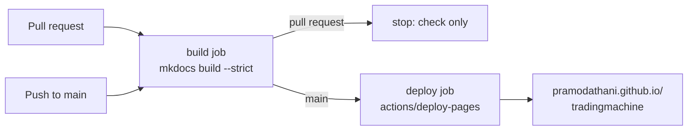
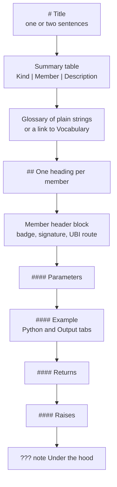

# Writing these docs

This site is built with MkDocs and the Material theme. Its hand-written pages live in `docs/`, and its API reference is generated from the docstrings in `src/tradingmachine` every time the site is built. Docs live with the code and change in the same commit as it.

The animation below shows how the parts come together in one build.

<figure class="diagram">
--8<-- "docs/assets/diagrams/docs-build.svg"
<figcaption>Orange dots are hand-written pages, configuration and the build hook, blue dots are docstrings becoming reference pages, and the green dot is the finished HTML.</figcaption>
</figure>

## Previewing and building

The documentation toolchain is the `docs` extra in `pyproject.toml`, so installing the library with that extra puts it in the project's virtual environment. The commands below install it and then cover almost everything else, all run from the project root.

```bash
.venv/bin/python -m pip install -e ".[docs,development]"
.venv/bin/mkdocs serve            # live preview on http://127.0.0.1:8000, rebuilt on every save
.venv/bin/mkdocs build --strict   # the full build, failing on any warning
```

`mkdocs serve` also watches `src` (the `watch:` list in `mkdocs.yml`), so editing a docstring refreshes the API reference too.

Always finish with `mkdocs build --strict`. In strict mode every warning is an error, so a broken link, a page missing from the nav, a missing snippet file or an unresolvable code cross-reference stops the build. Filtering its output shows only what needs fixing:

```bash
.venv/bin/mkdocs build --strict 2>&1 | grep -E "WARNING|ERROR"
```

MkDocs also logs one line at INFO level on every build, `Doc file 'index.md' contains an unrecognized relative link 'reference/'`, because that link points at a directory the generator creates rather than at a file on disk. It does not fail a strict build and can be ignored.

### Publishing

The site is published on GitHub Pages at <https://pramodathani.github.io/tradingmachine/>. The GitHub Actions workflow `.github/workflows/docs.yml` builds it with `mkdocs build --strict` and deploys it, so nobody publishes by hand. The table below shows what the workflow does for each kind of event.

| Event | Builds and checks the site | Publishes it |
|---|:---:|:---:|
| A push to `main`, which includes merging a pull request | :material-check: | :material-check: |
| A pull request | :material-check: | :material-close: |
| A manual run from the Actions tab | :material-check: | Only on `main` |

The flowchart below shows the same thing as a pipeline.



The workflow installs only the eight packages in the `docs` extra. It reads that list out of `pyproject.toml` with Python's `tomllib` and installs it with `pip`, rather than running `pip install ".[docs]"`, which would install the library and its dependencies too. One of those dependencies is TA-Lib, a wrapper around a native C library that GitHub's runner does not have, so that install would fail. The site does not need the library installed, because mkdocstrings reads the files under `src` without importing them, and the workflow needs no database, no `.env`, no UBI and no credentials. A pull request that breaks a link or a code reference fails its check before it can be merged, but running the strict build locally before pushing still saves a round trip.

The generated `site/` directory is ignored by git and never belongs on a branch.

## The configuration

`mkdocs.yml` holds the whole configuration. The table below lists the plugins it loads, the version of each pinned in the `docs` extra of `pyproject.toml`, and what each one does for this site.

| Plugin | Package and pinned version | What it does here |
|---|---|---|
| `search` | built into MkDocs, `mkdocs==1.6.1` | The search box |
| `charts` | `mkdocs-charts-plugin==0.0.13` | Renders ```` ```vegalite ```` fences as Vega-Lite charts, with the `default` theme in light mode and `dark` in dark mode |
| `gen-files` | `mkdocs-gen-files==0.5.0` | Runs `scripts/gen_ref_pages.py` at build time to create one reference page per module |
| `literate-nav` | `mkdocs-literate-nav==0.6.2` | Reads `reference/SUMMARY.md`, which the generator writes, as the navigation of the API reference |
| `section-index` | `mkdocs-section-index==0.3.9` | Lets a section's `index.md` be the page you land on when you click the section |
| `mkdocstrings` | `mkdocstrings[python]==0.29.0` | Turns each `::: dotted.path` line into documentation read from the docstrings, Google style |

The theme is `mkdocs-material==9.6.9`, with deep orange as its primary and accent colour, the `material/chart-line` logo, and a light, dark and "follow the system" toggle. The Markdown extensions come from `pymdown-extensions==10.21.3`. The ones this site relies on are `admonition` and `pymdownx.details` for the boxes, `pymdownx.superfences` for the Mermaid and Vega-Lite fences, `pymdownx.tabbed` for content tabs, `pymdownx.snippets` for including the SVG files, `pymdownx.emoji` for the Material icons, and `attr_list` and `md_in_html` for the cards, member badges and diagrams.

### How the API reference is generated

`scripts/gen_ref_pages.py` holds one class, `ReferencePageBuilder`, which the `gen-files` plugin runs by path. It walks every `.py` file under `src/tradingmachine`, and the steps below are what it does for each file.

1. It skips any path containing `__pycache__`.
2. It turns the file path, relative to `src`, into a dotted module path and a page path under `reference/`. A package's `__init__.py` becomes that package's `index.md`, and an empty `__init__.py` is skipped because it has nothing to show. Today that skips the `assets`, `assets.analysis`, `ubi_client` and `utilities` packages, so only `tradingmachine`, `tradingmachine.accounts` and `tradingmachine.orders` get an index page. Any other dunder module, such as a `__main__.py`, is skipped too.
3. It writes the page in memory, not on disk, with a single line such as `::: tradingmachine.assets.equities`, which mkdocstrings expands.
4. It records an edit link back to the source file, such as `src/tradingmachine/assets/equities.py`, and adds the page to the navigation.
5. At the end it writes `reference/SUMMARY.md`, which literate-nav reads. That is why the nav in `mkdocs.yml` says only `- API reference: reference/`.

A new module therefore appears in the reference with no edits anywhere. The builder keeps two roots on purpose: the repository root for edit links, and `src` for the dotted path, so that the identifier reads `tradingmachine.assets.equities` rather than `src.tradingmachine.assets.equities`. The script sits in `scripts/` rather than in the package, so it is never shipped to anyone installing the library.

The mkdocstrings options in `mkdocs.yml` matter when you write docstrings. The table below lists the ones that change what appears.

| Option | Value | Effect |
|---|---|---|
| `paths` | `[src]` | Identifiers resolve against the source tree, so the build does not depend on the library being installed |
| `docstring_style` | `google` | `Args:`, `Returns:` and `Raises:` sections are parsed into tables |
| `filters` | `["!^_[^_]"]` | Every name that starts with one underscore is hidden |
| `show_if_no_docstring` | `false` | Anything without a docstring is hidden |
| `inherited_members` | `false` | A class page does not repeat what it inherits, as explained below |
| `returns_named_value` | `false` | `Returns: A pandas.DataFrame ...` is read as a description, not as a value named "A" |
| `merge_init_into_class` | `true` | The constructor's arguments appear on the class |

### What the build hook does

`scripts/documentation_hooks.py` exists to stop one griffe warning from failing every strict build. Every docstring in this project has a `Raises:` section, and a member that raises nothing says so with the single word `Nothing.`, which griffe's Google parser does not recognise as an `exception: description` pair. It warns `Failed to get 'exception: description' pair from 'Nothing.'`, and `--strict` would turn each such warning into a failure.

MkDocs imports the file because `mkdocs.yml` lists it under `hooks:`, and calls its `on_config` function when the configuration is loaded. `on_config` creates a `DocumentationHooks` object, whose `install` method adds a `NothingRaisedFilter` to the handlers of the `mkdocs` logger and the root logger. The filter drops that one message, matched by its text, and nothing else. The filter goes on the handlers rather than on a logger, because griffe's messages reach MkDocs by propagating up from a logger mkdocstrings names, and a filter on a logger only sees records logged through that logger. A deliberately broken cross-reference still fails the build with the hook installed.

### Why `inherited_members` is false

`Instrument` inherits thirteen analysis classes, about 190 methods, and all 27 family classes inherit from it. With `inherited_members: true`, which the sibling UBI site uses, every family class reprinted the whole analysis surface on its own reference page. The table below shows what that did, measured on 2026-09-20 on the same content.

| `inherited_members` | Whole site | Build time | Largest page |
|---|---:|---:|---|
| `true` | 151 MB | 112 seconds | 23.8 MB |
| `false` | 13 MB | 5.9 seconds | 1.0 MB |

A 24 MB HTML page is not usable in a browser, so the setting is off. The analysis methods are still documented once each, on the reference pages of the modules that define them, and each class page names its base classes. [Design choices](../architecture/design-choices.md#inherited_members-false-in-the-docs) records the decision.

## Adding a page

A new narrative page takes two steps: create the Markdown file under `docs/`, and add it to `nav` in `mkdocs.yml`. A section's landing page is the `index.md` of its folder and is listed without a title, like `- project/index.md`. The API reference needs no nav entry, because it is generated.

Every page under `docs/python-api/` follows one template, modelled on Zerodha's Kite Connect documentation, so a reader always finds the same things in the same place. The flowchart below shows the order of its parts.



A page whose members place orders opens with a `!!! danger "These are real orders"` box. The level-4 headings keep the per-member subheadings out of the right-hand table of contents.

## Links

Links to other pages use relative `.md` paths, which MkDocs checks at build time. A heading's anchor is its text in lower case, with spaces turned into hyphens and underscores kept, so the heading `place_order` has the anchor `#place_order`.

```markdown
See [place_order](../python-api/orders.md#place_order) and [Equities](../asset-classes/equities.md).
```

Links to code use mkdocstrings cross-references, which point into the generated reference. The target must be public, with no leading underscore, and have a docstring, or the strict build fails. This page links to [`Equity`][tradingmachine.assets.equities.Equity] with this markup:

```markdown
[`Equity`][tradingmachine.assets.equities.Equity]
```

When you are not sure a name qualifies, cite the file path in backticks instead, such as `src/tradingmachine/assets/instruments.py`.

Links to UBI's behaviour go to its published site with absolute URLs under `https://pramodathani.github.io/unified_broker_interface/`, such as [Order engine](https://pramodathani.github.io/unified_broker_interface/rest-api/order-engine/). Link to UBI rather than repeating its documentation here, and check an anchor against the heading in UBI's `docs/rest-api/*.md` before using it.

## Visual conventions

Every page aims for at least one diagram or chart, and uses tables, lists and code blocks wherever the content has that shape. The table below lists every visual element this site uses and how to write it.

| Element | Use it for | How |
|---|---|---|
| Table | Anything with repeating fields | Markdown table, with a full sentence before it |
| Mermaid diagram | Flows, sequences, class hierarchies, state machines | ```` ```mermaid ```` fence; a `sequenceDiagram` starts with `autonumber` |
| Vega-Lite chart | Real numbers from the code or from a measurement | ```` ```vegalite ```` fence holding a JSON spec |
| Animated SVG | The site's headline diagrams, with moving dots | An `.svg` file in `docs/assets/diagrams/`, included with a snippet |
| Content tabs | The same thing in several forms, such as Python and its output | `=== "Python"` with the content indented four spaces |
| Admonition | Warnings, tips and notes | `!!! danger`, `!!! warning`, `!!! tip`, `!!! note`, `??? note "Under the hood"` |
| Cards | Section landing pages | `<div class="grid cards" markdown>` |
| Member badge | What kind of member something is | `<span class="member property">property</span>` and the four others below |
| Member header | The top of each member's section | `<div class="endpoint" markdown>…</div>` |
| HTTP method badge | The UBI route a member calls | `<span class="method get">GET</span>` |
| Status chip | An HTTP status code | `<span class="status s2">200</span>` |
| Icon | A tick, cross or dash in a table | `:material-check:`, `:material-close:`, `:material-minus:` |

The custom classes all live in `docs/stylesheets/extra.css`. Use only the classes that exist there.

### Member badges

A member badge says what kind of member a name is, and its colour warns before its name does. The table below shows each badge, its markup and when to use it.

| Badge | Markup | Use it for |
|---|---|---|
| <span class="member property">property</span> | `<span class="member property">property</span>` | A member that only reads a value, written without brackets |
| <span class="member method">method</span> | `<span class="member method">method</span>` | A member that takes arguments and only reads |
| <span class="member function">classmethod</span> | `<span class="member function">classmethod</span>` | A class method used for discovery, such as `search` or `chain` |
| <span class="member writes">places orders</span> | `<span class="member writes">places orders</span>` | A member that sends, changes or cancels real orders |
| <span class="member class">class</span> | `<span class="member class">class</span>` | A class you construct |

### Member headers, method badges and status chips

A member header puts the badge, the signature and the UBI route it calls in one bar. It must be written on one line, with `markdown` on the `div` so the backticks inside it still work:

```html
<div class="endpoint" markdown><span class="member method">method</span> `prices(interval="day", from_date=None, to_date=None, days=None, adjusted=True)`<span class="route"><span class="method get">GET</span> `/api/instruments/prices`</span></div>
```

<div class="endpoint" markdown><span class="member method">method</span> `prices(interval="day", from_date=None, to_date=None, days=None, adjusted=True)`<span class="route"><span class="method get">GET</span> `/api/instruments/prices`</span></div>

A method badge colours an HTTP method: `get` is green, `post` blue, `put` amber and `delete` red. UBI has no PATCH route, and a PATCH would use `put`.

<span class="method get">GET</span> <span class="method post">POST</span> <span class="method put">PUT</span> <span class="method delete">DELETE</span>

A status chip colours a status code by its class: `s2` is green for success, `s4` amber for a client error and `s5` red for a server error.

<span class="status s2">200</span> <span class="status s4">409</span> <span class="status s5">504</span>

### Animated SVG

The animated diagrams are hand-written SVG files in `docs/assets/diagrams/`, styled entirely by the classes in `extra.css`, so they follow the light and dark theme without any colours of their own. The table below lists those classes.

| Class | Draws |
|---|---|
| `tm-svg` | The root `<svg>` element, required for every other class to apply |
| `box` | An ordinary box |
| `store` | A data store, in a bluish fill |
| `accent-box` | The box the diagram is about, with an orange border |
| `wire` | A dashed connector that marches, unless the reader prefers reduced motion |
| `wire-solid` | A still connector |
| `title`, `small`, `mono` | Bold, muted and code-font text |
| `dot`, `dot alt`, `dot ok` | Moving dots in orange, blue and green, hidden when the reader prefers reduced motion |

A dot moves along a path with `<animateMotion>` and `<mpath>`. Every `id` in a file starts with a prefix unique to that file, so two diagrams on one page cannot clash. This is one connector and its dot from `docs-build.svg`, the diagram at the top of this page:

```xml
<path id="tm-docs-build-output" class="wire" d="M710,160 L760,160"/>
<circle class="dot ok" r="6"><animateMotion dur="1s" repeatCount="indefinite"><mpath href="#tm-docs-build-output"/></animateMotion></circle>
```

A dot that should wait, so that a request and its answer take turns, uses `calcMode="linear"` with `keyTimes` and `keyPoints`, and an `<animate>` on its opacity to hide it while it waits; `placement-probe.svg` on [Placement modes](../architecture/placement-modes.md) works this way. Draw the dots before the boxes, so a dot passing behind a box is hidden rather than drawn over its text.

Each SVG also carries a `<title>` and a `<desc>` for screen readers, and has no blank lines inside it, because a blank line would end the HTML block when the file is pasted into the page. A page includes it with the snippets extension, inside a `figure` with a one-sentence caption, and with no blank lines between the four lines:

```html
<figure class="diagram">
;--8<-- "docs/assets/diagrams/docs-build.svg"
<figcaption>One sentence explaining what each dot colour means.</figcaption>
</figure>
```

### Mermaid and Vega-Lite

Mermaid diagrams are written as text in a fenced block, and the theme draws them. Keep node labels short, use `<br/>` for a line break, and never put a semicolon inside label text, because it breaks Mermaid's parser.

A chart is a Vega-Lite JSON spec in a `vegalite` fence. Use the v5 schema, `"width": "container"` so it fills the column, and inline data in `"data": {"values": [...]}`. Chart only real numbers, from the code or from a measurement that the page dates. [Repository structure](structure.md#module-counts) has an example.

### Admonitions

Admonitions are the coloured boxes. Each type has one job, and `danger` is reserved.

| Type | Use it for |
|---|---|
| `!!! danger` | Only for something that places real orders |
| `!!! warning` | A trap that costs time or gives a wrong answer |
| `!!! tip` | A shortcut or a better way |
| `!!! note` | Background worth knowing |
| `??? note "Under the hood"` | A collapsed box with the UBI request body, the private methods and the files behind a member |

## Writing style

Every page follows the same writing rules, so the site reads as one voice. The list below collects them.

- Write in simple language and complete sentences. Every sentence has a subject and a verb, and a heading never stands in for the sentence that introduces a section.
- Name a thing in plain words before, or instead of, its identifier in the code.
- Put a complete sentence before every table, diagram, list and code block saying what it shows. Cells and list items can be short; the prose around them cannot.
- Keep facts exact. Never invent a value, field name, status code or message. Real output is copied, never reconstructed, and it says where and when it was captured.
- Replace every broker account identifier in captured output with a placeholder such as `XX000000`, and say in a sentence when output was trimmed.
