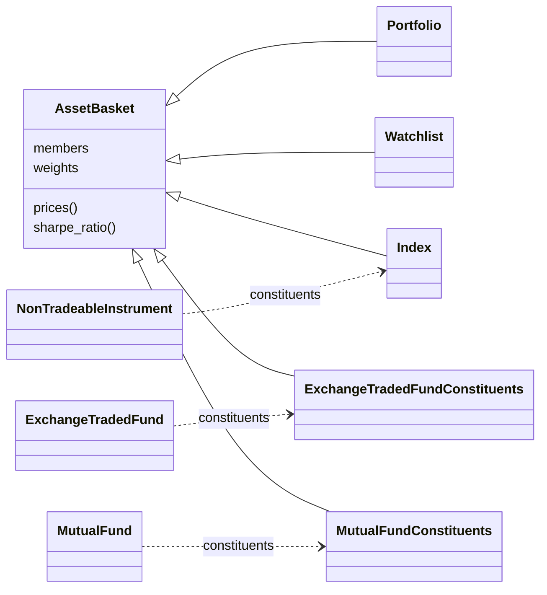
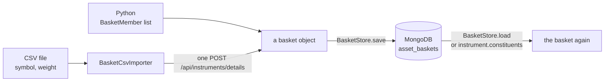

# Asset baskets

Everything else in the library describes one instrument. An asset basket describes a group of them: a portfolio, a watchlist, an index, or what an exchange traded fund or a mutual fund holds. Every basket reads what it needs about all its members in one list request to UBI, and every basket can be analysed exactly like an instrument, from moving averages to the Sharpe ratio.

!!! danger "Two members place real orders"
    `Portfolio.place_orders` and `Portfolio.rebalance` send one real market order per instrument, in one request, with real money. The orders are placed in parallel and not as one unit, so some can be accepted while others are refused. Run them with `dry_run=True` first and read the table they return.

## The classes

The package is one base class and five kinds of basket, each in its own module under `src/tradingmachine/asset_baskets/`. The diagram below shows how they relate and which instrument classes link to them.



The table below says what each kind of basket is for.

| Class | Members carry | What it is for |
|---|---|---|
| [`AssetBasket`][tradingmachine.asset_baskets.asset_basket.AssetBasket] | a weight, or nothing | The shared base: live prices, weights, correlation, risk, and every analysis method |
| [`Portfolio`][tradingmachine.asset_baskets.portfolio.Portfolio] | a quantity and an average price | What you hold: value, profit and loss, buying the whole basket, rebalancing |
| [`Watchlist`][tradingmachine.asset_baskets.watchlist.Watchlist] | nothing | Instruments followed together, each counting equally |
| [`Index`][tradingmachine.asset_baskets.index.Index] | a weight | A weighted index, published or your own, and turning it into a portfolio |
| [`ExchangeTradedFundConstituents`][tradingmachine.asset_baskets.exchange_traded_fund_constituents.ExchangeTradedFundConstituents] | a weight | What an ETF holds, compared with the ETF's own price |
| [`MutualFundConstituents`][tradingmachine.asset_baskets.mutual_fund_constituents.MutualFundConstituents] | a weight | What a mutual fund holds, the only way to measure one since UBI has no NAV |

## An index or a fund is two things

NIFTY is an instrument with its own price, which UBI quotes. It is also a basket of fifty shares with weights. The library keeps these apart rather than merging them into one class, because a merged class could not say whether `prices()` meant the official price or the price rebuilt from the members. The instrument keeps its price, and its `constituents` property returns the basket.

| Class | `instrument.sharpe_ratio(days=365)` | `instrument.constituents.sharpe_ratio(days=365)` |
|---|---|---|
| `EquityIndex` (NIFTY) | Works on the official index candles | Works on the rebuilt basket; comparing the two shows how well the stored weights reproduce the index |
| `ExchangeTradedFund` (NIFTYBEES) | Works on the fund's traded price | Works on its holdings; `fund.tracking_error(benchmark=fund.constituents)` shows how closely the fund follows them |
| `MutualFund` | Returns None, because UBI stores no candles or NAV for mutual funds | The only way to measure a mutual fund |

`holdings` on a fund still means the units of the fund your account holds, which is why the fund's own contents are called `constituents`.

## Where the members come from

UBI stores nothing about what an index or a fund holds, so baskets live in this project's MongoDB, in the `asset_baskets` collection. You supply the members, by hand in Python or from a CSV file. Each stored document is one version of one basket, dated by the day it takes effect, because an index is rebalanced and a fund's holdings change every month.



## AssetBasket

<div class="endpoint" markdown><span class="member class">class</span> `AssetBasket(name, members, linked_instrument=None, unmapped_weight=0.0, unified_broker_interface=None)`</div>

The base class holds a list of [`BasketMember`][tradingmachine.asset_baskets.basket_member.BasketMember] objects, each an instrument with a weight, a quantity, or neither. Every member must be a different instrument, and either every member has a weight or none does; without weights the members count equally. `unmapped_weight` is the share of a fund held in things UBI cannot price, such as cash.

The table below lists the members every basket has.

| Kind | Member | Description | UBI route |
|---|---|---|---|
| <span class="member property">property</span> | `instruments`, `labels`, `size` | What the basket holds; a label reads like `nse:INFY` | none |
| <span class="member property">property</span> | `weights` | The weights normalised to sum to 1, or equal weights | none |
| <span class="member property">property</span> | `last_prices`, `ohlc`, `quotes` | One row per member, with an `error` column for a member UBI has no price for | <span class="method post">POST</span> `/ltp`, `/ohlc`, `/quote` |
| <span class="member property">property</span> | `day_change_percent` | The weighted day move of the whole basket | <span class="method post">POST</span> `/ohlc` |
| <span class="member property">property</span> | `advancers`, `decliners`, `breadth` | How many members are up, down, unchanged or unpriced today | <span class="method post">POST</span> `/ohlc` |
| <span class="member property">property</span> | `exposure_by_segment`, `exposure_by_exchange` | Where the weight sits | none |
| <span class="member property">property</span> | `concentration`, `effective_number_of_members`, `largest_weight` | The Herfindahl index, the number of equal members it corresponds to, and the biggest weight | none |
| <span class="member method">method</span> | `prices(...)` | Candles for the basket as a whole, which every analysis method reads | <span class="method post">POST</span> `/prices` |
| <span class="member method">method</span> | `member_prices(...)`, `member_closes(...)`, `member_returns(...)` | Every member's candles, closes or returns, lined up by time | <span class="method post">POST</span> `/prices` |
| <span class="member method">method</span> | `covariance_matrix(...)`, `correlation_matrix(...)` | How every pair of members moves together | <span class="method post">POST</span> `/prices` |
| <span class="member method">method</span> | `risk_contributions(...)` | Each member's share of the basket's volatility | <span class="method post">POST</span> `/prices` |
| <span class="member method">method</span> | `diversification_ratio(...)` | How much the members' moves cancel out | <span class="method post">POST</span> `/prices` |
| <span class="member method">method</span> | `return_contributions(...)` | What each member added to the basket's return | <span class="method post">POST</span> `/prices` |
| <span class="member method">method</span> | `top_gainers(count)`, `top_losers(count)` | The biggest movers today | <span class="method post">POST</span> `/ohlc` |
| <span class="member method">method</span> | `overlap_with(other)` | The weight two baskets have in common, the standard test of whether two funds differ | none |
| <span class="member method">method</span> | `add_member(member)`, `remove_member(instrument)` | Change the members in memory | none |

Every basket also inherits the fourteen analysis classes an instrument does, the last of which is the [performance measures](../analysis/performance.md), because its `prices` method gives candles for the whole basket. Each candle is the sum over members of a fixed quantity times the member's candle. A weighted basket takes those quantities from its weights at the first candle of the range, starting from 100, which is how a price index moves between rebalances. The open and close are exact. The high and low are an approximation, because the members do not all reach their highs at the same moment, and volume and open interest are left empty.

#### Example

The example below builds a three-stock basket with one details request, then reads its live state and its history. The output is real, from 2026-09-28.

=== "Python"

    ```python
    from tradingmachine.asset_baskets import asset_basket, member_resolver

    members = member_resolver.MemberResolver().resolve(
        [
            {"exchange": "nse", "segment": "equities", "symbol": "INFY", "weight": 50},
            {"exchange": "nse", "segment": "equities", "symbol": "TCS", "weight": 30},
            {"exchange": "nse", "segment": "equities", "symbol": "WIPRO", "weight": 20},
        ]
    )
    basket = asset_basket.AssetBasket("IT test", members)
    print(basket.weights.to_dict())
    print(basket.breadth)
    print(basket.risk_contributions(days=365).round(4))
    print(basket.return_contributions(days=365).round(4))
    print(basket.cumulative_return(days=365))
    ```

=== "Output"

    ```
    {'nse:INFY': 0.5, 'nse:TCS': 0.3, 'nse:WIPRO': 0.2}
    {'advancers': 1, 'decliners': 2, 'unchanged': 0, 'unavailable': 0, 'advance_decline_ratio': 0.5}
               weight  risk_contribution
    label
    nse:INFY      0.5             0.5592
    nse:TCS       0.3             0.2968
    nse:WIPRO     0.2             0.1440
               starting_weight  member_return  contribution
    label
    nse:WIPRO              0.2        -0.3156       -0.0631
    nse:TCS                0.3        -0.2811       -0.0843
    nse:INFY               0.5        -0.3063       -0.1531
    -0.3005838911839611
    ```

The three contributions add up to the basket's cumulative return of −30.06 percent, and INFY carries 56 percent of the risk on 50 percent of the weight.

#### Raises

| Exception | When |
|---|---|
| [`BasketMemberError`](errors.md#basketmembererror) | The members are empty, name an instrument twice, or give weights to only some members; or UBI answered an error for a member when candles were asked for |
| `ValueError` | `unmapped_weight` is not between 0 and 1 |

## Portfolio

<div class="endpoint" markdown><span class="member class">class</span> `Portfolio(name, members, unified_broker_interface=None)`</div>

A portfolio gives every member a quantity, negative for a short position. Its weights are each member's share of today's value, and its candles show what the same quantities were worth at each candle, so its Sharpe ratio or drawdown describes the portfolio as you hold it now.

| Kind | Member | Description | UBI route |
|---|---|---|---|
| <span class="member function">classmethod</span> | `from_holdings(name="holdings")` | Builds a portfolio of the account's long-term holdings | <span class="method get">GET</span> `/api/portfolio/holdings` |
| <span class="member function">classmethod</span> | `from_positions(name="positions", day=False)` | Builds a portfolio of the open positions | <span class="method get">GET</span> `/api/portfolio/positions` |
| <span class="member property">property</span> | `quantities`, `values`, `value` | What is held and what it is worth at last prices | <span class="method post">POST</span> `/ltp` |
| <span class="member property">property</span> | `invested_value`, `unrealized_pnl` | What was paid and the profit on it | <span class="method post">POST</span> `/ltp` |
| <span class="member property">property</span> | `day_pnl`, `day_change_percent` | The profit and move since the previous close | <span class="method post">POST</span> `/ohlc` |
| <span class="member method">method</span> | `rebalance_trades(target, capital=None)` | The buys and sells that would give the portfolio another basket's weights, without sending anything | <span class="method post">POST</span> `/ltp` |
| <span class="member writes">places orders</span> | `place_orders(product, transaction_type="buy", ...)` | One market order per member, all in one request | <span class="method post">POST</span> `/api/orders/place` |
| <span class="member writes">places orders</span> | `rebalance(target, product, ...)` | Sends the trades `rebalance_trades` works out | <span class="method post">POST</span> `/api/orders/place` |

The orders go in UBI's list form of `POST /api/orders/place`, which takes up to 500 orders and places them in parallel, each at the broker that suits it. UBI's `basket` synthetic order is not used, because it takes at most 25 legs and sends every leg to the first leg's broker. Quantities are floored to whole units and sent as computed, with no lot or tick check, because UBI checks orders itself.

#### Example

The example below reads the account's holdings as a portfolio. The output is real, from 2026-09-28; UBI's own holdings summary said 9,237.33 for the value at the same moment, because it prices each holding from its holdings document rather than from the live last price.

=== "Python"

    ```python
    from tradingmachine.asset_baskets import portfolio

    held = portfolio.Portfolio.from_holdings()
    print(held, held.value, held.invested_value, held.unrealized_pnl, held.day_pnl)
    ```

=== "Output"

    ```
    Portfolio(name='holdings', size=7) 9240.43 11216.62 -1976.1900000000005 -216.28999999999994
    ```

## Watchlist

<div class="endpoint" markdown><span class="member class">class</span> `Watchlist(name, instruments, unified_broker_interface=None)`</div>

A watchlist takes plain instruments and weights them equally. It adds `add(instrument)` and `rank_by(column="change_percent", ascending=False)`, which sorts the members by any column of `ohlc`.

=== "Python"

    ```python
    from tradingmachine.asset_baskets import watchlist

    followed = watchlist.Watchlist("banks and more", [hdfc_bank, reliance, icici_bank, infosys, airtel])
    print(followed.rank_by("change_percent")[["label", "last_price", "change_percent"]])
    ```

=== "Output"

    ```
                label  last_price  change_percent
    0        nse:INFY     1003.20          0.2999
    1  nse:BHARTIARTL     1771.40         -0.7841
    2   nse:ICICIBANK     1302.00         -1.8692
    3    nse:HDFCBANK      719.05         -2.2499
    4    nse:RELIANCE     1197.60         -2.3165
    ```

## Index

<div class="endpoint" markdown><span class="member class">class</span> `Index(name, members, weighting="stated", base_value=100, base_date=None, linked_instrument=None, unified_broker_interface=None)`</div>

An index weights its members in one of three ways, which the table below lists.

| `weighting` | Each member's weight | Example |
|---|---|---|
| `stated` | Its own `weight`, as a factsheet gives it | NIFTY, loaded with its published weights |
| `equal` | The same for every member | NIFTY50 Equal Weight, or a file without weights |
| `price` | Its share of the sum of last prices, which is holding one unit of each | The Dow Jones |

`linked_instrument` is the official index the basket describes, when there is one, so `tracking_error(benchmark=index.linked_instrument)` measures how well the stored weights reproduce it. `level` reports today's level measured from `base_value` at `base_date`, and `to_portfolio(capital)` turns the index into whole units of each member for a sum of money, ready for `place_orders`.

## ExchangeTradedFundConstituents

<div class="endpoint" markdown><span class="member class">class</span> `ExchangeTradedFundConstituents(name, members, fund=None, indicative_net_asset_value=None, unmapped_weight=0.0, unified_broker_interface=None)`</div>

This is what an ETF holds, linked to the ETF through `fund`. `tracking_difference(...)` is the fund's return minus its holdings' return over a range, which is mostly the fund's fees. `premium_or_discount` compares the fund's last price with its indicative net asset value, when the index row that carries it is given as `indicative_net_asset_value`.

## MutualFundConstituents

<div class="endpoint" markdown><span class="member class">class</span> `MutualFundConstituents(name, members, fund=None, unmapped_weight=0.0, unified_broker_interface=None)`</div>

This is what a mutual fund holds, linked to the scheme through `fund`. `estimated_day_change_percent` is the holdings' day move scaled down by `unmapped_weight`, the usual guess at today's change in the net asset value before the fund publishes it, and `estimated_net_asset_value(previous_net_asset_value)` applies it to the last published value. The weights come from the fund's monthly disclosure, so the basket is an estimate of the fund, not the fund.

## BasketStore and BasketCsvImporter

<div class="endpoint" markdown><span class="member class">class</span> `BasketStore(project_configuration=None, unified_broker_interface=None)`</div>

The store saves and loads baskets in MongoDB. The table below lists its members.

| Kind | Member | Description |
|---|---|---|
| <span class="member method">method</span> | `save(basket, effective_date=None, source="user")` | Stores the basket as the version in effect from a date, replacing one stored for the same date |
| <span class="member method">method</span> | `load(name, as_of=None)` | Rebuilds the version in effect on a day, as the class its stored kind names |
| <span class="member method">method</span> | `load_for_instrument(instrument, as_of=None)` | Finds the basket linked to an instrument; `constituents` calls this |
| <span class="member method">method</span> | `names(kind=None)`, `history(name)`, `delete(name, effective_date)` | List, inspect and remove stored versions |
| <span class="member method">method</span> | `build(document, linked_instrument=None)` | Builds a basket from a document without storing it |

`load` raises [`BasketNotFoundError`](errors.md#basketnotfounderror) when no version of the name is in effect on the day asked for, while `load_for_instrument` returns `None` instead. A CSV file the importer cannot use raises [`BasketCsvImportError`](errors.md#basketcsvimporterror), and every basket error is listed on [Errors](errors.md#the-asset-basket-errors).

<div class="endpoint" markdown><span class="member class">class</span> `BasketCsvImporter(project_configuration=None, unified_broker_interface=None)`</div>

The importer's one method, `import_file(path, name, kind="index", exchange="nse", segment="equities", linked_instrument=None, effective_date=None, unmapped_weight=0.0, source="csv")`, reads a CSV with a `symbol` column and optional `exchange`, `segment`, `weight`, `quantity` and `instrument_id` columns. Column names are read without regard to case, so the NSE's own constituent files, whose header has `Symbol`, import as they are. A file without weights makes an equally weighted index. Weights may be fractions or percentages, with or without a `%` sign. The `kind` names the class the basket is stored and rebuilt as: `basket`, `portfolio`, `watchlist`, `index`, `exchange_traded_fund_constituents` or `mutual_fund_constituents`.

#### Example

The example below imports five NIFTY stocks with their weights, links them to the NIFTY index, and reads them back through `constituents`. The output is real, from 2026-09-28.

=== "five.csv"

    ```
    Company Name,Symbol,Weight
    HDFC Bank,HDFCBANK,13.1%
    Reliance Industries,RELIANCE,8.9%
    ICICI Bank,ICICIBANK,8.5%
    Infosys,INFY,5.2%
    Bharti Airtel,BHARTIARTL,4.6%
    ```

=== "Python"

    ```python
    from tradingmachine.asset_baskets import basket_csv_importer
    from tradingmachine.assets import equities

    nifty = equities.EquityIndex(exchange="nse", symbol="NIFTY")
    basket_csv_importer.BasketCsvImporter().import_file(
        "five.csv", name="NIFTY FIVE", kind="index", linked_instrument=nifty, effective_date="2026-09-01"
    )
    five = nifty.constituents
    print(five, five.weights.round(4).to_dict())
    print(five.tracking_error(benchmark=nifty, days=365))
    ```

=== "Output"

    ```
    Index(name='NIFTY FIVE', size=5) {'nse:HDFCBANK': 0.3251, 'nse:RELIANCE': 0.2208, 'nse:ICICIBANK': 0.2109, 'nse:INFY': 0.129, 'nse:BHARTIARTL': 0.1141}
    0.05995963449129185
    ```

??? note "Under the hood"
    - Every live member sends one `POST` to UBI's list form of the instrument routes, described in [Several instruments at once](https://pramodathani.github.io/unified_broker_interface/rest-api/instruments/#several-instruments-at-once). UBI answers one entry per instrument, and a bad instrument fails only its own entry.
    - `MemberResolver` in `src/tradingmachine/asset_baskets/member_resolver.py` turns rows into members with one `POST /api/instruments/details`, and builds each instrument from its entry through the `details` argument of the instrument constructors, so no instrument is looked up twice.
    - The reasoning behind each file is in `.claude/notes/src/tradingmachine/asset_baskets/`.
