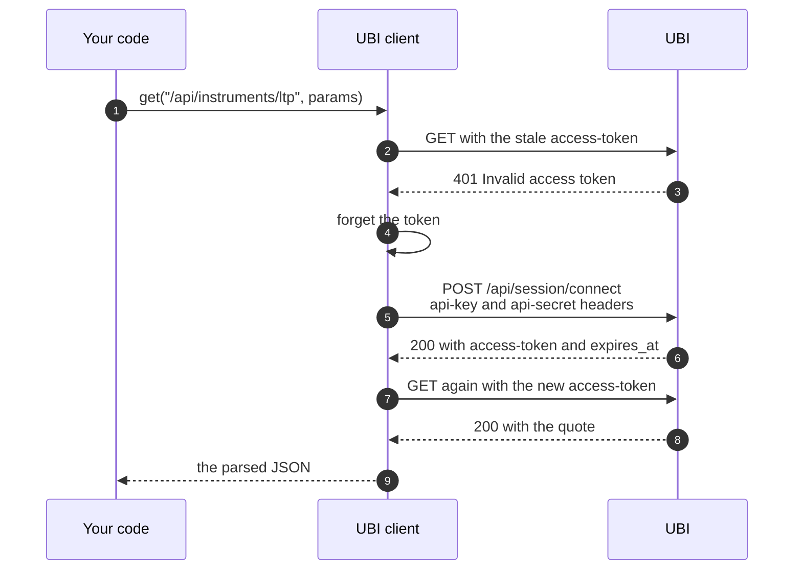

# The UBI client

`UnifiedBrokerInterface` is the thin layer that actually speaks HTTP to UBI. It logs in with UBI's api key and secret, sends every request with the access token, logs in again once when the token is refused, and turns every failed answer into a typed exception. It knows nothing about instruments or orders: callers give it a route such as `/api/instruments/ltp` and get the parsed JSON back. `Configuration` sits underneath it and says where UBI and MongoDB are.

You rarely use either class directly, because every instrument and the account already share one client. The table below lists what the two classes offer, for the times you do.

| Kind | Member | Description |
|---|---|---|
| <span class="member class">class</span> | [`UnifiedBrokerInterface`](#unifiedbrokerinterface) | A connection to UBI's REST API |
| <span class="member method">method</span> | [`connect`](#connect) | Exchanges the api key and secret for an access token |
| <span class="member method">method</span> | [`disconnect`](#disconnect) | Revokes the access token for every client |
| <span class="member method">method</span> | [`status`](#status) | Reports whether the session is connected and when it expires |
| <span class="member method">method</span> | [`get`](#get), [`post`](#post), [`put`](#put), [`patch`](#patch), [`delete`](#delete) | Send one request to any UBI route |
| <span class="member property">attribute</span> | [`token_expires_at`](#token_expires_at) | When the current token expires, as UBI reported it |
| <span class="member property">attribute</span> | [`placement_mode`](#placement_mode) | Whether UBI was last seen placing orders through its engine or directly |
| <span class="member class">class</span> | [`Configuration`](#configuration) | The settings for one process, read from the environment on first use |

## UnifiedBrokerInterface

<div class="endpoint" markdown><span class="member class">class</span> `UnifiedBrokerInterface(base_url=None, timeout_seconds=30, project_configuration=None)`</div>

The constructor finds UBI's address and reads UBI's api key and secret from MongoDB. It does not connect: the first request connects on its own. It lives in `tradingmachine.unified_broker_interface.client`.

#### Parameters

| Name | Type | Required | Default | Description |
|---|---|---|---|---|
| `base_url` | `str` or `None` | No | `None` | UBI's address, such as `http://127.0.0.1:8080`. `None` reads `TRADINGMACHINE_UBI_BASE_URL`. |
| `timeout_seconds` | `float` | No | `30` | How long to wait for each response |
| `project_configuration` | `Configuration` or `None` | No | `None` | Where to read the base url and the MongoDB settings from. `None` builds a plain [`Configuration`](#configuration). |

#### Example

This example builds a client of its own and reads the session status. It sends a real connect, so it would log out any client holding a token from before the latest 07:00; see [One token for everyone](#one-token-for-everyone). Its output was not captured.

=== "Python"

    ```python
    from tradingmachine.unified_broker_interface import client

    unified_broker_interface = client.UnifiedBrokerInterface()
    print(unified_broker_interface.status())
    ```

#### Returns

The constructor returns the client, with `token_expires_at` and `placement_mode` both `None`.

#### Raises

| Exception | When |
|---|---|
| `ValueError` | No base url is configured, or MongoDB has no `settings` document for UBI, or the document has no `api_key` or no `api_secret` |

### Where the key and secret come from

The client does not read UBI's credentials from the environment. It reads them once, in the constructor, from this project's own MongoDB, from the `settings` collection document whose `broker_name` is `unified_broker_interface`. The document looks like the one below; the values are placeholders, and they must match the same document in UBI's own MongoDB.

```json
{
  "broker_name": "unified_broker_interface",
  "api_key": "<the key UBI has in its own settings>",
  "api_secret": "<the secret UBI has in its own settings>"
}
```

The MongoDB connection is opened in a `with` block and closed straight away, so no database connection stays open for the life of the client. No code in this library creates the document; [Configuration](../get-started/configuration.md#the-mongodb-settings-document) shows how to seed it.

### One token for everyone

UBI holds a single access token for the whole application, not one per client. The rules that govern it come from UBI, and [How the token lives and dies](https://pramodathani.github.io/unified_broker_interface/rest-api/session/#how-the-token-lives-and-dies) on the UBI site has them in full. The two that matter here are listed below.

1. A `connect` returns the token already in force when it was issued at or after the most recent 07:00 and has not expired. Otherwise UBI mints a new token, and every other client still holding the old one starts getting HTTP 401, including UBI's own REST API test page.
2. A token is accepted for one day by default, set by UBI's `UNIFIED_BROKER_INTERFACE_API_TOKEN_TTL_SECONDS`.

So a token held by this library can be refused at any moment, either because it expired or because someone else's `connect` replaced it. The client does not check `token_expires_at` before a request. It sends the request, and on a 401 it throws the token away, connects again and retries exactly once.

That is also why every instrument shares one client through [`Instrument.shared_unified_broker_interface`](instruments.md#shared_unified_broker_interface). Two clients in one process would each hold a token and could keep replacing each other's.

### The retry on 401

The sequence below shows a `get` whose token has gone stale. The retry happens once only: a second 401 is raised as [`AuthenticationError`](errors.md#authenticationerror), so a wrong key or secret cannot cause a loop, and `connect` itself never retries.



If the second attempt also fails, the client raises the exception that matches its status code, as described under [How failures become exceptions](#how-failures-become-exceptions).

## connect

<div class="endpoint" markdown><span class="member method">method</span> `connect()`<span class="route"><span class="method post">POST</span> `/api/session/connect`</span></div>

This method sends the api key and secret as the `api-key` and `api-secret` headers and keeps the access token UBI returns, with its expiry in `token_expires_at`. You do not need to call it: the first request connects by itself, and a refused token reconnects by itself.

#### Parameters

This method takes no parameters.

#### Returns

The access token as a `str`.

#### Raises

| Exception | When |
|---|---|
| [`AuthenticationError`](errors.md#authenticationerror) | UBI refused the key or secret |
| [`UnreachableError`](errors.md#unreachableerror) | UBI could not be reached |
| [`UnifiedBrokerInterfaceError`](errors.md#unifiedbrokerinterfaceerror) | Any other failure |

## disconnect

<div class="endpoint" markdown><span class="member method">method</span> `disconnect()`<span class="route"><span class="method delete">DELETE</span> `/api/session/disconnect`</span></div>

This method revokes the access token on UBI, which ends the session for every client at once, not only this one, and clears the client's own copy. The next request made through any client connects again.

#### Parameters

This method takes no parameters.

#### Returns

UBI's answer as a `dict`, such as `{"status": "disconnected"}`.

#### Raises

| Exception | When |
|---|---|
| [`UnifiedBrokerInterfaceError`](errors.md#unifiedbrokerinterfaceerror) | UBI reported a failure or could not be reached |

## status

<div class="endpoint" markdown><span class="member method">method</span> `status()`<span class="route"><span class="method get">GET</span> `/api/session/status`</span></div>

This method asks UBI whether the token is valid and when it expires. Like every request it connects first if the client has no token yet.

#### Parameters

This method takes no parameters.

#### Returns

UBI's answer as a `dict`, such as `{"status": "connected", "expires_at": "..."}`.

#### Raises

| Exception | When |
|---|---|
| [`UnifiedBrokerInterfaceError`](errors.md#unifiedbrokerinterfaceerror) | UBI reported a failure or could not be reached |

## Sending requests

The five methods in this section send one authenticated request to any route and return the parsed JSON. They are what every other class in the library is built on, and they all behave the same way: connect first if there is no token, send the request with the `access-token` header, retry once on a 401, and raise the exception that matches any other failure status.

The table below lists their parameters together, because they share them.

| Name | Type | Required | Default | Description |
|---|---|---|---|---|
| `path` | `str` | Yes | | The route, starting with `/api/` |
| `params` | `dict` or `None` | No | `None` | Query string parameters |
| `body` | any JSON-serialisable value, or `None` | No | `None` | The request body, sent as JSON. `get` takes none. |
| `timeout_seconds` | `float` or `None` | No | `None` | `post` only. The seconds to wait for this one response, or `None` for the client's own timeout. |

Each method returns the parsed JSON body, of any JSON type, or `None` when the body is empty or not JSON. Each raises a subclass of [`UnifiedBrokerInterfaceError`](errors.md#unifiedbrokerinterfaceerror) chosen by the status code when UBI answers with a failure, and [`UnreachableError`](errors.md#unreachableerror) when no answer arrives.

### get

<div class="endpoint" markdown><span class="member method">method</span> `get(path, params=None)`<span class="route"><span class="method get">GET</span> any route</span></div>

This method sends a GET request. Every read in the library, from an instrument lookup to a quote, goes through it.

#### Example

This example reads a last price through the shared client. Its output was not captured, but the same route answered `1226.0` for RELIANCE through [`last_price`](market-data.md#last_price) on 2026-09-26.

=== "Python"

    ```python
    from tradingmachine.assets import instruments

    shared_client = instruments.Instrument.shared_unified_broker_interface()
    answer = shared_client.get(
        "/api/instruments/ltp",
        params={
            "exchange": "nse",
            "segment": "equities",
            "symbol": "RELIANCE",
        },
    )
    print(answer["last_price"])
    ```

### post

<div class="endpoint" markdown><span class="member method">method</span> `post(path, body=None, params=None, timeout_seconds=None)`<span class="route"><span class="method post">POST</span> any route</span></div>

This method sends a POST request with a JSON body. `post` alone takes a `timeout_seconds` for one slow request, which exists for [`Account.flatten`](account.md), because closing several positions one after another can take well over thirty seconds. Placing an order goes through `post`, so a POST to `/api/orders/place` without `"dry_run": true` in the body is a real order.

### put

<div class="endpoint" markdown><span class="member method">method</span> `put(path, body=None, params=None)`<span class="route"><span class="method put">PUT</span> any route</span></div>

This method sends a PUT request with a JSON body.

### patch

<div class="endpoint" markdown><span class="member method">method</span> `patch(path, body=None, params=None)`<span class="route"><span class="method put">PATCH</span> any route</span></div>

This method sends a PATCH request with a JSON body. UBI has no PATCH route today, so a PATCH gets HTTP 405 from UBI's web framework, which the client raises as [`ServerError`](errors.md#servererror). The method is there so that a future route needs no change here.

### delete

<div class="endpoint" markdown><span class="member method">method</span> `delete(path, body=None, params=None)`<span class="route"><span class="method delete">DELETE</span> any route</span></div>

This method sends a DELETE request. It accepts a body as well as query parameters, because UBI's order routes read both.

### How failures become exceptions

UBI reports a failure as a status code and a JSON body, and has no error-type field to switch on, so the status code alone chooses the exception class. The message is taken from the body's `error` field, or from its `status_message` when there is no `error`, which is how UBI's order engine explains a 504, or else it reads `UBI returned HTTP <status>`. The whole body is kept in the exception's `detail`. [Errors](errors.md#which-status-becomes-which-exception) has the full table of status codes.

## token_expires_at

`token_expires_at` is a public attribute holding the `str` time the current token expires, exactly as UBI reported it, or `None` before the first connect and after a disconnect. The client never reads it; it is there for code that wants to show the expiry or plan around it.

## placement_mode

`placement_mode` is a public attribute recording how UBI was last seen placing orders. UBI has no route that reports its mode, so the client learns it from the answers to orders, and the attribute has one of the three values in the table below.

| Value | Meaning | How it gets there |
|---|---|---|
| `None` | Not known yet | The starting value, and it stays so after plain orders, which work in either mode |
| `"engine"` | UBI hands orders to its order engine | An order answer, a dry run or an engine refusal carried an `intent_id` |
| `"direct"` | UBI places orders itself and would ignore a reference or a synthetic object | An answer to an order carrying one of them had no `intent_id` |

The attribute lives on the client rather than on an instrument, because every instrument shares the client and the mode belongs to the server. [`place_order`](orders.md#place_order) sets it, and it probes with one dry run before the first live order that carries a `price_reference`, a `quantity_reference` or a `synthetic` object. [The placement-mode probe](../architecture/placement-modes.md#the-placement-mode-probe) explains the check in full.

The captures on 2026-09-26 show both states. After a plain dry-run limit order `placement_mode` was still `None`, and after a dry run carrying `price_reference={"kind": "offer_level", "level": 1}` it was `'engine'`.

=== "Python"

    ```python
    shared_client = reliance.shared_unified_broker_interface()
    print(repr(shared_client.placement_mode))
    ```

=== "Output"

    ```text
    'engine'
    ```

## Configuration

<div class="endpoint" markdown><span class="member class">class</span> `Configuration(environment_file=None, load_environment_file=True)`</div>

`Configuration`, in `tradingmachine.utilities.configuration`, is the one place that knows which environment variable holds which setting. It reads nothing when it is created or when the library is imported. The first time one of its properties is read, it loads the `.env` file once, if asked to, and then every value is read from the process environment at that moment.

#### Parameters

| Name | Type | Required | Default | Description |
|---|---|---|---|---|
| `environment_file` | `str` or `None` | No | `None` | The path of a `.env` file to load, or `None` to search the working directory and its parents for a file named `.env` |
| `load_environment_file` | `bool` | No | `True` | `False` to load no file at all and rely only on variables already exported |

#### Properties

The table below lists what the object reports and which variable each value comes from. Every value is a `str`, or `None` when the variable is not set.

| Property | Environment variable |
|---|---|
| `ubi_base_url` | `TRADINGMACHINE_UBI_BASE_URL` |
| `mongodb_host` | `TRADINGMACHINE_MONGODB_HOST` |
| `mongodb_port` | `TRADINGMACHINE_MONGODB_PORT` |
| `mongodb_database_name` | `TRADINGMACHINE_MONGODB_DB` |
| `mongodb_username` | `TRADINGMACHINE_MONGODB_USERNAME` |
| `mongodb_password` | `TRADINGMACHINE_MONGODB_PASSWORD` |
| `mongodb_connection_string` | Built from the four MongoDB connection values above, as `mongodb://<username>:<password>@<host>:<port>/?authSource=admin`, with the username and password escaped |

`reload()` forgets that the file was loaded, so the next read loads it again. Note that loading a `.env` file never overrides a variable that is already exported, so an exported value always wins over the file.

#### Example

The three ways to point the library at its settings are shown below. The last one hands a custom client to an instrument, which is how one process can talk to a different UBI from another.

=== "Python"

    ```python
    from tradingmachine.assets import equities
    from tradingmachine.unified_broker_interface import client
    from tradingmachine.utilities import configuration

    from_working_directory = configuration.Configuration()
    from_elsewhere = configuration.Configuration(
        environment_file="/etc/tradingmachine.env",
    )
    exported_only = configuration.Configuration(load_environment_file=False)

    custom_client = client.UnifiedBrokerInterface(
        project_configuration=from_elsewhere,
    )
    reliance = equities.Equity(
        "nse",
        "RELIANCE",
        unified_broker_interface=custom_client,
    )
    ```

!!! warning "A second client means a second login"
    A custom client holds its own token. If it connects after the shared client did and UBI mints a new token, the shared client's next request gets a 401 and reconnects, and the two keep trading places. That costs an extra round trip each time but never fails, because each side retries once.

#### Raises

Nothing. A missing variable is reported as `None`, and it is the client that raises `ValueError` when the base url or the credentials are missing.

??? note "Under the hood"
    Every request goes through one private method that adds the `access-token` header, sends it with `requests.request`, and on a first 401 clears the token and calls itself once more. A `requests.RequestException` such as a refused connection or a timeout becomes `UnreachableError`, chained so the original error is kept. See [Session](https://pramodathani.github.io/unified_broker_interface/rest-api/session/) on the UBI site for the three session routes, and `.claude/notes/src/tradingmachine/unified_broker_interface/client.py.md` for the reasoning behind the client.
