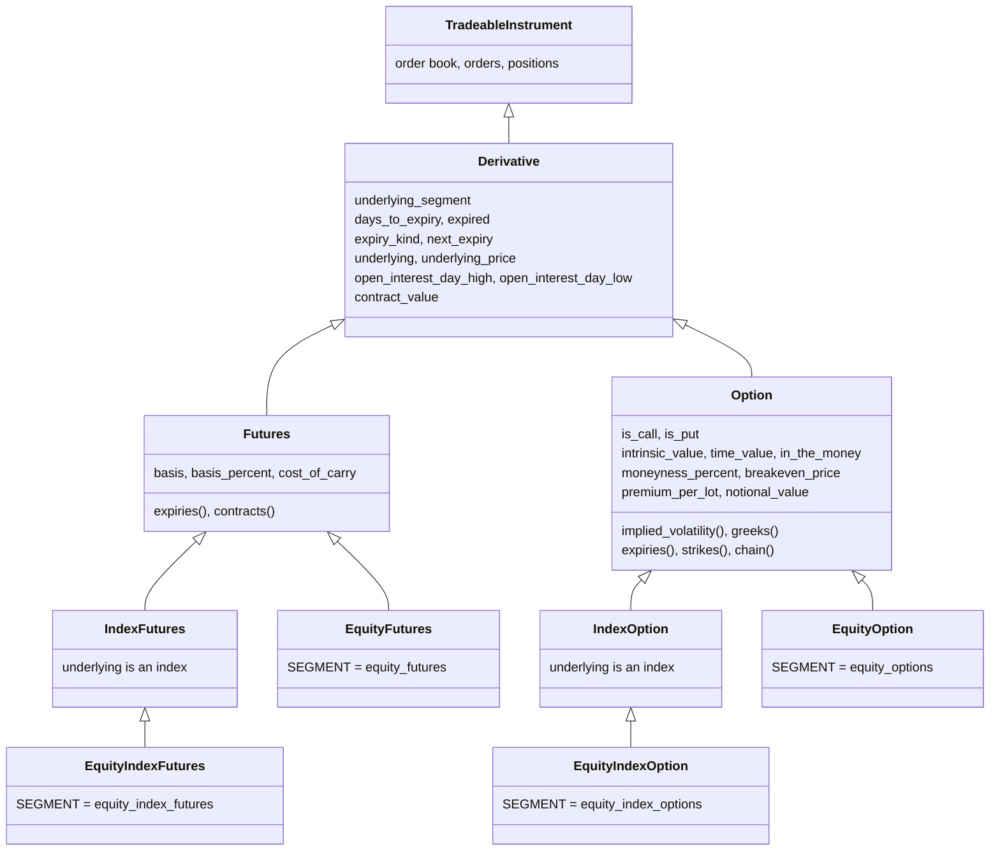

# Derivatives

A futures or option contract has things a share does not: a day it expires, an underlying it is written on, and a price that is partly the underlying's price and partly something else. The members on this page report those things. They live on five base classes in `tradingmachine.assets.instruments`, and every futures and option class, such as `EquityFutures` or `CommodityIndexOption`, inherits them, so they work on all sixteen derivative classes in the same way.

None of these members places an order. The table below lists them.

| Kind | Member | Description |
|---|---|---|
| attribute | [`underlying_segment`](#underlying_segment) | The segment of the instrument the contract is written on, such as `nse_equities`. |
| <span class="member property">property</span> | [`days_to_expiry`](#days_to_expiry) | The calendar days left until the contract expires. |
| <span class="member property">property</span> | [`expired`](#expired) | Whether the expiry date has passed. |
| <span class="member property">property</span> | [`expiry_kind`](#expiry_kind) | Whether the contract is the month's last expiry or a weekly one. |
| <span class="member property">property</span> | [`next_expiry`](#next_expiry) | The next expiry after this one, where a position rolls to. |
| <span class="member property">property</span> | [`underlying`](#underlying) | The underlying instrument: the one given when the contract was built, or one looked up by symbol. |
| <span class="member property">property</span> | [`underlying_price`](#underlying_price) | The underlying's last traded price. |
| <span class="member property">property</span> | [`open_interest_day_high`](#open_interest_day_high) | The highest open interest reached today. |
| <span class="member property">property</span> | [`open_interest_day_low`](#open_interest_day_low) | The lowest open interest reached today. |
| <span class="member property">property</span> | [`contract_value`](#contract_value) | What one lot is worth at the last price. |
| <span class="member property">property</span> | [`basis`](#basis) | How far a future's price is above its underlying's. Futures only. |
| <span class="member property">property</span> | [`basis_percent`](#basis_percent) | The basis as a percentage of the underlying's price. Futures only. |
| <span class="member property">property</span> | [`cost_of_carry`](#cost_of_carry) | The basis as a yearly rate. Futures only. |
| <span class="member property">property</span> | [`is_call`](#is_call) | Whether an option is a call. Options only. |
| <span class="member property">property</span> | [`is_put`](#is_put) | Whether an option is a put. Options only. |
| <span class="member property">property</span> | [`intrinsic_value`](#intrinsic_value) | What the option would be worth if exercised now. Options only. |
| <span class="member property">property</span> | [`time_value`](#time_value) | The part of the premium above the intrinsic value. Options only. |
| <span class="member property">property</span> | [`in_the_money`](#in_the_money) | Whether the option has intrinsic value. Options only. |
| <span class="member property">property</span> | [`moneyness_percent`](#moneyness_percent) | How far in or out of the money the option is, in per cent. Options only. |
| <span class="member property">property</span> | [`breakeven_price`](#breakeven_price) | The underlying price at which a buyer breaks even at expiry. Options only. |
| <span class="member property">property</span> | [`premium_per_lot`](#premium_per_lot) | What one lot costs to buy. Options only. |
| <span class="member property">property</span> | [`notional_value`](#notional_value) | What one lot controls at the strike price. Options only. |
| <span class="member method">method</span> | [`implied_volatility`](#implied_volatility) | The volatility the option's price implies. Options only. |
| <span class="member method">method</span> | [`greeks`](#greeks) | The option's fair price, delta, gamma, theta, vega and rho. Options only. |

The discovery class methods `expiries`, `contracts`, `strikes` and `chain` are defined on these base classes too, and are documented on [Finding instruments](discovery.md).

## The five base classes

The class diagram below shows where the base classes sit. `Derivative` holds what every contract shares, `Futures` and `Option` add what is particular to each, and `IndexFutures` and `IndexOption` narrow those two to contracts on an index. The family classes inherit the matching base, and each names its own segment in a `SEGMENT` class attribute, which is what the discovery class methods read.



The equity classes stand for all sixteen. The table below shows which base each kind of family class inherits.

| Family classes | Base |
|---|---|
| `EquityFutures`, `FixedIncomeFutures`, `CommodityFutures`, `CurrencyFutures` | `Futures` |
| `EquityOption`, `FixedIncomeOption`, `CommodityOption`, `CurrencyOption` | `Option` |
| `EquityIndexFutures`, `FixedIncomeIndexFutures`, `CommodityIndexFutures`, `CurrencyIndexFutures` | `IndexFutures` |
| `EquityIndexOption`, `FixedIncomeIndexOption`, `CommodityIndexOption`, `CurrencyIndexOption` | `IndexOption` |

You normally build a family class. The base classes can be built directly too, by `instrument_id` or by exchange, segment and identity fields, which is useful when you hold an id from an order or position row and do not know its family. Each checks what it was given and raises its own error if the contract is the wrong kind, as [Errors](errors.md#derivativeerror) lists.

## How a contract finds its underlying

Many of the members on this page need the underlying: its price for the basis, the moneyness and the greeks, and the object itself for `underlying`. A contract finds it in the order below, and the first way that applies wins.

| Order | Way | When it applies |
|---|---|---|
| 1 | The object you gave, as `underlying=` when building the contract | Always, when you gave one |
| 2 | UBI's `underlying_instrument_id` | When UBI's instrument details carry it, resolved from the brokers' own records |
| 3 | The family's default | Otherwise, as the next table shows |
| 4 | [`UnderlyingError`](errors.md#underlyingerror) | When the way chosen finds nothing |

The default differs by family, because UBI has prices for some underlyings and not others. A check of UBI's database on 2026-09-28 found that the underlying of an equity contract is almost always found by its name, that the underlying of a commodity or currency contract is a reference record with no price, and that 98.9 per cent of options have a future on the same underlying expiring on or after them.

| Contract | Default underlying | Priced with |
|---|---|---|
| Equity future or option, on a share or an index | The share or index with the same symbol | Black-Scholes |
| Option on a commodity, a currency pair or a bond | The future on the same underlying that expires first on or after the option | Black-76 |
| Future on a commodity, a currency pair or a bond | None, so the basis members raise `UnderlyingError` unless you give one | |

The future is taken on or after the option's expiry, not in the same month, because that is what an option settles into: an MCX GOLD option expiring on 30 October is priced off the December future, since the October one expired on 5 October. The example below finds a bond option's underlying with nothing given. Its output was captured from a local UBI at 18:50 IST on 2026-09-28.

=== "Python"

    ```python
    from tradingmachine.assets import fixed_income

    bond_call = fixed_income.FixedIncomeOption("nse", "633GS2035", "2026-10-29", 96.75, "CE")
    print(repr(bond_call.underlying))
    print(bond_call.underlying_price)
    print(bond_call.greeks()["model"], round(bond_call.implied_volatility(), 4))
    ```

=== "Output"

    ```text
    Futures(exchange='nse', segment='nse_fixed_income_futures', underlying_symbol='633GS2035', expiry_date='2026-10-29')
    96.83
    black_76 0.068
    ```

Two kinds of contract still find nothing. Until UBI carries its link, an index whose derivatives use a different name from the index, such as `NIFTYFPI`, whose index UBI stores as "Nifty FPI 150", raises `UnderlyingError`; give the index yourself. And the bse `USDINR-CNV` and `USDINR-STD` options have no future at all.

!!! warning "An option still needs a price of its own"
    The default underlying makes the pricing members work, but `implied_volatility` and `greeks` also need the option's own last price. Some contracts have none: on 2026-09-28 no broker that serves quotes carried the MCX GOLD options or any bse currency contract, and those raise [`ServiceUnavailableError`](errors.md#serviceunavailableerror).

## Every contract

The members in this section are on `Derivative`, so every futures and option class has them. The example below reads them from the nearest NIFTY future. Its output was captured from a local UBI at 17:30 IST on 2026-09-28, after the close.

=== "Python"

    ```python
    from tradingmachine.assets import equities

    future = equities.EquityIndexFutures("nse", "NIFTY", "2026-09-29")
    print(future.underlying_segment)
    print(future.days_to_expiry, future.expired)
    print(future.expiry_kind, future.next_expiry)
    print(repr(future.underlying))
    print(future.underlying_price)
    print(future.open_interest_day_high, future.open_interest_day_low)
    print(future.contract_value)
    ```

=== "Output"

    ```text
    nse_equity_indices
    1 False
    monthly 2026-10-27
    NonTradeableInstrument(exchange='nse', segment='nse_equity_indices', symbol='NIFTY')
    22780.25
    11670165 10349495
    1482968.5
    ```

### underlying_segment

<div class="endpoint" markdown>attribute `underlying_segment`</div>

This attribute is the exchange-prefixed segment of the underlying, such as `nse_equities` for a share future or `nse_equity_indices` for an index option. It is set when the contract is built and never changes. With an `underlying` given, it is that object's own segment, such as `mcx_commodity_futures` for an option given its future. Without one, it is worked out from the contract's own segment through a fixed table, because the rule is not a simple rename: `equity_futures` maps to `equities`, but `fixed_income_futures` maps to `fixed_income`.

It is a `str`.

### days_to_expiry

<div class="endpoint" markdown><span class="member property">property</span> `days_to_expiry`</div>

This property counts the calendar days from today until the expiry date, with today measured in India time. It sends no request.

#### Returns

An `int`. It is 0 on the day of expiry, and negative once the contract has expired.

#### Raises

Nothing.

### expired

<div class="endpoint" markdown><span class="member property">property</span> `expired`</div>

This property says whether the expiry date has passed. A contract expiring today is not expired, because it can still be traded until the market closes, which is the same rule the discovery class methods use to leave out dead contracts. It sends no request.

#### Returns

A `bool` that is `True` once the expiry date is in the past.

#### Raises

Nothing.

### expiry_kind

<div class="endpoint" markdown><span class="member property">property</span> `expiry_kind`<span class="route"><span class="method get">GET</span> `/api/instruments/master`</span></div>

This property says whether the contract is the last expiry of its month for its underlying, or one of the weekly expiries before it. It lists every expiry of the same underlying in the same segment, and calls the contract `monthly` when none of the later ones falls in the same calendar month. Quarterly and longer-dated contracts count as monthly, because each is the last of its month.

Each read downloads the segment's whole instrument list, which took about two and a half seconds for RELIANCE options on 2026-09-28 and a quarter of a second for NIFTY options.

#### Returns

The `str` `monthly` or `weekly`.

#### Raises

| Exception | When |
|---|---|
| [`BadRequestError`](errors.md#badrequesterror) | The exchange or segment is not one UBI knows |
| [`UnifiedBrokerInterfaceError`](errors.md#unifiedbrokerinterfaceerror) | Any other failure reported by, or on the way to, UBI |

### next_expiry

<div class="endpoint" markdown><span class="member property">property</span> `next_expiry`<span class="route"><span class="method get">GET</span> `/api/instruments/master`</span></div>

This property gives the first live expiry after this contract's, on the same underlying in the same segment, which is where a position is rolled to. It costs the same as `expiry_kind`.

#### Returns

A `datetime.date`, or `None` when this contract is the last one listed.

#### Raises

| Exception | When |
|---|---|
| [`BadRequestError`](errors.md#badrequesterror) | The exchange or segment is not one UBI knows |
| [`UnifiedBrokerInterfaceError`](errors.md#unifiedbrokerinterfaceerror) | Any other failure reported by, or on the way to, UBI |

### underlying

<div class="endpoint" markdown><span class="member property">property</span> `underlying`<span class="route"><span class="method get">GET</span> `/api/instruments/details`</span></div>

This property gives the instrument the contract is written on, found in the [order above](#how-a-contract-finds-its-underlying). What comes back depends on how it was found.

| How it was found | What `underlying` returns | Requests per read |
|---|---|---|
| You gave it, such as `EquityOption(..., underlying=reliance)` | That same object, of whatever class it is, such as `Equity` | None |
| UBI's link | A `TradeableInstrument`, or a `NonTradeableInstrument` for an index | One or two |
| An equity's default, by symbol | A `TradeableInstrument`, or a `NonTradeableInstrument` for an index | One |
| An option's default future | A `Futures` | Two |

Only a given object is kept; the others are looked up again on every read, so bind the result to a variable to use it more than once. Giving it is still worth doing when you have it: it costs nothing, it keeps its own class, so an `Equity` keeps its holdings members, and it cannot be defeated by a name mismatch.

=== "Python"

    ```python
    from tradingmachine.assets import equities

    reliance = equities.Equity("nse", "RELIANCE")
    call = equities.EquityOption("nse", "RELIANCE", "2026-10-27", 1200, "CE", underlying=reliance)
    print(repr(call.underlying))
    print(call.underlying is reliance)
    ```

=== "Output"

    ```text
    Equity(exchange='nse', segment='nse_equities', symbol='RELIANCE')
    True
    ```

#### Returns

The underlying, as an `Instrument`: the given object, or a `TradeableInstrument` or `NonTradeableInstrument` from the lookup.

#### Raises

| Exception | When |
|---|---|
| [`UnderlyingError`](errors.md#underlyingerror) | No underlying was given, UBI gives no link, and the family's default finds none |
| [`UnifiedBrokerInterfaceError`](errors.md#unifiedbrokerinterfaceerror) | Any other failure reported by, or on the way to, UBI |

### underlying_price

<div class="endpoint" markdown><span class="member property">property</span> `underlying_price`<span class="route"><span class="method get">GET</span> `/api/instruments/ltp`</span></div>

This property reads the last traded price of the instrument [`underlying`](#underlying) finds, as cheaply as that way allows: a given object's own `last_price`, one request by id for UBI's link, one request by exchange, segment and symbol for an equity's default, and the future's lookup and price for an option's default future. It is the cheap way to get the one figure most members on this page need, and on 2026-09-28 it equalled `underlying.last_price` exactly. See [Which contracts have an underlying price](#how-a-contract-finds-its-underlying) for the families where it raises.

#### Returns

A `float`, or `None` when UBI has no last price.

#### Raises

| Exception | When |
|---|---|
| [`UnderlyingError`](errors.md#underlyingerror) | The underlying cannot be found |
| [`ServiceUnavailableError`](errors.md#serviceunavailableerror) | UBI has no recent quote for the underlying |
| [`UnifiedBrokerInterfaceError`](errors.md#unifiedbrokerinterfaceerror) | Any other failure reported by, or on the way to, UBI |

### open_interest_day_high

<div class="endpoint" markdown><span class="member property">property</span> `open_interest_day_high`<span class="route"><span class="method get">GET</span> `/api/instruments/quote`</span></div>

This property gives the highest open interest the contract reached today, in underlying units. Read with [`open_interest`](market-data.md#open_interest) and the day's low, it shows whether positions were built up or unwound during the session.

#### Returns

An `int`, or `None` when the broker serving the quote does not report it.

#### Raises

| Exception | When |
|---|---|
| [`ServiceUnavailableError`](errors.md#serviceunavailableerror) | UBI has no recent quote and no broker could supply one |
| [`UnifiedBrokerInterfaceError`](errors.md#unifiedbrokerinterfaceerror) | Any other failure reported by, or on the way to, UBI |

### open_interest_day_low

<div class="endpoint" markdown><span class="member property">property</span> `open_interest_day_low`<span class="route"><span class="method get">GET</span> `/api/instruments/quote`</span></div>

This property gives the lowest open interest the contract reached today, in underlying units.

#### Returns

An `int`, or `None` when the broker serving the quote does not report it.

#### Raises

| Exception | When |
|---|---|
| [`ServiceUnavailableError`](errors.md#serviceunavailableerror) | UBI has no recent quote and no broker could supply one |
| [`UnifiedBrokerInterfaceError`](errors.md#unifiedbrokerinterfaceerror) | Any other failure reported by, or on the way to, UBI |

### contract_value

<div class="endpoint" markdown><span class="member property">property</span> `contract_value`<span class="route"><span class="method get">GET</span> `/api/instruments/ltp`</span></div>

This property gives the last price times the lot size. For a future that is the exposure one lot carries, and for an option it is the premium one lot costs. For currency contracts the lot size UBI reports is the plurality of the brokers' figures rather than the lot an order is measured against, so there the figure is approximate.

#### Returns

A `float` in rupees, or `None` when the last price or the lot size is unknown.

#### Raises

| Exception | When |
|---|---|
| [`ServiceUnavailableError`](errors.md#serviceunavailableerror) | UBI has no recent quote and no broker could supply one |
| [`UnifiedBrokerInterfaceError`](errors.md#unifiedbrokerinterfaceerror) | Any other failure reported by, or on the way to, UBI |

## Futures

The three members in this section are on `Futures`, so every futures class has them. Each reads the future's last price and the underlying's in two requests, which may be a moment apart. The example below reads them from the RELIANCE October future; its output was captured from a local UBI at 17:30 IST on 2026-09-28.

=== "Python"

    ```python
    from tradingmachine.assets import equities

    future = equities.EquityFutures("nse", "RELIANCE", "2026-10-27")
    print(future.last_price, future.underlying_price)
    print(round(future.basis, 2))
    print(round(future.basis_percent, 4))
    print(round(future.cost_of_carry, 2))
    ```

=== "Output"

    ```text
    1208.0 1197.6
    10.4
    0.8684
    10.93
    ```

### basis

<div class="endpoint" markdown><span class="member property">property</span> `basis`<span class="route"><span class="method get">GET</span> `/api/instruments/ltp` ×2</span></div>

This property gives the future's last price minus the underlying's. A positive basis, called a premium, is usual, because holding the future instead of the underlying saves the cost of financing it until expiry.

#### Returns

A `float` in the underlying's price units, or `None` when either last price is unknown.

#### Raises

| Exception | When |
|---|---|
| [`UnderlyingError`](errors.md#underlyingerror) | The underlying cannot be found |
| [`ServiceUnavailableError`](errors.md#serviceunavailableerror) | No broker that serves quotes carries the future or its underlying |
| [`UnifiedBrokerInterfaceError`](errors.md#unifiedbrokerinterfaceerror) | Any other failure reported by, or on the way to, UBI |

### basis_percent

<div class="endpoint" markdown><span class="member property">property</span> `basis_percent`<span class="route"><span class="method get">GET</span> `/api/instruments/ltp` ×2</span></div>

This property gives the basis as a percentage of the underlying's last price, so 0.87 means the future is 0.87 per cent above its underlying.

#### Returns

A `float` percentage, or `None` when either last price is unknown or the underlying's is zero.

#### Raises

The same as [`basis`](#basis).

### cost_of_carry

<div class="endpoint" markdown><span class="member property">property</span> `cost_of_carry`<span class="route"><span class="method get">GET</span> `/api/instruments/ltp` ×2</span></div>

This property gives the basis as a yearly rate: the basis percentage times 365, divided by the calendar days left. Compared with the risk-free rate, it says whether the future is dear or cheap. The RELIANCE October future above, 0.87 per cent over its underlying with 29 days to go, carries 10.93 per cent a year.

!!! note "Close to expiry the figure means little"
    Dividing by a small number of days magnifies small differences. On 2026-09-28, with one day left, the NIFTY September future's basis of 0.15 per cent read as 55.5 per cent a year, and RELIANCE's 0.28 per cent as 103.6 per cent.

#### Returns

A `float` annual percentage, or `None` when the contract expires today or has expired, or when either last price is unknown.

#### Raises

The same as [`basis`](#basis).

## Options

The members in this section are on `Option`, so every option class has them. The example below reads them from a NIFTY call; its output was captured from a local UBI at 17:30 IST on 2026-09-28. The call's strike of 22800 was the one nearest the index's close of 22780.25, so it was just out of the money.

=== "Python"

    ```python
    from tradingmachine.assets import equities

    option = equities.EquityIndexOption("nse", "NIFTY", "2026-10-06", 22800, "CE")
    print(option.is_call, option.is_put)
    print(option.last_price, option.underlying_price)
    print(option.intrinsic_value, option.time_value, option.in_the_money)
    print(round(option.moneyness_percent, 4))
    print(option.breakeven_price)
    print(option.premium_per_lot, option.notional_value)
    ```

=== "Output"

    ```text
    True False
    203.7 22780.25
    0.0 203.7 False
    -0.0867
    23003.7
    13240.5 1482000.0
    ```

### is_call

<div class="endpoint" markdown><span class="member property">property</span> `is_call`</div>

This property says whether the option is a call, the right to buy the underlying at the strike. It sends no request.

#### Returns

A `bool` that is `True` when `option_type` is `CE`.

#### Raises

Nothing.

### is_put

<div class="endpoint" markdown><span class="member property">property</span> `is_put`</div>

This property says whether the option is a put, the right to sell the underlying at the strike. It sends no request.

#### Returns

A `bool` that is `True` when `option_type` is `PE`.

#### Raises

Nothing.

### intrinsic_value

<div class="endpoint" markdown><span class="member property">property</span> `intrinsic_value`<span class="route"><span class="method get">GET</span> `/api/instruments/ltp`</span></div>

This property gives what the option would be worth if it were exercised now. For a call that is how far the underlying is above the strike, and for a put how far it is below, and it is never less than zero.

#### Returns

A `float` per unit of the underlying, or `None` when the underlying's last price is unknown.

#### Raises

| Exception | When |
|---|---|
| [`UnderlyingError`](errors.md#underlyingerror) | The underlying cannot be found |
| [`ServiceUnavailableError`](errors.md#serviceunavailableerror) | UBI has no recent quote for the underlying |
| [`UnifiedBrokerInterfaceError`](errors.md#unifiedbrokerinterfaceerror) | Any other failure reported by, or on the way to, UBI |

### time_value

<div class="endpoint" markdown><span class="member property">property</span> `time_value`<span class="route"><span class="method get">GET</span> `/api/instruments/ltp` ×2</span></div>

This property gives the option's last price minus its intrinsic value, which is what the time left until expiry is worth. An out-of-the-money option, like the call above, is all time value.

#### Returns

A `float` per unit of the underlying, or `None` when either last price is unknown.

#### Raises

The same as [`intrinsic_value`](#intrinsic_value), plus `ServiceUnavailableError` when the option itself has no quote.

### in_the_money

<div class="endpoint" markdown><span class="member property">property</span> `in_the_money`<span class="route"><span class="method get">GET</span> `/api/instruments/ltp`</span></div>

This property says whether the option has intrinsic value: a call whose strike is below the underlying, or a put whose strike is above it.

#### Returns

A `bool`, or `None` when the underlying's last price is unknown.

#### Raises

The same as [`intrinsic_value`](#intrinsic_value).

### moneyness_percent

<div class="endpoint" markdown><span class="member property">property</span> `moneyness_percent`<span class="route"><span class="method get">GET</span> `/api/instruments/ltp`</span></div>

This property gives how far the option is in or out of the money, as a percentage of the underlying's last price. The sign means the same for a call and a put: positive is in the money and negative is out of it. The call above, struck 19.75 points over an index at 22780.25, reads −0.0867.

#### Returns

A signed `float` percentage, or `None` when the underlying's last price is unknown or zero.

#### Raises

The same as [`intrinsic_value`](#intrinsic_value).

### breakeven_price

<div class="endpoint" markdown><span class="member property">property</span> `breakeven_price`<span class="route"><span class="method get">GET</span> `/api/instruments/ltp`</span></div>

This property gives the underlying price at expiry at which someone who bought the option at its last price neither gains nor loses: the strike plus the premium for a call, and the strike minus the premium for a put.

#### Returns

A `float`, or `None` when the option's last price is unknown.

#### Raises

| Exception | When |
|---|---|
| [`ServiceUnavailableError`](errors.md#serviceunavailableerror) | UBI has no recent quote for the option and no broker could supply one |
| [`UnifiedBrokerInterfaceError`](errors.md#unifiedbrokerinterfaceerror) | Any other failure reported by, or on the way to, UBI |

### premium_per_lot

<div class="endpoint" markdown><span class="member property">property</span> `premium_per_lot`<span class="route"><span class="method get">GET</span> `/api/instruments/ltp`</span></div>

This property gives what buying one lot of the option costs at its last price, which is the last price times the lot size. It is the same figure as [`contract_value`](#contract_value), under the name an option trader uses.

#### Returns

A `float` in rupees, or `None` when the last price or the lot size is unknown.

#### Raises

The same as [`breakeven_price`](#breakeven_price).

### notional_value

<div class="endpoint" markdown><span class="member property">property</span> `notional_value`</div>

This property gives the value of the underlying one lot controls at the strike price, which is the strike times the lot size. It sends no request.

#### Returns

A `float` in rupees, or `None` when the lot size is unknown.

#### Raises

Nothing.

## Implied volatility and greeks

The two methods in this section price the option with a model from `tradingmachine.assets.option_pricing`: Black-76 when the option is priced off a future, and Black-Scholes otherwise. UBI has no route for either, so the library works them out from the option's and the underlying's last prices, in the same way it works out the technical indicators from candles. The example below prices the same NIFTY call. Its output was captured from a local UBI at 18:50 IST on 2026-09-28, after the equity close, and the last line asks what the call would be worth at 18 per cent volatility.

=== "Python"

    ```python
    from tradingmachine.assets import equities

    option = equities.EquityIndexOption("nse", "NIFTY", "2026-10-06", 22800, "CE")
    print(round(option.implied_volatility(), 4))
    greeks = option.greeks()
    print(greeks["model"])
    for name in ["volatility", "price", "delta", "gamma", "theta", "vega", "rho"]:
        print(f"{name:10} {greeks[name]:.5f}")
    print(round(option.greeks(volatility=0.18)["price"], 2))
    ```

=== "Output"

    ```text
    0.1482
    black_scholes
    volatility 0.14818
    price      203.70000
    delta      0.51412
    gamma      0.00080
    theta      -14.61175
    vega       13.32858
    rho        2.47843
    246.12
    ```

The table below lists the conventions the two methods follow. Each is a choice worth knowing before comparing these figures with a broker's option chain.

| Convention | Value |
|---|---|
| Model | Black-76 on the future's price when the option is priced off a future, which is the default for options on commodities, currencies and bonds and the case whenever the underlying you give is a future; Black-Scholes on the spot price otherwise. Both treat the option as European, with no dividends. `greeks()` names the model it used under `model`. |
| Time to expiry | From now until 15:30 India time on the expiry date, over a 365-day year |
| Risk-free rate | 0.065 by default, an approximation of India's 91-day treasury bill yield; pass your own |
| Theta | Per calendar day |
| Vega | Per one percentage point of volatility |
| Rho | Per one percentage point of the rate |

!!! note "Why two models"
    A future's price already includes the cost of holding the underlying until expiry. Black-Scholes, given a future's price, adds that cost again; Black-76 takes the forward price as it is and only discounts, and it is the model UBI's order engine uses, so the two agree whenever an option is priced off a future. Under Black-76, delta and gamma are measured against the future's price, and rho holds that price still, so it is small and negative for calls and puts alike.

!!! note "After 15:30 on expiry day"
    From 15:30 India time on the expiry date both methods return `None`, because there is no time left to price, while `expired` stays `False` until the next day. MCX commodity options trade into the evening, so 15:30 is only an approximation for them.

### implied_volatility

<div class="endpoint" markdown><span class="member method">method</span> `implied_volatility(risk_free_rate=0.065, underlying_price=None)`<span class="route"><span class="method get">GET</span> `/api/instruments/ltp` ×2</span></div>

This method finds the volatility at which the model's price equals the option's last price. The underlying's price is read from UBI unless you give one; a figure you give is taken as the same kind of price, spot or future, as the underlying it stands in for, which is how to ask what the volatility would be at another underlying price. The option still needs a last price of its own.

On 2026-09-28 the MCX CRUDEOIL 9100 call for 2026-10-15, with no underlying given, found the future expiring on 2026-10-19 and gave an implied volatility of 0.6092 under Black-76.

#### Parameters

| Name | Type | Required | Default | Description |
|---|---|---|---|---|
| `risk_free_rate` | `float` | No | `0.065` | The annual risk-free rate, continuously compounded |
| `underlying_price` | `float` or `None` | No | `None` | The underlying price to use, or `None` to read it from UBI |

#### Returns

A `float` annual volatility, such as 0.1475 for 14.75 per cent. It is `None` when either price is unknown, when the option is at or past 15:30 on its expiry date, or when the premium is below the option's discounted intrinsic value, where no volatility can explain it.

#### Raises

| Exception | When |
|---|---|
| `ValueError` | `underlying_price` is given and is not above zero |
| [`UnderlyingError`](errors.md#underlyingerror) | The underlying cannot be found |
| [`ServiceUnavailableError`](errors.md#serviceunavailableerror) | No broker that serves quotes carries the option, or the underlying when no price is given |
| [`UnifiedBrokerInterfaceError`](errors.md#unifiedbrokerinterfaceerror) | Any other failure reported by, or on the way to, UBI |

### greeks

<div class="endpoint" markdown><span class="member method">method</span> `greeks(risk_free_rate=0.065, volatility=None, underlying_price=None)`<span class="route"><span class="method get">GET</span> `/api/instruments/ltp` ×2</span></div>

This method works out the option's fair price and its five greeks. Without a volatility it uses the implied volatility, so the fair price equals the last price and the greeks describe the option as the market prices it. With a volatility it answers "what if", as the last line of the example does.

The table below says what each greek measures.

| Key | Measures |
|---|---|
| `volatility` | The volatility the figures were worked out at |
| `price` | The model's fair price |
| `delta` | How much the option's price moves for a one-unit move in the underlying, from 0 to 1 for a call and from −1 to 0 for a put |
| `gamma` | How much the delta moves for a one-unit move in the underlying |
| `theta` | How much the option's price changes as one calendar day passes, usually negative |
| `vega` | How much the option's price moves when volatility rises by one percentage point |
| `rho` | How much the option's price moves when the rate rises by one percentage point |

#### Parameters

| Name | Type | Required | Default | Description |
|---|---|---|---|---|
| `risk_free_rate` | `float` | No | `0.065` | The annual risk-free rate, continuously compounded |
| `volatility` | `float` or `None` | No | `None` | The annual volatility to use, or `None` for the implied volatility |
| `underlying_price` | `float` or `None` | No | `None` | The underlying price to use, or `None` to read it from UBI |

#### Returns

A `dict` with `model`, the `str` `black_76` or `black_scholes`, and the seven keys above, each a `float`, or `None` when a price needed is unknown, when the option is at or past 15:30 on its expiry date, or when no implied volatility can be found.

#### Raises

| Exception | When |
|---|---|
| `ValueError` | `underlying_price` or `volatility` is given and is not above zero |
| [`UnderlyingError`](errors.md#underlyingerror) | The underlying cannot be found |
| [`ServiceUnavailableError`](errors.md#serviceunavailableerror) | No broker that serves quotes carries the option, or the underlying when no price is given |
| [`UnifiedBrokerInterfaceError`](errors.md#unifiedbrokerinterfaceerror) | Any other failure reported by, or on the way to, UBI |

??? note "Under the hood"
    `underlying_price` sends `GET /api/instruments/ltp` with `exchange`, `segment` set to `underlying_segment` and `symbol` set to `underlying_symbol`, which UBI's [quote routes](https://pramodathani.github.io/unified_broker_interface/rest-api/market-quotes/) accept in place of an `instrument_id`. `expiry_kind` and `next_expiry` read the same master list the [discovery calls](discovery.md#why-two-different-ubi-routes) read. `BlackScholes` in `tradingmachine.assets.option_pricing` does the maths using only Python's `math` module, and its implied volatility search halves the range from 0.0001 to 5.0 a hundred times, the same bounds UBI's own search uses.
