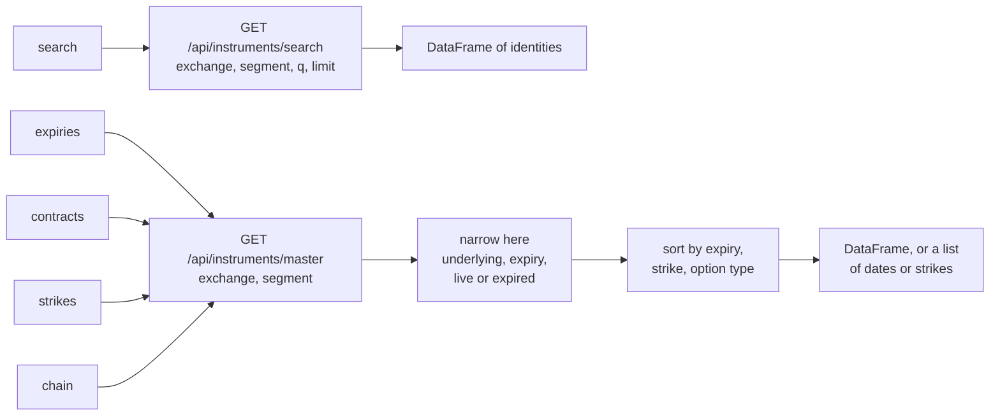

# Finding instruments

These class methods find instruments you do not already know by name: a share from part of its symbol, the expiries a futures or option underlying has, the strikes listed for one expiry, and a whole option chain. They are called on the class rather than on an object, because they run before you have an instrument to hold, and each class fills in its own segment so you never type one.

The table below lists the four kinds of call. Every one of them reads UBI's instrument list and nothing else, so none of them can place an order.

| Kind | Member | Description |
|---|---|---|
| <span class="member function">classmethod</span> | [`search`](#search) | Securities or indices whose symbol contains a term, as a DataFrame of identities |
| <span class="member function">classmethod</span> | [`expiries`](#expiries) | The live expiry dates of one underlying's futures or options, as a list of dates |
| <span class="member function">classmethod</span> | [`contracts`](#contracts) | The futures contracts in the segment, optionally for one underlying, as a DataFrame |
| <span class="member function">classmethod</span> | [`strikes`](#strikes) | The strike prices listed for one underlying and one expiry, as a list of floats |
| <span class="member function">classmethod</span> | [`chain`](#chain) | Every option for one underlying and one expiry, as a DataFrame |

Which class has which call depends on the class's shape. The table below shows the split across all twenty-seven classes.

| Classes | `search` | `expiries` | `contracts` | `strikes` | `chain` |
|---|:---:|:---:|:---:|:---:|:---:|
| `Equity`, `EquityIndex`, `FixedIncome`, `FixedIncomeIndex`, `Commodity`, `CommodityIndex`, `Currency`, `CurrencyIndex`, `ExchangeTradedFund`, `InvestmentTrust`, `MutualFund` | :material-check: | | | | |
| `EquityFutures`, `EquityIndexFutures`, `FixedIncomeFutures`, `FixedIncomeIndexFutures`, `CommodityFutures`, `CommodityIndexFutures`, `CurrencyFutures`, `CurrencyIndexFutures` | | :material-check: | :material-check: | | |
| `EquityOption`, `EquityIndexOption`, `FixedIncomeOption`, `FixedIncomeIndexOption`, `CommodityOption`, `CommodityIndexOption`, `CurrencyOption`, `CurrencyIndexOption` | | :material-check: | | :material-check: | :material-check: |

The strings these calls accept are exchanges such as `nse` and `mcx`, and dates as `datetime.date` or `YYYY-MM-DD`; [Vocabulary](vocabulary.md) lists them all.

## Why two different UBI routes

UBI offers two ways to list instruments, and they suit different jobs. Its search route ranks names well but returns at most 200 rows, sorted by expiry with the oldest first, and has no way to ask for the next page. Its master route returns a whole segment with no limit but takes no filters.

For a share or an index that difference does not matter, because there is one row per name. For a derivative it decides everything. A search for NIFTY index options on 2026-09-20 with the maximum limit of 200 returned 200 rows that all shared one expiry, 2026-08-25, which had passed four weeks earlier; every live contract sat behind thousands of dead ones and could never be reached. So the library uses search only for names, and fetches the master list and narrows it itself for contracts.

The flowchart below shows which route each call uses, and what the library does to the answer.



The master list is fast because UBI is on the same machine and streams it. The table below shows the sizes and times measured on 2026-09-20.

| Segment | Rows | Time to fetch |
|---|---|---|
| `nse_equity_index_futures` | 23 | 0.0 s |
| `nse_equity_index_options` | 14,826 | 0.2 s |
| `nse_equity_options` | 125,967 | 1.3 s |

!!! note "Every call fetches the list again"
    Nothing is cached, so asking for `expiries` and then a `chain` downloads the segment twice. For single-stock options that is about two seconds a call. A stale expiry list would be a worse failure than a slow one, which is why the library does not keep the list between calls.

## Rows, not objects

`search`, `contracts` and `chain` return a pandas DataFrame of identities rather than instrument objects. Building an object sends one lookup to UBI, so returning a 538-contract NIFTY chain as objects would mean 538 requests, where returning rows means none. Build the two or three contracts you actually want from their rows.

The table below lists the columns every identity DataFrame has. A row carries no `lot_size`, `tick_size` or `carried_by`; those arrive only when you build the object.

| Column | Type | Description |
|---|---|---|
| `instrument_id` | `str` | UBI's UUID for the instrument |
| `exchange` | `str` | The exchange, lower case |
| `segment` | `str` | The exchange-prefixed segment |
| `shape` | `str` | `security`, `future` or `option` |
| `symbol` | `str` or `None` | The symbol of a security, `None` for a contract |
| `underlying_symbol` | `str` or `None` | The underlying of a contract, `None` for a security |
| `expiry_date` | `datetime.date` or `None` | The expiry, converted from UBI's text into a real date |
| `strike_price` | `float` or `None` | The strike of an option |
| `option_type` | `str` or `None` | `CE` or `PE` for an option |

## search

<div class="endpoint" markdown><span class="member function">classmethod</span> `search(exchange, term, limit=50, unified_broker_interface=None)`<span class="route"><span class="method get">GET</span> `/api/instruments/search`</span></div>

This class method finds instruments in the class's own segment whose symbol contains a term, matched without regard to case. UBI puts an exact match first, then symbols that start with the term, then symbols that contain it anywhere, so a partial name such as `RELI` finds RELIANCE near the top. It is on the eleven classes named by exchange and symbol.

#### Parameters

| Name | Type | Required | Default | Description |
|---|---|---|---|---|
| `exchange` | `str` | Yes | | The exchange to search, such as `nse` |
| `term` | `str` | Yes | | The text the symbol must contain |
| `limit` | `int` | No | `50` | The most rows to return. UBI caps it at 200. |
| `unified_broker_interface` | `UnifiedBrokerInterface` or `None` | No | `None` | The client, or `None` for the shared one |

#### Example

The output below was captured from a local UBI on 2026-09-26. Both calls passed `limit=5`, and the share search found only four matches.

=== "Python"

    ```python
    from tradingmachine.assets import equities

    shares = equities.Equity.search("nse", "RELI", limit=5)
    print(shares.to_string())

    indices = equities.EquityIndex.search("nse", "NIFTY", limit=5)
    print(indices.to_string())
    ```

=== "Output"

    ```text
      exchange expiry_date                         instrument_id option_type       segment     shape strike_price    symbol underlying_symbol
    0      nse        None  a063ac67-1b07-5632-9cc5-4ad1b564a50d        None  nse_equities  security         None  RELIABLE              None
    1      nse        None  3f92570a-9924-5bf5-9f9d-e006cd9f4202        None  nse_equities  security         None  RELIANCE              None
    2      nse        None  e8af359c-57c2-5fb3-b425-e421e487de3f        None  nse_equities  security         None  RELIGARE              None
    3      nse        None  343a2c89-5bdf-551c-b409-943dc687fc58        None  nse_equities  security         None  RELINFRA              None
      exchange expiry_date                         instrument_id option_type             segment     shape strike_price          symbol underlying_symbol
    0      nse        None  dba60324-760b-53cc-aeae-a4bb4defd1bc        None  nse_equity_indices  security         None           NIFTY              None
    1      nse        None  e7c51261-0da7-5d34-a06d-061555b29f34        None  nse_equity_indices  security         None       NIFTY 100              None
    2      nse        None  2973b7d0-71ad-5fff-9a76-61fa8b76ac15        None  nse_equity_indices  security         None       NIFTY 200              None
    3      nse        None  fcffdd52-23c3-53ba-8035-f34ab407a7ab        None  nse_equity_indices  security         None       NIFTY 500              None
    4      nse        None  66d42d85-1805-5259-b2af-10132873f608        None  nse_equity_indices  security         None  NIFTY ALPHA 50              None
    ```

#### Returns

A pandas DataFrame of identities, with the [columns above](#rows-not-objects), or `None` when nothing matches. The columns arrive in the order UBI sends them, which is alphabetical, as the output shows.

#### Raises

| Exception | When |
|---|---|
| [`BadRequestError`](errors.md#badrequesterror) | The exchange is not one UBI knows |
| [`UnifiedBrokerInterfaceError`](errors.md#unifiedbrokerinterfaceerror) | Any other failure reported by, or on the way to, UBI |

## expiries

<div class="endpoint" markdown><span class="member function">classmethod</span> `expiries(exchange, underlying_symbol, include_expired=False, unified_broker_interface=None)`<span class="route"><span class="method get">GET</span> `/api/instruments/master`</span></div>

This class method lists the expiry dates one underlying has contracts for in the class's segment, soonest first. A contract that expires today counts as live, because it can still be traded until the close, and "today" is measured in India time. It is on all sixteen futures and option classes.

#### Parameters

| Name | Type | Required | Default | Description |
|---|---|---|---|---|
| `exchange` | `str` | Yes | | The exchange, such as `nse` or `mcx` |
| `underlying_symbol` | `str` | Yes | | The underlying, such as `NIFTY`, `RELIANCE` or `GOLD`. It is upper-cased before comparing. |
| `include_expired` | `bool` | No | `False` | `True` to include expiries that have already passed |
| `unified_broker_interface` | `UnifiedBrokerInterface` or `None` | No | `None` | The client, or `None` for the shared one |

#### Example

The output below was captured from a local UBI on 2026-09-26, for NIFTY index options, RELIANCE share futures and MCX gold futures.

=== "Python"

    ```python
    from tradingmachine.assets import commodities, equities

    print(equities.EquityIndexOption.expiries("nse", "NIFTY"))
    print(equities.EquityFutures.expiries("nse", "RELIANCE"))
    print(commodities.CommodityFutures.expiries("mcx", "GOLD"))
    ```

=== "Output"

    ```text
    [datetime.date(2026, 9, 29), datetime.date(2026, 10, 6), datetime.date(2026, 10, 13), datetime.date(2026, 10, 19), datetime.date(2026, 10, 27), datetime.date(2026, 11, 3), datetime.date(2026, 11, 23), datetime.date(2026, 12, 29), datetime.date(2027, 3, 30), datetime.date(2027, 6, 29), datetime.date(2027, 12, 28), datetime.date(2028, 6, 27), datetime.date(2028, 12, 26), datetime.date(2029, 6, 26), datetime.date(2029, 12, 24), datetime.date(2030, 6, 25), datetime.date(2030, 12, 31), datetime.date(2031, 6, 24)]
    [datetime.date(2026, 9, 29), datetime.date(2026, 10, 27), datetime.date(2026, 11, 23)]
    [datetime.date(2026, 10, 5), datetime.date(2026, 12, 4), datetime.date(2027, 2, 5), datetime.date(2027, 4, 5), datetime.date(2027, 6, 4), datetime.date(2027, 8, 5)]
    ```

The chart below places the eighteen captured NIFTY option expiries on a calendar. The weekly expiries crowd the first two months, and the long-dated ones run out to June 2031.

```vegalite
{
  "$schema": "https://vega.github.io/schema/vega-lite/v5.json",
  "description": "The eighteen live NIFTY index option expiries captured from a local UBI on 2026-09-26.",
  "width": "container",
  "height": 90,
  "data": {
    "values": [
      {"expiry": "2026-09-29"}, {"expiry": "2026-10-06"}, {"expiry": "2026-10-13"},
      {"expiry": "2026-10-19"}, {"expiry": "2026-10-27"}, {"expiry": "2026-11-03"},
      {"expiry": "2026-11-23"}, {"expiry": "2026-12-29"}, {"expiry": "2027-03-30"},
      {"expiry": "2027-06-29"}, {"expiry": "2027-12-28"}, {"expiry": "2028-06-27"},
      {"expiry": "2028-12-26"}, {"expiry": "2029-06-26"}, {"expiry": "2029-12-24"},
      {"expiry": "2030-06-25"}, {"expiry": "2030-12-31"}, {"expiry": "2031-06-24"}
    ]
  },
  "mark": {"type": "tick", "thickness": 3, "size": 40, "color": "#ff5722"},
  "encoding": {
    "x": {"field": "expiry", "type": "temporal", "title": "Expiry date"},
    "tooltip": [
      {"field": "expiry", "type": "temporal", "title": "Expiry", "format": "%Y-%m-%d"}
    ]
  }
}
```

#### Returns

A `list` of `datetime.date`, soonest first, which is empty when nothing is listed on the underlying.

#### Raises

| Exception | When |
|---|---|
| [`BadRequestError`](errors.md#badrequesterror) | The exchange is not one UBI knows |
| [`UnifiedBrokerInterfaceError`](errors.md#unifiedbrokerinterfaceerror) | Any other failure reported by, or on the way to, UBI |

## contracts

<div class="endpoint" markdown><span class="member function">classmethod</span> `contracts(exchange, underlying_symbol=None, include_expired=False, unified_broker_interface=None)`<span class="route"><span class="method get">GET</span> `/api/instruments/master`</span></div>

This class method lists the futures contracts in the class's segment, for one underlying or for every underlying when `underlying_symbol` is left out. It is on the eight futures classes, and it is the futures counterpart of `chain`.

#### Parameters

| Name | Type | Required | Default | Description |
|---|---|---|---|---|
| `exchange` | `str` | Yes | | The exchange, such as `nse` |
| `underlying_symbol` | `str` or `None` | No | `None` | The underlying to keep, or `None` for every underlying in the segment |
| `include_expired` | `bool` | No | `False` | `True` to include contracts whose expiry has passed |
| `unified_broker_interface` | `UnifiedBrokerInterface` or `None` | No | `None` | The client, or `None` for the shared one |

#### Example

No output was captured for this call. A check recorded in the project's notes on 2026-09-20 found that `EquityIndexFutures.contracts("nse", "NIFTY")` returned the three live quarterly contracts.

=== "Python"

    ```python
    from tradingmachine.assets import equities

    nifty_futures = equities.EquityIndexFutures.contracts("nse", "NIFTY")
    nearest = nifty_futures.iloc[0]
    contract = equities.EquityIndexFutures(
        nearest["exchange"],
        nearest["underlying_symbol"],
        nearest["expiry_date"],
    )
    ```

#### Returns

A pandas DataFrame of identities with the [columns above](#rows-not-objects), sorted by expiry, or `None` when nothing matches.

#### Raises

| Exception | When |
|---|---|
| [`BadRequestError`](errors.md#badrequesterror) | The exchange is not one UBI knows |
| [`UnifiedBrokerInterfaceError`](errors.md#unifiedbrokerinterfaceerror) | Any other failure reported by, or on the way to, UBI |

## strikes

<div class="endpoint" markdown><span class="member function">classmethod</span> `strikes(exchange, underlying_symbol, expiry_date, include_expired=False, unified_broker_interface=None)`<span class="route"><span class="method get">GET</span> `/api/instruments/master`</span></div>

This class method lists the strike prices listed for one underlying and one expiry, lowest first, with each strike appearing once even though it has a call and a put. It builds the [`chain`](#chain) and takes its distinct strikes, so it costs the same as a chain. It is on the eight option classes.

#### Parameters

| Name | Type | Required | Default | Description |
|---|---|---|---|---|
| `exchange` | `str` | Yes | | The exchange, such as `nse` |
| `underlying_symbol` | `str` | Yes | | The underlying, such as `NIFTY` |
| `expiry_date` | `datetime.date` or `str` | Yes | | The expiry, usually one returned by [`expiries`](#expiries) |
| `include_expired` | `bool` | No | `False` | `True` to allow an expiry that has already passed |
| `unified_broker_interface` | `UnifiedBrokerInterface` or `None` | No | `None` | The client, or `None` for the shared one |

#### Example

The output below was captured from a local UBI on 2026-09-26 for the first NIFTY expiry, 2026-09-29. The call returned 269 strikes from 1500.0 to 49500.0; the output shows the first twelve and the last three, and the rest are elided. The middle of the list runs in steps of 50 from 17800.0 to 30000.0, and the ends run in steps of 1500.

=== "Python"

    ```python
    expiries = equities.EquityIndexOption.expiries("nse", "NIFTY")
    strikes = equities.EquityIndexOption.strikes("nse", "NIFTY", expiries[0])
    print(len(strikes))
    print(strikes)
    ```

=== "Output"

    ```text
    269
    [1500.0, 3000.0, 4500.0, 6000.0, 7500.0, 9000.0, 10500.0, 12000.0, 13500.0, 15000.0, 16500.0, 17800.0, ..., 46500.0, 48000.0, 49500.0]
    ```

#### Returns

A `list` of `float` strike prices in rupees, lowest first, which is empty when nothing is listed for that expiry.

#### Raises

| Exception | When |
|---|---|
| [`BadRequestError`](errors.md#badrequesterror) | The exchange is not one UBI knows |
| `ValueError` | `expiry_date` is a string that is not a valid ISO date |
| [`UnifiedBrokerInterfaceError`](errors.md#unifiedbrokerinterfaceerror) | Any other failure reported by, or on the way to, UBI |

## chain

<div class="endpoint" markdown><span class="member function">classmethod</span> `chain(exchange, underlying_symbol, expiry_date, include_expired=False, unified_broker_interface=None)`<span class="route"><span class="method get">GET</span> `/api/instruments/master`</span></div>

This class method lists every option for one underlying and one expiry, a call and a put at each strike, sorted by strike and then by option type. It is on the eight option classes, and it is the usual starting point for building an option object, because each row carries the exact identity values the constructor needs.

#### Parameters

| Name | Type | Required | Default | Description |
|---|---|---|---|---|
| `exchange` | `str` | Yes | | The exchange, such as `nse` |
| `underlying_symbol` | `str` | Yes | | The underlying, such as `NIFTY` |
| `expiry_date` | `datetime.date` or `str` | Yes | | The expiry |
| `include_expired` | `bool` | No | `False` | `True` to allow an expiry that has already passed |
| `unified_broker_interface` | `UnifiedBrokerInterface` or `None` | No | `None` | The client, or `None` for the shared one |

#### Example

The output below was captured from a local UBI on 2026-09-26 for NIFTY's 2026-09-29 expiry. The chain had 538 rows, which is 269 strikes with a call and a put each; only the first five were printed.

=== "Python"

    ```python
    chain = equities.EquityIndexOption.chain("nse", "NIFTY", expiries[0])
    print(chain.shape)
    print(chain.head(5).to_string())
    ```

=== "Output"

    ```text
    (538, 9)
                              instrument_id exchange                   segment   shape symbol underlying_symbol expiry_date  strike_price option_type
    0  1c39032e-270b-51e0-aa0b-fa0e1072928d      nse  nse_equity_index_options  option   None             NIFTY  2026-09-29        1500.0          CE
    1  f44aa598-4ad7-54bb-b93d-d1dfc3426a45      nse  nse_equity_index_options  option   None             NIFTY  2026-09-29        1500.0          PE
    2  29f59c8a-8a7b-5acf-a019-17521f4c44f7      nse  nse_equity_index_options  option   None             NIFTY  2026-09-29        3000.0          CE
    3  01725b1b-6e9e-551a-9eb2-abeddaaf5e3a      nse  nse_equity_index_options  option   None             NIFTY  2026-09-29        3000.0          PE
    4  b987116e-93b3-54df-af89-68a725d35d10      nse  nse_equity_index_options  option   None             NIFTY  2026-09-29        4500.0          CE
    ```

The dtypes in the same capture were `str` for `instrument_id`, `exchange`, `segment`, `shape`, `underlying_symbol` and `option_type`, `object` for `symbol` and `expiry_date`, and `float64` for `strike_price`.

#### Returns

A pandas DataFrame of identities with the [columns above](#rows-not-objects), or `None` when nothing matches.

#### Raises

| Exception | When |
|---|---|
| [`BadRequestError`](errors.md#badrequesterror) | The exchange is not one UBI knows |
| `ValueError` | `expiry_date` is a string that is not a valid ISO date |
| [`UnifiedBrokerInterfaceError`](errors.md#unifiedbrokerinterfaceerror) | Any other failure reported by, or on the way to, UBI |

## include_expired

Every call except `search` takes `include_expired`, and it defaults to `False`, because the first row of an unfiltered list is almost always a dead contract. With `True`, contracts whose expiry has passed are kept, which is useful for looking back at a contract you once held. The check on 2026-09-20 showed the difference for RELIANCE share futures, and the table below reproduces it.

| Call | Expiries returned |
|---|---|
| `EquityFutures.expiries("nse", "RELIANCE")` | 2026-09-29, 2026-10-27, 2026-11-23 |
| `EquityFutures.expiries("nse", "RELIANCE", include_expired=True)` | 2026-08-25, 2026-09-29, 2026-10-27, 2026-11-23 |

UBI keeps only the instruments it has mapped, so how far back an expired list reaches depends on how long UBI has been running, not on this library.

## From a row to an object

A discovery row is only an identity. To quote or trade it, pass its identity fields to the class's constructor, which looks it up once and returns the full object. The example below does this for the nearest MCX gold future; its output was captured from a local UBI on 2026-09-26.

=== "Python"

    ```python
    from tradingmachine.assets import commodities

    expiries = commodities.CommodityFutures.expiries("mcx", "GOLD")
    gold = commodities.CommodityFutures("mcx", "GOLD", expiries[0])
    print(repr(gold))
    print((gold.lot_size, gold.tick_size))
    print(gold.last_price)
    ```

=== "Output"

    ```text
    CommodityFutures(exchange='mcx', segment='mcx_commodity_futures', underlying_symbol='GOLD', expiry_date='2026-10-05')
    (100, Decimal('1'))
    150734.0
    ```

For an option, take the row from `chain` and pass its `exchange`, `underlying_symbol`, `expiry_date`, `strike_price` and `option_type` to the option class. [Instruments](instruments.md#named-by-underlying-expiry-strike-and-option-type) records the check that proved a row and a constructed object always share the same `instrument_id`.

??? note "Under the hood"
    `search` sends `exchange`, `segment`, `q` and `limit` to [Search](https://pramodathani.github.io/unified_broker_interface/rest-api/instruments/#search). The other four send `exchange` and `segment` to [Master](https://pramodathani.github.io/unified_broker_interface/rest-api/instruments/#master), then keep the rows whose `underlying_symbol` equals the upper-cased underlying, whose expiry matches when one was given, and whose expiry is today or later in India time unless `include_expired` is `True`. The mechanism lives in protected class methods on `Instrument`, and each named class supplies its own segment.
