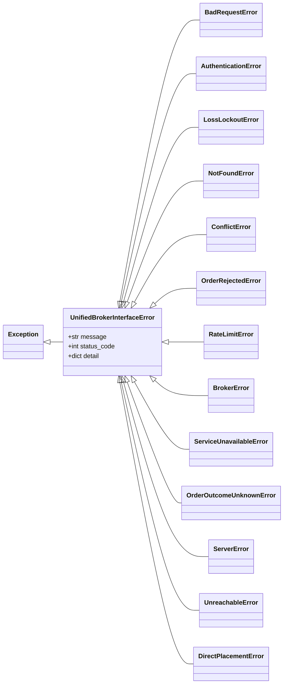
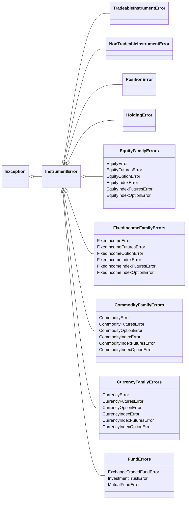
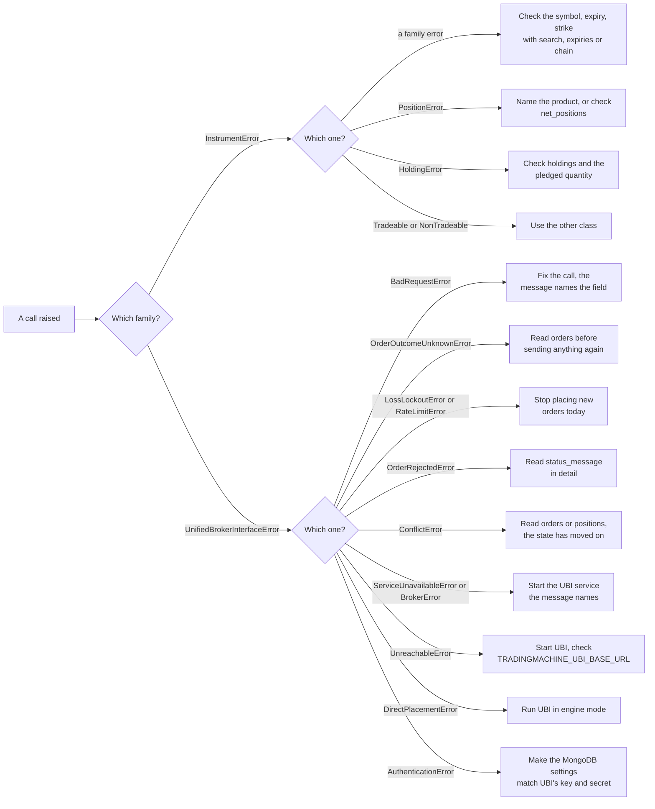

# Errors

The library raises two separate families of exception, and it helps to know which is which before catching anything. Errors about the request to UBI, such as a refused token, a rejected order or a UBI that cannot be reached, come from `tradingmachine.unified_broker_interface.exceptions` and are chosen by the HTTP status code UBI answered with. Errors about an instrument itself, such as an unknown symbol, an index used as something tradeable, or a position that cannot be changed as asked, come from `tradingmachine.assets.exceptions`.

The two families do not share a base class, so `except UnifiedBrokerInterfaceError` never catches an `EquityError`, and the other way round. Where one causes the other, the instrument error is raised `from` the UBI error, so the original stays in the traceback as `__cause__`.

The table below lists every class on this page.

| Kind | Member | Description |
|---|---|---|
| <span class="member class">class</span> | [`UnifiedBrokerInterfaceError`](#unifiedbrokerinterfaceerror) | The base of every failure reported by, or on the way to, UBI |
| <span class="member class">class</span> | [Twelve status classes](#the-ubi-client-errors) | One per HTTP status UBI returns, plus a catch-all and one for no answer at all |
| <span class="member class">class</span> | [`DirectPlacementError`](#directplacementerror) | UBI would ignore an order's reference or synthetic object |
| <span class="member class">class</span> | [`InstrumentError`](#instrumenterror) | The base of every problem with an instrument |
| <span class="member class">class</span> | [Four behaviour errors](#the-instrument-errors) | Tradeable, non-tradeable, position and holding |
| <span class="member class">class</span> | [Twenty-seven family errors](#the-family-errors) | One per named instrument class, raised when UBI has no such instrument |

## The two hierarchies

The class diagram below shows the UBI client errors. Every one of them is a direct subclass of `UnifiedBrokerInterfaceError`, which is itself a plain `Exception`.



The class diagram below shows the instrument errors. They are all direct subclasses of `InstrumentError`, which is also a plain `Exception`; the twenty-seven family errors are grouped by family here to keep the diagram readable, and each is listed by name further down.



The five grouping boxes in that diagram are not classes; each family error inherits from `InstrumentError` directly.

## Which status becomes which exception

UBI reports a failure as an HTTP status and a JSON body, with no error-type field, so the client chooses the class from the status code alone. The table below is that mapping, which lives in `EXCEPTION_FOR_STATUS_CODE`.

| Status | Exception | What UBI means by it |
|---|---|---|
| <span class="status s4">400</span> | [`BadRequestError`](#badrequesterror) | A parameter is missing or invalid, and the message names it |
| <span class="status s4">401</span> | [`AuthenticationError`](#authenticationerror) | The key or secret is wrong, or the token is missing, invalid or expired |
| <span class="status s4">403</span> | [`LossLockoutError`](#losslockouterror) | The day's loss is past UBI's daily loss limit |
| <span class="status s4">404</span> | [`NotFoundError`](#notfounderror) | The instrument, profile or order does not exist |
| <span class="status s4">409</span> | [`ConflictError`](#conflicterror) | The request conflicts with the account's state |
| <span class="status s4">422</span> | [`OrderRejectedError`](#orderrejectederror) | The broker refused the order |
| <span class="status s4">429</span> | [`RateLimitError`](#ratelimiterror) | The broker is at its order rate limit or daily order cap |
| <span class="status s5">502</span> | [`BrokerError`](#brokererror) | No broker's data could be read |
| <span class="status s5">503</span> | [`ServiceUnavailableError`](#serviceunavailableerror) | Data is stale or not kept, no broker can take the order, or a price reference cannot be resolved |
| <span class="status s5">504</span> | [`OrderOutcomeUnknownError`](#orderoutcomeunknownerror) | The order was sent but its outcome is unknown |
| <span class="status s5">500</span>, 405 and any other | [`ServerError`](#servererror) | A failure with no more specific class |
| none | [`UnreachableError`](#unreachableerror) | No answer arrived at all |
| none | [`DirectPlacementError`](#directplacementerror) | Raised by the library itself, not by a status code |

A 2xx is never raised. That includes UBI's 202 for a synthetic order that is armed or scheduled, and its 207 for a flatten that partly failed, which `Account.flatten` returns for you to read.

The exception's `message` is the body's `error` field, or its `status_message` when there is no `error`, or else `UBI returned HTTP <status>`. For a 422 and a 504 UBI answers with the order document rather than an error body, so the order is in `detail`. [Errors and status codes](https://pramodathani.github.io/unified_broker_interface/rest-api/errors/) on the UBI site lists every message UBI can send.

## What to do next

The flowchart below is a quick way to decide what to do when a call fails. The class sections after it give the detail.



!!! danger "Never resend an order after `OrderOutcomeUnknownError`"
    The order may well have reached the broker. Read [`orders`](orders.md) and look for it before sending anything again, or you may end up holding twice what you meant to.

## The UBI client errors

These classes live in `tradingmachine.unified_broker_interface.exceptions`. Catch the base class to handle every failure the same way, or one subclass to handle one case.

### UnifiedBrokerInterfaceError

`UnifiedBrokerInterfaceError` is the base of every failure reported by, or on the way to, UBI. It carries three attributes, listed in the table below, so a handler can always read `detail.get(...)` without first checking for `None`.

| Attribute | Type | Description |
|---|---|---|
| `message` | `str` | What went wrong, from the body's `error` or `status_message`, or a generic text naming the status |
| `status_code` | `int` or `None` | The HTTP status, or `None` when no answer arrived or the library raised it itself |
| `detail` | `dict` | The parsed JSON body, or an empty dict when there was none |

The example below catches one subclass and reads all three. It is built from the code, and its output was not captured.

=== "Python"

    ```python
    from tradingmachine.unified_broker_interface import exceptions

    try:
        reliance.place_order("buy", "limit", 1, "cnc")
    except exceptions.BadRequestError as error:
        print(error.status_code, error.message)
        print(error.detail)
    ```

### BadRequestError

`BadRequestError` means HTTP 400: UBI could not use a parameter, such as a missing identity field, an unknown exchange, an invalid interval, or price fields that do not fit the order type. The message names the field. Fix the call rather than retrying it. A 400 is never turned into an instrument error, because it is a malformed call rather than a missing instrument.

### AuthenticationError

`AuthenticationError` means HTTP 401. The client already retried once with a fresh token before raising it, so seeing it means the key or secret is wrong: the `settings` document in this project's MongoDB does not match UBI's own. [Configuration](../get-started/configuration.md#the-mongodb-settings-document) shows the document.

### LossLockoutError

`LossLockoutError` means HTTP 403, which UBI's order engine answers only when the day's loss is past its daily loss limit. Every new order is refused until the next trading day, so do not retry. The body carries an `intent_id`, which also tells the library UBI is in engine mode.

### NotFoundError

`NotFoundError` means HTTP 404: the instrument, profile or order does not exist, or no broker has a mapping for the instrument an order names. An instrument constructor never lets it escape, because it turns a 404 on lookup into [`InstrumentError`](#instrumenterror) or the class's own family error.

### ConflictError

`ConflictError` means HTTP 409: the request conflicts with the account's state. The common causes are modifying or cancelling an order that is no longer open, a `reduce_position` or `liquidate_position` naming a product that is not held, and an order the engine read too late to place. Read [`orders`](orders.md) or [`net_positions`](positions.md) to see what changed.

### OrderRejectedError

`OrderRejectedError` means HTTP 422: the broker answered and refused the order. UBI sends the order document instead of an error body, so the broker's reason is in `detail["status_message"]`.

### RateLimitError

`RateLimitError` means HTTP 429: the broker UBI chose is at its order rate limit, or has used its daily order cap. The position-closing methods mark their orders as exits, so they can use the part of the cap UBI keeps for closing positions.

### BrokerError

`BrokerError` means HTTP 502: no broker's data could be read for the request, such as positions or the order book. It usually means UBI's background scripts for the brokers are not running.

### ServiceUnavailableError

`ServiceUnavailableError` means HTTP 503. It covers several causes, listed below, and the message says which.

- UBI has no recent quote and no broker that serves quotes carries the instrument, which is always true of a cash bond, a fixed income index and a mutual fund.
- A document UBI keeps, such as positions, is missing or too old to serve.
- No broker can take the order, or the engine's rate budget is full.
- A price reference cannot be resolved: there is no live quote, the book is too shallow for the level asked for, or the brokers do not agree on a tick size.
- The order engine is not running, so nothing was queued.
- For commodities, UBI does not trust the contract's size that day, which the body reports as `contract_size_status`.

### OrderOutcomeUnknownError

`OrderOutcomeUnknownError` means HTTP 504: the order was sent, or handed to the engine, and whether it took effect is unknown. The order may exist. Read the order book before doing anything else. In engine mode the message is taken from `status_message`, such as "the order engine did not answer within 5.0 seconds, so this order may still be placed".

### ServerError

`ServerError` is the catch-all for any failure status without a class of its own, such as HTTP 500 when UBI's own settings document is missing, or HTTP 405 from a [`patch`](client.md#patch), because UBI has no PATCH route.

### UnreachableError

`UnreachableError` means no answer arrived at all: the connection was refused, the address was wrong, or the request timed out. Its `status_code` is `None`, and the original `requests` exception is chained as its cause. Check that UBI is running and that `TRADINGMACHINE_UBI_BASE_URL` points at it.

### DirectPlacementError

`DirectPlacementError` is raised by the library, not by a status code, so its `status_code` is `None`. It means UBI is placing orders directly rather than through its order engine, so it would validate and then silently ignore an order's `price_reference`, `quantity_reference` or `synthetic` object. [`place_order`](orders.md#place_order) raises it in the three situations listed below.

1. Before the first live order carrying one of those objects, the library sends the same body as a dry run. When the answer has no `intent_id`, it raises this error and sends nothing.
2. After a live order carrying one of them, when the answer has no `intent_id`, UBI must have been switched to direct mode since the check. The order has already gone out as a plain order, so the message says so and tells you to read the order book.
3. A dry run carrying one of them is not probed first, because it is its own probe, and it raises this error when its answer has no `intent_id`.

Start UBI with `UNIFIED_BROKER_INTERFACE_API_ORDER_PLACEMENT=engine` and the order engine service running. [The placement-mode probe](../architecture/placement-modes.md#the-placement-mode-probe) explains the check.

## The instrument errors

These classes live in `tradingmachine.assets.exceptions`. Catch `InstrumentError` to handle every one of them, including all twenty-seven family errors.

### InstrumentError

`InstrumentError` is the base of every problem with an instrument itself. [`Instrument`](instruments.md#instrument), `TradeableInstrument` and `NonTradeableInstrument` raise it directly when UBI answers 404 to a lookup, chained from the [`NotFoundError`](#notfounderror). The named classes catch it and raise their own family error instead.

### TradeableInstrumentError

`TradeableInstrumentError` means an instrument was asked for as tradeable but is an index, whose segment ends in `_indices`. Only [`TradeableInstrument`](instruments.md#tradeableinstrument) built with a lookup of your own can raise it, because every named class fixes a segment that agrees with its base class.

### NonTradeableInstrumentError

`NonTradeableInstrumentError` means an instrument was asked for as non-tradeable but is not an index, so it can be traded. Only [`NonTradeableInstrument`](instruments.md#nontradeableinstrument) built with a lookup of your own can raise it.

### PositionError

`PositionError` means a position cannot be changed as asked. The table below lists when each position method raises it.

| Method | When |
|---|---|
| [`add_to_position`](positions.md#add_to_position) | Several positions are held and no product was named, or the product named is not held, or `transaction_type` points the other way from the position, or nothing is held and no direction and product were given |
| [`reduce_position`](positions.md#reduce_position), [`liquidate_position`](positions.md#liquidate_position) | No product was named and there is not exactly one position, or the product is not `cnc`, `mis` or `nrml` |

For `reduce_position` and `liquidate_position`, a named product that is not held comes back from UBI as [`ConflictError`](#conflicterror) instead, because UBI reads the position itself.

### HoldingError

`HoldingError` means a holding cannot be changed as asked. The [holdings](holdings.md) methods on `Equity`, `FixedIncome`, `ExchangeTradedFund`, `InvestmentTrust` and `MutualFund` raise it when the instrument is not held, when a sale is larger than the units free to sell, and when the whole holding is pledged as collateral.

## The family errors

Each of the twenty-seven named classes has an error of its own, raised by its constructor when UBI has no instrument matching the arguments, chained from the `InstrumentError` beneath it. The constructor also raises it if UBI ever returned an instrument outside the class's segment, which cannot happen today but guards against a change in UBI. The fix is almost always to find the right identity with [`search`](discovery.md#search), [`expiries`](discovery.md#expiries) or [`chain`](discovery.md#chain) first.

Some classes resolve nothing today because their segment is empty in UBI, so every call to their constructor raises their error: `FixedIncomeIndexOption`, `CurrencyIndex`, `CurrencyIndexFutures` and `CurrencyIndexOption`. [Asset classes](../asset-classes/index.md) explains why.

### EquityError

`EquityError` is raised by [`Equity`](instruments.md#named-by-exchange-and-symbol) when UBI has no share with that symbol on that exchange.

### EquityFuturesError

`EquityFuturesError` is raised by `EquityFutures` when UBI has no share futures contract on that underlying with that expiry.

### EquityOptionError

`EquityOptionError` is raised by `EquityOption` when UBI has no share option with that underlying, expiry, strike and option type.

### EquityIndexError

`EquityIndexError` is raised by `EquityIndex` when UBI has no equity index with that symbol on that exchange.

### EquityIndexFuturesError

`EquityIndexFuturesError` is raised by `EquityIndexFutures` when UBI has no index futures contract on that underlying with that expiry.

### EquityIndexOptionError

`EquityIndexOptionError` is raised by `EquityIndexOption` when UBI has no index option with that underlying, expiry, strike and option type.

### FixedIncomeError

`FixedIncomeError` is raised by `FixedIncome` when UBI has no bond with that symbol, which is usually an ISIN such as `IN000126C010`.

### FixedIncomeFuturesError

`FixedIncomeFuturesError` is raised by `FixedIncomeFutures` when UBI has no bond futures contract on that underlying, such as `633GS2035`, with that expiry.

### FixedIncomeOptionError

`FixedIncomeOptionError` is raised by `FixedIncomeOption` when UBI has no bond option with that underlying, expiry, strike and option type.

### FixedIncomeIndexError

`FixedIncomeIndexError` is raised by `FixedIncomeIndex` when UBI has no fixed income index with that symbol.

### FixedIncomeIndexFuturesError

`FixedIncomeIndexFuturesError` is raised by `FixedIncomeIndexFutures` when UBI has no fixed income index futures contract on that underlying with that expiry.

### FixedIncomeIndexOptionError

`FixedIncomeIndexOptionError` is raised by `FixedIncomeIndexOption` every time today, because no broker fills the `fixed_income_index_options` segment.

### CommodityError

`CommodityError` is raised by `Commodity` when UBI has no commodity with that symbol on that exchange.

### CommodityFuturesError

`CommodityFuturesError` is raised by `CommodityFutures` when UBI has no commodity futures contract, such as MCX `GOLD`, with that expiry.

### CommodityOptionError

`CommodityOptionError` is raised by `CommodityOption` when UBI has no commodity option with that underlying, expiry, strike and option type.

### CommodityIndexError

`CommodityIndexError` is raised by `CommodityIndex` when UBI has no commodity index, such as `MCXBULLDEX`, with that symbol.

### CommodityIndexFuturesError

`CommodityIndexFuturesError` is raised by `CommodityIndexFutures` when UBI has no commodity index futures contract on that underlying with that expiry.

### CommodityIndexOptionError

`CommodityIndexOptionError` is raised by `CommodityIndexOption` when UBI has no commodity index option with that underlying, expiry, strike and option type.

### CurrencyError

`CurrencyError` is raised by `Currency` when UBI has no currency pair with that symbol on that exchange.

### CurrencyFuturesError

`CurrencyFuturesError` is raised by `CurrencyFutures` when UBI has no currency futures contract, such as `USDINR`, with that expiry.

### CurrencyOptionError

`CurrencyOptionError` is raised by `CurrencyOption` when UBI has no currency option with that underlying, expiry, strike and option type.

### CurrencyIndexError

`CurrencyIndexError` is raised by `CurrencyIndex` every time today, because the `currency_indices` segment holds no rows on any exchange.

### CurrencyIndexFuturesError

`CurrencyIndexFuturesError` is raised by `CurrencyIndexFutures` every time today, because the `currency_index_futures` segment holds no rows on any exchange.

### CurrencyIndexOptionError

`CurrencyIndexOptionError` is raised by `CurrencyIndexOption` every time today, because the `currency_index_options` segment holds no rows on any exchange.

### ExchangeTradedFundError

`ExchangeTradedFundError` is raised by `ExchangeTradedFund` when UBI has no exchange traded fund, such as `NIFTYBEES`, with that symbol on that exchange.

### InvestmentTrustError

`InvestmentTrustError` is raised by `InvestmentTrust` when UBI has no investment trust, such as `EMBASSY`, with that symbol on that exchange.

### MutualFundError

`MutualFundError` is raised by `MutualFund` when UBI has no mutual fund scheme with that code, such as `ABSLFTTIDG`, on that exchange.

## Errors that are not the library's own

A few failures come from Python or from the configuration rather than from either family. The table below lists them.

| Exception | Raised by | When |
|---|---|---|
| `TypeError` | Any named constructor | A required identity argument is missing, reported before any request |
| `ValueError` | `UnifiedBrokerInterface()` and so the first instrument | No base url, or no UBI `settings` document or key or secret in MongoDB |
| `ValueError` | The discovery calls and the constructors | A date string that is not `YYYY-MM-DD` |
| `AttributeError` | An index class | Reading an order-book or order member, which an index does not have |

??? note "Under the hood"
    The status mapping is `EXCEPTION_FOR_STATUS_CODE` in `src/tradingmachine/unified_broker_interface/exceptions.py`, and the choice is made by the client's `_raise_for_failure`. The reasoning behind each class, including why the 403 class is named for the loss lockout rather than called `ForbiddenError`, is in `.claude/notes/src/tradingmachine/unified_broker_interface/exceptions.py.md`.
