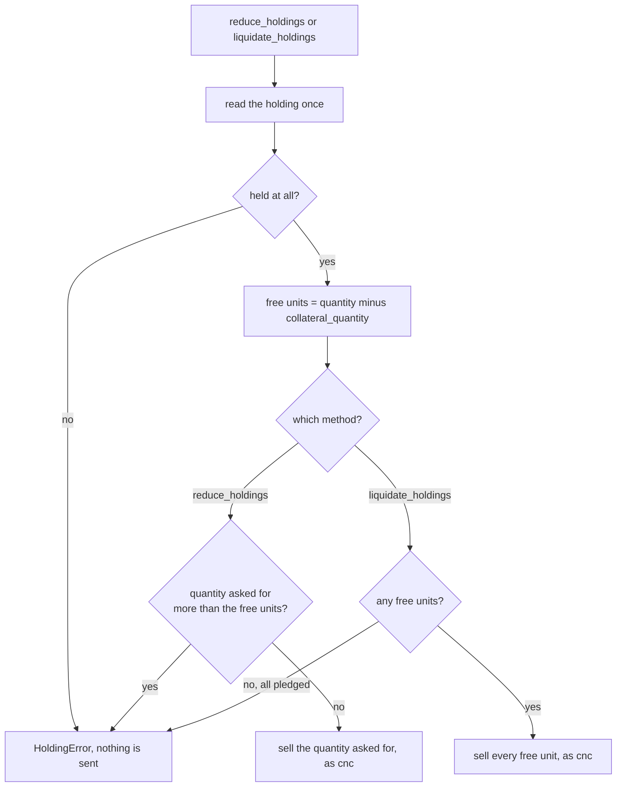

# Holding for the long term

A holding is something you own outright and keep in your demat account, such as shares bought for delivery, as against a position, which a futures, options or intraday trade leaves open. The six members on this page read a holding and add to it or sell out of it. Positions have their own page, [Positions](positions.md).

!!! danger "These are real orders"
    `add_to_holdings`, `reduce_holdings` and `liquidate_holdings` send market or limit orders through UBI to real brokers, with real money, and none of them takes a `dry_run` argument. To see what one would send, call [`place_order`](orders.md#place_order) with `product="cnc"`, the same side, quantity and price, and `dry_run=True`.

The table below lists the six members.

| Kind | Member | Description |
|---|---|---|
| <span class="member property">property</span> | [`holdings`](#holdings) | The long-term holding of this instrument, merged across every broker. |
| <span class="member property">property</span> | [`holdings_value`](#holdings_value) | What the units held are worth at the moment. |
| <span class="member property">property</span> | [`holdings_pnl`](#holdings_pnl) | What the units held have made or lost. |
| <span class="member writes">places orders</span> | [`add_to_holdings`](#add_to_holdings) | Buys more of this instrument to keep. |
| <span class="member writes">places orders</span> | [`reduce_holdings`](#reduce_holdings) | Sells some of the units held, without selling more than are free. |
| <span class="member writes">places orders</span> | [`liquidate_holdings`](#liquidate_holdings) | Sells every unit held that is free to sell. |

## Which classes can be held

Only instruments in UBI's cash segments can be reported as holdings, so only five classes carry these members. Each class has its own copy of them rather than sharing a base class, but the six behave the same way in all five. The table below shows which classes have them and why the rest do not.

| Class | Holdings members | Why |
|---|:---:|---|
| [`Equity`](../asset-classes/equities.md) | :material-check: | A share is the classic holding. |
| [`FixedIncome`](../asset-classes/fixed-income.md) | :material-check: | A bond or a sovereign gold bond is held in the demat account. |
| [`ExchangeTradedFund`](../asset-classes/funds.md) | :material-check: | A fund's units trade and are held like shares. |
| [`InvestmentTrust`](../asset-classes/funds.md) | :material-check: | A trust's units trade and are held like shares. |
| [`MutualFund`](../asset-classes/mutual-funds.md) | :material-check: | A scheme is subscribed to rather than traded, but holding it is what it is for. |
| Every futures and options class | :material-close: | A derivative leaves a position, not a holding. |
| Every index class | :material-close: | An index cannot be owned. |
| `Commodity`, `Currency` and their derivatives | :material-close: | UBI's cash segments exclude commodities and currencies, so they are never reported as holdings. |

Two classes need care. No broker that serves quotes carries a cash bond or a mutual fund, so `FixedIncome` and `MutualFund` have no live price. Give the three order methods a `price`, which sends a limit order, rather than letting them send a market order into a book nobody quotes.

## Always cnc

Every order these members send uses the `cnc` product, and there is no parameter to change it. `cnc` is the only product that buys into or sells out of a demat account. Selling a holding as `mis` would not sell your shares at all: it would open an intraday short position beside them, which the broker squares off before the close, so the mistake would cost money twice and leave the holding untouched. Removing the parameter makes that impossible to do by accident.

The order methods send plain market or limit orders through [`buy_at_market_price`](price-wrappers.md#buy_at_market_price), [`buy_at_limit_price`](price-wrappers.md#buy_at_limit_price) and their sell twins, so they work in either of UBI's placement modes.

## Free units and pledged units

A holding's `collateral_quantity` is the part pledged to a broker as margin, and a broker will not let you sell it until the pledge is released. So `reduce_holdings` and `liquidate_holdings` work on the free units, which are the whole `quantity` minus `collateral_quantity`, and refuse before sending anything when the free units cannot cover the sale. The flowchart below shows the check both methods make.



`holdings_value` and `holdings_pnl` still count pledged units, because a pledged share is still owned.

## holdings

<div class="endpoint" markdown><span class="member property">property</span> `holdings`<span class="route"><span class="method get">GET</span> `/api/portfolio/holdings`</span></div>

This property gives the long-term holding of this instrument, merged across every broker. UBI serves the whole account's holdings and has no route for one instrument, so each access sends one request and picks this instrument's row. It matches on `instrument_id` first, and then on `symbol`, because UBI merges a holding held on two exchanges into one row under whichever broker's row arrived first, and that row may carry the other exchange's id.

Unlike the order and position readers, it returns a single `dict` rather than a DataFrame, because an instrument has at most one holdings row.

#### Example

The first output was captured from a local UBI on 2026-09-26, when no RELIANCE shares were held. The second is built from the code for an INFY holding, using the illustrative row on UBI's [holdings](https://pramodathani.github.io/unified_broker_interface/rest-api/portfolio/#holdings) page.

=== "Python"

    ```python
    from tradingmachine.assets import equities

    reliance = equities.Equity("nse", "RELIANCE")
    print(reliance.holdings)

    infosys = equities.Equity("nse", "INFY")
    print(infosys.holdings)
    ```

=== "Output"

    ```python
    None
    {'instrument_id': '11111111-1111-5111-8111-000000000002',
     'isin': 'INE009A01021',
     'symbol': 'INFY',
     'exchange': 'nse',
     'segment': 'nse_equities',
     'quantity': 20.0,
     'average_price': 1400.0,
     'invested_value': 28000.0,
     'last_price': 1521.4,
     'current_value': 30428.0,
     'pnl': {'unrealized': 2428.0, 'day_change': 13.25, 'day_change_percentage': 0.88},
     'collateral_quantity': 0.0}
    ```

#### Returns

A `dict` with the keys below, or `None` when no broker holds this instrument.

| Key | Type | Description |
|---|---|---|
| `instrument_id` | `str` | The instrument. |
| `isin` | `str` or `None` | The ISIN, when a broker sent one. |
| `symbol` | `str` | The symbol. |
| `exchange` | `str` | The exchange. |
| `segment` | `str` | The exchange-prefixed segment. |
| `quantity` | `float` | Everything held, across every broker, including pledged units. |
| `average_price` | `float` | What was paid per unit on average. |
| `invested_value` | `float` | What was paid in all. |
| `last_price` | `float` or `None` | The price used to value the holding. |
| `current_value` | `float` or `None` | `quantity` times `last_price`. |
| `pnl` | `dict` | `unrealized`, `day_change` and `day_change_percentage`. |
| `collateral_quantity` | `float` | The units pledged as collateral, which cannot be sold. |

#### Raises

| Exception | When |
|---|---|
| `ServiceUnavailableError` | UBI's holdings document is missing or too old to serve. |
| `BrokerError` | No broker's holdings could be read. |
| `UnifiedBrokerInterfaceError` | Any other failure reported by, or on the way to, UBI. |

## holdings_value

<div class="endpoint" markdown><span class="member property">property</span> `holdings_value`<span class="route"><span class="method get">GET</span> `/api/portfolio/holdings`</span></div>

This property says what the units held are worth, in rupees. UBI prices a holding itself, so this reads the row's `current_value` rather than working it out, which is the opposite of [`positions_value`](positions.md#positions_value). It counts every unit held, including pledged ones.

#### Example

The output below is built from the same illustrative INFY row.

=== "Python"

    ```python
    print(infosys.holdings_value)
    ```

=== "Output"

    ```text
    30428.0
    ```

#### Returns

A `float` in rupees, or `None` when this instrument is not held. It can also be `None` when the holding is held only at a broker that sends no price and there is no usable quote.

#### Raises

The same exceptions as [`holdings`](#holdings).

## holdings_pnl

<div class="endpoint" markdown><span class="member property">property</span> `holdings_pnl`<span class="route"><span class="method get">GET</span> `/api/portfolio/holdings`</span></div>

This property says what the units held have made or lost. Its dictionary is not shaped like a position's, and the table below shows the difference, because the two are easy to confuse.

| Key | `holdings_pnl` | [`positions_pnl`](positions.md#positions_pnl) |
|---|:---:|:---:|
| `unrealized` | :material-check: | :material-check: |
| `day_change` | :material-check: | :material-close: |
| `day_change_percentage` | :material-check: | :material-close: |
| `realized` | :material-close: | :material-check: |
| `total` | :material-close: | :material-check: |

Only `unrealized` means the same thing in both: what is still riding on what you hold, against what you paid. A holding has no realised figure, because selling a share removes it from the holding rather than booking a profit against it.

#### Example

The output below is built from the same illustrative INFY row.

=== "Python"

    ```python
    print(infosys.holdings_pnl)
    ```

=== "Output"

    ```python
    {'unrealized': 2428.0, 'day_change': 13.25, 'day_change_percentage': 0.88}
    ```

#### Returns

A `dict` with `unrealized` in rupees against what was paid, and `day_change` in rupees and `day_change_percentage` in per cent since the previous close, or `None` when this instrument is not held.

#### Raises

The same exceptions as [`holdings`](#holdings).

## add_to_holdings

<div class="endpoint" markdown><span class="member writes">places orders</span> `add_to_holdings(quantity, price=None, validity=None, after_market=False, tag=None)`<span class="route"><span class="method post">POST</span> `/api/orders/place`</span></div>

This method buys more of this instrument to keep, always as `cnc`. It reads nothing first, because you can buy whether or not you already hold any, and neither the library nor UBI checks your funds before sending; the broker does.

#### Parameters

| Name | Type | Required | Default | Description |
|---|---|:---:|---|---|
| `quantity` | `int` | yes | | The number of units to buy. |
| `price` | `float` or `None` | no | `None` | A limit price in rupees, or `None` for a market order. |
| `validity` | `str` or `None` | no | `None` | `day` or `ioc`. UBI uses `day` when it is `None`. |
| `after_market` | `bool` | no | `False` | `True` sends an after-market order. |
| `tag` | `str` or `None` | no | `None` | A label of up to twenty letters and digits. |

#### Example

The example below buys ten INFY shares at no more than 1500 rupees each, and queues the order for the next session.

=== "Python"

    ```python
    infosys.add_to_holdings(quantity=10, price=1500.0, after_market=True)
    ```

#### Returns

The `dict` that [`place_order`](orders.md#place_order) returns.

#### Raises

| Exception | When |
|---|---|
| `UnifiedBrokerInterfaceError` | Any failure reported by, or on the way to, UBI, including every exception [`place_order`](orders.md#place_order) can raise. |

## reduce_holdings

<div class="endpoint" markdown><span class="member writes">places orders</span> `reduce_holdings(quantity, price=None, validity=None, after_market=False, tag=None)`<span class="route"><span class="method get">GET</span> `/api/portfolio/holdings`, then <span class="method post">POST</span> `/api/orders/place`</span></div>

This method sells some of the units held, as `cnc`. It reads the holding once and refuses, before sending anything, when the quantity asked for is more than the free units.

#### Parameters

| Name | Type | Required | Default | Description |
|---|---|:---:|---|---|
| `quantity` | `int` | yes | | The number of units to sell. |
| `price` | `float` or `None` | no | `None` | A limit price in rupees, or `None` for a market order. |
| `validity` | `str` or `None` | no | `None` | `day` or `ioc`. |
| `after_market` | `bool` | no | `False` | `True` sends an after-market order. |
| `tag` | `str` or `None` | no | `None` | A label of up to twenty letters and digits. |

#### Example

The example below sells five of the INFY shares at no less than 1550 rupees each.

=== "Python"

    ```python
    infosys.reduce_holdings(quantity=5, price=1550.0)
    ```

#### Returns

The `dict` that [`place_order`](orders.md#place_order) returns.

#### Raises

| Exception | When |
|---|---|
| `HoldingError` | This instrument is not held, or the quantity is more than the free units. |
| `UnifiedBrokerInterfaceError` | Any failure reported by, or on the way to, UBI. |

## liquidate_holdings

<div class="endpoint" markdown><span class="member writes">places orders</span> `liquidate_holdings(price=None, validity=None, after_market=False, tag=None)`<span class="route"><span class="method get">GET</span> `/api/portfolio/holdings`, then <span class="method post">POST</span> `/api/orders/place`</span></div>

This method sells every unit held that is free to sell, as `cnc`. Pledged units are left alone, so it empties the holding only when nothing is pledged.

#### Parameters

| Name | Type | Required | Default | Description |
|---|---|:---:|---|---|
| `price` | `float` or `None` | no | `None` | A limit price in rupees, or `None` for a market order. |
| `validity` | `str` or `None` | no | `None` | `day` or `ioc`. |
| `after_market` | `bool` | no | `False` | `True` sends an after-market order. |
| `tag` | `str` or `None` | no | `None` | A label of up to twenty letters and digits. |

#### Example

The example below sells every free INFY share at market.

=== "Python"

    ```python
    infosys.liquidate_holdings()
    ```

#### Returns

The `dict` that [`place_order`](orders.md#place_order) returns.

#### Raises

| Exception | When |
|---|---|
| `HoldingError` | This instrument is not held, or every unit held is pledged as collateral. |
| `UnifiedBrokerInterfaceError` | Any failure reported by, or on the way to, UBI. |

## HoldingError

`HoldingError` is the library's own exception for a holding that cannot be changed as asked. It is raised before anything is sent, and it lives in `tradingmachine.assets.exceptions`. The table below lists its three messages as `Equity` words them, with `<...>` marking a value filled in. The other four classes say `units` where `Equity` says `shares`, and in all five classes the first message ends with the instrument's representation.

| Message | Raised by |
|---|---|
| `No <symbol> shares are held, so there is nothing to sell` | `reduce_holdings`, `liquidate_holdings` |
| `<free> of the <quantity> <symbol> shares held are free to sell, because <pledged> are pledged as collateral, so <asked> cannot be sold` | `reduce_holdings` |
| `All <quantity> <symbol> shares held are pledged as collateral, so none can be sold` | `liquidate_holdings` |

The [Errors](errors.md#holdingerror) page lists `HoldingError` with the rest of the library's exceptions.
