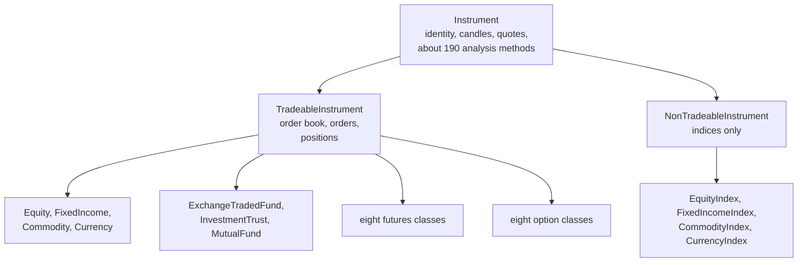
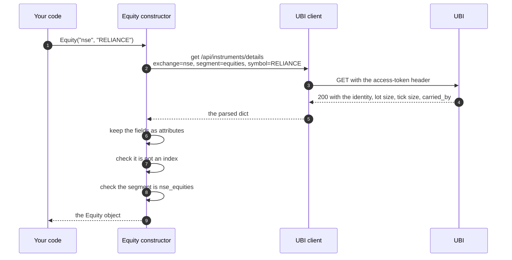

# Instruments

An instrument is one thing you can look up at UBI, such as a share, an index, a futures contract or an option, held as a Python object. You build it once by naming it, it looks itself up in UBI with one request, and from then on it carries its identity, its lot size and tick size, and every member described on the other pages of this tab.

The table below lists what this page covers. The twenty-seven named classes are the ones you normally use; the three base classes underneath them are documented at the end.

| Kind | Member | Description |
|---|---|---|
| <span class="member class">class</span> | [Named by exchange and symbol](#named-by-exchange-and-symbol) | The eleven classes for shares, indices, bonds, currency pairs, commodities, funds, trusts and mutual funds |
| <span class="member class">class</span> | [Named by underlying and expiry](#named-by-underlying-and-expiry) | The eight futures classes |
| <span class="member class">class</span> | [Named by underlying, expiry, strike and option type](#named-by-underlying-expiry-strike-and-option-type) | The eight option classes |
| <span class="member property">attribute</span> | [The attributes set on lookup](#the-attributes-set-on-lookup) | `instrument_id`, `exchange`, `segment`, `shape`, `symbol` and the rest, fixed at construction |
| <span class="member function">classmethod</span> | [`shared_unified_broker_interface`](#shared_unified_broker_interface) | The one UBI client every instrument shares |
| <span class="member class">class</span> | [`Instrument`](#instrument) | The base of every instrument, which quotes and analyses but cannot trade |
| <span class="member class">class</span> | [`TradeableInstrument`](#tradeableinstrument) | An instrument that can be traded, which is anything except an index |
| <span class="member class">class</span> | [`NonTradeableInstrument`](#nontradeableinstrument) | An index, which is followed rather than traded |

The strings these constructors accept, such as `nse`, `CE` and the segment names, are listed on [Vocabulary](vocabulary.md).

## The twenty-seven classes

Each class stands for one of UBI's segments, so the kind of contract is the class you pick rather than a segment string you type. The diagram below shows how the classes are built: every one of them inherits from `Instrument` through one of two middle classes, and only the four index classes are non-tradeable.



The table below lists every class with its module, the segment it fixes, and the constructor arguments that name one of its instruments. The `unified_broker_interface` argument, which every class also takes, is left out of the last column.

| Class | Module | Segment | Base | Named by |
|---|---|---|---|---|
| `Equity` | `equities` | `equities` | Tradeable | `exchange`, `symbol` |
| `EquityFutures` | `equities` | `equity_futures` | Tradeable | `exchange`, `underlying_symbol`, `expiry_date` |
| `EquityOption` | `equities` | `equity_options` | Tradeable | `exchange`, `underlying_symbol`, `expiry_date`, `strike_price`, `option_type` |
| `EquityIndex` | `equities` | `equity_indices` | Non-tradeable | `exchange`, `symbol` |
| `EquityIndexFutures` | `equities` | `equity_index_futures` | Tradeable | `exchange`, `underlying_symbol`, `expiry_date` |
| `EquityIndexOption` | `equities` | `equity_index_options` | Tradeable | `exchange`, `underlying_symbol`, `expiry_date`, `strike_price`, `option_type` |
| `FixedIncome` | `fixed_income` | `fixed_income` | Tradeable | `exchange`, `symbol` |
| `FixedIncomeFutures` | `fixed_income` | `fixed_income_futures` | Tradeable | `exchange`, `underlying_symbol`, `expiry_date` |
| `FixedIncomeOption` | `fixed_income` | `fixed_income_options` | Tradeable | `exchange`, `underlying_symbol`, `expiry_date`, `strike_price`, `option_type` |
| `FixedIncomeIndex` | `fixed_income` | `fixed_income_indices` | Non-tradeable | `exchange`, `symbol` |
| `FixedIncomeIndexFutures` | `fixed_income` | `fixed_income_index_futures` | Tradeable | `exchange`, `underlying_symbol`, `expiry_date` |
| `FixedIncomeIndexOption` | `fixed_income` | `fixed_income_index_options` | Tradeable | `exchange`, `underlying_symbol`, `expiry_date`, `strike_price`, `option_type` |
| `Commodity` | `commodities` | `commodities` | Tradeable | `exchange`, `symbol` |
| `CommodityFutures` | `commodities` | `commodity_futures` | Tradeable | `exchange`, `underlying_symbol`, `expiry_date` |
| `CommodityOption` | `commodities` | `commodity_options` | Tradeable | `exchange`, `underlying_symbol`, `expiry_date`, `strike_price`, `option_type` |
| `CommodityIndex` | `commodities` | `commodity_indices` | Non-tradeable | `exchange`, `symbol` |
| `CommodityIndexFutures` | `commodities` | `commodity_index_futures` | Tradeable | `exchange`, `underlying_symbol`, `expiry_date` |
| `CommodityIndexOption` | `commodities` | `commodity_index_options` | Tradeable | `exchange`, `underlying_symbol`, `expiry_date`, `strike_price`, `option_type` |
| `Currency` | `currencies` | `currencies` | Tradeable | `exchange`, `symbol` |
| `CurrencyFutures` | `currencies` | `currency_futures` | Tradeable | `exchange`, `underlying_symbol`, `expiry_date` |
| `CurrencyOption` | `currencies` | `currency_options` | Tradeable | `exchange`, `underlying_symbol`, `expiry_date`, `strike_price`, `option_type` |
| `CurrencyIndex` | `currencies` | `currency_indices` | Non-tradeable | `exchange`, `symbol` |
| `CurrencyIndexFutures` | `currencies` | `currency_index_futures` | Tradeable | `exchange`, `underlying_symbol`, `expiry_date` |
| `CurrencyIndexOption` | `currencies` | `currency_index_options` | Tradeable | `exchange`, `underlying_symbol`, `expiry_date`, `strike_price`, `option_type` |
| `ExchangeTradedFund` | `funds` | `exchange_traded_funds` | Tradeable | `exchange`, `symbol` |
| `InvestmentTrust` | `funds` | `investment_trusts` | Tradeable | `exchange`, `symbol` |
| `MutualFund` | `mutual_funds` | `mutual_funds` | Tradeable | `exchange`, `symbol` |

Every module lives under `tradingmachine.assets`, so `Equity` is imported with `from tradingmachine.assets import equities`. Some classes exist for symmetry and resolve nothing today, because UBI holds no rows in their segment; [Asset classes](../asset-classes/index.md) says which, and what each family can and cannot do.

!!! note "Tradeable does not always mean orderable"
    `Commodity` is built on `TradeableInstrument`, but the rows in UBI's `commodities` segment are the exchange's underlying reference records rather than contracts, so UBI refuses an order for one and has no quote for it. The class carries the order members anyway, because the tradeable rule is only "not an index". [Commodities](../asset-classes/commodities.md) has the details.

### Named by exchange and symbol

<div class="endpoint" markdown><span class="member class">class</span> `Equity(exchange, symbol, unified_broker_interface=None)`<span class="route"><span class="method get">GET</span> `/api/instruments/details`</span></div>

Eleven classes name their instrument by an exchange and a symbol: `Equity`, `EquityIndex`, `FixedIncome`, `FixedIncomeIndex`, `Commodity`, `CommodityIndex`, `Currency`, `CurrencyIndex`, `ExchangeTradedFund`, `InvestmentTrust` and `MutualFund`. Each constructor sends one request to UBI with its own segment filled in, keeps what comes back, and raises its own error class if UBI has no such instrument. The signature above is `Equity`'s, and the other ten are identical apart from the class name.

#### Parameters

| Name | Type | Required | Default | Description |
|---|---|---|---|---|
| `exchange` | `str` | Yes | | The exchange, such as `nse`, `bse` or `mcx` |
| `symbol` | `str` | Yes | | The symbol, such as `RELIANCE`, `NIFTY`, the ISIN `IN000126C010` for a bond, or the scheme code `ABSLFTTIDG` for a mutual fund. UBI upper-cases it, so `reliance` works too. |
| `unified_broker_interface` | `UnifiedBrokerInterface` or `None` | No | `None` | The client to send requests through. `None` uses the [shared client](#shared_unified_broker_interface), which is almost always what you want. |

#### Example

The output below was captured from a local UBI on 2026-09-26.

=== "Python"

    ```python
    from tradingmachine.assets import equities

    reliance = equities.Equity("nse", "RELIANCE")
    print(repr(reliance))
    ```

=== "Output"

    ```text
    Equity(exchange='nse', segment='nse_equities', symbol='RELIANCE')
    ```

#### Returns

The constructor returns the instrument object, with the [attributes below](#the-attributes-set-on-lookup) already set.

#### Raises

| Exception | When |
|---|---|
| The class's own error, such as [`EquityError`](errors.md#equityerror) | UBI has no instrument with that symbol on that exchange in this class's segment |
| `TypeError` | An argument is missing, which Python reports before any request is sent |
| [`BadRequestError`](errors.md#badrequesterror) | UBI does not know the exchange |
| [`UnifiedBrokerInterfaceError`](errors.md#unifiedbrokerinterfaceerror) | Any other failure reported by, or on the way to, UBI |

### Named by underlying and expiry

<div class="endpoint" markdown><span class="member class">class</span> `EquityFutures(exchange, underlying_symbol, expiry_date, unified_broker_interface=None)`<span class="route"><span class="method get">GET</span> `/api/instruments/details`</span></div>

The eight futures classes name a contract by its exchange, the symbol of what it is written on, and the day it expires: `EquityFutures`, `EquityIndexFutures`, `FixedIncomeFutures`, `FixedIncomeIndexFutures`, `CommodityFutures`, `CommodityIndexFutures`, `CurrencyFutures` and `CurrencyIndexFutures`. A futures contract does not hold an object for its underlying, because UBI links the two only by the symbol strings matching; build the underlying yourself when you want it.

#### Parameters

| Name | Type | Required | Default | Description |
|---|---|---|---|---|
| `exchange` | `str` | Yes | | The exchange, such as `nse` or `mcx` |
| `underlying_symbol` | `str` | Yes | | The symbol of the underlying, such as `RELIANCE`, `NIFTY` or `GOLD` |
| `expiry_date` | `datetime.date` or `str` | Yes | | The expiry, as a date or a `YYYY-MM-DD` string. [`expiries`](discovery.md#expiries) lists the valid ones. |
| `unified_broker_interface` | `UnifiedBrokerInterface` or `None` | No | `None` | The client to send requests through, or `None` for the shared one |

#### Example

The output below was captured from a local UBI on 2026-09-26. The expiry was taken from `CommodityFutures.expiries`, whose first answer was 2026-10-05.

=== "Python"

    ```python
    from tradingmachine.assets import commodities

    expiries = commodities.CommodityFutures.expiries("mcx", "GOLD")
    gold = commodities.CommodityFutures("mcx", "GOLD", expiries[0])
    print(repr(gold))
    print((gold.lot_size, gold.tick_size))
    ```

=== "Output"

    ```text
    CommodityFutures(exchange='mcx', segment='mcx_commodity_futures', underlying_symbol='GOLD', expiry_date='2026-10-05')
    (100, Decimal('1'))
    ```

#### Returns

The constructor returns the contract object, with the [attributes below](#the-attributes-set-on-lookup) set and `symbol` left as `None`.

#### Raises

| Exception | When |
|---|---|
| The class's own error, such as [`EquityFuturesError`](errors.md#equityfutureserror) | UBI has no such contract, including a date that is not one of the underlying's expiries |
| `TypeError` | An argument is missing |
| `ValueError` | The expiry string is not a valid ISO date |
| [`UnifiedBrokerInterfaceError`](errors.md#unifiedbrokerinterfaceerror) | Any other failure reported by, or on the way to, UBI |

### Named by underlying, expiry, strike and option type

<div class="endpoint" markdown><span class="member class">class</span> `EquityIndexOption(exchange, underlying_symbol, expiry_date, strike_price, option_type, unified_broker_interface=None)`<span class="route"><span class="method get">GET</span> `/api/instruments/details`</span></div>

The eight option classes add a strike price and an option type to the futures arguments: `EquityOption`, `EquityIndexOption`, `FixedIncomeOption`, `FixedIncomeIndexOption`, `CommodityOption`, `CommodityIndexOption`, `CurrencyOption` and `CurrencyIndexOption`. The usual way to get the four identity values right is to read them off a row of [`chain`](discovery.md#chain) rather than typing them.

#### Parameters

| Name | Type | Required | Default | Description |
|---|---|---|---|---|
| `exchange` | `str` | Yes | | The exchange, such as `nse` |
| `underlying_symbol` | `str` | Yes | | The symbol of the underlying, such as `NIFTY` |
| `expiry_date` | `datetime.date` or `str` | Yes | | The expiry, as a date or a `YYYY-MM-DD` string |
| `strike_price` | `float` | Yes | | The strike price in rupees, such as `25000` |
| `option_type` | `str` | Yes | | `CE` for a call or `PE` for a put |
| `unified_broker_interface` | `UnifiedBrokerInterface` or `None` | No | `None` | The client to send requests through, or `None` for the shared one |

#### Example

This example is the one in the `equities` module's own docstring. Its output was not captured, so none is shown.

=== "Python"

    ```python
    from tradingmachine.assets import equities

    option = equities.EquityIndexOption(
        exchange="nse",
        underlying_symbol="NIFTY",
        expiry_date="2026-09-29",
        strike_price=25000,
        option_type="CE",
    )
    premium = option.last_price
    ```

A check recorded in the project's notes on 2026-09-20 built `EquityOption("nse", "RELIANCE", "2026-09-29", 1270.0, "PE")` from a row of the RELIANCE chain. UBI returned the same `instrument_id` the row carried, `12278f86-2feb-54b0-875f-4c1311d550fc`, with a lot size of 500 and a tick size of 0.05, which is the evidence that a row found by discovery always turns into the right contract.

#### Returns

The constructor returns the option object, with `strike_price` as a float and `option_type` as `CE` or `PE`.

#### Raises

| Exception | When |
|---|---|
| The class's own error, such as [`EquityIndexOptionError`](errors.md#equityindexoptionerror) | UBI has no such option |
| `TypeError` | An argument is missing |
| `ValueError` | The expiry string is not a valid ISO date |
| [`UnifiedBrokerInterfaceError`](errors.md#unifiedbrokerinterfaceerror) | Any other failure reported by, or on the way to, UBI |

## How an instrument is looked up

Every constructor, whatever its class, ends in the same single request to UBI's details route. The sequence below shows that request for `Equity("nse", "RELIANCE")`, including the two checks that run after the answer arrives.



A 404 from UBI is turned into `InstrumentError` inside `Instrument`, and each named class catches that and raises its own error, such as `EquityError`, chained with `from` so UBI's own message stays in the traceback. After construction the object sends only its `instrument_id` on every request, so the identity fields are never parsed again.

### What the `instrument_id` is

The `instrument_id` is a UUID that UBI computes rather than hands out. It is a UUID version 5 of the instrument's natural key, which is its exchange, its segment, its shape and its identity fields joined together, so every broker that lists the same instrument arrives at the same id, and the id stays the same from one day to the next. [Naming an instrument](https://pramodathani.github.io/unified_broker_interface/rest-api/instruments/#naming-an-instrument) on the UBI site explains the key in full.

This library never computes the id itself. The table below shows the two ways a constructor can send the lookup, and which classes use each.

| Lookup | What is sent | Used by |
|---|---|---|
| By identity | `exchange`, `segment` and the identity fields for the segment's shape | The twenty-seven named classes, always |
| By id | `instrument_id` alone | `Instrument`, `TradeableInstrument` and `NonTradeableInstrument` when you pass `instrument_id=` |

Two instrument objects compare equal when their `instrument_id` values are equal, and an instrument hashes by its id, so instruments work as dictionary keys and set members. An instrument built by id equals the same instrument built from its fields.

## The attributes set on lookup

The constructor copies UBI's answer into plain attributes, which never change for the life of the object. The table below lists each one with its type and the value captured for `Equity("nse", "RELIANCE")` from a local UBI on 2026-09-26.

| Attribute | Type | RELIANCE | Description |
|---|---|---|---|
| `instrument_id` | `str` | `'3f92570a-9924-5bf5-9f9d-e006cd9f4202'` | UBI's UUID for the instrument, the same at every broker |
| `exchange` | `str` | `'nse'` | The exchange, lower case |
| `segment` | `str` | `'nse_equities'` | The segment, always with the exchange as a prefix |
| `shape` | `str` | `'security'` | `security`, `future` or `option` |
| `symbol` | `str` or `None` | `'RELIANCE'` | The symbol of a security, or `None` for a future or an option |
| `underlying_symbol` | `str` or `None` | `None` | The underlying of a future or an option |
| `expiry_date` | `datetime.date` or `None` | `None` | The expiry of a future or an option |
| `strike_price` | `float` or `None` | `None` | The strike price of an option |
| `option_type` | `str` or `None` | `None` | `CE` or `PE` for an option |
| `mapping_date` | `datetime.date` | `datetime.date(2026, 9, 26)` | The day of the UBI mapping the details were read from |
| `first_seen_date` | `datetime.date` or `None` | `datetime.date(2026, 8, 7)` | The first day UBI saw the instrument |
| `last_seen_date` | `datetime.date` or `None` | `datetime.date(2026, 9, 26)` | The last day UBI saw the instrument |
| `lot_size` | `int` or `None` | `1` | Underlying units in one lot, or `None` when the brokers tie |
| `tick_size` | `decimal.Decimal` or `None` | `Decimal('0.1')` | The smallest price step in rupees, kept exact, or `None` when the brokers tie |
| `carried_by` | `list[dict]` | nine entries, below | One entry per broker that carries the instrument, with that broker's own figures |

`carried_by` keeps each broker's own spelling of the instrument, exactly as UBI stores it, with the numbers as strings. The table below is RELIANCE's full list from the same capture.

| `broker` | `broker_token` | `order_symbol` | `lot_size` | `tick_size` |
|---|---|---|---|---|
| `dhan` | `2885` | `None` | `'1.0'` | `'0.1'` |
| `flattrade` | `2885` | `'RELIANCE-EQ'` | `'1.0'` | `None` |
| `fyers` | `10100000002885` | `'NSE:RELIANCE-EQ'` | `'1.0'` | `'0.1'` |
| `groww` | `2885` | `'RELIANCE'` | `'1.0'` | `'0.1'` |
| `indmoney` | `2885` | `None` | `'1.0'` | `'0.1'` |
| `kotak` | `2885` | `'RELIANCE-EQ'` | `'1.0'` | `'0.1'` |
| `shoonya` | `2885` | `'RELIANCE-EQ'` | `'1.0'` | `'0.1'` |
| `stoxkart` | `2885` | `None` | `'1.0'` | `'0.1'` |
| `zerodha` | `738561` | `'RELIANCE'` | `'1.0'` | `'0.1'` |

!!! warning "Use `lot_size` and `tick_size`, not a `carried_by` entry"
    The brokers do not always agree on units, and on MCX one broker's lot is another's single unit. The top-level `lot_size` and `tick_size` are the values UBI decided on for the instrument itself. For currencies even `lot_size` is not the lot an order is measured against; [Currencies](../asset-classes/currencies.md) explains why. This library never checks a quantity or a price against either figure before sending an order.

The captured output below is the raw dictionary of public attributes, with `carried_by` trimmed to its first two entries.

=== "Python"

    ```python
    public_attributes = {}
    for name, value in vars(reliance).items():
        if not name.startswith("_"):
            public_attributes[name] = value
    print(public_attributes)
    ```

=== "Output"

    ```text
    {'instrument_id': '3f92570a-9924-5bf5-9f9d-e006cd9f4202', 'exchange': 'nse', 'segment': 'nse_equities', 'shape': 'security', 'symbol': 'RELIANCE', 'underlying_symbol': None, 'expiry_date': None, 'strike_price': None, 'option_type': None, 'mapping_date': datetime.date(2026, 9, 26), 'first_seen_date': datetime.date(2026, 8, 7), 'last_seen_date': datetime.date(2026, 9, 26), 'lot_size': 1, 'tick_size': Decimal('0.1'), 'carried_by': [{'broker': 'dhan', 'broker_token': '2885', 'lot_size': '1.0', 'order_symbol': None, 'tick_size': '0.1'}, {'broker': 'flattrade', 'broker_token': '2885', 'lot_size': '1.0', 'order_symbol': 'RELIANCE-EQ', 'tick_size': None}, ...]}
    ```

## shared_unified_broker_interface

<div class="endpoint" markdown><span class="member function">classmethod</span> `Instrument.shared_unified_broker_interface()`</div>

This class method returns the one UBI client that every instrument, and the [account](account.md), sends its requests through, creating it the first time it is asked. UBI holds a single access token for the whole application, so separate clients would keep replacing each other's token; sharing one client avoids that. The client is stored on `Instrument` itself, so every subclass shares the same one.

#### Parameters

This method takes no parameters.

#### Example

The capture on 2026-09-26 read the client's `placement_mode` through this method after a dry run with a price reference.

=== "Python"

    ```python
    client = reliance.shared_unified_broker_interface()
    print(repr(client.placement_mode))
    ```

=== "Output"

    ```text
    'engine'
    ```

#### Returns

The shared [`UnifiedBrokerInterface`](client.md).

#### Raises

| Exception | When |
|---|---|
| `ValueError` | The UBI base url is not configured, or the MongoDB `settings` document with UBI's key and secret is missing |

## Instrument

<div class="endpoint" markdown><span class="member class">class</span> `Instrument(instrument_id=None, exchange=None, segment=None, symbol=None, underlying_symbol=None, expiry_date=None, strike_price=None, option_type=None, unified_broker_interface=None)`<span class="route"><span class="method get">GET</span> `/api/instruments/details`</span></div>

`Instrument` is the base of every instrument. It holds the lookup, the attributes above, [`prices`](market-data.md#prices), [`quote`](market-data.md#quote), [`last_price`](market-data.md#last_price) and [`ohlc`](market-data.md#ohlc), and it inherits the thirteen analysis classes described under [Analysis](../analysis/index.md). You rarely build one directly; it is useful when all you have is an `instrument_id`, such as one read from an order row, and you do not care which class it belongs to.

#### Parameters

| Name | Type | Required | Default | Description |
|---|---|---|---|---|
| `instrument_id` | `str` or `None` | One spelling | `None` | The instrument's UUID. When given, it is sent alone. |
| `exchange` | `str` or `None` | The other spelling | `None` | The exchange |
| `segment` | `str` or `None` | The other spelling | `None` | The segment, bare such as `equities` or prefixed such as `nse_equities` |
| `symbol` | `str` or `None` | For a security | `None` | The symbol |
| `underlying_symbol` | `str` or `None` | For a future or option | `None` | The underlying's symbol |
| `expiry_date` | `datetime.date`, `str` or `None` | For a future or option | `None` | The expiry |
| `strike_price` | `float` or `None` | For an option | `None` | The strike price |
| `option_type` | `str` or `None` | For an option | `None` | `CE` or `PE` |
| `unified_broker_interface` | `UnifiedBrokerInterface` or `None` | No | `None` | The client, or `None` for the shared one |

#### Example

This example builds the same share by its id; the id is the one captured for RELIANCE above.

=== "Python"

    ```python
    from tradingmachine.assets import instruments

    same_share = instruments.Instrument(
        instrument_id="3f92570a-9924-5bf5-9f9d-e006cd9f4202",
    )
    assert same_share == reliance
    ```

#### Returns

The constructor returns an `Instrument` with the attributes above.

#### Raises

| Exception | When |
|---|---|
| [`InstrumentError`](errors.md#instrumenterror) | UBI has no instrument matching the lookup |
| [`BadRequestError`](errors.md#badrequesterror) | The lookup is incomplete or malformed, such as a future without an `expiry_date` or an id that is not a UUID |
| [`UnifiedBrokerInterfaceError`](errors.md#unifiedbrokerinterfaceerror) | Any other failure reported by, or on the way to, UBI |

## TradeableInstrument

<div class="endpoint" markdown><span class="member class">class</span> `TradeableInstrument(...)`<span class="route"><span class="method get">GET</span> `/api/instruments/details`</span></div>

`TradeableInstrument` takes the same arguments as `Instrument` and adds everything that needs an order book or an account: the [order-book values](market-data.md#the-order-book-values), [orders](orders.md), the [price wrappers](price-wrappers.md) and [positions](positions.md). After the lookup it checks that the segment does not end in `_indices`, because an index cannot be traded.

#### Raises

| Exception | When |
|---|---|
| [`TradeableInstrumentError`](errors.md#tradeableinstrumenterror) | The instrument is an index |
| [`InstrumentError`](errors.md#instrumenterror) | UBI has no instrument matching the lookup |
| [`BadRequestError`](errors.md#badrequesterror) | The lookup is incomplete or malformed |

## NonTradeableInstrument

<div class="endpoint" markdown><span class="member class">class</span> `NonTradeableInstrument(...)`<span class="route"><span class="method get">GET</span> `/api/instruments/details`</span></div>

`NonTradeableInstrument` takes the same arguments as `Instrument` and accepts only an index, which is any instrument whose segment ends in `_indices`. It has candles, quotes and analysis, but no order book and no order members, so reading `nifty.best_bid` is an `AttributeError` rather than a request.

#### Raises

| Exception | When |
|---|---|
| [`NonTradeableInstrumentError`](errors.md#nontradeableinstrumenterror) | The instrument is not an index, so it can be traded |
| [`InstrumentError`](errors.md#instrumenterror) | UBI has no instrument matching the lookup |
| [`BadRequestError`](errors.md#badrequesterror) | The lookup is incomplete or malformed |

## Lookup errors at a glance

The table below gathers every way building an instrument can fail, in the order the checks happen.

| Step | What fails | Exception |
|---|---|---|
| 1. Calling the constructor | A required argument is missing | `TypeError`, before any request |
| 2. Creating the shared client | No base url, or no key and secret in MongoDB | `ValueError` |
| 3. Sending the lookup | UBI cannot be reached | [`UnreachableError`](errors.md#unreachableerror) |
| 4. UBI reads the parameters | An unknown exchange or segment, or a missing identity field | [`BadRequestError`](errors.md#badrequesterror) |
| 5. UBI looks the instrument up | Nothing matches on the latest mapping date | The class's own error, such as [`EquityError`](errors.md#equityerror), or [`InstrumentError`](errors.md#instrumenterror) for the base classes |
| 6. The tradeable check | The index-ness disagrees with the base class | [`TradeableInstrumentError`](errors.md#tradeableinstrumenterror) or [`NonTradeableInstrumentError`](errors.md#nontradeableinstrumenterror) |

??? note "Under the hood"
    The request is `GET /api/instruments/details` with `instrument_id` alone, or with every lookup argument that is not `None`. UBI decides which identity fields a segment's shape needs and answers 400 when some are missing, so this library keeps no segment table of its own. See [Details](https://pramodathani.github.io/unified_broker_interface/rest-api/instruments/#details) on the UBI site for the route, and `.claude/notes/src/tradingmachine/assets/instruments.py.md` for the reasoning behind the lookup.
