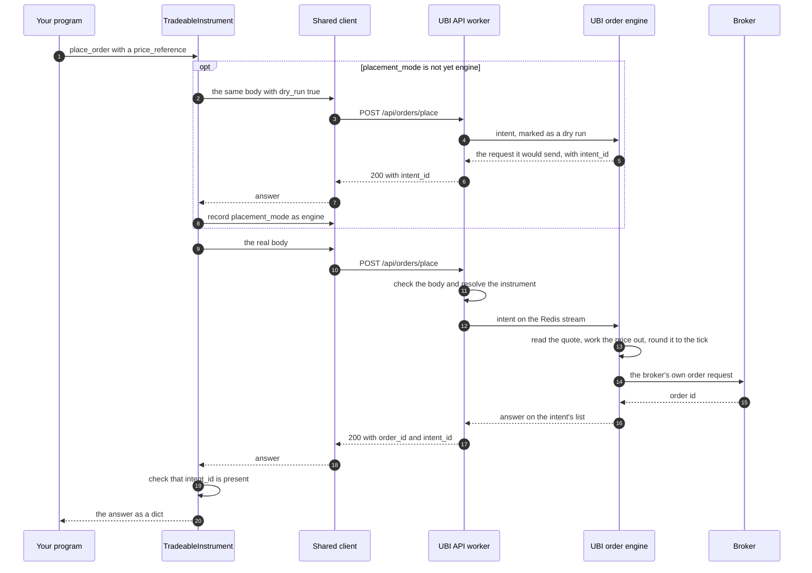

# Placing and reading orders

Every instrument that can be traded carries the members on this page. Four of them send orders to UBI, which passes them on to a broker, and six read this instrument's own rows out of the day's order book and trade book. An index cannot be traded, so `EquityIndex` and the other index classes have none of these members.

!!! danger "These are real orders"
    The members with a <span class="member writes">places orders</span> badge send orders through UBI to real brokers, with real money. UBI does not check the market's hours, and a broker that accepts an order can still see it filled within milliseconds. Pass `dry_run=True` to `place_order`, `modify_order` or `cancel_order` first: UBI then builds the exact request it would send to the broker and returns it without sending anything.

The table below lists the ten members this page documents.

| Kind | Member | Description |
|---|---|---|
| <span class="member writes">places orders</span> | [`place_order`](#place_order) | Places one order in this instrument through UBI. |
| <span class="member writes">places orders</span> | [`modify_order`](#modify_order) | Changes one pending order through UBI. |
| <span class="member writes">places orders</span> | [`cancel_order`](#cancel_order) | Cancels one pending order through UBI. |
| <span class="member writes">places orders</span> | [`cancel_open_orders`](#cancel_open_orders) | Cancels every order in this instrument that is still waiting in the market. |
| <span class="member property">property</span> | [`orders`](#orders) | Every one of today's orders in this instrument, whatever its status. |
| <span class="member property">property</span> | [`open_orders`](#open_orders) | Today's orders in this instrument that can still be changed. |
| <span class="member property">property</span> | [`completed_orders`](#completed_orders) | Today's orders in this instrument that filled in full. |
| <span class="member property">property</span> | [`rejected_orders`](#rejected_orders) | Today's orders in this instrument that a broker or the exchange refused. |
| <span class="member property">property</span> | [`cancelled_orders`](#cancelled_orders) | Today's orders in this instrument that were cancelled. |
| <span class="member property">property</span> | [`trades`](#trades) | Today's trades in this instrument. |

Placing an order through a named price, such as "buy at the best bid", has its own page, [Price wrappers](price-wrappers.md). Changing a position without saying which side you are on is on [Positions](positions.md), and the forty-two order types UBI builds out of ordinary orders are on [Synthetic orders](synthetic-orders.md). All of them end in `place_order`.

## Glossary of plain strings

The library passes the order vocabulary to UBI as plain lower-case strings, with no constants and no enums, because UBI already checks every value and answers HTTP 400 with a clear message when one is wrong. UBI ignores case, so `"buy"` and `"BUY"` are the same. The table below lists the values these members accept and return; [Vocabulary](vocabulary.md) has the full list for the whole library.

| Parameter | Values | Meaning |
|---|---|---|
| `transaction_type` | `buy`, `sell` | The side of the order. |
| `order_type` | `market` | Fill at whatever price the market offers. Takes no price. |
| | `limit` | Fill at the price given or better. Needs a price. |
| | `sl` | A stop-loss limit: waits for the trigger price, then rests a limit. Needs a price and a trigger price. |
| | `sl-m` | A stop-loss market: waits for the trigger price, then sends a market order. Needs a trigger price and takes no price. |
| `product` | `cnc` | Delivery. A buy puts shares in the demat account. |
| | `mis` | Intraday. The broker closes the position before the session ends. |
| | `nrml` | Carry forward, for futures and options held overnight. |
| `validity` | `day`, `ioc` | Good for the day, or immediate-or-cancel. UBI uses `day` when none is given. |
| `status` (returned) | `PENDING`, `OPEN`, `COMPLETE`, `CANCELLED`, `REJECTED`, `EXPIRED` | UBI's own upper-case status of an order. |
| `outcome` (returned) | `accepted`, `rejected`, `unknown`, `armed`, `scheduled` | What happened to the request. The last two come only from UBI's order engine, for an order that is waiting for a price or a time. |

UBI ties the price fields to the order type, and the library does not check this before sending. The table below shows the rule, which you will otherwise meet as a `BadRequestError`.

| `order_type` | `price` | `trigger_price` |
|---|:---:|:---:|
| `market` | must be absent | must be absent |
| `limit` | required | must be absent |
| `sl` | required | required |
| `sl-m` | must be absent | required |

A `price_reference` stands in for `price`, and a `quantity_reference` stands in for `quantity`. Both are described under [`place_order`](#place_order).

## Nothing is checked before sending

The library sends the price and the quantity to UBI exactly as you give them. It does not round a price to the tick size, it does not check that a quantity is a whole number of lots, and it does not check that the market is open. UBI and the broker behind it hold those rules, and their refusal is the most accurate message you can get. The consequence is that the error you see comes from UBI, as one of the exceptions on the [Errors](errors.md) page.

Quantities are always in units, never in lots. An MCX gold future has a lot of 100, so one lot is `quantity=100`, and `quantity=1` is refused with HTTP 400.

## How an order travels

The sequence below follows one order that carries a `price_reference`, from your code to the broker and back, with UBI running in engine mode. The first box of steps happens only once per client: it is the check, described on [Placement modes](../architecture/placement-modes.md#the-placement-mode-probe), that UBI's order engine is really running before an order that depends on it is sent.



A plain order, with no `price_reference`, `quantity_reference` or `synthetic` object, skips the first box and the last check. It works whether UBI runs in engine mode or in direct mode, where the API worker sends the order to the broker itself. UBI's page on the [order engine](https://pramodathani.github.io/unified_broker_interface/rest-api/order-engine/#direct-mode-and-engine-mode) explains the two modes.

## place_order

<div class="endpoint" markdown><span class="member writes">places orders</span> `place_order(transaction_type, order_type, quantity, product, price=None, trigger_price=None, validity=None, disclosed_quantity=None, after_market=False, tag=None, dry_run=False, price_reference=None, quantity_reference=None, synthetic=None)`<span class="route"><span class="method post">POST</span> `/api/orders/place`</span></div>

This method places one order in this instrument. You never name a broker: UBI chooses one from the brokers that carry the instrument and can take the order, and the answer says which it chose. Every optional field left as `None` is left out of the request entirely, rather than sent as zero, because UBI treats a missing price and a zero price differently.

An answer with an `outcome` of `accepted` means the broker took the order, not that the order survived. The exchange can still refuse it a moment later, which is what happens to an ordinary order sent while the market is closed, so read its real fate from [`orders`](#orders). To queue an order for the next session, pass `after_market=True`.

The last three parameters describe something for UBI to work out instead of stating it. A `price_reference` names a price, such as "the second best offer", which UBI reads from the live quote and rounds to the tick when it sends the order. A `quantity_reference` names a quantity, such as "the whole position", which UBI reads from the account's positions. A `synthetic` object turns the order into one of UBI's forty-two synthetic order types. Only UBI's order engine acts on these three, so before the first such order a client sends, the library checks that the engine is running and raises `DirectPlacementError` without sending anything if it is not.

#### Parameters

| Name | Type | Required | Default | Description |
|---|---|:---:|---|---|
| `transaction_type` | `str` | yes | | `buy` or `sell`. UBI overrides it for a `quantity_reference` that reduces or closes a position. |
| `order_type` | `str` | yes | | `market`, `limit`, `sl` or `sl-m`. |
| `quantity` | `int` or `None` | yes | | The quantity in units, not lots, or `None` when a `quantity_reference` supplies it. It has no default, so you have to write `None` on purpose. |
| `product` | `str` | yes | | `cnc`, `mis` or `nrml`. |
| `price` | `float` or `None` | no | `None` | The limit price in rupees. Leave it out for `market` and `sl-m`, or when a `price_reference` supplies it. |
| `trigger_price` | `float` or `None` | no | `None` | The trigger price in rupees, for `sl` and `sl-m`. |
| `validity` | `str` or `None` | no | `None` | `day` or `ioc`. UBI uses `day` when it is `None`. |
| `disclosed_quantity` | `int` or `None` | no | `None` | The part of the order to show on the exchange. `None` shows all of it. |
| `after_market` | `bool` | no | `False` | `True` sends an after-market order, which the broker queues for the next session. |
| `tag` | `str` or `None` | no | `None` | A label of up to twenty letters and digits. |
| `dry_run` | `bool` | no | `False` | `True` has UBI build the broker's request and return it without sending it. |
| `price_reference` | `dict` or `None` | no | `None` | A price for UBI to work out, such as `{"kind": "offer_level", "level": 2}`. The seven kinds are on [Price wrappers](price-wrappers.md#the-seven-price-references). |
| `quantity_reference` | `dict` or `None` | no | `None` | A quantity for UBI to work out, such as `{"kind": "liquidate_position", "product": "intraday"}`. The kinds are on [Positions](positions.md#the-quantity-reference-ubi-resolves). |
| `synthetic` | `dict` or `None` | no | `None` | A synthetic order type and its settings, such as `{"type": "bracket", "stop_price": 990, "stop_limit_price": 988, "target_price": 1010}`. The classes on [Synthetic orders](synthetic-orders.md) build it for you. |

#### Example

The first example below is a dry run of a plain limit buy of one RELIANCE share at 1000 rupees. The second asks UBI to price the order at the best offer instead of stating a price. Both outputs were captured from a local UBI on Saturday 2026-09-26, with the market closed, in two separate runs, each of which printed `placement_mode` afterwards; the plain order's run printed `None`. They are reformatted across lines, and the broker account identifier in `actid` and `uid` is replaced with `XX000000`.

=== "Python"

    ```python
    from tradingmachine.assets import equities

    reliance = equities.Equity("nse", "RELIANCE")

    answer = reliance.place_order(
        "buy",
        "limit",
        1,
        "cnc",
        price=1000,
        dry_run=True,
    )
    print(answer)

    answer = reliance.place_order(
        "buy",
        "limit",
        1,
        "cnc",
        price_reference={
            "kind": "offer_level",
            "level": 1,
        },
        dry_run=True,
    )
    print(answer)
    placement_mode = reliance.shared_unified_broker_interface().placement_mode
    print("placement_mode:", repr(placement_mode))
    ```

=== "Output: plain limit"

    ```python
    {'broker': 'shoonya',
     'dry_run': True,
     'instrument_id': '3f92570a-9924-5bf5-9f9d-e006cd9f4202',
     'intent_id': '520360eee8e9494ab580e96e093d715c',
     'request': {'form': {'actid': 'XX000000',
                          'amo': 'NO',
                          'dscqty': '0',
                          'exch': 'NSE',
                          'ordersource': 'API',
                          'prc': '1000',
                          'prctyp': 'LMT',
                          'prd': 'C',
                          'qty': '1',
                          'ret': 'DAY',
                          'trantype': 'B',
                          'trgprc': '0',
                          'tsym': 'RELIANCE-EQ',
                          'uid': 'XX000000'},
                 'method': 'POST',
                 'url': 'https://api.shoonya.com/NorenWClientAPI/PlaceOrder'},
     'skipped': [],
     'tag': None,
     'timing_ms': {'preparation': 1.594}}
    ```

=== "Output: price reference"

    ```python
    {'broker': 'stoxkart',
     'dry_run': True,
     'instrument_id': '3f92570a-9924-5bf5-9f9d-e006cd9f4202',
     'intent_id': '584e0a7f6cb84dc18fe0e64da9f4db69',
     'request': {'json': {'action': 'BUY',
                          'algo_id': '99999',
                          'disclose_quantity': '0',
                          'exchange': 'NSE',
                          'order_type': 'LIMIT',
                          'price': '1226.0',
                          'product_type': 'DELIVERY',
                          'quantity': '1',
                          'stop_loss_price': '0',
                          'token': '2885',
                          'trailing_stop_loss': '0',
                          'trigger_price': '0',
                          'validity': 'DAY'},
                 'method': 'POST',
                 'url': 'https://openapi.stoxkart.com/orders/normal'},
     'skipped': [],
     'tag': None,
     'timing_ms': {'preparation': 1.98}}
    placement_mode: 'engine'
    ```

The outputs show four things worth knowing:

- UBI chose a different broker for each request, `shoonya` and then `stoxkart`, because its selector takes turns among the brokers that can take the order.
- The lower-case `"buy"`, `"limit"` and `"cnc"` reached each broker in that broker's own spelling: `trantype: B`, `prctyp: LMT` and `prd: C` for Shoonya, and `DELIVERY` for Stoxkart.
- The price reference was resolved to `1226.0`, which was the one level on the offer side of the book in the quote captured the same afternoon.
- Both answers carry an `intent_id`, because UBI was in engine mode, but `placement_mode` was still `None` after the plain order. Only an order that carries a reference or a synthetic object records the mode.

#### Returns

A `dict`, which is UBI's answer unchanged. The table below lists its keys; which of them appear depends on whether the order was sent, was a dry run, or is waiting inside UBI's order engine.

| Key | Type | Description |
|---|---|---|
| `broker` | `str` or `None` | The broker UBI chose. It is `None` for a synthetic order that is waiting for a price or a time. |
| `instrument_id` | `str` | The instrument the order was for. |
| `order_id` | `str` or `None` | The broker's id for the order, which `modify_order` and `cancel_order` take. It is `None` unless the outcome is `accepted`. |
| `outcome` | `str` | `accepted`, `rejected` or `unknown`, or `armed` or `scheduled` for a synthetic order that is waiting. Absent on a dry run. |
| `status_message` | `str` or `None` | Why the outcome is not `accepted`. |
| `broker_response` | `dict`, `str` or `None` | The broker's own answer. |
| `dry_run` | `bool` | `True`, on a dry run only. |
| `request` | `dict` | On a dry run only: the method, the URL and the body the broker would have received. |
| `skipped` | `list` | Each broker UBI passed over before the one it chose, with its reason. |
| `tag` | `str` or `None` | The tag the order carried. |
| `timing_ms` | `dict` | How long UBI spent preparing the order, and how long the broker took. |
| `intent_id` | `str` | Present in engine mode only. |
| `parent_id` | `str` | Present for an order the engine recorded as a synthetic parent. Keep it: it is the only handle on an order that has not reached a broker yet. |
| `order_ids` | `list` | Present for `freeze_slicer` and `ladder` orders, one id per order sent. |

#### Raises

| Exception | When |
|---|---|
| `BadRequestError` | A field is invalid, the price fields do not fit the order type, or a synthetic order's own settings are wrong. |
| `LossLockoutError` | The day's loss is past UBI's daily loss limit. |
| `NotFoundError` | No broker has a mapping for this instrument today. |
| `ConflictError` | A `quantity_reference` asked to reduce or close a position that is not held, or the engine read the order too late to place it. |
| `OrderRejectedError` | The broker refused the order. Its answer is in the exception's `detail`, not in its message. |
| `RateLimitError` | The broker's daily order cap has no room for this order. |
| `ServiceUnavailableError` | No broker could take the order, or a `price_reference` could not be resolved, for example because the book is empty. |
| `OrderOutcomeUnknownError` | The order was sent but its outcome is unknown. Read [`orders`](#orders) before sending it again, or you may place it twice. |
| `DirectPlacementError` | The order carries a reference or a synthetic object and UBI is placing orders directly, without its engine. |
| `UnifiedBrokerInterfaceError` | Any other failure reported by, or on the way to, UBI. |

Each of these is described, with what to do next, on the [Errors](errors.md) page.

??? note "Under the hood"
    The method builds a JSON body from its arguments and sends it with the shared client's `post`. The six fields that are always present come first, and each optional field is added only when it is not `None`. For the price-reference example above, the body was:

    ```json
    {
      "instrument_id": "3f92570a-9924-5bf5-9f9d-e006cd9f4202",
      "transaction_type": "buy",
      "order_type": "limit",
      "product": "cnc",
      "after_market": false,
      "dry_run": true,
      "quantity": 1,
      "price_reference": {"kind": "offer_level", "level": 1}
    }
    ```

    When a live order carries a reference or a synthetic object and the client's `placement_mode` is not yet `engine`, the same body is sent once with `dry_run` set to `true`. An answer carrying `intent_id` records `engine` and lets the real order go out; an answer without one records `direct` and raises `DirectPlacementError`. After the real order, the answer is checked again, so a UBI switched to direct mode in between is still caught, although by then the order has gone out as a plain order. UBI's route is documented under [Place an order](https://pramodathani.github.io/unified_broker_interface/rest-api/orders/#place-an-order).

## modify_order

<div class="endpoint" markdown><span class="member writes">places orders</span> `modify_order(order_id, quantity=None, price=None, trigger_price=None, order_type=None, validity=None, disclosed_quantity=None, broker=None, dry_run=False)`<span class="route"><span class="method put">PUT</span> `/api/orders/modify`</span></div>

This method changes one order that is still waiting in the market. Give at least one field to change; every field left as `None` keeps the value the order already has. UBI finds the order by its id in the brokers' order books, so the method does not check that the order belongs to the instrument you called it on.

UBI's order books are copies that its own collectors refresh every few seconds, so an order placed a moment ago is not in them yet, and changing it raises `NotFoundError`. In a live test on 2026-09-20 an order took 2.0 seconds to appear. Wait until the order shows up in [`orders`](#orders) before you change it.

#### Parameters

| Name | Type | Required | Default | Description |
|---|---|:---:|---|---|
| `order_id` | `str` | yes | | The id the broker gave the order, as `place_order` returned it. |
| `quantity` | `int` or `None` | no | `None` | The new total quantity in units, counting what has already filled. |
| `price` | `float` or `None` | no | `None` | The new limit price in rupees. |
| `trigger_price` | `float` or `None` | no | `None` | The new trigger price in rupees. |
| `order_type` | `str` or `None` | no | `None` | The new order type: `market`, `limit`, `sl` or `sl-m`. |
| `validity` | `str` or `None` | no | `None` | The new validity: `day` or `ioc`. |
| `disclosed_quantity` | `int` or `None` | no | `None` | The new quantity to show on the exchange. |
| `broker` | `str` or `None` | no | `None` | The broker holding the order. It is needed only after a `ConflictError` that says two brokers share the id. |
| `dry_run` | `bool` | no | `False` | `True` has UBI build the broker's request and return it without sending it. |

#### Example

The example below waits for a freshly placed order to appear and then lowers its price. No output was captured for it, because the example would change a real order.

=== "Python"

    ```python
    import time

    answer = reliance.place_order(
        "buy",
        "limit",
        1,
        "cnc",
        price=1000,
        after_market=True,
    )
    order_id = answer["order_id"]

    for attempt in range(30):
        frame = reliance.open_orders
        if frame is not None and order_id in set(frame["order_id"]):
            break
        time.sleep(2)

    reliance.modify_order(order_id, price=995, broker=answer["broker"])
    ```

#### Returns

A `dict` with `broker`, `order_id`, `instrument_id`, `status_before_modify`, `outcome`, `status_message`, `broker_response` and `timing_ms`. On a dry run it holds `dry_run` and the `request` UBI would have sent instead.

#### Raises

| Exception | When |
|---|---|
| `BadRequestError` | No field was given to change, or a field is invalid or is one this broker cannot change. |
| `NotFoundError` | No broker's order book holds this order id, which is also what a very new order gives. |
| `ConflictError` | The order is already complete, cancelled, rejected or expired, or two brokers hold the same id and the exception's `detail` lists them under `brokers`. |
| `OrderRejectedError` | The broker refused the change. |
| `OrderOutcomeUnknownError` | The change was sent but its outcome is unknown. |
| `UnifiedBrokerInterfaceError` | Any other failure reported by, or on the way to, UBI. |

??? note "Under the hood"
    The body holds `order_id` and `dry_run`, plus each field that is not `None`, and it is sent with the shared client's `put`. UBI's route is documented under [Modify an order](https://pramodathani.github.io/unified_broker_interface/rest-api/orders/#modify-an-order).

## cancel_order

<div class="endpoint" markdown><span class="member writes">places orders</span> `cancel_order(order_id, broker=None, dry_run=False)`<span class="route"><span class="method delete">DELETE</span> `/api/orders/cancel`</span></div>

This method cancels one order that is still waiting in the market. Like `modify_order`, it finds the order by id across every broker's order book, does not check which instrument it belongs to, and cannot see an order placed in the last few seconds.

#### Parameters

| Name | Type | Required | Default | Description |
|---|---|:---:|---|---|
| `order_id` | `str` | yes | | The id the broker gave the order. |
| `broker` | `str` or `None` | no | `None` | The broker holding the order, needed only when two brokers share the id. |
| `dry_run` | `bool` | no | `False` | `True` has UBI build the broker's request and return it without sending it. |

#### Example

The example below cancels an order, naming the broker from the answer that placed it.

=== "Python"

    ```python
    reliance.cancel_order(order_id, broker=answer["broker"])
    ```

#### Returns

A `dict` with `broker`, `order_id`, `status_before_cancel`, `outcome`, `status_message`, `broker_response` and `timing_ms`, or, on a dry run, `dry_run` and the `request` UBI would have sent.

#### Raises

| Exception | When |
|---|---|
| `BadRequestError` | The order id, the broker or the dry run flag is malformed. |
| `NotFoundError` | No broker's order book holds this order id. |
| `ConflictError` | The order is already complete, cancelled, rejected or expired, or two brokers hold the same id. |
| `OrderRejectedError` | The broker refused the cancellation. |
| `OrderOutcomeUnknownError` | The cancellation was sent but its outcome is unknown. |
| `UnifiedBrokerInterfaceError` | Any other failure reported by, or on the way to, UBI. |

??? note "Under the hood"
    The body holds `order_id`, `dry_run` and, when given, `broker`, and it is sent with the shared client's `delete`. UBI's route is documented under [Cancel an order](https://pramodathani.github.io/unified_broker_interface/rest-api/orders/#cancel-an-order).

## cancel_open_orders

<div class="endpoint" markdown><span class="member writes">places orders</span> `cancel_open_orders()`<span class="route"><span class="method get">GET</span> `/api/orders/details`, then <span class="method delete">DELETE</span> `/api/orders/cancel` per order</span></div>

This method cancels every order in this instrument that is still waiting in the market. It reads [`open_orders`](#open_orders) once, then cancels each order on its own, naming the broker from the order's row so that a shared id cannot cause a `ConflictError`. Every order is attempted even when an earlier one fails, and a failure is reported in the returned frame rather than raised, so one order that can no longer be cancelled does not leave the rest open.

It has no `dry_run` argument. To see what it would cancel, read `open_orders` yourself first.

#### Parameters

The method takes no parameters.

#### Example

The output below is built from the code rather than captured, because running the method cancels real orders. It shows one order cancelled and one that had filled a moment before; the order ids are invented, and the error text is UBI's HTTP 409 message for an order that is already finished.

=== "Python"

    ```python
    outcome = reliance.cancel_open_orders()
    print(outcome)
    ```

=== "Output"

    ```text
         order_id     broker  cancelled                                          error
    0  2609260001    zerodha       True                                           None
    1  2609260002  flattrade      False  ConflictError: the order is already COMPLETE
    ```

#### Returns

A `pandas.DataFrame` with one row per order, or `None` when this instrument has no open orders.

| Column | Type | Description |
|---|---|---|
| `order_id` | `str` | The broker's id for the order. |
| `broker` | `str` | The broker holding it. |
| `cancelled` | `bool` | Whether the cancellation succeeded. |
| `error` | `str` or `None` | The exception's class name and message when it did not, otherwise `None`. |

#### Raises

| Exception | When |
|---|---|
| `BrokerError` | No broker's order book could be read. |
| `ServiceUnavailableError` | UBI's order book document is missing or too old to serve. |
| `UnifiedBrokerInterfaceError` | The order book could not be read for any other reason. A failure to cancel one order is reported in the frame instead. |

## Reading the order book

UBI serves the whole account's order book and trade book, across every broker, and has no route for one instrument. So each property below reads the whole book, one request per access, and keeps the rows whose `instrument_id` matches this instrument. The book is not merged across brokers: one order at one broker is one row, and the same instrument traded at two brokers gives a row from each. A row whose `instrument_id` UBI could not work out is invisible here, because there is no other field that names the instrument reliably.

The table below shows which statuses each property keeps. An order still waiting in the market is `PENDING` at some brokers and `OPEN` at others, which is why `open_orders` takes both.

| Property | Statuses kept |
|---|---|
| `orders` | all six |
| `open_orders` | `PENDING`, `OPEN` |
| `completed_orders` | `COMPLETE` |
| `rejected_orders` | `REJECTED` |
| `cancelled_orders` | `CANCELLED` |

A status with no property of its own, such as `EXPIRED`, is found by filtering the `status` column of `orders`. Every property returns `None`, not an empty frame, when no row matches, and each access sends a new request, so bind the frame to a variable when you need it twice.

### orders

<div class="endpoint" markdown><span class="member property">property</span> `orders`<span class="route"><span class="method get">GET</span> `/api/orders/details`</span></div>

This property gives every one of today's orders in this instrument, whatever its status.

#### Example

The output below was captured from a local UBI on 2026-09-26. The account had placed no RELIANCE order that day, so the property returned `None`.

=== "Python"

    ```python
    frame = reliance.orders
    print(frame)

    if frame is not None:
        expired = frame[frame["status"] == "EXPIRED"]
    ```

=== "Output"

    ```text
    None
    ```

#### Returns

A `pandas.DataFrame` with UBI's order fields, or `None` when this instrument has no orders today. The table lists the columns the library's docstring names; UBI's [order book](https://pramodathani.github.io/unified_broker_interface/rest-api/orders/#order-book) page lists every field.

| Column | Type | Description |
|---|---|---|
| `broker` | `str` | The broker holding the order. |
| `order_id` | `str` | The broker's id for the order. |
| `status` | `str` | `PENDING`, `OPEN`, `COMPLETE`, `CANCELLED`, `REJECTED` or `EXPIRED`. |
| `status_message` | `str` or `None` | Why an order was rejected, in the words of whoever refused it. |
| `transaction_type` | `str` | `BUY` or `SELL`. |
| `product` | `str` | `CNC`, `MIS` or `NRML`. |
| `order_type` | `str` | `MARKET`, `LIMIT`, `SL` or `SL-M`. |
| `quantity` | number | The order's quantity in units. |
| `filled_quantity` | number | How much has filled. |
| `price` | number | The limit price. |
| `trigger_price` | number | The trigger price. |
| `average_price` | number | The average fill price. |
| `order_timestamp` | `str` | When the order was placed. |

A column that is null in every row comes back from pandas as `NaN` rather than `None`.

#### Raises

| Exception | When |
|---|---|
| `BrokerError` | No broker's order book could be read. |
| `ServiceUnavailableError` | UBI's order book document is missing or too old to serve. This means UBI's own background writer stopped, not that a broker is down. |
| `UnifiedBrokerInterfaceError` | Any other failure reported by, or on the way to, UBI. |

### open_orders

<div class="endpoint" markdown><span class="member property">property</span> `open_orders`<span class="route"><span class="method get">GET</span> `/api/orders/details`</span></div>

This property gives today's orders in this instrument that are still waiting in the market, which are the only ones `modify_order` and `cancel_order` will accept. It returns a frame shaped like [`orders`](#orders), or `None`, and raises the same exceptions.

### completed_orders

<div class="endpoint" markdown><span class="member property">property</span> `completed_orders`<span class="route"><span class="method get">GET</span> `/api/orders/details`</span></div>

This property gives today's orders in this instrument that filled in full. It returns a frame shaped like [`orders`](#orders), or `None`, and raises the same exceptions.

### rejected_orders

<div class="endpoint" markdown><span class="member property">property</span> `rejected_orders`<span class="route"><span class="method get">GET</span> `/api/orders/details`</span></div>

This property gives today's orders in this instrument that a broker or the exchange refused. The `status_message` column holds the reason, which is the first place to look after an `accepted` order that never filled. It returns a frame shaped like [`orders`](#orders), or `None`, and raises the same exceptions.

### cancelled_orders

<div class="endpoint" markdown><span class="member property">property</span> `cancelled_orders`<span class="route"><span class="method get">GET</span> `/api/orders/details`</span></div>

This property gives today's orders in this instrument that were cancelled. It returns a frame shaped like [`orders`](#orders), or `None`, and raises the same exceptions.

### trades

<div class="endpoint" markdown><span class="member property">property</span> `trades`<span class="route"><span class="method get">GET</span> `/api/orders/trades`</span></div>

This property gives today's trades in this instrument. One order can fill in several trades, and each trade names the order it came from, so `trades` is where to look for the prices an order actually filled at.

#### Returns

A `pandas.DataFrame` with UBI's trade fields, or `None` when this instrument has no trades today. The columns the library's docstring names are listed below; UBI's [trade book](https://pramodathani.github.io/unified_broker_interface/rest-api/orders/#trade-book) page lists every field.

| Column | Type | Description |
|---|---|---|
| `broker` | `str` | The broker the trade happened at. |
| `trade_id` | `str` | The id of the trade. |
| `order_id` | `str` | The order the trade filled. |
| `transaction_type` | `str` | `BUY` or `SELL`. |
| `product` | `str` | `CNC`, `MIS` or `NRML`. |
| `quantity` | number | The quantity traded. |
| `price` | number | The price it traded at. |
| `value` | number | The quantity times the price. |
| `trade_timestamp` | `str` | When it traded. |

#### Raises

| Exception | When |
|---|---|
| `BrokerError` | No broker's trade book could be read. |
| `ServiceUnavailableError` | UBI's trade book document is missing or too old to serve. |
| `UnifiedBrokerInterfaceError` | Any other failure reported by, or on the way to, UBI. |
