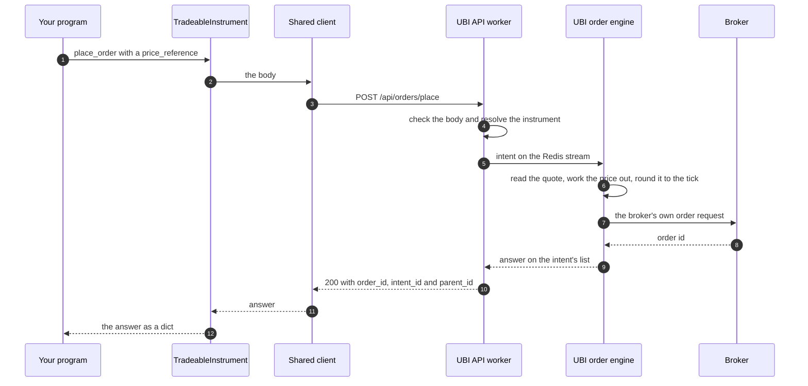

# Placing and reading orders

Every instrument that can be traded carries the members on this page. Five of them send orders to UBI, which passes them on to a broker, six read this instrument's own rows out of the day's order book and trade book, and four read the order engine's parents, which are the synthetic orders and held limit orders UBI is working. An index cannot be traded, so `EquityIndex` and the other index classes have none of these members.

!!! danger "These are real orders"
    The members with a <span class="member writes">places orders</span> badge send orders through UBI to real brokers, with real money. UBI does not check the market's hours, and a broker that accepts an order can still see it filled within milliseconds. Pass `dry_run=True` to `place_order`, `modify_order` or `cancel_order` first: UBI then builds the exact request it would send to the broker and returns it without sending anything.

The table below lists the fifteen members this page documents.

| Kind | Member | Description |
|---|---|---|
| <span class="member writes">places orders</span> | [`place_order`](#place_order) | Places one order in this instrument through UBI. |
| <span class="member writes">places orders</span> | [`modify_order`](#modify_order) | Changes one pending order through UBI. |
| <span class="member writes">places orders</span> | [`cancel_order`](#cancel_order) | Cancels one pending order through UBI. |
| <span class="member writes">places orders</span> | [`cancel_open_orders`](#cancel_open_orders) | Cancels every order in this instrument that is still waiting, whether at a broker or held in UBI's order engine. |
| <span class="member writes">places orders</span> | [`cancel_parent`](#cancel_parent) | Cancels one of the order engine's parents, with every leg it still has resting at a broker. |
| <span class="member property">property</span> | [`orders`](#orders) | Every one of today's orders in this instrument, whatever its status. |
| <span class="member property">property</span> | [`open_orders`](#open_orders) | Today's orders in this instrument that can still be changed. |
| <span class="member property">property</span> | [`completed_orders`](#completed_orders) | Today's orders in this instrument that filled in full. |
| <span class="member property">property</span> | [`rejected_orders`](#rejected_orders) | Today's orders in this instrument that a broker or the exchange refused. |
| <span class="member property">property</span> | [`cancelled_orders`](#cancelled_orders) | Today's orders in this instrument that were cancelled. |
| <span class="member property">property</span> | [`trades`](#trades) | Today's trades in this instrument. |
| <span class="member property">property</span> | [`parents`](#parents) | This instrument's synthetic orders and held orders that the order engine has not finished. |
| <span class="member method">method</span> | [`parent`](#parent) | Reads one of the order engine's parents, whether or not it has finished. |
| <span class="member method">method</span> | [`parent_orders`](#parent_orders) | Today's broker orders that one parent placed. |
| <span class="member method">method</span> | [`parent_trades`](#parent_trades) | Today's trades in the broker orders that one parent placed. |

Placing an order through a named price, such as "buy at the best bid", has its own page, [Price wrappers](price-wrappers.md). Changing a position without saying which side you are on is on [Positions](positions.md), and the fifty-four order types UBI builds out of ordinary orders are on [Synthetic orders](synthetic-orders.md). All of them end in `place_order`.

## Glossary of plain strings

The library passes the order vocabulary to UBI as plain lower-case strings, with no constants and no enums, because UBI already checks every value and answers HTTP 400 with a clear message when one is wrong. UBI ignores case, so `"buy"` and `"BUY"` are the same. The table below lists the values these members accept and return; [Vocabulary](vocabulary.md) has the full list for the whole library.

| Parameter | Values | Meaning |
|---|---|---|
| `transaction_type` | `buy`, `sell` | The side of the order. |
| `order_type` | `market` | Fill at whatever price the market offers. Takes no price. |
| | `limit` | Fill at the price given or better. Needs a price. |
| | `sl` | A stop-loss limit: waits for the trigger price, then rests a limit. Needs a price and a trigger price. |
| | `sl-m` | A stop-loss market: waits for the trigger price, then sends a market order. Needs a trigger price and takes no price. |
| `product` | `cnc` | Delivery. A buy puts shares in the demat account. |
| | `mis` | Intraday. The broker closes the position before the session ends. |
| | `nrml` | Carry forward, for futures and options held overnight. |
| `validity` | `day`, `ioc` | Good for the day, or immediate-or-cancel. UBI uses `day` when none is given. |
| `status` (returned) | `PENDING`, `OPEN`, `COMPLETE`, `CANCELLED`, `REJECTED`, `EXPIRED` | UBI's own upper-case status of an order. |
| `outcome` (returned) | `accepted`, `rejected`, `unknown`, `partial`, `armed` | What happened to the request. `partial` means some of the orders of a type that sends several at once were accepted and some were not. `armed` means the order engine is holding the order, waiting for a price or a time. |

UBI ties the price fields to the order type, and the library does not check this before sending. The table below shows the rule, which you will otherwise meet as a `BadRequestError`.

| `order_type` | `price` | `trigger_price` |
|---|:---:|:---:|
| `market` | must be absent | must be absent |
| `limit` | required | must be absent |
| `sl` | required | required |
| `sl-m` | must be absent | required |

A `price_reference` stands in for `price`, and a `quantity_reference` stands in for `quantity`. Both are described under [`place_order`](#place_order).

## Nothing is checked before sending

The library sends the price and the quantity to UBI exactly as you give them. It does not round a price to the tick size, it does not check that a quantity is a whole number of lots, and it does not check that the market is open. UBI and the broker behind it hold those rules, and their refusal is the most accurate message you can get. The consequence is that the error you see comes from UBI, as one of the exceptions on the [Errors](errors.md) page.

Quantities are always in units, never in lots. An MCX gold future has a lot of 100, so one lot is `quantity=100`, and `quantity=1` is refused with HTTP 400.

## How an order travels

The sequence below follows one order that carries a `price_reference`, from your code to the broker and back. Every order takes this path through UBI's order engine, which has placed every order since UBI removed its direct placement mode on 2026-09-27.


```mermaid
sequenceDiagram
    autonumber
    participant P as Your program
    participant I as TradeableInstrument
    participant C as Shared client
    participant A as UBI API worker
    participant E as UBI order engine
    participant B as Broker
    P->>I: place_order with a price_reference
    I->>C: the body
    C->>A: POST /api/orders/place
    A->>A: check the body and resolve the instrument
    A->>E: intent on the Redis stream
    E->>E: read the quote, work the price out, round it to the tick
    E->>B: the broker's own order request
    B-->>E: order id
    E-->>A: answer on the intent's list
    A-->>C: 200 with order_id, intent_id and parent_id
    C-->>I: answer
    I-->>P: the answer as a dict
```

A plain `day` limit order with a price of its own stops at step 6: the engine holds it, answers at once with HTTP 202 and an `outcome` of `armed`, and sends it only when the book reaches its price. [Order engine](../architecture/order-engine.md#plain-limit-orders-are-held) explains that, and UBI's page on the [order engine](https://pramodathani.github.io/unified_broker_interface/rest-api/order-engine/) describes the engine itself.

## place_order

<div class="endpoint" markdown><span class="member writes">places orders</span> `place_order(transaction_type, order_type, quantity, product, price=None, trigger_price=None, validity=None, disclosed_quantity=None, after_market=False, tag=None, dry_run=False, price_reference=None, quantity_reference=None, synthetic=None)`<span class="route"><span class="method post">POST</span> `/api/orders/place`</span></div>

This method places one order in this instrument. You never name a broker: UBI chooses one from the brokers that carry the instrument and can take the order, and the answer says which it chose. Every optional field left as `None` is left out of the request entirely, rather than sent as zero, because UBI treats a missing price and a zero price differently.

An answer with an `outcome` of `accepted` means the broker took the order, not that the order survived. The exchange can still refuse it a moment later, which is what happens to an ordinary order sent while the market is closed, so read its real fate from [`orders`](#orders). To queue an order for the next session, pass `after_market=True`.

The last three parameters describe something for UBI to work out instead of stating it. A `price_reference` names a price, such as "the second best offer", which UBI reads from the live quote and rounds to the tick when it sends the order. A `quantity_reference` names a quantity, such as "the whole position", which UBI reads from the account's positions. A `synthetic` object turns the order into one of UBI's fifty-four synthetic order types.

A plain `limit` order with a price of its own, `day` validity and no `synthetic` object is held by UBI's order engine rather than sent, until the other side of the book reaches its price. The answer then has an `outcome` of `armed`, a `parent_id` and no `order_id`, and the order is found in [`parents`](#parents) rather than in `orders`. Pass `synthetic={"type": "simple"}` to send a limit order at once, which an instrument with no live quote needs, because its held order would never be sent.

A plain `market` order that is not after-market is not sent as a market order either. The engine runs it as a `marketable_limit`, a `limit` two ticks past the other side's best price that follows that price until it fills and is cancelled after 30 seconds, and refuses it with HTTP 409 when nobody is on the other side of the book or the quote is missing or stale. `synthetic={"type": "simple"}` sends a real market order. [Order engine](../architecture/order-engine.md#market-orders-are-sent-as-marketable-limits) explains it.

#### Parameters

| Name | Type | Required | Default | Description |
|---|---|:---:|---|---|
| `transaction_type` | `str` | yes | | `buy` or `sell`. UBI overrides it for a `quantity_reference` that reduces or closes a position. |
| `order_type` | `str` | yes | | `market`, `limit`, `sl` or `sl-m`. |
| `quantity` | `int` or `None` | yes | | The quantity in units, not lots, or `None` when a `quantity_reference` supplies it. It has no default, so you have to write `None` on purpose. |
| `product` | `str` | yes | | `cnc`, `mis` or `nrml`. |
| `price` | `float` or `None` | no | `None` | The limit price in rupees. Leave it out for `market` and `sl-m`, or when a `price_reference` supplies it. |
| `trigger_price` | `float` or `None` | no | `None` | The trigger price in rupees, for `sl` and `sl-m`. |
| `validity` | `str` or `None` | no | `None` | `day` or `ioc`. UBI uses `day` when it is `None`. |
| `disclosed_quantity` | `int` or `None` | no | `None` | The part of the order to show on the exchange. `None` shows all of it. |
| `after_market` | `bool` | no | `False` | `True` sends an after-market order, which the broker queues for the next session. |
| `tag` | `str` or `None` | no | `None` | A label of up to twenty letters and digits. |
| `dry_run` | `bool` | no | `False` | `True` has UBI build the broker's request and return it without sending it. |
| `price_reference` | `dict` or `None` | no | `None` | A price for UBI to work out, such as `{"kind": "offer_level", "level": 2}`. The seven kinds are on [Price wrappers](price-wrappers.md#the-seven-price-references). |
| `quantity_reference` | `dict` or `None` | no | `None` | A quantity for UBI to work out, such as `{"kind": "liquidate_position", "product": "intraday"}`. The kinds are on [Positions](positions.md#the-quantity-reference-ubi-resolves). |
| `synthetic` | `dict` or `None` | no | `None` | A synthetic order type and its settings, such as `{"type": "bracket", "stop_price": 990, "stop_limit_price": 988, "target_price": 1010}`. The classes on [Synthetic orders](synthetic-orders.md) build it for you. |

#### Example

The first example below is a dry run of a plain limit buy of one RELIANCE share at 1000 rupees. The second asks UBI to price the order at the best offer instead of stating a price. Both outputs were captured from a local UBI on Saturday 2026-09-26, with the market closed, in two separate runs, the day before UBI began holding plain limit orders; the plain limit order's dry run may answer differently today. They are reformatted across lines, and the broker account identifier in `actid` and `uid` is replaced with `XX000000`.

=== "Python"

    ```python
    from tradingmachine.assets import equities

    reliance = equities.Equity("nse", "RELIANCE")

    answer = reliance.place_order(
        "buy",
        "limit",
        1,
        "cnc",
        price=1000,
        dry_run=True,
    )
    print(answer)

    answer = reliance.place_order(
        "buy",
        "limit",
        1,
        "cnc",
        price_reference={
            "kind": "offer_level",
            "level": 1,
        },
        dry_run=True,
    )
    print(answer)
    ```

=== "Output: plain limit"

    ```python
    {'broker': 'shoonya',
     'dry_run': True,
     'instrument_id': '3f92570a-9924-5bf5-9f9d-e006cd9f4202',
     'intent_id': '520360eee8e9494ab580e96e093d715c',
     'request': {'form': {'actid': 'XX000000',
                          'amo': 'NO',
                          'dscqty': '0',
                          'exch': 'NSE',
                          'ordersource': 'API',
                          'prc': '1000',
                          'prctyp': 'LMT',
                          'prd': 'C',
                          'qty': '1',
                          'ret': 'DAY',
                          'trantype': 'B',
                          'trgprc': '0',
                          'tsym': 'RELIANCE-EQ',
                          'uid': 'XX000000'},
                 'method': 'POST',
                 'url': 'https://api.shoonya.com/NorenWClientAPI/PlaceOrder'},
     'skipped': [],
     'tag': None,
     'timing_ms': {'preparation': 1.594}}
    ```

=== "Output: price reference"

    ```python
    {'broker': 'stoxkart',
     'dry_run': True,
     'instrument_id': '3f92570a-9924-5bf5-9f9d-e006cd9f4202',
     'intent_id': '584e0a7f6cb84dc18fe0e64da9f4db69',
     'request': {'json': {'action': 'BUY',
                          'algo_id': '99999',
                          'disclose_quantity': '0',
                          'exchange': 'NSE',
                          'order_type': 'LIMIT',
                          'price': '1226.0',
                          'product_type': 'DELIVERY',
                          'quantity': '1',
                          'stop_loss_price': '0',
                          'token': '2885',
                          'trailing_stop_loss': '0',
                          'trigger_price': '0',
                          'validity': 'DAY'},
                 'method': 'POST',
                 'url': 'https://openapi.stoxkart.com/orders/normal'},
     'skipped': [],
     'tag': None,
     'timing_ms': {'preparation': 1.98}}
    ```

The outputs show three things worth knowing:

- UBI chose a different broker for each request, `shoonya` and then `stoxkart`, because its selector takes turns among the brokers that can take the order.
- The lower-case `"buy"`, `"limit"` and `"cnc"` reached each broker in that broker's own spelling: `trantype: B`, `prctyp: LMT` and `prd: C` for Shoonya, and `DELIVERY` for Stoxkart.
- The price reference was resolved to `1226.0`, which was the one level on the offer side of the book in the quote captured the same afternoon.

#### Returns

A `dict`, which is UBI's answer unchanged. The table below lists its keys; which of them appear depends on whether the order was sent, was a dry run, or is held inside UBI's order engine.

| Key | Type | Description |
|---|---|---|
| `broker` | `str` or `None` | The broker UBI chose. It is `None` for a held limit order or a synthetic order that is waiting for a price or a time. |
| `instrument_id` | `str` | The instrument the order was for. |
| `order_id` | `str` or `None` | The broker's id for the order, which `modify_order` and `cancel_order` take. It is `None` unless the outcome is `accepted`. |
| `outcome` | `str` | `accepted`, `rejected` or `unknown`; `partial` for a type that sends several orders when only some were accepted, which UBI answers with HTTP 207 and the library returns rather than raises; or `armed` for an order the engine is holding. Absent on a dry run. |
| `status_message` | `str` or `None` | Why the outcome is not `accepted`. |
| `broker_response` | `dict`, `str` or `None` | The broker's own answer. |
| `dry_run` | `bool` | `True`, on a dry run only. |
| `request` | `dict` | On a dry run only: the method, the URL and the body the broker would have received. |
| `skipped` | `list` | Each broker UBI passed over before the one it chose, with its reason. |
| `tag` | `str` or `None` | The tag the order carried. |
| `timing_ms` | `dict` | How long UBI spent preparing the order, and how long the broker took. |
| `intent_id` | `str` | The id of the order's intent in UBI's order engine, on every answer. [`Account.intent`](account.md#intent) reads the answer again by it. |
| `parent_id` | `str` | Present for an order the engine recorded as a parent, including a held limit order. Keep it: it is the only handle on an order that has not reached a broker yet. |
| `legs` | `list` | Present for the types that send several orders at once, such as `freeze_slicer` and `ladder`, one entry per order with its plan `path`, `instrument_id`, `outcome`, `order_id` and `status_message`. |

#### Raises

| Exception | When |
|---|---|
| `BadRequestError` | A field is invalid, the price fields do not fit the order type, or a synthetic order's own settings are wrong. |
| `LossLockoutError` | The day's loss is past UBI's daily loss limit. |
| `NotFoundError` | No broker has a mapping for this instrument today. |
| `ConflictError` | A `quantity_reference` asked to reduce or close a position that is not held, a market order run as a marketable limit found nobody on the other side of the book or no fresh quote, a reduce-only order would not reduce the position, or the engine read the order too late or had already started it before a restart. |
| `OrderRejectedError` | The broker refused the order. Its answer is in the exception's `detail`, not in its message. |
| `RateLimitError` | The broker's daily order cap has no room for this order. |
| `ServiceUnavailableError` | No broker could take the order, the order engine is not running, or a `price_reference` could not be resolved, for example because the book is empty. |
| `OrderOutcomeUnknownError` | The order was sent but its outcome is unknown. Read [`orders`](#orders), or [`Account.intent`](account.md#intent) with the `intent_id` in the exception's `detail`, before sending it again, or you may place it twice. |
| `UnifiedBrokerInterfaceError` | Any other failure reported by, or on the way to, UBI. |

Each of these is described, with what to do next, on the [Errors](errors.md) page.

??? note "Under the hood"
    The method builds a JSON body from its arguments and sends it with the shared client's `post`. The six fields that are always present come first, and each optional field is added only when it is not `None`. For the price-reference example above, the body was:

    ```json
    {
      "instrument_id": "3f92570a-9924-5bf5-9f9d-e006cd9f4202",
      "transaction_type": "buy",
      "order_type": "limit",
      "product": "cnc",
      "after_market": false,
      "dry_run": true,
      "quantity": 1,
      "price_reference": {"kind": "offer_level", "level": 1}
    }
    ```

    Nothing else is sent: one call is one request. UBI's route is documented under [Place an order](https://pramodathani.github.io/unified_broker_interface/rest-api/orders/#place-an-order).

## modify_order

<div class="endpoint" markdown><span class="member writes">places orders</span> `modify_order(order_id=None, quantity=None, price=None, trigger_price=None, order_type=None, validity=None, disclosed_quantity=None, broker=None, dry_run=False, parent_id=None, part=None)`<span class="route"><span class="method put">PUT</span> `/api/orders/modify`</span></div>

This method changes one order that is still waiting in the market. Give at least one field to change; every field left as `None` keeps the value the order already has. UBI finds the order by its id in the brokers' order books, so the method does not check that the order belongs to the instrument you called it on.

UBI's order books are copies that its own collectors refresh every few seconds, so an order placed a moment ago is not in them yet, and changing it raises `NotFoundError`. In a live test on 2026-09-20 an order took 2.0 seconds to appear. Wait until the order shows up in [`orders`](#orders) before you change it.

An order that is a leg of one of UBI's synthetic orders is handed to the order engine, which lets the order type carry on from the change: a trailing stop trails from the trigger you set, and a chaser steps on from the price you set. Only such a leg's `price`, `trigger_price` and `quantity` can change, and anything else raises `ConflictError`.

An order the engine is still holding, such as a plain limit order waiting for the book to reach its price, has no broker order id yet. Name it by `parent_id` instead of `order_id`. Only its `price` and `quantity` can change, nothing is sent to a broker, and the order is later sent at the new terms.

#### Parameters

| Name | Type | Required | Default | Description |
|---|---|:---:|---|---|
| `order_id` | `str` or `None` | one of the two | `None` | The id the broker gave the order, as `place_order` returned it. |
| `quantity` | `int` or `None` | no | `None` | The new total quantity in units, counting what has already filled. |
| `price` | `float` or `None` | no | `None` | The new limit price in rupees. |
| `trigger_price` | `float` or `None` | no | `None` | The new trigger price in rupees. |
| `order_type` | `str` or `None` | no | `None` | The new order type: `market`, `limit`, `sl` or `sl-m`. |
| `validity` | `str` or `None` | no | `None` | The new validity: `day` or `ioc`. |
| `disclosed_quantity` | `int` or `None` | no | `None` | The new quantity to show on the exchange. |
| `broker` | `str` or `None` | no | `None` | The broker holding the order. It is needed only after a `ConflictError` that says two brokers share the id. |
| `dry_run` | `bool` | no | `False` | `True` has UBI build the broker's request and return it without sending it. |
| `parent_id` | `str` or `None` | one of the two | `None` | The `parent_id` of an order the engine is still holding, or of the plan that holds `part`, as `place_order` returned it. |
| `part` | `str` or `None` | no | `None` | With `parent_id`, the path of a part of a `plan` order that has not been sent, such as `root.each_fill.children.0` for a bracket's stop. Its `price`, `trigger_price` and `quantity` can change, and it keeps them until its turn comes. |

#### Example

The first example below changes a held limit order by its `parent_id`. The second sends a limit order to the broker at once, with the `simple` type, waits for it to appear and then lowers its price. No output was captured for either, because both would change a real order.

=== "Python, a held order"

    ```python
    held = reliance.buy_at_limit_price(price=1000, quantity=1, product="cnc")
    reliance.modify_order(parent_id=held["parent_id"], price=995)
    ```

=== "Python, a broker order"

    ```python
    import time

    answer = reliance.place_order(
        "buy",
        "limit",
        1,
        "cnc",
        price=1000,
        after_market=True,
        synthetic={
            "type": "simple",
        },
    )
    order_id = answer["order_id"]

    for attempt in range(30):
        frame = reliance.open_orders
        if frame is not None and order_id in set(frame["order_id"]):
            break
        time.sleep(2)

    reliance.modify_order(order_id, price=995, broker=answer["broker"])
    ```

#### Returns

A `dict` with `broker`, `order_id`, `instrument_id`, `status_before_modify`, `outcome`, `status_message`, `broker_response` and `timing_ms`, plus `parent_id` and `synthetic_type` for a leg of a synthetic order. On a dry run it holds `dry_run` and the `request` UBI would have sent instead. A held order answers with `parent_id`, `synthetic_type`, `held` set to `True`, the new `price` and `quantity`, and an `outcome` of `accepted`.

#### Raises

| Exception | When |
|---|---|
| `BadRequestError` | No field was given to change, or a field is invalid or is one this broker cannot change. |
| `NotFoundError` | No broker's order book holds this order id, which is also what a very new order gives, or the engine holds no parent with this `parent_id`. |
| `ConflictError` | The order is already complete, cancelled, rejected or expired; two brokers hold the same id and the exception's `detail` lists them under `brokers`; a leg of a synthetic order was asked to change a field other than its price, trigger price or quantity; or a held order has already been sent, when the `detail` names its `broker` and `order_id`. |
| `OrderRejectedError` | The broker refused the change. |
| `ServiceUnavailableError` | The broker's order rate budget was full, so the change was not sent. It is worth retrying a moment later. |
| `OrderOutcomeUnknownError` | The change was sent but its outcome is unknown. |
| `UnifiedBrokerInterfaceError` | Any other failure reported by, or on the way to, UBI. |

??? note "Under the hood"
    The body holds `dry_run`, plus `order_id` or `parent_id` and each field that is not `None`, and it is sent with the shared client's `put`. UBI's route is documented under [Modify an order](https://pramodathani.github.io/unified_broker_interface/rest-api/orders/#modify-an-order).

## cancel_order

<div class="endpoint" markdown><span class="member writes">places orders</span> `cancel_order(order_id, broker=None, dry_run=False)`<span class="route"><span class="method delete">DELETE</span> `/api/orders/cancel`</span></div>

This method cancels one order that is still waiting in the market. Like `modify_order`, it finds the order by id across every broker's order book, does not check which instrument it belongs to, and cannot see an order placed in the last few seconds.

An order that is a leg of one of UBI's synthetic orders is cancelled through the order engine, so the order type knows about it, but the synthetic order itself carries on. [`cancel_parent`](#cancel_parent) stops a synthetic order, and it is also how an order the engine is still holding is cancelled, because such an order has no broker order id. Since 2026-10-05 a leg cancelled this way stays cancelled: a bracket's stop is not placed again, and the leg's unfilled quantity comes off what its part trades, so a later fill of the entry is protected for the smaller quantity only.

#### Parameters

| Name | Type | Required | Default | Description |
|---|---|:---:|---|---|
| `order_id` | `str` | yes | | The id the broker gave the order. |
| `broker` | `str` or `None` | no | `None` | The broker holding the order, needed only when two brokers share the id. |
| `dry_run` | `bool` | no | `False` | `True` has UBI build the broker's request and return it without sending it. |

#### Example

The example below cancels an order, naming the broker from the answer that placed it.

=== "Python"

    ```python
    reliance.cancel_order(order_id, broker=answer["broker"])
    ```

#### Returns

A `dict` with `broker`, `order_id`, `status_before_cancel`, `outcome`, `status_message`, `broker_response` and `timing_ms`, plus `parent_id` and `synthetic_type` for a leg of a synthetic order, or, on a dry run, `dry_run` and the `request` UBI would have sent.

#### Raises

| Exception | When |
|---|---|
| `BadRequestError` | The order id, the broker or the dry run flag is malformed. |
| `NotFoundError` | No broker's order book holds this order id. |
| `ConflictError` | The order is already complete, cancelled, rejected or expired, or two brokers hold the same id. |
| `OrderRejectedError` | The broker refused the cancellation. |
| `ServiceUnavailableError` | The broker's order rate budget was full, so the cancellation was not sent. |
| `OrderOutcomeUnknownError` | The cancellation was sent but its outcome is unknown. |
| `UnifiedBrokerInterfaceError` | Any other failure reported by, or on the way to, UBI. |

??? note "Under the hood"
    The body holds `order_id`, `dry_run` and, when given, `broker`, and it is sent with the shared client's `delete`. UBI's route is documented under [Cancel an order](https://pramodathani.github.io/unified_broker_interface/rest-api/orders/#cancel-an-order).

## cancel_open_orders

<div class="endpoint" markdown><span class="member writes">places orders</span> `cancel_open_orders()`<span class="route"><span class="method get">GET</span> `/api/orders/parents` and `/api/orders/details`, then <span class="method delete">DELETE</span> `/api/orders/parents` per parent and one <span class="method delete">DELETE</span> `/api/orders/cancel` for the rest</span></div>

This method cancels every order in this instrument that is still waiting, whether it rests at a broker or is held in UBI's order engine. The numbered steps below are what it does.

1. It reads this instrument's open [`parents`](#parents) and cancels each with [`cancel_parent`](#cancel_parent). The parents go first, because a synthetic order left running could place a new order after its old ones had been cancelled.
2. It reads [`open_orders`](#open_orders) and leaves out every order whose `engine_parent_id` is a parent the engine took a cancel for, because the engine has already dealt with it. An order whose parent's cancel failed is kept, so it is still cancelled.
3. It cancels every remaining order in one request, naming the broker from each order's row, using the list form of UBI's cancel route.

Every parent and order is attempted even when an earlier one fails, and a failure is reported in the returned frame rather than raised, so one order that can no longer be cancelled does not leave the rest open. A parent whose cancel a broker refused for one leg is reported as not cancelled, because that leg may still be live.

It has no `dry_run` argument. To see what it would cancel, read `parents` and `open_orders` yourself first.

#### Parameters

The method takes no parameters.

#### Example

The output below is built from the code rather than captured, because running the method cancels real orders. It shows a held limit order cancelled through its parent, one broker order cancelled, and one that had filled a moment before; the ids are invented, and the error text is UBI's HTTP 409 message for an order that is already finished.

=== "Python"

    ```python
    outcome = reliance.cancel_open_orders()
    print(outcome)
    ```

=== "Output"

    ```text
                                  parent_id    order_id     broker  cancelled                                    error
    0  00000000-0000-4000-8000-000000000002        None       None       True                                     None
    1                                  None  2609260001    zerodha       True                                     None
    2                                  None  2609260002  flattrade      False  HTTP 409: the order is already COMPLETE
    ```

#### Returns

A `pandas.DataFrame` with one row per parent and per order, or `None` when nothing in this instrument is waiting.

| Column | Type | Description |
|---|---|---|
| `parent_id` | `str` or `None` | The parent cancelled, or `None` for an order cancelled on its own. |
| `order_id` | `str` or `None` | The broker's id for the order, or `None` for a parent. |
| `broker` | `str` or `None` | The broker holding the order, or `None` for a parent. |
| `cancelled` | `bool` | Whether the cancellation was accepted. |
| `error` | `str` or `None` | Why it was not: the exception's class name and message for a parent, or the HTTP status and UBI's message for an order. `None` when it was. |

#### Raises

| Exception | When |
|---|---|
| `BrokerError` | No broker's order book could be read. |
| `ServiceUnavailableError` | UBI's order book document is missing or too old to serve, or UBI's parents could not be read. |
| `UnifiedBrokerInterfaceError` | The order book or the parents could not be read for any other reason, or UBI refused the list of cancels as a whole. A failure to cancel one order or parent is reported in the frame instead. |

## Reading the order book

UBI serves the whole account's order book and trade book, across every broker, and has no route for one instrument. So each property below reads the whole book, one request per access, and keeps the rows whose `instrument_id` matches this instrument. The book is not merged across brokers: one order at one broker is one row, and the same instrument traded at two brokers gives a row from each. A row whose `instrument_id` UBI could not work out is invisible here, because there is no other field that names the instrument reliably.

The table below shows which statuses each property keeps. An order still waiting in the market is `PENDING` at some brokers and `OPEN` at others, which is why `open_orders` takes both.

| Property | Statuses kept |
|---|---|
| `orders` | all six |
| `open_orders` | `PENDING`, `OPEN` |
| `completed_orders` | `COMPLETE` |
| `rejected_orders` | `REJECTED` |
| `cancelled_orders` | `CANCELLED` |

A status with no property of its own, such as `EXPIRED`, is found by filtering the `status` column of `orders`. An order UBI's order engine is still holding has not reached a broker, so it is in none of these frames; it is in [`parents`](#parents). Every property returns `None`, not an empty frame, when no row matches, and each access sends a new request, so bind the frame to a variable when you need it twice.

### orders

<div class="endpoint" markdown><span class="member property">property</span> `orders`<span class="route"><span class="method get">GET</span> `/api/orders/details`</span></div>

This property gives every one of today's orders in this instrument, whatever its status.

#### Example

The output below was captured from a local UBI on 2026-09-26. The account had placed no RELIANCE order that day, so the property returned `None`.

=== "Python"

    ```python
    frame = reliance.orders
    print(frame)

    if frame is not None:
        expired = frame[frame["status"] == "EXPIRED"]
    ```

=== "Output"

    ```text
    None
    ```

#### Returns

A `pandas.DataFrame` with UBI's order fields, or `None` when this instrument has no orders today. The table lists the columns the library's docstring names; UBI's [order book](https://pramodathani.github.io/unified_broker_interface/rest-api/orders/#order-book) page lists every field.

| Column | Type | Description |
|---|---|---|
| `broker` | `str` | The broker holding the order. |
| `order_id` | `str` | The broker's id for the order. |
| `status` | `str` | `PENDING`, `OPEN`, `COMPLETE`, `CANCELLED`, `REJECTED` or `EXPIRED`. |
| `status_message` | `str` or `None` | Why an order was rejected, in the words of whoever refused it. |
| `transaction_type` | `str` | `BUY` or `SELL`. |
| `product` | `str` | `CNC`, `MIS` or `NRML`. |
| `order_type` | `str` | `MARKET`, `LIMIT`, `SL` or `SL-M`. |
| `quantity` | number | The order's quantity in units. |
| `filled_quantity` | number | How much has filled. |
| `price` | number | The limit price. |
| `trigger_price` | number | The trigger price. |
| `average_price` | number | The average fill price. |
| `order_timestamp` | `str` | When the order was placed. |
| `engine_parent_id` | `str` or `None` | The order engine parent that placed the order, or `None` for an order placed elsewhere. |
| `leg_role` | `str` or `None` | The order's role in that parent, such as `entry`, `stop`, `target` or `slice`. |
| `synthetic_type` | `str` or `None` | The parent's order type, such as `bracket` or `virtual_limit`. |
| `intent_id` | `str` or `None` | The intent the parent was placed for, as the place answer named it. |

A column that is null in every row comes back from pandas as `NaN` rather than `None`.

#### Raises

| Exception | When |
|---|---|
| `BrokerError` | No broker's order book could be read. |
| `ServiceUnavailableError` | UBI's order book document is missing or too old to serve. This means UBI's own background writer stopped, not that a broker is down. |
| `UnifiedBrokerInterfaceError` | Any other failure reported by, or on the way to, UBI. |

### open_orders

<div class="endpoint" markdown><span class="member property">property</span> `open_orders`<span class="route"><span class="method get">GET</span> `/api/orders/details`</span></div>

This property gives today's orders in this instrument that are still waiting in the market, which are the only ones `modify_order` and `cancel_order` will accept. It returns a frame shaped like [`orders`](#orders), or `None`, and raises the same exceptions.

### completed_orders

<div class="endpoint" markdown><span class="member property">property</span> `completed_orders`<span class="route"><span class="method get">GET</span> `/api/orders/details`</span></div>

This property gives today's orders in this instrument that filled in full. It returns a frame shaped like [`orders`](#orders), or `None`, and raises the same exceptions.

### rejected_orders

<div class="endpoint" markdown><span class="member property">property</span> `rejected_orders`<span class="route"><span class="method get">GET</span> `/api/orders/details`</span></div>

This property gives today's orders in this instrument that a broker or the exchange refused. The `status_message` column holds the reason, which is the first place to look after an `accepted` order that never filled. It returns a frame shaped like [`orders`](#orders), or `None`, and raises the same exceptions.

### cancelled_orders

<div class="endpoint" markdown><span class="member property">property</span> `cancelled_orders`<span class="route"><span class="method get">GET</span> `/api/orders/details`</span></div>

This property gives today's orders in this instrument that were cancelled. It returns a frame shaped like [`orders`](#orders), or `None`, and raises the same exceptions.

### trades

<div class="endpoint" markdown><span class="member property">property</span> `trades`<span class="route"><span class="method get">GET</span> `/api/orders/trades`</span></div>

This property gives today's trades in this instrument. One order can fill in several trades, and each trade names the order it came from, so `trades` is where to look for the prices an order actually filled at.

#### Returns

A `pandas.DataFrame` with UBI's trade fields, or `None` when this instrument has no trades today. The columns the library's docstring names are listed below; UBI's [trade book](https://pramodathani.github.io/unified_broker_interface/rest-api/orders/#trade-book) page lists every field.

| Column | Type | Description |
|---|---|---|
| `broker` | `str` | The broker the trade happened at. |
| `trade_id` | `str` | The id of the trade. |
| `order_id` | `str` | The order the trade filled. |
| `transaction_type` | `str` | `BUY` or `SELL`. |
| `product` | `str` | `CNC`, `MIS` or `NRML`. |
| `quantity` | number | The quantity traded. |
| `price` | number | The price it traded at. |
| `value` | number | The quantity times the price. |
| `trade_timestamp` | `str` | When it traded. |
| `engine_parent_id`, `leg_role`, `synthetic_type`, `intent_id` | `str` or `None` | The order engine parent the trade's order belongs to, as for an order, or `None` for an order placed elsewhere. |

#### Raises

| Exception | When |
|---|---|
| `BrokerError` | No broker's trade book could be read. |
| `ServiceUnavailableError` | UBI's trade book document is missing or too old to serve. |
| `UnifiedBrokerInterfaceError` | Any other failure reported by, or on the way to, UBI. |

## Reading the order engine's parents

A parent is one order the order engine was asked for, such as a bracket, a trailing stop or a held limit order, and its legs are the broker orders it placed. Every answer from the engine for such an order carries a `parent_id`, which the members below take. The classes on [Synthetic orders](synthetic-orders.md) keep their own `parent_id` and call these members for you.

### cancel_parent

<div class="endpoint" markdown><span class="member writes">places orders</span> `cancel_parent(parent_id, part=None, dry_run=False)`<span class="route"><span class="method delete">DELETE</span> `/api/orders/cancel`</span></div>

This method cancels one parent, with every leg it still has resting at a broker, so the parent places, moves and cancels nothing more. It is how a synthetic order is stopped and how a held limit order is cancelled. A position the parent has already opened is not closed.

When a broker refuses the cancel of one leg, or its outcome is unknown, UBI answers HTTP 207, which the library returns rather than raises, and the parent's `state` is `cancelling` rather than `cancelled`. The parent no longer acts, and becomes `cancelled` on its own once the broker reports that leg finished. Read `cancelled_legs` to see which leg may still be live, and call the method again to retry it.

#### Parameters

| Name | Type | Required | Default | Description |
|---|---|:---:|---|---|
| `parent_id` | `str` | yes | | The `parent_id` that `place_order` answered with. |
| `part` | `str` or `None` | no | `None` | The path of one part of a `plan` order to cancel, such as `root.each_fill.children.0`, as the parent's `parameters.parts` lists it. The rest of the plan carries on. `None` cancels the whole parent. |
| `dry_run` | `bool` | no | `False` | `True` has UBI say what would be cancelled, without cancelling anything. |

#### Example

The example below places a held limit order and cancels it again. No output was captured for it, because it places and cancels a real order.

=== "Python"

    ```python
    held = reliance.buy_at_limit_price(price=1000, quantity=1, product="cnc")
    answer = reliance.cancel_parent(held["parent_id"])
    print(answer["state"])
    ```

#### Returns

A `dict` with `parent_id`, `synthetic_type`, `state`, `intent_id` and `cancelled_legs`, which holds one entry per leg with its `leg_id`, `broker`, `order_id`, `outcome` and `status_message`. A part answers instead with `parent_id`, `synthetic_type`, `part`, its `state`, `outcome`, `status_message`, `intent_id` and `orders`, where each order's `cancel_accepted` says whether its broker accepted the cancel.

#### Raises

| Exception | When |
|---|---|
| `BadRequestError` | The parent id is malformed. |
| `NotFoundError` | The order engine holds no parent with this id, or the plan has no part at this path. |
| `ConflictError` | The parent or part has already finished, the part is kept whole and has not started, or the parent is not a plan and was given a part. |
| `ServiceUnavailableError` | The order engine is not running. |
| `OrderOutcomeUnknownError` | The engine did not answer in time. |
| `UnifiedBrokerInterfaceError` | Any other failure reported by, or on the way to, UBI. |

### parents

<div class="endpoint" markdown><span class="member property">property</span> `parents`<span class="route"><span class="method get">GET</span> `/api/orders/parents`</span></div>

This property gives this instrument's parents that the order engine has not finished. It is the only way to see a parent that has placed nothing yet, such as a held limit order or an armed trigger. UBI lists every open parent in the account, so the property reads them all and keeps this instrument's; [`Account.parents`](account.md#parents) gives the whole list.

#### Returns

A `pandas.DataFrame` with one row per parent, or `None` when no parent in this instrument is open. The table lists its main columns.

| Column | Type | Description |
|---|---|---|
| `parent_order_id` | `str` | The parent's id, which is the `parent_id` the other members take. |
| `synthetic_type` | `str` | `plan` for every type but `simple`, since UBI runs every other type as a plan of its preset; the type asked for is under `parameters` as `routed_from`. |
| `state` | `str` | `received`, `working` or `cancelling`; a parent placed before 2026-10-03 can also show `protecting`. The finished states, `completed`, `cancelled`, `rejected` and `failed`, do not appear here. |
| `instrument_id` | `str` | This instrument. |
| `body` | `dict` | The order body the parent was placed with. |
| `parameters` | `dict` | The type's settings, including the engine's own working values. |
| `legs` | `list` | One entry per broker order the parent placed. |

#### Raises

| Exception | When |
|---|---|
| `ServiceUnavailableError` | UBI's parents could not be read. |
| `UnifiedBrokerInterfaceError` | Any other failure reported by, or on the way to, UBI. |

### parent

<div class="endpoint" markdown><span class="member method">method</span> `parent(parent_id)`<span class="route"><span class="method get">GET</span> `/api/orders/parents?parent_id=...`</span></div>

This method reads one parent, whether or not it has finished. UBI finds it by id alone, so the method does not check that it belongs to this instrument. It returns a `dict` with the same fields as a row of [`parents`](#parents), and raises `NotFoundError` when the engine holds no parent with this id.

### parent_orders

<div class="endpoint" markdown><span class="member method">method</span> `parent_orders(parent_id)`<span class="route"><span class="method get">GET</span> `/api/orders/details?parent_id=...`</span></div>

This method gives today's broker orders that one parent placed, using the order book's `parent_id` filter. It returns a frame shaped like [`orders`](#orders), whose `leg_role` column says what each order was to the parent, or `None` when the parent has placed nothing the order book shows yet. It raises the same exceptions as `orders`.

### parent_trades

<div class="endpoint" markdown><span class="member method">method</span> `parent_trades(parent_id)`<span class="route"><span class="method get">GET</span> `/api/orders/trades?parent_id=...`</span></div>

This method gives today's trades in the broker orders that one parent placed. It returns a frame shaped like [`trades`](#trades), or `None` when none of the parent's orders has traded, and raises the same exceptions as `trades`.
