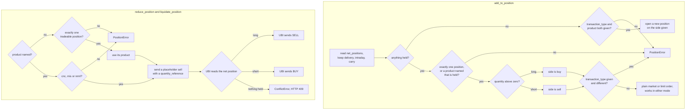

# Positions

A position is what a futures or options trade, or an intraday trade in shares, leaves open: a quantity you are long or short that has not been closed yet. The members on this page read this instrument's positions and change them without being told which side you are on, so a long position is reduced by selling and a short one by buying back. Shares kept in a demat account are holdings rather than positions, and they are on [Holdings](holdings.md).

!!! danger "These are real orders"
    The four members with a <span class="member writes">places orders</span> badge send market or limit orders through UBI to real brokers, with real money, and none of them takes a `dry_run` argument. `reduce_position` and `liquidate_position` also let UBI choose the side, which is the point of them, so read [`net_positions`](#net_positions) first and be sure of what you hold. To preview one, send the same body through [`place_order`](orders.md#place_order) with `dry_run=True`, as [Under the hood](#reduce_position) shows.

The table below lists the eight members this page documents.

| Kind | Member | Description |
|---|---|---|
| <span class="member property">property</span> | [`net_positions`](#net_positions) | The positions held in this instrument now, merged across every broker. |
| <span class="member property">property</span> | [`day_positions`](#day_positions) | Today's own positions in this instrument, without what was carried in. |
| <span class="member property">property</span> | [`positions_value`](#positions_value) | What this instrument's open positions are worth at the moment. |
| <span class="member property">property</span> | [`positions_pnl`](#positions_pnl) | What this instrument's positions have made or lost. |
| <span class="member writes">places orders</span> | [`add_to_position`](#add_to_position) | Makes an existing position bigger, or opens a new one. |
| <span class="member writes">places orders</span> | [`reduce_position`](#reduce_position) | Makes an existing position smaller, without turning it around. |
| <span class="member writes">places orders</span> | [`liquidate_position`](#liquidate_position) | Closes one position in this instrument completely. |
| <span class="member writes">places orders</span> | [`liquidate_all_positions`](#liquidate_all_positions) | Closes every position this instrument holds, under every product. |

## Two names for one product

UBI names a position's product with one set of words and takes orders with another, and this is the trap on this page. A position you opened with `product="mis"` comes back from [`net_positions`](#net_positions) with `product` set to `intraday`. The table below shows the whole mapping.

| Product an order is sent with | Product a position reports | Can the library close it? |
|---|---|:---:|
| `cnc` | `delivery` | :material-check: |
| `mis` | `intraday` | :material-check: |
| `nrml` | `carry` | :material-check: |
| none | `margin_trading` | :material-close: |
| none | `cover` | :material-close: |
| none | `bracket` | :material-close: |

Every member that changes a position takes `product` in the order spelling, `cnc`, `mis` or `nrml`, and translates it. The last three rows come from order kinds UBI's place route cannot send, such as a broker's own bracket or cover order, so there is no order these members could write to close them. `add_to_position`, `reduce_position` and `liquidate_position` ignore those positions entirely, as though they were not there, which means you can hold a `bracket` position and be told nothing is held. `liquidate_all_positions` reports each one as ignored instead, with the reason, and such a position has to be closed at the broker directly. `positions_value` and `positions_pnl` count all six, because every one of them is real money.

## How the side is chosen

The flowchart below shows how each of the four writing members decides which side to send. `add_to_position` works the side out itself and sends a plain order. `reduce_position` and `liquidate_position` hand the decision to UBI, which reads the position when it sends the order.



The practical difference between the two paths is where a mistake is caught. A missing position is a `PositionError` raised here when you named no product, because the library had to read the positions to find the only one. When you named a product, nothing is read here, and a product that is not held comes back from UBI as `ConflictError`.

## The quantity reference UBI resolves

`reduce_position` and `liquidate_position` send a `quantity_reference`, a small dictionary that describes the quantity instead of stating it. UBI's order engine reads the account's positions when it sends the order, adds up the signed quantity of every row for this instrument and product, and decides the quantity and the side from that total. The table below lists the four kinds UBI accepts; the library sends the last two.

| `kind` | Quantity sent | Side sent | Refused when |
|---|---|---|---|
| `absolute` | The body's `quantity` | The body's `transaction_type` | `quantity` is missing or below 1 |
| `add_to_position` | The body's `quantity` | The body's `transaction_type` | `quantity` is missing or below 1 |
| `reduce_position` | The smaller of the body's `quantity` and the position | `SELL` for a long, `BUY` for a short | Nothing is held (HTTP 409) |
| `liquidate_position` | The whole position | `SELL` for a long, `BUY` for a short | Nothing is held (HTTP 409) |

The reference's optional `product` is spelled the positions' way, `delivery`, `intraday` or `carry`, not the order way. The library translates it for you. UBI's `add_to_position` kind reads no position, so it cannot choose a side, and that is why `add_to_position` still works the side out in the library rather than sending a reference.

Only UBI's order engine resolves a quantity reference, so `reduce_position` and `liquidate_position` need UBI running in engine mode, and they raise `DirectPlacementError` without sending anything when it is not. UBI's page on [quantity references](https://pramodathani.github.io/unified_broker_interface/rest-api/price-quantity-references/#quantity-references) has the full rules.

## Reading positions

UBI serves the whole account's positions and has no route for one instrument, so each property below sends one request per access and keeps this instrument's rows. UBI merges positions across brokers by instrument and product, so one instrument gives one row per product it is held under, and no row names a broker. Bind the result to a variable when you need it twice.

### net_positions

<div class="endpoint" markdown><span class="member property">property</span> `net_positions`<span class="route"><span class="method get">GET</span> `/api/portfolio/positions`</span></div>

This property gives the positions held in this instrument now, whenever they were opened. It is UBI's `net` bucket, and it is the one every other member on this page reads.

#### Example

The output below was captured from a local UBI on 2026-09-26. No position was held in RELIANCE, so the property returned `None`.

=== "Python"

    ```python
    from tradingmachine.assets import equities

    reliance = equities.Equity("nse", "RELIANCE")
    print(reliance.net_positions)
    ```

=== "Output"

    ```text
    None
    ```

#### Returns

A `pandas.DataFrame` with one row per product held, or `None` when nothing is held in this instrument. The columns are UBI's position fields, listed below.

| Column | Type | Description |
|---|---|---|
| `instrument_id` | `str` | The instrument. |
| `symbol` | `str` | The symbol for a security, or the underlying for a derivative. |
| `exchange` | `str` | The exchange. |
| `segment` | `str` | The exchange-prefixed segment, such as `mcx_commodity_futures`. |
| `expiry_date`, `strike_price`, `option_type` | `str`, number, `str`, or `None` | The contract, for a derivative. |
| `product` | `str` | `delivery`, `intraday`, `carry`, `margin_trading`, `cover` or `bracket`. |
| `quantity` | number | The net quantity in units, positive when long and negative when short. |
| `buy`, `sell` | `dict` | Each side's `quantity`, `average_price` and `value`. |
| `average_price` | number | The average price of the open quantity. |
| `last_price` | number or `None` | From the live quote when there is one, otherwise the price a broker sent. |
| `pnl` | `dict` | `realized`, `unrealized` and `total`, as the brokers report them. |
| `day_change`, `day_change_percentage` | number or `None` | The change since the previous close. |

#### Raises

| Exception | When |
|---|---|
| `BrokerError` | No broker's positions could be read. |
| `ServiceUnavailableError` | UBI's positions document is missing or more than 30 seconds old. |
| `UnifiedBrokerInterfaceError` | Any other failure reported by, or on the way to, UBI. |

### day_positions

<div class="endpoint" markdown><span class="member property">property</span> `day_positions`<span class="route"><span class="method get">GET</span> `/api/portfolio/positions`</span></div>

This property gives only what was opened and closed today in this instrument, UBI's `day` bucket. It has the same columns as [`net_positions`](#net_positions) and raises the same exceptions. It is usually `None` even when `net_positions` is not, because only some brokers report positions on a day basis at all, so use `net_positions` to find out what you hold.

### positions_value

<div class="endpoint" markdown><span class="member property">property</span> `positions_value`<span class="route"><span class="method get">GET</span> `/api/portfolio/positions`</span></div>

This property says what the positions in this instrument are worth, in rupees. UBI prices a holding for you but not a position, so the library multiplies each position's signed quantity by its last price and adds them up across products. The sign is kept: a long position adds and a short one subtracts, because a short position is an obligation to buy back. When any position has no last price, the whole answer is `None`, rather than a total quietly missing one of its parts.

#### Example

The captured output below is `None`, because nothing was held in RELIANCE on 2026-09-26. The second tab is built from the code, for a short position of 100 units of an MCX crude oil future with a last price of 5712.0, which is the illustrative row on UBI's positions page.

=== "Python"

    ```python
    print(reliance.positions_value)
    print(crude_oil_future.positions_value)
    ```

=== "Output"

    ```text
    None
    -571200.0
    ```

#### Returns

A `float` in rupees, rounded to two decimal places, or `None` when nothing is held or any position has no last price. It counts positions under all six products.

#### Raises

The same exceptions as [`net_positions`](#net_positions).

### positions_pnl

<div class="endpoint" markdown><span class="member property">property</span> `positions_pnl`<span class="route"><span class="method get">GET</span> `/api/portfolio/positions`</span></div>

This property says what the positions in this instrument have made or lost. The realised part is profit already booked by closing some of a position today, and the unrealised part is what is still riding on what remains open. Both are added across every product, and the total is worked out from the two sums.

#### Example

The output below is built from the code for the same illustrative crude oil position, whose row reports an unrealised profit of 1800.0 and nothing realised.

=== "Python"

    ```python
    print(crude_oil_future.positions_pnl)
    ```

=== "Output"

    ```python
    {'realized': 0.0, 'unrealized': 1800.0, 'total': 1800.0}
    ```

#### Returns

A `dict` with `realized`, `unrealized` and `total` in rupees, each rounded to two decimal places, or `None` when nothing is held. A holding's profit dictionary has different keys, as [Holdings](holdings.md#holdings_pnl) explains.

#### Raises

The same exceptions as [`net_positions`](#net_positions).

## Changing a position

The four members below place orders. `price` is optional on all of them: given, it sends a limit order at that price, and left out, it sends a market order, which is what closing a position usually means.

### add_to_position

<div class="endpoint" markdown><span class="member writes">places orders</span> `add_to_position(quantity, product=None, transaction_type=None, price=None, validity=None, after_market=False, tag=None)`<span class="route"><span class="method get">GET</span> `/api/portfolio/positions`, then <span class="method post">POST</span> `/api/orders/place`</span></div>

This method makes an existing position bigger, or opens a new one. It reads the positions, and the direction follows the one you hold: a long position is added to by buying and a short one by selling. `transaction_type` is needed only when nothing is held yet, and then `product` is needed too, because neither can be read from a position that does not exist. A `transaction_type` that contradicts the position held raises `PositionError` and points you at `reduce_position`, rather than silently reducing the position.

It sends a plain market or limit order through [`buy_at_market_price`](price-wrappers.md#buy_at_market_price) and its three siblings, so it works in either of UBI's placement modes.

#### Parameters

| Name | Type | Required | Default | Description |
|---|---|:---:|---|---|
| `quantity` | `int` | yes | | The quantity to add, in units and always positive, whichever way the position points. |
| `product` | `str` or `None` | no | `None` | The position to add to, as `cnc`, `mis` or `nrml`. Needed when several positions are held, and when none is. |
| `transaction_type` | `str` or `None` | no | `None` | `buy` or `sell`, used only to open a position when none is held. |
| `price` | `float` or `None` | no | `None` | A limit price in rupees, or `None` for a market order. |
| `validity` | `str` or `None` | no | `None` | `day` or `ioc`. UBI uses `day` when it is `None`. |
| `after_market` | `bool` | no | `False` | `True` sends an after-market order. |
| `tag` | `str` or `None` | no | `None` | A label of up to twenty letters and digits. |

#### Example

The example below adds 100 units to a gold futures position, whichever way it points, and opens a new intraday short in shares where nothing is held.

=== "Python"

    ```python
    from tradingmachine.assets import commodities, equities

    gold = commodities.CommodityFutures("mcx", "GOLD", "2026-10-05")
    gold.add_to_position(quantity=100)

    reliance = equities.Equity("nse", "RELIANCE")
    reliance.add_to_position(
        quantity=10,
        product="mis",
        transaction_type="sell",
        price=1230.0,
    )
    ```

#### Returns

The `dict` that [`place_order`](orders.md#place_order) returns.

#### Raises

| Exception | When |
|---|---|
| `PositionError` | Several positions are held and none was named, a product was named that is not held while another is, the direction given contradicts the position held, or nothing is held and `transaction_type` and `product` were not both given. |
| `UnifiedBrokerInterfaceError` | Any failure reported by, or on the way to, UBI, including every exception [`place_order`](orders.md#place_order) can raise. |

!!! note "Opening a second product"
    When a position is already held under one product, naming a different product raises `PositionError` rather than opening a second position, because the method only adds to what it can find. Open the second position with a price wrapper or `place_order` instead.

### reduce_position

<div class="endpoint" markdown><span class="member writes">places orders</span> `reduce_position(quantity, product=None, price=None, validity=None, after_market=False, tag=None)`<span class="route"><span class="method post">POST</span> `/api/orders/place`</span></div>

This method makes an existing position smaller without turning it round. It sends one order carrying a `reduce_position` quantity reference, and UBI works out the side from the position when it sends the order: a long position is reduced by selling and a short one by buying. UBI also caps the order at what is held, so asking for more than the position closes the whole of it and never opens a new position the other way round.

When you name no product, the positions are read once here to find the only one held; when you name one, nothing is read here and UBI reads the positions itself.

#### Parameters

| Name | Type | Required | Default | Description |
|---|---|:---:|---|---|
| `quantity` | `int` | yes | | The largest quantity to close, in units and always positive. |
| `product` | `str` or `None` | no | `None` | The position to reduce, as `cnc`, `mis` or `nrml`, or `None` when only one is held. |
| `price` | `float` or `None` | no | `None` | A limit price in rupees, or `None` for a market order. |
| `validity` | `str` or `None` | no | `None` | `day` or `ioc`. |
| `after_market` | `bool` | no | `False` | `True` sends an after-market order. |
| `tag` | `str` or `None` | no | `None` | A label of up to twenty letters and digits. |

#### Example

The example below halves an intraday futures position of 200 units, whichever way it points.

=== "Python"

    ```python
    gold.reduce_position(quantity=100, product="mis")
    ```

#### Returns

The `dict` that [`place_order`](orders.md#place_order) returns.

#### Raises

| Exception | When |
|---|---|
| `PositionError` | No product was named and there is not exactly one tradeable position, or the product named is not `cnc`, `mis` or `nrml`. |
| `ConflictError` | The product named is not held in this instrument, which UBI answers with HTTP 409. |
| `DirectPlacementError` | UBI is placing orders directly, so it would ignore the quantity reference. Nothing was sent. |
| `UnifiedBrokerInterfaceError` | Any other failure reported by, or on the way to, UBI. |

??? note "Under the hood"
    The call in the example sends this body, built from the code. The `transaction_type` of `sell` is a placeholder that UBI replaces, because the route needs a side before the engine reads the reference. The `synthetic` object asks for UBI's plain `simple` order type with `closes_position` set, which lets the order use the part of a broker's daily order cap that UBI keeps for exits, so a day that used up its cap on entries can still close its positions.

    ```json
    {
      "instrument_id": "<the gold future's instrument_id>",
      "transaction_type": "sell",
      "order_type": "market",
      "product": "mis",
      "after_market": false,
      "dry_run": false,
      "quantity": 100,
      "quantity_reference": {"kind": "reduce_position", "product": "intraday"},
      "synthetic": {"type": "simple", "closes_position": true}
    }
    ```

    To preview it, send the same fields through `place_order` with `dry_run=True`:

    ```python
    gold.place_order(
        "sell",
        "market",
        100,
        "mis",
        dry_run=True,
        quantity_reference={
            "kind": "reduce_position",
            "product": "intraday",
        },
        synthetic={
            "type": "simple",
            "closes_position": True,
        },
    )
    ```

### liquidate_position

<div class="endpoint" markdown><span class="member writes">places orders</span> `liquidate_position(product=None, price=None, validity=None, after_market=False, tag=None)`<span class="route"><span class="method post">POST</span> `/api/orders/place`</span></div>

This method closes one position in this instrument completely. It works exactly like `reduce_position` except that it sends no quantity and a `liquidate_position` reference, so UBI closes the whole position, selling a long one and buying back a short one.

#### Parameters

| Name | Type | Required | Default | Description |
|---|---|:---:|---|---|
| `product` | `str` or `None` | no | `None` | The position to close, as `cnc`, `mis` or `nrml`, or `None` when only one is held. |
| `price` | `float` or `None` | no | `None` | A limit price in rupees, or `None` for a market order. |
| `validity` | `str` or `None` | no | `None` | `day` or `ioc`. |
| `after_market` | `bool` | no | `False` | `True` sends an after-market order. |
| `tag` | `str` or `None` | no | `None` | A label of up to twenty letters and digits. |

#### Example

The example below closes the only position held in the gold future, whatever its product and direction.

=== "Python"

    ```python
    gold.liquidate_position()
    ```

#### Returns

The `dict` that [`place_order`](orders.md#place_order) returns.

#### Raises

The same exceptions as [`reduce_position`](#reduce_position).

### liquidate_all_positions

<div class="endpoint" markdown><span class="member writes">places orders</span> `liquidate_all_positions(price=None, validity=None, after_market=False, tag=None)`<span class="route"><span class="method get">GET</span> `/api/portfolio/positions`, then <span class="method post">POST</span> `/api/orders/place` per position</span></div>

This method closes every position this instrument holds, under every product. It reads `net_positions` once, then calls `liquidate_position` for each tradeable product, so each close is one request that UBI sizes and directs. Every position is attempted even when an earlier one fails, and a failure is reported in the returned frame rather than raised. A position under `margin_trading`, `cover` or `bracket` is reported as ignored, with the reason, rather than passed over in silence.

It acts on this one instrument. To empty the whole account, cancelling every open order first, use [`Account.flatten`](account.md#flatten).

#### Parameters

| Name | Type | Required | Default | Description |
|---|---|:---:|---|---|
| `price` | `float` or `None` | no | `None` | A limit price in rupees for every order, or `None` for market orders. |
| `validity` | `str` or `None` | no | `None` | `day` or `ioc`. |
| `after_market` | `bool` | no | `False` | `True` sends after-market orders. |
| `tag` | `str` or `None` | no | `None` | A label for every order. |

#### Example

The output below is built from the code rather than captured, because running the method closes real positions. It shows a bracket position that was ignored, a carried position the broker refused to close, and an intraday short that was bought back. The rows come in UBI's order, which sorts by product; the order id and the broker's refusal text are invented.

=== "Python"

    ```python
    print(gold.liquidate_all_positions())
    ```

=== "Output"

    ```text
        product order_product  quantity  closed    order_id                                                                 error
    0   bracket          None     100.0   False        None  ignored: UBI cannot send a bracket order, so close this at the broker
    1     carry          nrml     100.0   False        None                                 OrderRejectedError: insufficient margin
    2  intraday           mis    -200.0    True  2609260003                                                                  None
    ```

#### Returns

A `pandas.DataFrame` with one row per position, or `None` when this instrument holds no position at all.

| Column | Type | Description |
|---|---|---|
| `product` | `str` | The position's product, spelled the positions' way. |
| `order_product` | `str` or `None` | The product the closing order was sent with, or `None` for a product UBI cannot send. |
| `quantity` | number | The signed quantity that was held. |
| `closed` | `bool` | Whether the closing order was accepted by UBI. |
| `order_id` | `str` or `None` | The closing order's id. |
| `error` | `str` or `None` | Why the position was not closed. |

#### Raises

| Exception | When |
|---|---|
| `BrokerError` | No broker's positions could be read. |
| `ServiceUnavailableError` | UBI's positions document is missing or too old to serve. |
| `UnifiedBrokerInterfaceError` | The positions could not be read for any other reason. A failure to close one position is reported in the frame instead. |

## PositionError

`PositionError` is the library's own exception for a position that cannot be changed as asked. It is raised before anything is sent, and it lives in `tradingmachine.assets.exceptions`, not with the UBI client's exceptions. The table below lists every message it carries, with `<...>` marking a value filled in.

| Message | Raised by |
|---|---|
| `No position is held in this instrument that UBI can send an order for` | `reduce_position` and `liquidate_position` with no product named |
| `Positions are held under <products>, so name the product to act on` | all three, when several positions are held and no product was named |
| `No <product> position is held in this instrument, which holds <products>` | `add_to_position` |
| `This is a position of <quantity> under <product>, so a <side> reduces it rather than adding to it; use reduce_position` | `add_to_position` |
| `No position is held in this instrument, so opening one needs both transaction_type and product` | `add_to_position` |
| `Positions can be closed only under cnc, mis or nrml, not <product>` | `reduce_position`, `liquidate_position` |

Every message ends with the instrument's representation, such as `CommodityFutures(exchange='mcx', ...)`. The [Errors](errors.md#positionerror) page lists `PositionError` with the rest of the library's exceptions.
