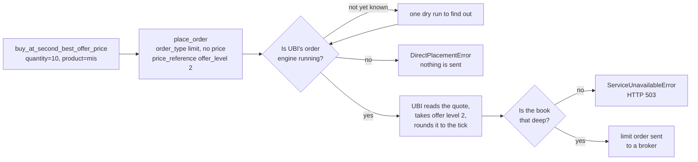

# Price wrappers

A price wrapper is `place_order` with the source of the price written into its name. `buy_at_best_bid_price(quantity=10, product="mis")` says "join the queue of buyers at the highest bid" in one line, where the same order through `place_order` would need you to know how UBI describes that price. There are thirty-two of them on every tradeable instrument.

!!! danger "These are real orders"
    Every member on this page sends an order through UBI to a real broker, with real money, and none of them takes a `dry_run` argument. To see what a wrapper would send, call [`place_order`](orders.md#place_order) with the same arguments and `dry_run=True`, as the example under [How a wrapper works](#how-a-wrapper-works) shows.

## All thirty-two wrappers

Every member on this page carries the <span class="member writes">places orders</span> badge. The table below lists each wrapper with its side, where its price comes from, what it sends to UBI, and how eager it is to fill. The last column follows one rule: pricing further down your own side of the book makes an order more patient, and reaching further into the other side makes it more aggressive, because it can sweep several levels at once.

| Member | Side | Where the price comes from | What it sends | Character |
|---|---|---|---|---|
| [`buy_at_market_price`](#buy_at_market_price) | buy | the market decides | `market`, no reference | fills now, price unknown |
| [`sell_at_market_price`](#sell_at_market_price) | sell | the market decides | `market`, no reference | fills now, price unknown |
| [`buy_at_limit_price`](#buy_at_limit_price) | buy | the `price` you give | `limit` with `price` | your price or better |
| [`sell_at_limit_price`](#sell_at_limit_price) | sell | the `price` you give | `limit` with `price` | your price or better |
| [`buy_at_best_bid_price`](#buy_at_best_bid_price) | buy | the best bid | `limit` with `{"kind": "bid_level", "level": 1}` | patient, joins the queue |
| [`sell_at_best_bid_price`](#sell_at_best_bid_price) | sell | the best bid | `limit` with `{"kind": "bid_level", "level": 1}` | aggressive, crosses the spread |
| [`buy_at_best_offer_price`](#buy_at_best_offer_price) | buy | the best offer | `limit` with `{"kind": "offer_level", "level": 1}` | aggressive, crosses the spread |
| [`sell_at_best_offer_price`](#sell_at_best_offer_price) | sell | the best offer | `limit` with `{"kind": "offer_level", "level": 1}` | patient, joins the queue |
| [`buy_at_mid_price`](#buy_at_mid_price) | buy | halfway between the best bid and the best offer | `limit` with `{"kind": "mid"}` | inside the spread |
| [`sell_at_mid_price`](#sell_at_mid_price) | sell | halfway between the best bid and the best offer | `limit` with `{"kind": "mid"}` | inside the spread |
| [`buy_at_volume_weighted_average_price`](#buy_at_volume_weighted_average_price) | buy | the day's volume weighted average price | `limit` with `{"kind": "vwap"}` | either way |
| [`sell_at_volume_weighted_average_price`](#sell_at_volume_weighted_average_price) | sell | the day's volume weighted average price | `limit` with `{"kind": "vwap"}` | either way |
| [`buy_at_last_price`](#buy_at_last_price) | buy | the last traded price | `limit` with `{"kind": "last"}` | either way |
| [`sell_at_last_price`](#sell_at_last_price) | sell | the last traded price | `limit` with `{"kind": "last"}` | either way |
| [`buy_at_marketable_price`](#buy_at_marketable_price) | buy | the best offer, the price that fills a buy now | `limit` with `{"kind": "marketable"}` plus `buffer_percent` | fills now, capped |
| [`sell_at_marketable_price`](#sell_at_marketable_price) | sell | the best bid, the price that fills a sell now | `limit` with `{"kind": "marketable"}` plus `buffer_percent` | fills now, capped |
| [`buy_at_second_best_bid_price`](#buy_at_second_best_bid_price) | buy | the second best bid | `limit` with `{"kind": "bid_level", "level": 2}` | patient, deeper in the queue |
| [`buy_at_third_best_bid_price`](#buy_at_third_best_bid_price) | buy | the third best bid | `limit` with `{"kind": "bid_level", "level": 3}` | patient, deeper in the queue |
| [`buy_at_fourth_best_bid_price`](#buy_at_fourth_best_bid_price) | buy | the fourth best bid | `limit` with `{"kind": "bid_level", "level": 4}` | patient, deeper in the queue |
| [`buy_at_fifth_best_bid_price`](#buy_at_fifth_best_bid_price) | buy | the fifth best bid | `limit` with `{"kind": "bid_level", "level": 5}` | patient, deeper in the queue |
| [`buy_at_second_best_offer_price`](#buy_at_second_best_offer_price) | buy | the second best offer | `limit` with `{"kind": "offer_level", "level": 2}` | aggressive, sweeps deeper |
| [`buy_at_third_best_offer_price`](#buy_at_third_best_offer_price) | buy | the third best offer | `limit` with `{"kind": "offer_level", "level": 3}` | aggressive, sweeps deeper |
| [`buy_at_fourth_best_offer_price`](#buy_at_fourth_best_offer_price) | buy | the fourth best offer | `limit` with `{"kind": "offer_level", "level": 4}` | aggressive, sweeps deeper |
| [`buy_at_fifth_best_offer_price`](#buy_at_fifth_best_offer_price) | buy | the fifth best offer | `limit` with `{"kind": "offer_level", "level": 5}` | aggressive, sweeps deeper |
| [`sell_at_second_best_bid_price`](#sell_at_second_best_bid_price) | sell | the second best bid | `limit` with `{"kind": "bid_level", "level": 2}` | aggressive, sweeps deeper |
| [`sell_at_third_best_bid_price`](#sell_at_third_best_bid_price) | sell | the third best bid | `limit` with `{"kind": "bid_level", "level": 3}` | aggressive, sweeps deeper |
| [`sell_at_fourth_best_bid_price`](#sell_at_fourth_best_bid_price) | sell | the fourth best bid | `limit` with `{"kind": "bid_level", "level": 4}` | aggressive, sweeps deeper |
| [`sell_at_fifth_best_bid_price`](#sell_at_fifth_best_bid_price) | sell | the fifth best bid | `limit` with `{"kind": "bid_level", "level": 5}` | aggressive, sweeps deeper |
| [`sell_at_second_best_offer_price`](#sell_at_second_best_offer_price) | sell | the second best offer | `limit` with `{"kind": "offer_level", "level": 2}` | patient, deeper in the queue |
| [`sell_at_third_best_offer_price`](#sell_at_third_best_offer_price) | sell | the third best offer | `limit` with `{"kind": "offer_level", "level": 3}` | patient, deeper in the queue |
| [`sell_at_fourth_best_offer_price`](#sell_at_fourth_best_offer_price) | sell | the fourth best offer | `limit` with `{"kind": "offer_level", "level": 4}` | patient, deeper in the queue |
| [`sell_at_fifth_best_offer_price`](#sell_at_fifth_best_offer_price) | sell | the fifth best offer | `limit` with `{"kind": "offer_level", "level": 5}` | patient, deeper in the queue |

The chart below places the wrappers on one order book, the five-level quote UBI's offline test suite uses: a tick of 0.05 rupees, bids from 1000.00 downwards and offers from 1000.05 upwards, 100 units at every level, a last price of 1000.10 and a day's average price of 999.80. The prices beside each level are what UBI's own resolver gives for that quote, from UBI's [worked examples](https://pramodathani.github.io/unified_broker_interface/rest-api/price-quantity-references/#worked-examples). Hover over a bar to see every wrapper that prices at that level.

```vegalite
{
  "$schema": "https://vega.github.io/schema/vega-lite/v5.json",
  "description": "A five-level order book with the price wrappers that use each level",
  "width": "container",
  "height": 340,
  "data": {
    "values": [
      {"price": "1000.25", "rank": 10, "side": "Offers (sell side)", "signed": 100, "label": "offer 5", "wrappers": "buy_at_fifth_best_offer_price, sell_at_fifth_best_offer_price"},
      {"price": "1000.20", "rank": 9, "side": "Offers (sell side)", "signed": 100, "label": "offer 4", "wrappers": "buy_at_fourth_best_offer_price, sell_at_fourth_best_offer_price"},
      {"price": "1000.15", "rank": 8, "side": "Offers (sell side)", "signed": 100, "label": "offer 3", "wrappers": "buy_at_third_best_offer_price, sell_at_third_best_offer_price"},
      {"price": "1000.10", "rank": 7, "side": "Offers (sell side)", "signed": 100, "label": "offer 2, also the last price", "wrappers": "buy_at_second_best_offer_price, sell_at_second_best_offer_price, buy_at_last_price, sell_at_last_price"},
      {"price": "1000.05", "rank": 6, "side": "Offers (sell side)", "signed": 100, "label": "offer 1, marketable buy, mid for a sell", "wrappers": "buy_at_best_offer_price, sell_at_best_offer_price, buy_at_marketable_price, sell_at_mid_price"},
      {"price": "1000.00", "rank": 5, "side": "Bids (buy side)", "signed": -100, "label": "bid 1, marketable sell, mid for a buy", "wrappers": "buy_at_best_bid_price, sell_at_best_bid_price, sell_at_marketable_price, buy_at_mid_price"},
      {"price": "999.95", "rank": 4, "side": "Bids (buy side)", "signed": -100, "label": "bid 2", "wrappers": "buy_at_second_best_bid_price, sell_at_second_best_bid_price"},
      {"price": "999.90", "rank": 3, "side": "Bids (buy side)", "signed": -100, "label": "bid 3", "wrappers": "buy_at_third_best_bid_price, sell_at_third_best_bid_price"},
      {"price": "999.85", "rank": 2, "side": "Bids (buy side)", "signed": -100, "label": "bid 4", "wrappers": "buy_at_fourth_best_bid_price, sell_at_fourth_best_bid_price"},
      {"price": "999.80", "rank": 1, "side": "Bids (buy side)", "signed": -100, "label": "bid 5, also the day's average price", "wrappers": "buy_at_fifth_best_bid_price, sell_at_fifth_best_bid_price, buy_at_volume_weighted_average_price, sell_at_volume_weighted_average_price"}
    ]
  },
  "encoding": {
    "y": {"field": "price", "type": "ordinal", "sort": {"field": "rank", "order": "descending"}, "title": "Price in rupees"}
  },
  "layer": [
    {
      "mark": {"type": "bar", "cornerRadiusEnd": 3},
      "encoding": {
        "x": {"field": "signed", "type": "quantitative", "title": "Units waiting (bids to the left, offers to the right)", "scale": {"domain": [-400, 400]}, "axis": {"values": [-100, 0, 100]}},
        "color": {"field": "side", "type": "nominal", "title": null, "scale": {"domain": ["Bids (buy side)", "Offers (sell side)"], "range": ["#42a5f5", "#ff7043"]}},
        "tooltip": [
          {"field": "price", "title": "Price"},
          {"field": "label", "title": "Level"},
          {"field": "wrappers", "title": "Wrappers that price here"}
        ]
      }
    },
    {
      "transform": [{"filter": "datum.signed > 0"}],
      "mark": {"type": "text", "align": "left", "dx": 6, "fontSize": 11},
      "encoding": {
        "x": {"field": "signed", "type": "quantitative"},
        "text": {"field": "label"}
      }
    },
    {
      "transform": [{"filter": "datum.signed < 0"}],
      "mark": {"type": "text", "align": "right", "dx": -6, "fontSize": 11},
      "encoding": {
        "x": {"field": "signed", "type": "quantitative"},
        "text": {"field": "label"}
      }
    }
  ]
}
```

Two things in the chart are easy to get backwards. A buy at the best bid and a sell at the best bid use the same price but mean opposite things: the buy waits with the other buyers, while the sell crosses the spread and fills against them at once. And the midpoint, 1000.025, is not a whole number of ticks, so UBI rounds it towards the patient side, down to 1000.00 for a buy and up to 1000.05 for a sell, so a mid-price order never crosses the spread.

## How a wrapper works

Apart from the two market and the two limit wrappers, no wrapper reads the order book itself. Each one sends a `limit` order with no price and a `price_reference` that names the level, and UBI's order engine reads the live quote, applies any offset, rounds the result to the tick and sends the order, all in one step. The price is therefore the one in the book when the order leaves, not the one when you called the method.



Because the price-reference wrappers depend on the engine, they need UBI running with `UNIFIED_BROKER_INTERFACE_API_ORDER_PLACEMENT=engine`. The market and limit wrappers send a plain price and work in either mode, which is also why the holdings methods, which only use those four, work in either mode. [Placement modes](../architecture/placement-modes.md) explains the difference.

The wrappers have no `dry_run` argument. To preview one, send the same order through `place_order`. The example below previews `buy_at_best_offer_price(quantity=1, product="cnc")` on RELIANCE; its output was captured from a local UBI on 2026-09-26, reformatted across lines, when the only level in the book was one offer at 1226.0.

=== "Python"

    ```python
    from tradingmachine.assets import equities

    reliance = equities.Equity("nse", "RELIANCE")

    preview = reliance.place_order(
        transaction_type="buy",
        order_type="limit",
        quantity=1,
        product="cnc",
        price_reference={
            "kind": "offer_level",
            "level": 1,
        },
        dry_run=True,
    )
    print(preview["request"]["json"]["price"])
    ```

=== "Output"

    ```text
    1226.0
    ```

## Common parameters

Every wrapper takes the same five parameters, in the same positions, so you can switch from one to another by changing only its name. The two limit wrappers put `price` first, and the two marketable wrappers add `buffer_percent` at the end.

| Name | Type | Required | Default | Description |
|---|---|:---:|---|---|
| `price` | `float` | limit pair only | | The limit price in rupees, for `buy_at_limit_price` and `sell_at_limit_price`. |
| `quantity` | `int` | yes | | The quantity in units, not lots. |
| `product` | `str` | yes | | `cnc`, `mis` or `nrml`. It has no default on purpose, because it decides whether a buy becomes shares you keep or a position the broker closes before the session ends. |
| `validity` | `str` or `None` | no | `None` | `day` or `ioc`. UBI uses `day` when it is `None`. |
| `after_market` | `bool` | no | `False` | `True` sends an after-market order. |
| `tag` | `str` or `None` | no | `None` | A label of up to twenty letters and digits. |
| `buffer_percent` | `float` or `None` | no | `None` | For the marketable pair only: how far past the best price to set the cap, such as `0.5` for half a per cent. A negative number moves it the other way. |

Anything beyond these, such as a disclosed quantity, a stop, or one of the offsets below, is a reason to call `place_order` directly.

### Returns

Every wrapper returns the `dict` that [`place_order`](orders.md#place_order) returns, holding `broker`, `order_id`, `outcome` and the rest.

### Raises

Every wrapper can raise any exception `place_order` raises. The table below lists the ones a wrapper is most likely to meet; the market and limit wrappers cannot raise the first two, because they send no reference.

| Exception | When |
|---|---|
| `ServiceUnavailableError` | UBI could not work the price out: there is no live quote, the book is not as deep as the level asked for, or the brokers do not agree on a tick size. This is what an order book looks like outside market hours. |
| `DirectPlacementError` | UBI is placing orders directly, without its engine, so it would ignore the reference. Nothing was sent. |
| `BadRequestError` | A field is invalid, or the offsets pushed the price to zero or below. |
| `OrderRejectedError` | The broker refused the order. |
| `UnifiedBrokerInterfaceError` | Any other failure reported by, or on the way to, UBI. |

## The seven price references

A `price_reference` is a small dictionary that describes a price instead of stating it. The wrappers use six of the seven kinds; the seventh, `absolute`, and the two offsets `offset_percent` and `offset_ticks` are reachable only through `place_order`. The table below lists every kind, what UBI reads for it, and which wrappers send it.

| `kind` | What UBI reads | Wrappers that send it |
|---|---|---|
| `absolute` | The `price` inside the reference, rounded to the tick towards the patient side | none |
| `last` | The last traded price | `buy_at_last_price`, `sell_at_last_price` |
| `mid` | Halfway between the best bid and the best offer | `buy_at_mid_price`, `sell_at_mid_price` |
| `vwap` | The day's volume weighted average price, which the quote calls `average_price` | `buy_at_volume_weighted_average_price`, `sell_at_volume_weighted_average_price` |
| `bid_level` | One level of the bid side, the best bid being level 1 | the ten `..._bid_price` wrappers |
| `offer_level` | One level of the offer side, the best offer being level 1 | the ten `..._offer_price` wrappers |
| `marketable` | The best price on the other side: the best offer for a buy, the best bid for a sell | `buy_at_marketable_price`, `sell_at_marketable_price` |

A reference can carry a few optional fields besides `kind`. The table below lists them with UBI's rules.

| Field | Type | Used by | Rules |
|---|---|---|---|
| `price` | number | `absolute` only, where it is required | Above zero. |
| `level` | integer | `bid_level`, `offer_level` | From 1 to 5, which is as deep as UBI's quote carries. Defaults to 1. |
| `buffer_percent` | number | any kind | A percentage offset, applied first. May be negative. |
| `offset_percent` | number | any kind | A second percentage offset, applied after the first. May be negative. |
| `offset_ticks` | integer | any kind | An offset in whole ticks, applied last. May be negative. |

UBI always applies an offset in the direction that makes the order more likely to fill: a buy's price goes up and a sell's goes down, and a negative offset improves the price instead. The final price is rounded to a whole tick, towards the patient side for every kind except `marketable`, which rounds towards the market because it is meant to fill. UBI's page on [price and quantity references](https://pramodathani.github.io/unified_broker_interface/rest-api/price-quantity-references/#price-references) gives the full rules and every error message.

The example below sends a buy one tick above the best bid, which no wrapper covers, through `place_order`.

=== "Python"

    ```python
    reliance.place_order(
        transaction_type="buy",
        order_type="limit",
        quantity=10,
        product="mis",
        price_reference={
            "kind": "bid_level",
            "level": 1,
            "offset_ticks": 1,
        },
    )
    ```

## An empty or shallow book

Every reference except `absolute` reads the live quote, and a quote can be thinner than the reference needs. When it is, UBI refuses the order with HTTP 503 before anything reaches a broker, and the library raises `ServiceUnavailableError`. The message names the problem, for example `a bid_level price reference needs 3 level(s) on the buy side of the book and the quote carries 1`.

The book really does get this thin. The quote for RELIANCE captured from a local UBI on Saturday 2026-09-26, with the market closed, held no bids at all and a single offer, as the trimmed output below shows.

```python
{'depth': {'buy': [], 'sell': [{'orders': 11, 'price': 1226.0, 'quantity': 855}]},
 'last_price': 1226.0,
 'average_price': 1220.44}
```

The table below shows how each wrapper would fare against that book, by UBI's rules. Only the best-offer buy was actually sent as a dry run; the other rows are worked out from the rules above and were not tested.

| Wrappers | Against that book |
|---|---|
| `buy_at_best_offer_price`, `sell_at_best_offer_price` | Priced at 1226.0. The dry run of the buy confirmed it. |
| `buy_at_marketable_price` | Priced at 1226.0, the best offer. |
| `sell_at_marketable_price`, every `..._bid_price` wrapper | Refused with 503, because there is no bid. |
| `buy_at_mid_price`, `sell_at_mid_price` | Refused with 503, because a midpoint needs both sides. |
| the `second` to `fifth` `..._offer_price` wrappers | Refused with 503, because there is only one offer. |
| `buy_at_last_price`, `sell_at_last_price` | Priced at 1226.0. |
| `buy_at_volume_weighted_average_price`, `sell_at_volume_weighted_average_price` | Priced at 1220.4 for a buy and 1220.5 for a sell, after rounding 1220.44 to the 0.1 tick towards the patient side. |
| `buy_at_market_price`, `sell_at_market_price`, the limit pair | Not affected, because they send no reference. |

!!! tip "Ask for a shallower level, or state the price"
    When a 503 names the book's depth, ask for a shallower level or a kind that needs less of the book, such as `last`. When the market is closed, a plain limit order with `after_market=True` is the order that will survive until the next session.

## Market and limit

These four send a plain order with no reference, so they work in either of UBI's placement modes. They are the ones the position and holdings methods use.

The example below buys ten shares at market for an intraday position, and places a limit sell of the same ten at 1250 rupees.

=== "Python"

    ```python
    reliance.buy_at_market_price(quantity=10, product="mis")
    reliance.sell_at_limit_price(price=1250.0, quantity=10, product="mis")
    ```

### buy_at_market_price

<div class="endpoint" markdown><span class="member writes">places orders</span> `buy_at_market_price(quantity, product, validity=None, after_market=False, tag=None)`<span class="route"><span class="method post">POST</span> `/api/orders/place`</span></div>

Buys at whatever price the market is asking. A market order takes the best price on offer and fills straight away while the market is open. The price is therefore not known before the order is sent, and in a thin book it can be a good deal worse than the last traded price.

It sends a `market` order with no price and no reference, so it works in either of UBI's placement modes.

### sell_at_market_price

<div class="endpoint" markdown><span class="member writes">places orders</span> `sell_at_market_price(quantity, product, validity=None, after_market=False, tag=None)`<span class="route"><span class="method post">POST</span> `/api/orders/place`</span></div>

Sells at whatever price the market is bidding. A market order takes the best price being bid and fills straight away while the market is open. The price is therefore not known before the order is sent, and in a thin book it can be a good deal worse than the last traded price.

It sends a `market` order with no price and no reference, so it works in either of UBI's placement modes.

### buy_at_limit_price

<div class="endpoint" markdown><span class="member writes">places orders</span> `buy_at_limit_price(price, quantity, product, validity=None, after_market=False, tag=None)`<span class="route"><span class="method post">POST</span> `/api/orders/place`</span></div>

Buys at a price of your choosing, or better. A limit buy never pays more than the price given. It waits in the market until someone sells at that price or lower, and it may never fill at all.

It sends a `limit` order at the `price` you give, with no reference, so it works in either of UBI's placement modes.

### sell_at_limit_price

<div class="endpoint" markdown><span class="member writes">places orders</span> `sell_at_limit_price(price, quantity, product, validity=None, after_market=False, tag=None)`<span class="route"><span class="method post">POST</span> `/api/orders/place`</span></div>

Sells at a price of your choosing, or better. A limit sell never accepts less than the price given. It waits in the market until someone buys at that price or higher, and it may never fill at all.

It sends a `limit` order at the `price` you give, with no reference, so it works in either of UBI's placement modes.

## Top of the book

These four price the order at the best bid or the best offer. The buy at the best bid and the sell at the best offer are the patient pair, which wait in the queue on their own side; the other two are the aggressive pair, which cross the spread and fill against whoever is waiting.

The example below joins the queue of buyers with a patient order for ten units.

=== "Python"

    ```python
    reliance.buy_at_best_bid_price(quantity=10, product="mis")
    ```

### buy_at_best_bid_price

<div class="endpoint" markdown><span class="member writes">places orders</span> `buy_at_best_bid_price(quantity, product, validity=None, after_market=False, tag=None)`<span class="route"><span class="method post">POST</span> `/api/orders/place`</span></div>

Buys patiently, joining the queue at the highest price anyone is bidding. This is the patient side of the pair. It prices the order alongside everyone already waiting at the best price on its own side of the book, so it saves the spread but only fills when the market comes to it.

It sends a `limit` order with no price and `price_reference={"kind": "bid_level", "level": 1}`.

### sell_at_best_bid_price

<div class="endpoint" markdown><span class="member writes">places orders</span> `sell_at_best_bid_price(quantity, product, validity=None, after_market=False, tag=None)`<span class="route"><span class="method post">POST</span> `/api/orders/place`</span></div>

Sells at once, by crossing the spread to the highest price anyone is bidding. This is the aggressive side of the pair. It prices the order where the other side of the market already is, so it fills immediately against whoever is waiting there, and it pays the spread for that certainty.

It sends a `limit` order with no price and `price_reference={"kind": "bid_level", "level": 1}`.

### buy_at_best_offer_price

<div class="endpoint" markdown><span class="member writes">places orders</span> `buy_at_best_offer_price(quantity, product, validity=None, after_market=False, tag=None)`<span class="route"><span class="method post">POST</span> `/api/orders/place`</span></div>

Buys at once, by crossing the spread to the lowest price anyone is offering. This is the aggressive side of the pair. It prices the order where the other side of the market already is, so it fills immediately against whoever is waiting there, and it pays the spread for that certainty.

It sends a `limit` order with no price and `price_reference={"kind": "offer_level", "level": 1}`.

### sell_at_best_offer_price

<div class="endpoint" markdown><span class="member writes">places orders</span> `sell_at_best_offer_price(quantity, product, validity=None, after_market=False, tag=None)`<span class="route"><span class="method post">POST</span> `/api/orders/place`</span></div>

Sells patiently, joining the queue at the lowest price anyone is offering. This is the patient side of the pair. It prices the order alongside everyone already waiting at the best price on its own side of the book, so it saves the spread but only fills when the market comes to it.

It sends a `limit` order with no price and `price_reference={"kind": "offer_level", "level": 1}`.

## Inside the spread and the day's benchmarks

These six price the order from a single number in the quote rather than from one side of the book: the midpoint, the day's volume weighted average price, or the last traded price. UBI rounds each to the tick, towards the patient side.

The example below sells ten units at the day's average price, a common benchmark to measure a fill against.

=== "Python"

    ```python
    reliance.sell_at_volume_weighted_average_price(quantity=10, product="mis")
    ```

### buy_at_mid_price

<div class="endpoint" markdown><span class="member writes">places orders</span> `buy_at_mid_price(quantity, product, validity=None, after_market=False, tag=None)`<span class="route"><span class="method post">POST</span> `/api/orders/place`</span></div>

Buys halfway between the best bid and the best offer. The mid price sits inside the spread, where nobody is waiting, so the order is better than joining its own side of the book and cheaper than crossing to the other. It fills only if the market moves that far. UBI works the midpoint out when it sends the order and rounds it to the tick, down for a buy and up for a sell, so the order never crosses the spread.

It sends a `limit` order with no price and `price_reference={"kind": "mid"}`.

### sell_at_mid_price

<div class="endpoint" markdown><span class="member writes">places orders</span> `sell_at_mid_price(quantity, product, validity=None, after_market=False, tag=None)`<span class="route"><span class="method post">POST</span> `/api/orders/place`</span></div>

Sells halfway between the best bid and the best offer. The mid price sits inside the spread, where nobody is waiting, so the order is better than joining its own side of the book and cheaper than crossing to the other. It fills only if the market moves that far. UBI works the midpoint out when it sends the order and rounds it to the tick, down for a buy and up for a sell, so the order never crosses the spread.

It sends a `limit` order with no price and `price_reference={"kind": "mid"}`.

### buy_at_volume_weighted_average_price

<div class="endpoint" markdown><span class="member writes">places orders</span> `buy_at_volume_weighted_average_price(quantity, product, validity=None, after_market=False, tag=None)`<span class="route"><span class="method post">POST</span> `/api/orders/place`</span></div>

Buys at the average price the day has traded at so far. The volume weighted average price is where the day's business has actually been done, which makes it a common benchmark to measure a fill against. It has no relation to where the book is now, so the order may cross the spread or sit far away from it. Not every broker reports it. UBI reads it when it sends the order and rounds it to the tick.

It sends a `limit` order with no price and `price_reference={"kind": "vwap"}`.

### sell_at_volume_weighted_average_price

<div class="endpoint" markdown><span class="member writes">places orders</span> `sell_at_volume_weighted_average_price(quantity, product, validity=None, after_market=False, tag=None)`<span class="route"><span class="method post">POST</span> `/api/orders/place`</span></div>

Sells at the average price the day has traded at so far. The volume weighted average price is where the day's business has actually been done, which makes it a common benchmark to measure a fill against. It has no relation to where the book is now, so the order may cross the spread or sit far away from it. Not every broker reports it. UBI reads it when it sends the order and rounds it to the tick.

It sends a `limit` order with no price and `price_reference={"kind": "vwap"}`.

### buy_at_last_price

<div class="endpoint" markdown><span class="member writes">places orders</span> `buy_at_last_price(quantity, product, validity=None, after_market=False, tag=None)`<span class="route"><span class="method post">POST</span> `/api/orders/place`</span></div>

Buys with a limit order at the price the instrument last traded at. The last traded price is where the most recent deal was done, which may be on either side of the book by the time the order arrives, so the order may fill at once or rest. UBI reads it when it sends the order and rounds it to the tick.

It sends a `limit` order with no price and `price_reference={"kind": "last"}`.

### sell_at_last_price

<div class="endpoint" markdown><span class="member writes">places orders</span> `sell_at_last_price(quantity, product, validity=None, after_market=False, tag=None)`<span class="route"><span class="method post">POST</span> `/api/orders/place`</span></div>

Sells with a limit order at the price the instrument last traded at. The last traded price is where the most recent deal was done, which may be on either side of the book by the time the order arrives, so the order may fill at once or rest. UBI reads it when it sends the order and rounds it to the tick.

It sends a `limit` order with no price and `price_reference={"kind": "last"}`.

## Marketable limits

A marketable limit is what a market order has become in India. Brokers convert an API market order into a limit order with price protection, and some refuse market orders outright, so these two state the cap themselves: the order fills at once up to the price on the other side of the book and never beyond it. `buffer_percent` moves the cap further to reach deeper into the book, and `validity="ioc"` cancels whatever cannot fill at once.

The example below buys up to 100 units at no more than half a per cent above the best offer, and cancels the rest.

=== "Python"

    ```python
    reliance.buy_at_marketable_price(
        quantity=100,
        product="mis",
        validity="ioc",
        buffer_percent=0.5,
    )
    ```

### buy_at_marketable_price

<div class="endpoint" markdown><span class="member writes">places orders</span> `buy_at_marketable_price(quantity, product, validity=None, after_market=False, tag=None, buffer_percent=None)`<span class="route"><span class="method post">POST</span> `/api/orders/place`</span></div>

Buys now with a limit order priced at the best offer, the price it takes to fill immediately. This is what a market order has become in India: brokers convert an API market order into a limit order with price protection, and some refuse market orders outright. A marketable limit states the cap itself, so the order fills at once up to that price and never beyond it. UBI reads the best offer when it sends the order, and `buffer_percent` moves the cap that far above it to reach deeper into the book. Pair it with `validity="ioc"` to cancel whatever cannot fill at once.

It sends a `limit` order with no price and `price_reference={"kind": "marketable"}`, adding `"buffer_percent"` when you pass one.

### sell_at_marketable_price

<div class="endpoint" markdown><span class="member writes">places orders</span> `sell_at_marketable_price(quantity, product, validity=None, after_market=False, tag=None, buffer_percent=None)`<span class="route"><span class="method post">POST</span> `/api/orders/place`</span></div>

Sells now with a limit order priced at the best bid, the price it takes to fill immediately. This is what a market order has become in India: brokers convert an API market order into a limit order with price protection, and some refuse market orders outright. A marketable limit states the cap itself, so the order fills at once up to that price and never beyond it. UBI reads the best bid when it sends the order, and `buffer_percent` moves the cap that far below it to reach deeper into the book. Pair it with `validity="ioc"` to cancel whatever cannot fill at once.

It sends a `limit` order with no price and `price_reference={"kind": "marketable"}`, adding `"buffer_percent"` when you pass one.

## Deeper in the book

These sixteen price the order at the second to the fifth level of one side of the book. Pricing further down your own side waits behind more of the queue, so it fills less often and at a better price when it does. Reaching further into the other side can sweep every level down to the one named, so it fills more at a worse average price. A level deeper than the book holds raises `ServiceUnavailableError`.

The example below sells ten units patiently at the third best offer.

=== "Python"

    ```python
    reliance.sell_at_third_best_offer_price(quantity=10, product="mis")
    ```

### buy_at_second_best_bid_price

<div class="endpoint" markdown><span class="member writes">places orders</span> `buy_at_second_best_bid_price(quantity, product, validity=None, after_market=False, tag=None)`<span class="route"><span class="method post">POST</span> `/api/orders/place`</span></div>

Buys at the second best price on the buy side of the book.

It sends a `limit` order with no price and `price_reference={"kind": "bid_level", "level": 2}`.

### buy_at_third_best_bid_price

<div class="endpoint" markdown><span class="member writes">places orders</span> `buy_at_third_best_bid_price(quantity, product, validity=None, after_market=False, tag=None)`<span class="route"><span class="method post">POST</span> `/api/orders/place`</span></div>

Buys at the third best price on the buy side of the book.

It sends a `limit` order with no price and `price_reference={"kind": "bid_level", "level": 3}`.

### buy_at_fourth_best_bid_price

<div class="endpoint" markdown><span class="member writes">places orders</span> `buy_at_fourth_best_bid_price(quantity, product, validity=None, after_market=False, tag=None)`<span class="route"><span class="method post">POST</span> `/api/orders/place`</span></div>

Buys at the fourth best price on the buy side of the book.

It sends a `limit` order with no price and `price_reference={"kind": "bid_level", "level": 4}`.

### buy_at_fifth_best_bid_price

<div class="endpoint" markdown><span class="member writes">places orders</span> `buy_at_fifth_best_bid_price(quantity, product, validity=None, after_market=False, tag=None)`<span class="route"><span class="method post">POST</span> `/api/orders/place`</span></div>

Buys at the fifth best price on the buy side of the book.

It sends a `limit` order with no price and `price_reference={"kind": "bid_level", "level": 5}`.

### buy_at_second_best_offer_price

<div class="endpoint" markdown><span class="member writes">places orders</span> `buy_at_second_best_offer_price(quantity, product, validity=None, after_market=False, tag=None)`<span class="route"><span class="method post">POST</span> `/api/orders/place`</span></div>

Buys at the second best price on the sell side of the book.

It sends a `limit` order with no price and `price_reference={"kind": "offer_level", "level": 2}`.

### buy_at_third_best_offer_price

<div class="endpoint" markdown><span class="member writes">places orders</span> `buy_at_third_best_offer_price(quantity, product, validity=None, after_market=False, tag=None)`<span class="route"><span class="method post">POST</span> `/api/orders/place`</span></div>

Buys at the third best price on the sell side of the book.

It sends a `limit` order with no price and `price_reference={"kind": "offer_level", "level": 3}`.

### buy_at_fourth_best_offer_price

<div class="endpoint" markdown><span class="member writes">places orders</span> `buy_at_fourth_best_offer_price(quantity, product, validity=None, after_market=False, tag=None)`<span class="route"><span class="method post">POST</span> `/api/orders/place`</span></div>

Buys at the fourth best price on the sell side of the book.

It sends a `limit` order with no price and `price_reference={"kind": "offer_level", "level": 4}`.

### buy_at_fifth_best_offer_price

<div class="endpoint" markdown><span class="member writes">places orders</span> `buy_at_fifth_best_offer_price(quantity, product, validity=None, after_market=False, tag=None)`<span class="route"><span class="method post">POST</span> `/api/orders/place`</span></div>

Buys at the fifth best price on the sell side of the book.

It sends a `limit` order with no price and `price_reference={"kind": "offer_level", "level": 5}`.

### sell_at_second_best_bid_price

<div class="endpoint" markdown><span class="member writes">places orders</span> `sell_at_second_best_bid_price(quantity, product, validity=None, after_market=False, tag=None)`<span class="route"><span class="method post">POST</span> `/api/orders/place`</span></div>

Sells at the second best price on the buy side of the book.

It sends a `limit` order with no price and `price_reference={"kind": "bid_level", "level": 2}`.

### sell_at_third_best_bid_price

<div class="endpoint" markdown><span class="member writes">places orders</span> `sell_at_third_best_bid_price(quantity, product, validity=None, after_market=False, tag=None)`<span class="route"><span class="method post">POST</span> `/api/orders/place`</span></div>

Sells at the third best price on the buy side of the book.

It sends a `limit` order with no price and `price_reference={"kind": "bid_level", "level": 3}`.

### sell_at_fourth_best_bid_price

<div class="endpoint" markdown><span class="member writes">places orders</span> `sell_at_fourth_best_bid_price(quantity, product, validity=None, after_market=False, tag=None)`<span class="route"><span class="method post">POST</span> `/api/orders/place`</span></div>

Sells at the fourth best price on the buy side of the book.

It sends a `limit` order with no price and `price_reference={"kind": "bid_level", "level": 4}`.

### sell_at_fifth_best_bid_price

<div class="endpoint" markdown><span class="member writes">places orders</span> `sell_at_fifth_best_bid_price(quantity, product, validity=None, after_market=False, tag=None)`<span class="route"><span class="method post">POST</span> `/api/orders/place`</span></div>

Sells at the fifth best price on the buy side of the book.

It sends a `limit` order with no price and `price_reference={"kind": "bid_level", "level": 5}`.

### sell_at_second_best_offer_price

<div class="endpoint" markdown><span class="member writes">places orders</span> `sell_at_second_best_offer_price(quantity, product, validity=None, after_market=False, tag=None)`<span class="route"><span class="method post">POST</span> `/api/orders/place`</span></div>

Sells at the second best price on the sell side of the book.

It sends a `limit` order with no price and `price_reference={"kind": "offer_level", "level": 2}`.

### sell_at_third_best_offer_price

<div class="endpoint" markdown><span class="member writes">places orders</span> `sell_at_third_best_offer_price(quantity, product, validity=None, after_market=False, tag=None)`<span class="route"><span class="method post">POST</span> `/api/orders/place`</span></div>

Sells at the third best price on the sell side of the book.

It sends a `limit` order with no price and `price_reference={"kind": "offer_level", "level": 3}`.

### sell_at_fourth_best_offer_price

<div class="endpoint" markdown><span class="member writes">places orders</span> `sell_at_fourth_best_offer_price(quantity, product, validity=None, after_market=False, tag=None)`<span class="route"><span class="method post">POST</span> `/api/orders/place`</span></div>

Sells at the fourth best price on the sell side of the book.

It sends a `limit` order with no price and `price_reference={"kind": "offer_level", "level": 4}`.

### sell_at_fifth_best_offer_price

<div class="endpoint" markdown><span class="member writes">places orders</span> `sell_at_fifth_best_offer_price(quantity, product, validity=None, after_market=False, tag=None)`<span class="route"><span class="method post">POST</span> `/api/orders/place`</span></div>

Sells at the fifth best price on the sell side of the book.

It sends a `limit` order with no price and `price_reference={"kind": "offer_level", "level": 5}`.
