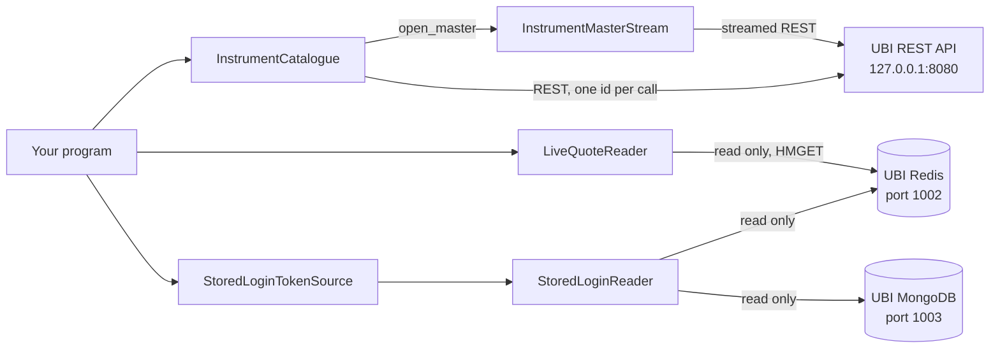

# Read-only market data

The classes on this page read UBI's market data for programs that deal with thousands of instruments at once, such as a screener, a chart server or a map of the whole market. They never place an order and never change anything, in UBI or anywhere else. They were added on 2026-09-26 for instruments_explorer, a web application that sits beside UBI and moved all of its UBI access onto this library that day, but any program can use them.

They fall into two groups. `InstrumentCatalogue`, `PricesDocument` and `InstrumentMasterStream` go through UBI's REST API, like the rest of the library. The `tradingmachine.ubi_stores` package reads UBI's own Redis and MongoDB directly, for the two things UBI's REST API cannot give. The table below lists everything on this page.

| Kind | Member | Description |
|---|---|---|
| <span class="member class">class</span> | [`InstrumentCatalogue`](#instrumentcatalogue) | UBI's instrument data, looked up by instrument id without building an instrument object |
| <span class="member property">property</span> | [`greeting`](#greeting-segments-and-mapping_date), [`segments`](#greeting-segments-and-mapping_date), [`mapping_date`](#greeting-segments-and-mapping_date) | Whether UBI is up, its segments, and the date of its instrument catalogue |
| <span class="member method">method</span> | [`details`](#details-additional_details-and-quote), [`additional_details`](#details-additional_details-and-quote), [`quote`](#details-additional_details-and-quote) | One instrument's identity, its brokers' extra attributes, and its quote |
| <span class="member method">method</span> | [`prices_document`](#prices_document) | One instrument's candles together with UBI's facts about them |
| <span class="member method">method</span> | [`open_master`](#open_master) | Opens UBI's whole instrument master for reading in batches |
| <span class="member class">class</span> | [`PricesDocument`](#pricesdocument) | UBI's whole answer from the prices route |
| <span class="member class">class</span> | [`InstrumentMasterStream`](#instrumentmasterstream) | The instrument master, read in batches as it arrives |
| <span class="member class">class</span> | [`RedisSettings`, `MongoSettings`](#redissettings-and-mongosettings) | Where UBI's own Redis and MongoDB are, and how to log in |
| <span class="member class">class</span> | [`StoredLoginReader`](#storedloginreader) | Reads the access token UBI has stored, and UBI's api key and secret |
| <span class="member class">class</span> | [`StoredLoginTokenSource`](#storedlogintokensource) | A token source that uses UBI's stored token and connects only as a last resort |
| <span class="member class">class</span> | [`LiveQuoteReader`](#livequotereader) | Reads the live quotes of many instruments in one round trip |
| <span class="member class">class</span> | [`IncompleteResponseError`](#incompleteresponseerror) | A successful answer from UBI that stopped before its end |

## When to use these rather than an instrument

An instrument object such as `Equity("nse", "RELIANCE")` looks itself up with one request when it is built, and then every property reads UBI again. That is the right shape for a script that works with a handful of named instruments. It is the wrong shape for an application that already holds the ids of 236,000 instruments from UBI's master and wants, say, the candles of 750 of them: building 750 objects would send 750 extra lookups before any candle was read.

The flowchart below shows which class answers which need, and which of UBI's doors each one goes through.



The table below compares the two ways of reading the same data, so you can choose one.

| Need | With an instrument object | With this page's classes |
|---|---|---|
| Candles for one named instrument | `share.prices(days=365)` | `catalogue.prices_document(instrument_id, days=365).frame(...)` |
| Candles for 750 instruments whose ids you hold | 750 constructions, then 750 `prices` calls | 750 `prices_document` calls and nothing else |
| The price basis, the range UBI read, or whether the candles came from UBI's cache | [`share.prices_document(...)`](market-data.md#prices_document) | `catalogue.prices_document(...)` |
| Every instrument UBI knows about | Not available | `catalogue.open_master()` |
| Live quotes for 500 instruments | 500 requests to UBI | One `LiveQuoteReader.read` call, one Redis round trip |

## InstrumentCatalogue

<div class="endpoint" markdown><span class="member class">class</span> `InstrumentCatalogue(unified_broker_interface)`</div>

An `InstrumentCatalogue` reads UBI's instrument data by instrument id. Each method takes an id and returns UBI's answer as it came, and nothing is read until a method is called, so building a catalogue costs nothing. It lives in `tradingmachine.ubi_client.instrument_catalogue`.

#### Parameters

| Name | Type | Required | Default | Description |
|---|---|---|---|---|
| `unified_broker_interface` | `UnifiedBrokerInterface` | Yes | | The client every request goes through, such as [`Instrument.shared_unified_broker_interface()`](instruments.md#shared_unified_broker_interface) or one you built with a [token source](client.md#token-sources) of your own |

The client is kept as the public attribute `unified_broker_interface`.

#### Example

The example below builds a catalogue over the shared client, checks the catalogue's date and reads one instrument's details. The instrument id is RELIANCE's, taken from the quote captured on [Market data](market-data.md#quote). Its output was not captured.

=== "Python"

    ```python
    from tradingmachine.assets import instruments
    from tradingmachine.ubi_client import instrument_catalogue

    shared_client = instruments.Instrument.shared_unified_broker_interface()
    catalogue = instrument_catalogue.InstrumentCatalogue(shared_client)

    print(catalogue.mapping_date)
    reliance_id = "3f92570a-9924-5bf5-9f9d-e006cd9f4202"
    print(catalogue.details(reliance_id))
    ```

### greeting, segments and mapping_date

These three properties take no argument and read UBI on every access, like an instrument's `quote`. The table below lists them.

| Property | Route | Returns |
|---|---|---|
| `greeting` | <span class="method get">GET</span> `/api/` | UBI's welcome message as a `dict`, read without an access token through [`UnifiedBrokerInterface.greeting`](client.md#greeting), which shows whether UBI is running |
| `segments` | <span class="method get">GET</span> `/api/instruments/segments` | A `dict` with `mapping_date`, `exchanges` and `segments` |
| `mapping_date` | <span class="method get">GET</span> `/api/instruments/segments` | The `str` date of UBI's current instrument catalogue, such as `2026-09-26`, or `None` when UBI does not report one |

UBI rebuilds its catalogue of instruments once a day, and the mapping date names the day's catalogue. UBI has no route of its own for the date, so `mapping_date` reads the segments route, which is the cheapest route that carries it. A program that keeps its own copy of the master can read `mapping_date` every few minutes and rebuild its copy when the date changes, which is what instruments_explorer does. [Mapping dates](https://pramodathani.github.io/unified_broker_interface/rest-api/instruments/#mapping-dates) on the UBI site explains them.

### details, additional_details and quote

These three methods each take one argument, the `str` UBI instrument id, and return UBI's answer as a `dict`, unchanged. The table below lists what each one reads.

| Method | Route | What UBI answers with |
|---|---|---|
| `details(instrument_id)` | <span class="method get">GET</span> `/api/instruments/details` | The instrument's identity, the dates it was seen, its lot size and tick size, and the brokers that carry it |
| `additional_details(instrument_id)` | <span class="method get">GET</span> `/api/instruments/additional_details` | `attribute_names`, and one `carried_by` entry per broker with the extra attributes it publishes, such as the ISIN and the freeze quantity |
| `quote(instrument_id)` | <span class="method get">GET</span> `/api/instruments/quote` | The full [unified quote](https://pramodathani.github.io/unified_broker_interface/rest-api/market-quotes/#the-unified-quote-document), including `source` |

All three raise [`NotFoundError`](errors.md#notfounderror) when UBI has no instrument with that id, and [`UnifiedBrokerInterfaceError`](errors.md#unifiedbrokerinterfaceerror) for any other failure. `quote` also raises [`ServiceUnavailableError`](errors.md#serviceunavailableerror) when UBI has no recent quote and no broker could supply one. [Additional details](https://pramodathani.github.io/unified_broker_interface/rest-api/instruments/#additional-details) on the UBI site lists the sixteen attribute names.

### prices_document

<div class="endpoint" markdown><span class="member method">method</span> `prices_document(instrument_id, interval="day", from_date=None, to_date=None, days=None, adjusted=True)`<span class="route"><span class="method get">GET</span> `/api/instruments/prices`</span></div>

This method reads one instrument's candles for a range and returns UBI's whole answer as a [`PricesDocument`](#pricesdocument). It takes the same range arguments as an instrument's [`prices`](market-data.md#prices), after the instrument id, so give either `days`, or `from_date` and `to_date`.

#### Parameters

| Name | Type | Required | Default | Description |
|---|---|---|---|---|
| `instrument_id` | `str` | Yes | | The UBI instrument id |
| `interval` | `str` | No | `"day"` | The candle length, one of the [intervals](vocabulary.md#intervals) |
| `from_date` | `datetime.date`, `str` or `None` | With `to_date` | `None` | The first day, inclusive, as a date or `YYYY-MM-DD` |
| `to_date` | `datetime.date`, `str` or `None` | With `from_date` | `None` | The last day, inclusive |
| `days` | `int` or `None` | Instead of the two dates | `None` | Count back this many days from today |
| `adjusted` | `bool` | No | `True` | `True` for prices adjusted for splits and bonuses |

#### Example

The example below reads a year of RELIANCE's daily candles, prints what UBI says about them, and turns them into the same DataFrame that `prices` returns. Its output was not captured.

=== "Python"

    ```python
    document = catalogue.prices_document(reliance_id, days=365)
    print(document.price_basis, document.adjustable, document.source)
    print(document.from_date, document.to_date, len(document.candles))

    frame = document.frame("nse", "nse_equities", "day")
    ```

#### Returns

A [`PricesDocument`](#pricesdocument). When UBI has no candles for the range, it is still a document, whose `is_empty` is `True` and whose `frame` returns `None`.

#### Raises

| Exception | When |
|---|---|
| [`BadRequestError`](errors.md#badrequesterror) | The range or interval is invalid, such as both `days` and `from_date` given |
| [`NotFoundError`](errors.md#notfounderror) | UBI has no instrument with that id |
| [`UnifiedBrokerInterfaceError`](errors.md#unifiedbrokerinterfaceerror) | Any other failure reported by, or on the way to, UBI |

### open_master

<div class="endpoint" markdown><span class="member method">method</span> `open_master(exchange="all", segment="all")`<span class="route"><span class="method get">GET</span> `/api/instruments/master`</span></div>

This method opens UBI's instrument master, the list of every instrument's identity, and returns an [`InstrumentMasterStream`](#instrumentmasterstream) that reads it in batches. The whole master, for every exchange and segment, is about 540,000 instruments and 127 MB of JSON, and a read of it on 2026-09-26 took about 7 seconds. You must close the stream when you are done, which a `with` block does for you.

#### Parameters

| Name | Type | Required | Default | Description |
|---|---|---|---|---|
| `exchange` | `str` | No | `"all"` | The exchange to list, such as `nse`, or `all` |
| `segment` | `str` | No | `"all"` | The segment to list, such as `nse_equities`, or `all`. With `exchange="all"`, UBI accepts only `all` and `uncategorised`. |

#### Example

The example below reads the whole master in batches of 5,000 and counts the instruments. Its output was not captured.

=== "Python"

    ```python
    with catalogue.open_master() as stream:
        print("Catalogue of", stream.mapping_date)
        for batch in stream.batches(5000):
            store_somewhere(batch)
        print(stream.item_count, "instruments")
    ```

#### Returns

An open [`InstrumentMasterStream`](#instrumentmasterstream), which you must close.

#### Raises

| Exception | When |
|---|---|
| [`BadRequestError`](errors.md#badrequesterror) | UBI refused the exchange or segment |
| [`IncompleteResponseError`](#incompleteresponseerror) | UBI's answer has no `X-Mapping-Date` header |
| [`UnifiedBrokerInterfaceError`](errors.md#unifiedbrokerinterfaceerror) | Any other failure reported by, or on the way to, UBI |

!!! note "The discovery methods still read the master their own way"
    The class methods on [Finding instruments](discovery.md), such as `Equity.search` and `EquityOption.chain`, read one segment of the master fully into memory and do not use `open_master`. Their answers are small enough that streaming would not help them.

## PricesDocument

<div class="endpoint" markdown><span class="member class">class</span> `PricesDocument(document)`</div>

A `PricesDocument` holds one answer from UBI's prices route, exactly as it came, and offers both UBI's facts about the candles and the candles themselves. You get one from [`InstrumentCatalogue.prices_document`](#prices_document) or from an instrument's [`prices_document`](market-data.md#prices_document) rather than building it. It lives in `tradingmachine.ubi_client.prices_document`.

The table below lists its attributes. Every one except `document`, `columns` and `candles` is `None` when UBI's answer does not carry it.

| Attribute | Type | Description |
|---|---|---|
| `document` | `dict` | UBI's answer itself, not a copy, for a program that passes it on unchanged |
| `columns` | `list` of `str` | The name of each cell in a candle row, such as `time`, `open` and `close` |
| `candles` | `list` of `list` | The candle rows, oldest first, each holding its cells in the order of `columns` |
| `interval` | `str` | The candle interval UBI served, such as `day` |
| `price_basis` | `str` | `adjusted`, `unadjusted` or `as_served`, as UBI's [glossary](https://pramodathani.github.io/unified_broker_interface/rest-api/historical-data/#glossary-of-constants) defines them |
| `adjustable` | `bool` | Whether this instrument's prices can be adjusted for corporate actions at all |
| `source` | `str` | Where UBI read the candles from, `cache` or `database` |
| `from_date` | `str` | The first day of the range UBI read, as `YYYY-MM-DD` |
| `to_date` | `str` | The last day of the range UBI read, as `YYYY-MM-DD` |
| `is_empty` | `bool` | A property that is `True` when UBI has no candles for the range |

`to_date` is the day UBI actually read up to, which can be earlier than the day asked for. A chart that reads extra history before its first candle, so that a 200-day average has values from the left edge, can use it to trim that warm-up away afterwards.

### frame

<div class="endpoint" markdown><span class="member method">method</span> `frame(exchange, segment, interval)`</div>

This method turns the candles into a pandas DataFrame labelled with the instrument and interval you pass in. The frame is exactly the one [`prices`](market-data.md#prices) returns, because `prices` is built on this method: UBI's `time` column is renamed `datetime` and converted to India time, `exchange`, `segment` and `interval` columns are inserted at the front, and the rows are sorted by time. The three arguments are the `str` values to put in those three columns.

It returns the DataFrame, or `None` when the document has no candles, and it raises nothing. [`prices`](market-data.md#prices) lists the columns.

## InstrumentMasterStream

<div class="endpoint" markdown><span class="member class">class</span> `InstrumentMasterStream(response)`</div>

An `InstrumentMasterStream` reads UBI's instrument master piece by piece as it arrives and hands it out in batches, so the whole array is never held in memory at once. You get one from [`open_master`](#open_master) rather than building it. It lives in `tradingmachine.ubi_client.instrument_master_stream`.

The table below lists its members.

| Kind | Member | Description |
|---|---|---|
| <span class="member property">attribute</span> | `mapping_date` | The `str` date of the catalogue being read, from UBI's `X-Mapping-Date` header |
| <span class="member property">property</span> | `item_count` | The `int` number of instruments parsed so far, including any not yet handed out |
| <span class="member method">method</span> | `batches(batch_size=5000)` | A generator that yields each batch in turn, as a `list` of identity `dict`s in catalogue order |
| <span class="member method">method</span> | `next_batch(batch_size=5000)` | Reads just enough for one batch and returns it, or `None` once everything has been handed out |
| <span class="member method">method</span> | `close()` | Closes the answer and releases its connection, whether or not it was read to the end |

`batches` is the plain way to read the master. `next_batch` exists for a program running in an asyncio event loop, which must not block that loop while it reads: it can hand one call at a time to a worker thread, with `await asyncio.to_thread(stream.next_batch, 5000)`, and process each batch in between. The stream is also a context manager, and its `with` block calls `close` at the end.

Both reading methods raise [`IncompleteResponseError`](#incompleteresponseerror) when the answer ends before its closing bracket or is not a JSON array, and [`UnreachableError`](errors.md#unreachableerror) when the connection fails part-way through, with a message saying how many instruments had arrived.

??? note "Under the hood"
    The stream reads the body in 64 KB chunks through [`UnifiedBrokerInterface.stream_get`](client.md#stream_get). It decodes the bytes with an incremental UTF-8 decoder, because a character such as `₹` can be split across two chunks, and feeds the text to a small parser in `tradingmachine.ubi_client.json_array_stream_parser` that returns each value of the array as soon as the character after it has arrived. The reasoning is in `.claude/notes/src/tradingmachine/ubi_client/instrument_master_stream.py.md`. See [Master](https://pramodathani.github.io/unified_broker_interface/rest-api/instruments/#master) on the UBI site for the route.

## Reading UBI's stores directly

The `tradingmachine.ubi_stores` package reads UBI's own Redis and MongoDB, the databases UBI runs on ports 1002 and 1003, rather than going through UBI's REST API. It exists because two things a long-running program needs have no REST route in UBI.

1. **The token UBI already holds.** UBI has no route that returns its current access token without connecting, and the first connect after 07:00 replaces the token and logs every other client out. UBI keeps its current token in its Redis and MongoDB, so a program can read it there and never connect while a usable one exists.
2. **Many quotes at once.** Every UBI quote route answers for one instrument per request, and UBI has no bulk or streaming quote route. UBI keeps every instrument's live quote in one Redis hash, `unified:quotes:live`, and its own order engine reads quotes for many instruments from there in one round trip. `LiveQuoteReader` does the same.

!!! warning "These classes read UBI's databases, and only read them"
    Nothing in `tradingmachine.ubi_stores` writes to Redis or MongoDB, and a test, `tests/test_ubi_stores.py::TestReadOnly`, checks that the readers have no public method beyond their reads and `close` and that their source contains no write command. They do need UBI's own store passwords, which is why they live in a package of their own: a program that imports `tradingmachine.ubi_stores` is visibly reading UBI's databases, and a program that only imports `tradingmachine.ubi_client` never needs those passwords, or the `redis` package.

Every reader and settings class here is filled in by your program. Nothing in the package reads the environment or tradingmachine's own [`Configuration`](client.md#configuration), whose `TRADINGMACHINE_*` variables describe tradingmachine's databases on ports 2002 and 2003, not UBI's.

### RedisSettings and MongoSettings

<div class="endpoint" markdown><span class="member class">class</span> `RedisSettings(host, port, database=0, username=None, password=None, timeout_seconds=30.0)`</div>

<div class="endpoint" markdown><span class="member class">class</span> `MongoSettings(host, port, database_name, username=None, password=None, timeout_seconds=30.0)`</div>

These two classes hold the address and login of UBI's Redis and UBI's MongoDB. Every argument is kept as a public attribute of the same name, and neither class shows its password in its `repr`, so a settings object can be logged safely. `timeout_seconds` bounds each connection and command for Redis, and each server selection, connection and query for MongoDB, so an unreachable store fails within that time. They live in `tradingmachine.ubi_stores.store_settings`.

The usual source of the values is UBI's own `.env` file, whose variables are named `UNIFIED_BROKER_INTERFACE_REDIS_*` and `UNIFIED_BROKER_INTERFACE_MONGODB_*`. The example below reads that file with `python-dotenv`, which the library already depends on, from a program started in a folder beside UBI's, and it does not load the file into the process environment. Its output was not captured.

=== "Python"

    ```python
    import dotenv

    from tradingmachine.ubi_stores import store_settings

    ubi_environment = dotenv.dotenv_values(
        "../unified_broker_interface/.env",
    )
    redis_settings = store_settings.RedisSettings(
        host=ubi_environment["UNIFIED_BROKER_INTERFACE_REDIS_HOST"],
        port=int(ubi_environment["UNIFIED_BROKER_INTERFACE_REDIS_PORT"]),
        database=int(ubi_environment["UNIFIED_BROKER_INTERFACE_REDIS_DB"]),
        username=ubi_environment["UNIFIED_BROKER_INTERFACE_REDIS_USERNAME"],
        password=ubi_environment["UNIFIED_BROKER_INTERFACE_REDIS_PASSWORD"],
        timeout_seconds=5.0,
    )
    mongo_settings = store_settings.MongoSettings(
        host=ubi_environment["UNIFIED_BROKER_INTERFACE_MONGODB_HOST"],
        port=int(ubi_environment["UNIFIED_BROKER_INTERFACE_MONGODB_PORT"]),
        database_name=ubi_environment["UNIFIED_BROKER_INTERFACE_MONGODB_DB"],
        username=ubi_environment["UNIFIED_BROKER_INTERFACE_MONGODB_USERNAME"],
        password=ubi_environment["UNIFIED_BROKER_INTERFACE_MONGODB_PASSWORD"],
        timeout_seconds=5.0,
    )
    ```

### StoredLoginReader

<div class="endpoint" markdown><span class="member class">class</span> `StoredLoginReader(redis_settings, mongo_settings)`</div>

A `StoredLoginReader` reads the login UBI has stored and the api key and secret UBI checks connects against. Neither store is contacted until the first read, so building a reader never fails because a store is down. It lives in `tradingmachine.ubi_stores.stored_login_reader`.

The table below lists its three methods.

| Method | Reads | Returns | Raises |
|---|---|---|---|
| `stored_login()` | The Redis hash `last_login`, field `unified_broker_interface`, and when Redis has nothing readable, the MongoDB collection `last_login` | A `StoredLogin`, or `None` when neither store has one | [`UnreachableError`](errors.md#unreachableerror) when Redis had nothing readable and MongoDB could not be read |
| `api_credentials()` | UBI's own MongoDB `settings` document | A tuple `(api_key, api_secret)` of `str` | `ValueError` when the document or either field is missing, and `UnreachableError` when MongoDB could not be read |
| `close()` | Nothing | `None` | Nothing |

Redis is read first because it is the copy UBI itself checks on every request; MongoDB is the record Redis is filled from. A Redis failure is logged as a warning and MongoDB is tried instead.

A `StoredLogin`, from `tradingmachine.ubi_stores.stored_login`, has three attributes: `access_token`, the `str` token or `None`; `expires_at_text`, the expiry exactly as UBI wrote it, in UBI's local time, such as `2026-09-27 08:40:30.859909`; and `expires_at_epoch`, the same moment as a `float` count of seconds since the Unix epoch. Its method `is_usable(now, margin_seconds)` says whether there is a token that stays valid for more than `margin_seconds` after `now`. Its `repr` never shows the token.

### StoredLoginTokenSource

<div class="endpoint" markdown><span class="member class">class</span> `StoredLoginTokenSource(reader, time_source, may_connect=True, connect_cooldown_seconds=60.0, expiry_margin_seconds=30.0)`</div>

A `StoredLoginTokenSource` is a [token source](client.md#token-sources) that uses the access token UBI has already stored, and connects only as a last resort. Pass it to a `UnifiedBrokerInterface` as `token_source`, and every request the client sends uses UBI's own token. It lives in `tradingmachine.ubi_stores.stored_login_token_source`.

The steps below are its policy, in the order it applies them.

1. Before each request, it reads UBI's stored login, from Redis and then MongoDB, and uses its token while the token has more than `expiry_margin_seconds` left. It also copies the stored expiry into the client's [`token_expires_at`](client.md#token_expires_at).
2. After UBI refuses a token with HTTP 401, it reads the stored login again and uses it if it now holds a different usable token, which happens when another client has connected in the meantime.
3. Only when neither step found a usable token does it connect, with UBI's own api key and secret read from UBI's MongoDB. It connects only if `may_connect` is true and it has not tried within the last `connect_cooldown_seconds`, which stops a loop of connects when UBI keeps refusing.
4. When neither Redis nor MongoDB can be read, it raises `UnreachableError` rather than connecting, because not knowing whether a token exists is not the same as knowing there is none.

Reading the stored login before every request costs one Redis read, a fraction of a millisecond on the same machine, and it means a token another client obtained is picked up at once.

#### Parameters

| Name | Type | Required | Default | Description |
|---|---|---|---|---|
| `reader` | `StoredLoginReader` | Yes | | The reader for UBI's stores |
| `time_source` | `SystemClock`, or any object with a `now()` method | Yes | | Where the current time comes from; pass `tradingmachine.utilities.clock.SystemClock()` |
| `may_connect` | `bool` | No | `True` | `False` never connects, and raises `AuthenticationError` instead when no usable token is stored |
| `connect_cooldown_seconds` | `float` | No | `60.0` | The shortest time between two connect attempts |
| `expiry_margin_seconds` | `float` | No | `30.0` | How long a stored token must still be valid for to be used |

The same five settings are public attributes, except `reader` and `time_source`. The source also has `connect_count`, the `int` number of successful connects it has made, and `connect_listener`, a callable that receives a one-line `str` message after each connect, or `None`. Every connect is also logged as a warning. Its method `stored_login()` reads UBI's stored login for a status page or health check, and its `forget()` does nothing, because the token belongs to UBI's stores rather than to the source.

#### Example

The example below builds a client that uses UBI's stored token and is never allowed to connect, then reads a quote through it. It uses the settings objects from the example above. A check with these settings against the running UBI on 2026-09-26 read RELIANCE's details, additional details, quote and 30 days of candles, and UBI's stored token was the same before and after, because no connect was made. The output of this exact code was not captured.

=== "Python"

    ```python
    from tradingmachine.ubi_client import client
    from tradingmachine.ubi_client import instrument_catalogue
    from tradingmachine.ubi_stores import stored_login_reader
    from tradingmachine.ubi_stores import stored_login_token_source
    from tradingmachine.utilities import clock

    reader = stored_login_reader.StoredLoginReader(redis_settings, mongo_settings)
    source = stored_login_token_source.StoredLoginTokenSource(
        reader,
        clock.SystemClock(),
        may_connect=False,
    )
    unified_broker_interface = client.UnifiedBrokerInterface(
        "http://127.0.0.1:8080",
        token_source=source,
    )
    catalogue = instrument_catalogue.InstrumentCatalogue(unified_broker_interface)
    print(catalogue.quote("3f92570a-9924-5bf5-9f9d-e006cd9f4202")["last_price"])
    print(unified_broker_interface.token_expires_at)
    ```

#### Raises

The table below lists what the source can raise from inside any request the client sends.

| Exception | When |
|---|---|
| [`AuthenticationError`](errors.md#authenticationerror) | No usable token is stored and connecting is not allowed, is cooling down, or was refused |
| [`UnreachableError`](errors.md#unreachableerror) | Neither Redis nor MongoDB could be read, or UBI could not be reached to connect |
| [`ServerError`](errors.md#servererror) | UBI answered the connect without a token |
| `ValueError` | UBI's api key or secret is missing from UBI's MongoDB |

### LiveQuoteReader

<div class="endpoint" markdown><span class="member class">class</span> `LiveQuoteReader(redis_settings, hash_name="unified:quotes:live", batch_size=500)`</div>

A `LiveQuoteReader` reads the live quotes of many instruments at once from UBI's Redis hash `unified:quotes:live`, whose field is the instrument id and whose value is the [unified quote](https://pramodathani.github.io/unified_broker_interface/architecture/contracts/#the-unified-quote) as JSON. It sends one Redis `HMGET` per `batch_size` ids, so 2,000 instruments take four round trips. Redis is not contacted until the first read. It lives in `tradingmachine.ubi_stores.live_quote_reader`, and its constructor raises `ValueError` when `batch_size` is less than one.

Its method `read(instrument_ids)` takes a `list` of `str` instrument ids and returns a `dict` that maps each id with a quote to that quote as a `dict`. Repeated ids are read once. An id with no quote is left out, and so is one whose stored value is not a JSON object, so one damaged quote never hides hundreds of good ones. A Redis failure raises [`UnreachableError`](errors.md#unreachableerror), so you never need to import `redis` to catch it. `close()` closes the connection.

The example below reads the live quotes of RELIANCE and one id that does not exist. Its output was not captured, but the same kind of read on 2026-09-26 returned the quotes of RELIANCE and NIFTY and skipped an unknown id.

=== "Python"

    ```python
    from tradingmachine.ubi_stores import live_quote_reader

    reader = live_quote_reader.LiveQuoteReader(redis_settings)
    quotes = reader.read(
        [
            "3f92570a-9924-5bf5-9f9d-e006cd9f4202",
            "00000000-0000-0000-0000-000000000000",
        ]
    )
    for instrument_id, quote in quotes.items():
        print(instrument_id, quote["last_price"], quote["stale"])
    reader.close()
    ```

The quote has the same fields as an instrument's [`quote`](market-data.md#quote), with two differences worth knowing. Its times, such as `last_trade_time` and `received_at`, are seconds since the Unix epoch rather than converted datetimes. And a quote from a broker that has gone silent stays in the hash with `stale` set to `true`, so check that field before trusting the price. [Redis keys](https://pramodathani.github.io/unified_broker_interface/architecture/redis-keys/#market-data) on the UBI site describes the hash.

## IncompleteResponseError

`IncompleteResponseError`, in `tradingmachine.ubi_client.exceptions`, means UBI answered with a success status but the answer stopped before its end. It exists because UBI streams its instrument master, and by the time something can fail part-way through, UBI has already sent HTTP 200, so the status code cannot say that anything went wrong. [`InstrumentMasterStream`](#instrumentmasterstream) raises it when the array stops before its closing bracket, when the answer is not a JSON array, and when the answer has no `X-Mapping-Date` header.

Its `status_code` is `None`. It inherits [`UnifiedBrokerInterfaceError`](errors.md#unifiedbrokerinterfaceerror), so code that already catches every UBI failure catches this one too. The right response is to read the master again from the start, and never to keep the partial list, because a short catalogue would look complete.
