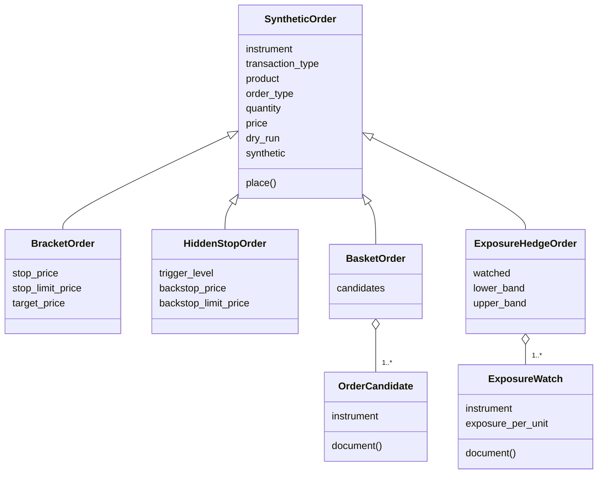

# Synthetic orders

A synthetic order is an order that no Indian exchange offers, such as a bracket, a trailing stop, an iceberg or an order sliced over half an hour. UBI's order engine builds each one out of ordinary broker orders: it places them, watches them, changes them and cancels them for you. The package `tradingmachine.orders` has one class for each of the forty-two types the engine runs. Each class only describes the order and sends the description; all the work happens in UBI.

!!! danger "These are real orders"
    `place()` sends real orders through UBI to real brokers, with real money. Many of these types keep acting after `place()` has returned: a trigger fires hours later, a trailing stop moves all day, a grid trades back and forth, a good-till-triggered order waits for up to a year. Construct every order with `dry_run=True` first, which has UBI build the first broker request and return it without recording or sending anything.

!!! warning "UBI's order engine must be running"
    Only UBI's order engine understands a synthetic order. UBI in direct mode would check the `synthetic` object's shape and then place the template as one plain order, so a bracket would go out with no stop and no target. The library therefore checks the mode before the first such order a client sends, and raises `DirectPlacementError` without sending anything when UBI is not running its engine. [Placement modes](../architecture/placement-modes.md) explains the check.

The table below lists the three classes every synthetic order is built from, and the one method they all share.

| Kind | Member | Description |
|---|---|---|
| <span class="member class">class</span> | [`SyntheticOrder`](#syntheticorder) | The shared base: an order template plus the synthetic type that works it. |
| <span class="member writes">places orders</span> | [`place`](#place) | Sends the order to UBI's order engine through `place_order`. |
| <span class="member class">class</span> | [`OrderCandidate`](#ordercandidate) | One leg of an order that spans several instruments. |
| <span class="member class">class</span> | [`ExposureWatch`](#exposurewatch) | One watched instrument of an exposure hedge. |

## All forty-two types

The table below lists every class, in its family. The module and class names spell out UBI's abbreviations, so UBI's `oto` is `one_triggers_other` here and its `atr_trail` is `average_true_range_trail`. The settings are the class's own keyword arguments, named as UBI names them except for `average_true_range_multiple`, which UBI calls `atr_multiple`, and for arguments that take an instrument object where UBI takes an id. The last column is UBI's first answer: 200 means a broker order goes out when you ask, and 202 means the engine records the order and waits for a price or a time.

| Class | Module | UBI type | Family | What it does | Key settings | First answer |
|---|---|---|---|---|---|:---:|
| [`SimpleOrder`][tradingmachine.orders.simple.SimpleOrder] | `simple` | `simple` | Plain and laddered | One plain order to one broker, with nothing watching it afterwards. Asking for it by name is useful only to set `closes_position`. | none | 200 |
| [`FreezeSlicerOrder`][tradingmachine.orders.freeze_slicer.FreezeSlicerOrder] | `freeze_slicer` | `freeze_slicer` | Plain and laddered | Splits an order above the exchange's freeze quantity into even orders that each fit, all at one broker. | none | 200 |
| [`LadderOrder`][tradingmachine.orders.ladder.LadderOrder] | `ladder` | `ladder` | Plain and laddered | Places several limit orders spaced evenly between two prices, sharing the quantity between them. | `from_price`, `to_price`, `steps` | 200 |
| [`GridOrder`][tradingmachine.orders.grid.GridOrder] | `grid` | `grid` | Plain and laddered | Rests buys below the market and sells above it, and each fill places its opposite one step away. | `levels`, `step_points`, `most_inventory` | 200 |
| [`OneTriggersOtherOrder`][tradingmachine.orders.one_triggers_other.OneTriggersOtherOrder] | `one_triggers_other` | `oto` | Linked orders | Places a second order, sized to what actually filled, once the first one fills. | `then_transaction_type`, `then_order_type`, `then_price`, `then_trigger_price`, `then_product`, `then_validity` | 200 |
| [`OneCancelsOtherOrder`][tradingmachine.orders.one_cancels_other.OneCancelsOtherOrder] | `one_cancels_other` | `oco` | Linked orders | Rests a stop and a target on a position already held, each shrinking as the other fills. | `stop_price`, `stop_limit_price`, `target_price` | 200 |
| [`BracketOrder`][tradingmachine.orders.bracket.BracketOrder] | `bracket` | `bracket` | Linked orders | An entry that arms a stop and a target behind itself on its first fill, even a partial one. | `stop_price`, `stop_limit_price`, `target_price` | 200 |
| [`CoverOrder`][tradingmachine.orders.cover.CoverOrder] | `cover` | `cover` | Linked orders | An entry with a compulsory stop and no target. | `stop_price`, `stop_limit_price` | 200 |
| [`ScaleOutOrder`][tradingmachine.orders.scale_out.ScaleOutOrder] | `scale_out` | `scale_out` | Linked orders | A bracket with several targets that take the position off in tranches, and a stop that moves to breakeven. | `target_prices`, `stop_price`, `stop_limit_price`, `breakeven_after` | 200 |
| [`TwoSidedBreakoutOrder`][tradingmachine.orders.two_sided_breakout.TwoSidedBreakoutOrder] | `two_sided_breakout` | `two_sided_breakout` | Linked orders | A buy stop above a range and a sell stop below it, where the first to fire cancels the other. | `buy_trigger`, `buy_limit`, `sell_trigger`, `sell_limit`, optional `stop_price`, `stop_limit_price`, `target_price` | 200 |
| [`OneCancelsAllOrder`][tradingmachine.orders.one_cancels_all.OneCancelsAllOrder] | `one_cancels_all` | `oca` | Linked orders | Several candidate entries, each on its own instrument, where the first fill cancels all the rest. | `candidates` | 200 |
| [`MarketIfTouchedOrder`][tradingmachine.orders.market_if_touched.MarketIfTouchedOrder] | `market_if_touched` | `market_if_touched` | Price triggers | Waits unseen for the price to touch a level, then takes what is there with a marketable limit. | `trigger_price`, `trigger_direction`, `buffer_ticks` | 202 |
| [`LimitIfTouchedOrder`][tradingmachine.orders.limit_if_touched.LimitIfTouchedOrder] | `limit_if_touched` | `limit_if_touched` | Price triggers | Waits for the price to touch a level, then rests a limit at another price. | `trigger_price`, `limit_price`, `trigger_direction` | 202 |
| [`CrossInstrumentOrder`][tradingmachine.orders.cross_instrument.CrossInstrumentOrder] | `cross_instrument` | `cross_instrument` | Price triggers | A limit-if-touched order whose trigger watches the last price of a different instrument. | `watch_instrument`, `trigger_price`, `limit_price`, `trigger_direction` | 202 |
| [`IndicatorTriggeredOrder`][tradingmachine.orders.indicator_triggered.IndicatorTriggeredOrder] | `indicator_triggered` | `indicator_triggered` | Price triggers | Sends a limit when one field of the live quote, such as the day's average price, crosses a level. | `trigger_price`, `limit_price`, `watch_field`, `trigger_direction` | 202 |
| [`GoodTillTriggeredOrder`][tradingmachine.orders.good_till_triggered.GoodTillTriggeredOrder] | `good_till_triggered` | `gtt` | Price triggers | A limit-if-touched order that keeps waiting across days until it fires or expires. | `trigger_price`, `limit_price`, `valid_days`, `trigger_direction` | 202 |
| [`HiddenStopOrder`][tradingmachine.orders.hidden_stop.HiddenStopOrder] | `hidden_stop` | `hidden_stop` | Stops and trailing | A stop kept inside UBI that watches the bid or the offer, with an optional real stop behind it. | `trigger_price`, `backstop_price`, `backstop_limit_price`, `buffer_ticks`, `trigger_direction` | 202 |
| [`CandleCloseStopOrder`][tradingmachine.orders.candle_close_stop.CandleCloseStopOrder] | `candle_close_stop` | `candle_close_stop` | Stops and trailing | A hidden stop that fires only when a whole bar closes past the level. | `trigger_price`, `bar_minutes`, `backstop_price`, `backstop_limit_price`, `buffer_ticks`, `trigger_direction` | 202 |
| [`TrailingStopOrder`][tradingmachine.orders.trailing_stop.TrailingStopOrder] | `trailing_stop` | `trailing_stop` | Stops and trailing | A real stop at the broker whose trigger follows the market up, never down. | `stop_limit_offset`, `trail_points` or `trail_percent`, `step_ticks` | 200 |
| [`TrailingEntryOrder`][tradingmachine.orders.trailing_entry.TrailingEntryOrder] | `trailing_entry` | `trailing_entry` | Stops and trailing | A stop entry that follows a falling market down, so the first bounce of the trailing distance fills it. | `stop_limit_offset`, `trail_points` or `trail_percent`, `step_ticks` | 200 |
| [`AverageTrueRangeTrailOrder`][tradingmachine.orders.average_true_range_trail.AverageTrueRangeTrailOrder] | `average_true_range_trail` | `atr_trail` | Stops and trailing | A trailing stop whose distance is a multiple of the recent average true range. | `trail_points`, `stop_limit_offset`, `bar_minutes`, `periods`, `average_true_range_multiple`, `step_ticks` | 200 |
| [`DailyStopOrder`][tradingmachine.orders.daily_stop.DailyStopOrder] | `daily_stop` | `daily_stop` | Stops and trailing | A native stop placed afresh every morning for a position held overnight. | `stop_price`, `stop_limit_price`, `arm_at`, `valid_days` | 202 |
| [`PegOrder`][tradingmachine.orders.peg.PegOrder] | `peg` | `peg` | Book-following limits | A limit order kept re-priced to your own side's best price, the midpoint or the other side as the book moves. | `reference`, `offset_ticks`, `cap_price` | 200 |
| [`ChaserOrder`][tradingmachine.orders.chaser.ChaserOrder] | `chaser` | `chaser` | Book-following limits | A limit order that starts on its own side of the book and steps towards the other until it fills. | `step_ticks`, `step_seconds`, `cap_price`, `cross_after_seconds` | 200 |
| [`PostOnlyOrder`][tradingmachine.orders.post_only.PostOnlyOrder] | `post_only` | `post_only` | Book-following limits | A limit order checked to rest rather than trade before it is sent. | `on_crossing` | 200 |
| [`DiscretionaryOrder`][tradingmachine.orders.discretionary.DiscretionaryOrder] | `discretionary` | `discretionary` | Book-following limits | A limit order that shows one price and quietly takes a slightly worse one when it comes within reach. | `discretion_points`, `discretion_quantity` | 200 |
| [`VirtualLimitOrder`][tradingmachine.orders.virtual_limit.VirtualLimitOrder] | `virtual_limit` | `virtual_limit` | Book-following limits | A limit order held inside UBI and sent only when the other side of the book reaches its price. | `paper` | 202 |
| [`TimeWeightedAveragePriceOrder`][tradingmachine.orders.time_weighted_average_price.TimeWeightedAveragePriceOrder] | `time_weighted_average_price` | `twap` | Execution algorithms | A large order sent as equal slices at even intervals over a period. | `slices`, `over_minutes` | 200 |
| [`VolumeWeightedAveragePriceOrder`][tradingmachine.orders.volume_weighted_average_price.VolumeWeightedAveragePriceOrder] | `volume_weighted_average_price` | `vwap` | Execution algorithms | A time-sliced order whose slice sizes follow the shape of the day's volume. | `slices`, `over_minutes`, `volume_profile` | 200 |
| [`ImplementationShortfallOrder`][tradingmachine.orders.implementation_shortfall.ImplementationShortfallOrder] | `implementation_shortfall` | `implementation_shortfall` | Execution algorithms | A time-sliced order whose slices shrink, so most of it trades early. | `slices`, `over_minutes`, `urgency` | 200 |
| [`ParticipationOrder`][tradingmachine.orders.participation.ParticipationOrder] | `participation` | `participation` | Execution algorithms | Trades a fixed share of the volume the market itself trades. | `participation_percent`, `most_slices` | 202 |
| [`LiquiditySeekingOrder`][tradingmachine.orders.liquidity_seeking.LiquiditySeekingOrder] | `liquidity_seeking` | `liquidity_seeking` | Execution algorithms | Shows nothing and strikes only when enough size appears at an acceptable price. | `limit_price`, `minimum_quantity` | 202 |
| [`IcebergOrder`][tradingmachine.orders.iceberg.IcebergOrder] | `iceberg` | `iceberg` | Execution algorithms | Rests one slice at a time and places the next when that slice fills. | `slice_quantity`, `randomise_percent` | 200 |
| [`AccumulationOrder`][tradingmachine.orders.accumulation.AccumulationOrder] | `accumulation` | `accumulation` | Execution algorithms | Buys a fixed quantity at a fixed interval, like a SIP, each purchase resting on its own side of the book. | `every_minutes`, `purchases` | 200 |
| [`ScheduledOrder`][tradingmachine.orders.scheduled.ScheduledOrder] | `scheduled` | `scheduled` | Time-based | Holds the order until a time of day and then places it. | `at_time` | 202 |
| [`GoodTillTimeOrder`][tradingmachine.orders.good_till_time.GoodTillTimeOrder] | `good_till_time` | `good_till_time` | Time-based | Places the order now and cancels whatever has not filled at a time of day. | `until_time` | 200 |
| [`TimeStopOrder`][tradingmachine.orders.time_stop.TimeStopOrder] | `time_stop` | `time_stop` | Time-based | Places an entry now and closes what filled at a time of day, or after some minutes. | `until_time` or `minutes` | 200 |
| [`SquareOffOrder`][tradingmachine.orders.square_off.SquareOffOrder] | `square_off` | `square_off` | Time-based | At a time of day, cancels resting orders and then closes the day's positions on one product with limit orders. | `at_time`, `product`, `only_instruments` | 202 |
| [`BasketOrder`][tradingmachine.orders.basket.BasketOrder] | `basket` | `basket` | Multi-instrument | Orders on several instruments placed in one request, each reported on its own. | `candidates` | 200 |
| [`LeggedSpreadOrder`][tradingmachine.orders.legged_spread.LeggedSpreadOrder] | `legged_spread` | `legged_spread` | Multi-instrument | A two-legged spread worked passively on the first leg and completed on the second at the price that makes the net. | `first_leg`, `second_leg`, `net_price` | 200 |
| [`StrategyStopOrder`][tradingmachine.orders.strategy_stop.StrategyStopOrder] | `strategy_stop` | `strategy_stop` | Multi-instrument | A basket whose every leg is closed when the whole strategy's profit or loss crosses a line. | `candidates`, `loss_limit`, `profit_target` | 200 |
| [`ExposureHedgeOrder`][tradingmachine.orders.exposure_hedge.ExposureHedgeOrder] | `exposure_hedge` | `exposure_hedge` | Multi-instrument | Trades one hedge instrument whenever the watched instruments' net exposure leaves a band. | `watched`, `lower_band`, `upper_band`, `hedge_exposure_per_unit` | 202 |

Each class name links to its page in the generated reference, which lists every argument with its default. UBI's [glossary by family](https://pramodathani.github.io/unified_broker_interface/rest-api/synthetic-orders/#glossary-by-family) gives the rules UBI applies to each setting.

The chart below counts the types in each family and splits them by their first answer. Every price trigger waits, and every linked order acts at once, which is a quick guide to whether an order is in the market as soon as you place it.

```vegalite
{
  "$schema": "https://vega.github.io/schema/vega-lite/v5.json",
  "description": "Synthetic order types in each family, split by whether the first answer is 200 or 202",
  "width": "container",
  "height": 280,
  "data": {
    "values": [
      {"family": "Linked orders", "answer": "200: acts at once", "types": 7},
      {"family": "Execution algorithms", "answer": "200: acts at once", "types": 5},
      {"family": "Execution algorithms", "answer": "202: waits", "types": 2},
      {"family": "Stops and trailing", "answer": "200: acts at once", "types": 3},
      {"family": "Stops and trailing", "answer": "202: waits", "types": 3},
      {"family": "Book-following limits", "answer": "200: acts at once", "types": 4},
      {"family": "Book-following limits", "answer": "202: waits", "types": 1},
      {"family": "Price triggers", "answer": "202: waits", "types": 5},
      {"family": "Plain and laddered", "answer": "200: acts at once", "types": 4},
      {"family": "Time-based", "answer": "200: acts at once", "types": 2},
      {"family": "Time-based", "answer": "202: waits", "types": 2},
      {"family": "Multi-instrument", "answer": "200: acts at once", "types": 3},
      {"family": "Multi-instrument", "answer": "202: waits", "types": 1}
    ]
  },
  "mark": {"type": "bar", "cornerRadiusEnd": 3},
  "encoding": {
    "y": {"field": "family", "type": "nominal", "sort": "-x", "title": null},
    "x": {"aggregate": "sum", "field": "types", "type": "quantitative", "title": "Number of types", "axis": {"tickMinStep": 1}},
    "color": {"field": "answer", "type": "nominal", "title": "First answer", "scale": {"range": ["#ff7043", "#42a5f5"]}},
    "tooltip": [
      {"field": "family", "type": "nominal", "title": "Family"},
      {"field": "answer", "type": "nominal", "title": "First answer"},
      {"field": "types", "type": "quantitative", "title": "Types"}
    ]
  }
}
```

## How the classes fit together

Every class inherits from `SyntheticOrder`, which holds the ordinary order fields, called the template, and sends them with a `synthetic` object naming the type and holding its settings. A subclass adds only its own settings. The five multi-instrument classes also take small helper objects, one per instrument. The class diagram below shows the shape with a few of the forty-two.



## SyntheticOrder

<div class="endpoint" markdown><span class="member class">class</span> `SyntheticOrder(instrument, *, transaction_type, product, order_type, quantity, price=None, trigger_price=None, validity=None, disclosed_quantity=None, after_market=False, tag=None, price_reference=None, quantity_reference=None, closes_position=False, dry_run=False)`</div>

`SyntheticOrder` is the shared base of every class on this page, and it is the `simple` type itself. You normally construct one of its subclasses instead. Every argument after the instrument is keyword-only, so a class's settings can never be passed in the wrong position.

The template fields are validated by UBI exactly as a plain order's are, with the rules on [Placing and reading orders](orders.md#glossary-of-plain-strings), and most types use the template for every real order they send, changing only what they must. The library checks nothing before sending.

#### Parameters

The table below lists the template fields every class accepts. A class may make one of them required, fix it, or leave it out, and the generated reference shows the exact signature of each.

| Name | Type | Required | Default | Description |
|---|---|:---:|---|---|
| `instrument` | `TradeableInstrument` | yes | | The instrument to trade. |
| `transaction_type` | `str` | yes | | `buy` or `sell`. |
| `product` | `str` | yes | | `cnc`, `mis` or `nrml`. |
| `order_type` | `str` | yes | | `market`, `limit`, `sl` or `sl-m`. |
| `quantity` | `int` or `None` | yes | | The quantity in units, or `None` when a `quantity_reference` supplies it. |
| `price` | `float` or `None` | no | `None` | The template's limit price in rupees. |
| `trigger_price` | `float` or `None` | no | `None` | The template's own trigger price. In seven classes this argument means something else; see [The trigger level](#the-trigger-level). |
| `validity` | `str` or `None` | no | `None` | `day` or `ioc`. |
| `disclosed_quantity` | `int` or `None` | no | `None` | The part of each order to show on the exchange. |
| `after_market` | `bool` | no | `False` | `True` sends after-market orders. |
| `tag` | `str` or `None` | no | `None` | A label of up to twenty letters and digits. |
| `price_reference` | `dict` or `None` | no | `None` | A price for UBI to work out, as on [Price wrappers](price-wrappers.md#the-seven-price-references). |
| `quantity_reference` | `dict` or `None` | no | `None` | A quantity for UBI to work out, as on [Positions](positions.md#the-quantity-reference-ubi-resolves). |
| `closes_position` | `bool` | no | `False` | `True` says every order this type sends closes a position, so it may use the part of a broker's daily order cap that UBI keeps for exits. |
| `dry_run` | `bool` | no | `False` | `True` has UBI build the first broker request and return it without recording or sending anything. |

Every argument is stored as a public attribute of the same name, and the `synthetic` property gives the object that will be sent: the type, every setting that is not `None`, and `closes_position` when it is `True`.

Not every type works a reference out. UBI resolves references for most single-instrument types, but nine types never call its resolver, so they need real numbers: `ladder`, `two_sided_breakout`, `basket`, `oca`, `legged_spread`, `strategy_stop`, `exposure_hedge`, `square_off` and `daily_stop`. UBI's page on [which order types resolve references](https://pramodathani.github.io/unified_broker_interface/rest-api/price-quantity-references/#which-order-types-resolve-references) has the full list.

### place

<div class="endpoint" markdown><span class="member writes">places orders</span> `place()`<span class="route"><span class="method post">POST</span> `/api/orders/place`</span></div>

This method sends the order to UBI's order engine by calling the instrument's [`place_order`](orders.md#place_order) with the template fields and the `synthetic` object. It takes no arguments; everything, including `dry_run`, was given when the object was built.

#### Example

The example below builds the same bracket twice, first as a dry run to check it, then for real. A bracket buys ten shares at 1000 rupees and, on the first fill, arms a stop at 990 with a limit of 988 and a target at 1010. It is built from the class's own docstring; no output was captured, because the real call places orders.

=== "Python"

    ```python
    from tradingmachine.assets import equities
    from tradingmachine.orders import bracket

    reliance = equities.Equity("nse", "RELIANCE")

    settings = {
        "transaction_type": "buy",
        "product": "mis",
        "order_type": "limit",
        "quantity": 10,
        "price": 1000.0,
        "stop_price": 990.0,
        "stop_limit_price": 988.0,
        "target_price": 1010.0,
    }

    preview = bracket.BracketOrder(reliance, dry_run=True, **settings).place()
    print(preview["request"])

    order = bracket.BracketOrder(reliance, **settings)
    print(order.synthetic)
    answer = order.place()
    parent_id = answer["parent_id"]
    ```

=== "The synthetic object"

    ```python
    {'type': 'bracket', 'stop_price': 990.0, 'stop_limit_price': 988.0, 'target_price': 1010.0}
    ```

The second tab is what `order.synthetic` gives for these settings, worked out from the code.

#### Returns

The `dict` that `place_order` returns. A type that acts at once answers with the broker's answer plus a `parent_id`. A type that waits for a price or a time answers with HTTP 202, an `outcome` of `armed` or `scheduled`, a `broker` and an `order_id` of `None`, and a `parent_id`. The answer below is UBI's recorded example for a `market_if_touched` buy waiting for 995, from UBI's offline test suite.

```json
{
  "broker": null,
  "instrument_id": "11111111-1111-5111-8111-000000000001",
  "order_id": null,
  "outcome": "armed",
  "parent_id": "<uuid4>",
  "skipped": [],
  "status_message": "the order is recorded and will be placed when the price touches the level",
  "tag": null,
  "trigger_direction": "at_or_below",
  "trigger_level": "995"
}
```

Keep the `parent_id`. It is the only handle on an order that has not reached a broker yet, and the library has no member that lists or cancels such an order, because UBI has no route for it.

#### Raises

| Exception | When |
|---|---|
| `BadRequestError` | A template field is invalid, or one of the type's own settings is missing or wrong. |
| `LossLockoutError` | The day's loss is past UBI's daily loss limit. |
| `ConflictError` | The engine refused to act on the account's state, such as a post-only order that would cross the book. |
| `RateLimitError` | The broker's daily order cap has no room for this order. |
| `ServiceUnavailableError` | No broker could take the order, or a price UBI needed could not be read. |
| `OrderOutcomeUnknownError` | The engine did not answer in time, so the order may still be placed. Read the order book before trying again. |
| `DirectPlacementError` | UBI is placing orders directly, so it would place the template as a plain order. Nothing was sent. |
| `UnifiedBrokerInterfaceError` | Any other failure reported by, or on the way to, UBI. |

## The trigger level

In seven classes the `trigger_price` argument is not the trigger of the order that is eventually sent. It is the level UBI watches before sending anything, and UBI calls that field `trigger_price` inside the `synthetic` object. To keep the two meanings apart, these classes store the argument as the attribute `trigger_level`, leave the template's own `trigger_price` empty, and send the level as `synthetic.trigger_price`. The table below lists the seven and what each level watches.

| Class | What the level watches |
|---|---|
| `MarketIfTouchedOrder` | The last traded price of this instrument |
| `LimitIfTouchedOrder` | The last traded price of this instrument |
| `CrossInstrumentOrder` | The last traded price of `watch_instrument`, a different instrument |
| `IndicatorTriggeredOrder` | One field of the live quote, chosen by `watch_field` |
| `GoodTillTriggeredOrder` | The last traded price, across days |
| `HiddenStopOrder` | The bid when protecting a long position, the offer when protecting a short one |
| `CandleCloseStopOrder` | The close of each bar, built from UBI's own ticks |

In all seven, `trigger_price` is a required argument and `trigger_direction`, `at_or_above` or `at_or_below`, is optional, because UBI works it out from the side. The example below shows the difference for a hidden stop, worked out from the code.

=== "Python"

    ```python
    from tradingmachine.orders import hidden_stop

    order = hidden_stop.HiddenStopOrder(
        reliance,
        transaction_type="buy",
        product="mis",
        order_type="limit",
        quantity=10,
        price=990.0,
        trigger_price=990.0,
        backstop_price=980.0,
        backstop_limit_price=978.0,
        dry_run=True,
    )
    print(order.trigger_price, order.trigger_level)
    print(order.synthetic)
    ```

=== "Output"

    ```python
    None 990.0
    {'type': 'hidden_stop', 'trigger_price': 990.0, 'backstop_price': 980.0, 'backstop_limit_price': 978.0}
    ```

## Orders on several instruments

Five classes act on more than one instrument, and they take helper objects rather than a single instrument. `BasketOrder`, `OneCancelsAllOrder` and `StrategyStopOrder` take a list of `candidates`, `LeggedSpreadOrder` takes a `first_leg` and a `second_leg`, and `ExposureHedgeOrder` takes a list of `watched` instruments plus the hedge instrument.

UBI's route still needs one instrument to anchor the request, so the first candidate's instrument, or the first leg's, becomes the order's `instrument`. A dry run of a basket prepares only that first candidate's order. `BasketOrder`, `OneCancelsAllOrder` and `StrategyStopOrder` raise `ValueError` when given no candidate at all, because there would be nothing to anchor the request.

!!! warning "A candidate inherits the whole template"
    UBI lays each candidate's fields over the whole template, so a template `price` is carried into a candidate that sets `order_type` to `market`, and UBI then refuses the market order because it carries a price. Give such a template no price, or give each candidate its own. The same trap applies to `OneTriggersOtherOrder`'s `then_order_type`.

### OrderCandidate

<div class="endpoint" markdown><span class="member class">class</span> `OrderCandidate(instrument, *, transaction_type=None, product=None, order_type=None, validity=None, quantity=None, price=None, trigger_price=None, tag=None)`</div>

An `OrderCandidate` is one leg of a multi-instrument order: an instrument, and any of eight template fields it overrides. A field left as `None` takes the template's value. Its `document()` method gives the object UBI reads, with `instrument_id` and every field that is set.

#### Parameters

| Name | Type | Required | Default | Description |
|---|---|:---:|---|---|
| `instrument` | `TradeableInstrument` | yes | | The instrument this leg trades. |
| `transaction_type`, `product`, `order_type`, `validity`, `quantity`, `price`, `trigger_price`, `tag` | as on `SyntheticOrder` | no | `None` | The template fields this leg overrides. |

### ExposureWatch

<div class="endpoint" markdown><span class="member class">class</span> `ExposureWatch(instrument, exposure_per_unit=None)`</div>

An `ExposureWatch` names one instrument whose net position counts towards the exposure an `ExposureHedgeOrder` keeps inside its band, and how much exposure each unit carries. UBI has no option pricing model, so the delta of an option is yours to supply as `exposure_per_unit`. Its `document()` method gives the object UBI reads.

#### Parameters

| Name | Type | Required | Default | Description |
|---|---|:---:|---|---|
| `instrument` | `Instrument` | yes | | The instrument whose net position is counted. |
| `exposure_per_unit` | `float` or `None` | no | `None` | The exposure one unit carries, such as an option's delta. UBI counts 1 when it is `None`. |

## By family

The tabs below group the forty-two classes into UBI's eight families, which UBI's documentation uses to make the list easier to scan; neither UBI's code nor this package groups them. Each tab has one example, taken from the classes' own docstrings, and every example is a dry run. In the examples, `reliance` and `infosys` are `Equity` objects and `nifty_call` and `nifty_put` are `EquityIndexOption` objects.

=== "Plain and laddered"

    These four types act at once and place everything they need when you ask. `SimpleOrder` is a plain order, useful by name only to set `closes_position`. `FreezeSlicerOrder` splits an order above the exchange's freeze quantity into even slices at one broker, so 250 against a limit of 100 goes as 84, 83 and 83, and the answer carries a list of `order_ids`. `LadderOrder` shares the quantity across evenly spaced limit orders and then does nothing more, so its rungs keep working at the broker whether or not UBI is running. `GridOrder` rests buys below and sells above the market and replaces each fill with its opposite, and `most_inventory` caps the position a trending market can build.

    The example below spreads a buy of 100 shares over three limit orders between 995 and 1000 rupees, which share it as 34, 33 and 33.

    ```python
    from tradingmachine.orders import ladder

    order = ladder.LadderOrder(
        reliance,
        transaction_type="buy",
        product="cnc",
        order_type="limit",
        quantity=100,
        price=1000.0,
        from_price=995.0,
        to_price=1000.0,
        steps=3,
        dry_run=True,
    )
    answer = order.place()
    ```

=== "Linked orders"

    These seven types place orders that watch each other, so a fill on one changes, places or cancels another. A linked exit is reduced by what its sibling filled rather than cancelled, so a position is never left unprotected. Every stop is a stop-limit, so a stop always needs both `stop_price` and `stop_limit_price`.

    - `BracketOrder` arms a stop and a target on the entry's first fill, even a partial one, and grows them as more fills.
    - `CoverOrder` is a bracket with a compulsory stop and no target.
    - `OneCancelsOtherOrder` protects a position you already hold. Set `transaction_type` to the side that opened it, so a long position is protected by asking for `buy`.
    - `ScaleOutOrder` takes a position off in tranches at several `target_prices` and moves the stop to breakeven after `breakeven_after` of them fill.
    - `OneTriggersOtherOrder` places a second order, described by the `then_` settings, sized to what the first filled.
    - `TwoSidedBreakoutOrder` rests native buy and sell stops around a range, so they fire at exchange speed even if UBI is down, and cancels the one that did not fire.
    - `OneCancelsAllOrder` takes several candidates on different instruments and cancels the rest on the first fill.

    The example below buys ten shares at 1000 rupees with a stop at 990 and a target at 1010.

    ```python
    from tradingmachine.orders import bracket

    order = bracket.BracketOrder(
        reliance,
        transaction_type="buy",
        product="mis",
        order_type="limit",
        quantity=10,
        price=1000.0,
        stop_price=990.0,
        stop_limit_price=988.0,
        target_price=1010.0,
        dry_run=True,
    )
    answer = order.place()
    ```

=== "Price triggers"

    These five types send nothing until a price touches a level, so their first answer is 202 with an `outcome` of `armed`, and each stores its level as `trigger_level`, as [The trigger level](#the-trigger-level) explains. `MarketIfTouchedOrder` buys on a dip or sells on a rise, which a native stop cannot do, because a native stop only fires when the price moves against you. `LimitIfTouchedOrder` rests a limit at `limit_price` once touched. `CrossInstrumentOrder` watches a different instrument, so an option can be exited when the index crosses a level rather than when its own thin book spikes. `IndicatorTriggeredOrder` watches one field of the quote, most usefully `average_price`. `GoodTillTriggeredOrder` is what brokers sell as GTT: it waits across days, 30 by default and up to 365.

    The example below sells ten shares held for delivery if the price falls to 950, resting a limit at 951.

    ```python
    from tradingmachine.orders import good_till_triggered

    order = good_till_triggered.GoodTillTriggeredOrder(
        reliance,
        transaction_type="sell",
        product="cnc",
        order_type="limit",
        quantity=10,
        price=951.0,
        trigger_price=950.0,
        limit_price=951.0,
        dry_run=True,
    )
    answer = order.place()
    ```

=== "Stops and trailing"

    These six types protect a position. Two of them keep the stop inside UBI, where the book cannot see it: `HiddenStopOrder` watches the bid or the offer, and `CandleCloseStopOrder` fires only when a whole bar closes past the level, so a brief wick does not stop you out. A hidden stop protects nothing while UBI is down, which is what the optional backstop is for, a real stop-loss limit placed at the broker when the order is armed. The other four put a real stop at the broker: `TrailingStopOrder` moves its trigger up with the market and never down, `TrailingEntryOrder` is its mirror for entering, `AverageTrueRangeTrailOrder` trails by a multiple of the recent average true range, and `DailyStopOrder` re-places a native stop every morning, because native stops expire at the end of the day.

    The example below buys ten shares and trails a stop five rupees behind the best price, with its limit two rupees past the trigger.

    ```python
    from tradingmachine.orders import trailing_stop

    order = trailing_stop.TrailingStopOrder(
        reliance,
        transaction_type="buy",
        product="mis",
        order_type="limit",
        quantity=10,
        price=1000.0,
        trail_points=5.0,
        stop_limit_offset=2.0,
        dry_run=True,
    )
    answer = order.place()
    ```

=== "Book-following limits"

    These five types manage a limit order against the live book. `PegOrder` re-prices it to your own side's best price, the midpoint or the other side, and every re-price is a real modification that loses the order's place in the queue. `ChaserOrder` starts on its own side and steps towards the other until it fills, crossing outright after `cross_after_seconds` and never beyond `cap_price`. `PostOnlyOrder` checks the book before sending, because Indian exchanges have no post-only flag; with `on_crossing="refuse"` an order that would cross is refused with HTTP 409. `DiscretionaryOrder` shows one price and takes a slightly worse one when it comes within `discretion_points`. `VirtualLimitOrder` holds the limit inside UBI until the other side reaches it, and with `paper=True` never sends anything at all.

    The example below keeps a buy of ten shares pegged to the midpoint, never paying more than 1005 rupees.

    ```python
    from tradingmachine.orders import peg

    order = peg.PegOrder(
        reliance,
        transaction_type="buy",
        product="mis",
        order_type="limit",
        quantity=10,
        price=1000.0,
        reference="mid",
        cap_price=1005.0,
        dry_run=True,
    )
    answer = order.place()
    ```

=== "Execution algorithms"

    These seven types work a large order into the market over time or against liquidity. `TimeWeightedAveragePriceOrder` sends equal slices at even intervals, `VolumeWeightedAveragePriceOrder` sizes them to the day's usual volume, and `ImplementationShortfallOrder` makes them shrink so that most of the order trades early, becoming a plain time-weighted order at an `urgency` of 0. `ParticipationOrder` trades a fixed share of the market's own volume. `LiquiditySeekingOrder` shows nothing and strikes only when `minimum_quantity` is visible at `limit_price` or better. `IcebergOrder` shows one slice at a time. `AccumulationOrder` buys a fixed quantity at a fixed interval, like a SIP. The three time-sliced types and `AccumulationOrder` work a `price_reference` out afresh for every order they send, while the others work it out once, when UBI takes the order.

    The example below buys 600 shares in six slices over thirty minutes, each priced to fill at once.

    ```python
    from tradingmachine.orders import time_weighted_average_price

    order = time_weighted_average_price.TimeWeightedAveragePriceOrder(
        reliance,
        transaction_type="buy",
        product="cnc",
        order_type="limit",
        quantity=600,
        price_reference={"kind": "marketable"},
        slices=6,
        over_minutes=30.0,
        dry_run=True,
    )
    answer = order.place()
    ```

=== "Time-based"

    These four types act at a time of day, written as `HH:MM` or `HH:MM:SS` in India time; a time that has already passed today is refused rather than taken to mean tomorrow. `ScheduledOrder` holds the order until `at_time`. `GoodTillTimeOrder` places it now and cancels what has not filled at `until_time`, filling the gap between the exchanges' `day` and `ioc` validities. `TimeStopOrder` closes what the entry filled at `until_time` or after `minutes`, cancelling the unfilled part first. `SquareOffOrder` closes the day's positions on one product at `at_time` with limit orders, after cancelling their resting orders, instead of leaving it to the broker's automatic square-off with its market order and fee. It leaves overnight positions alone, which is the difference from [`Account.flatten`](account.md#flatten), and it sets `closes_position` by default.

    The example below closes every intraday position at 15:05.

    ```python
    from tradingmachine.orders import square_off

    order = square_off.SquareOffOrder(
        reliance,
        at_time="15:05",
        product="mis",
        dry_run=True,
    )
    answer = order.place()
    ```

    `SquareOffOrder` takes no side, order type or quantity, because UBI decides them for every closing order from the positions. The route still needs a template, so the library fills it with placeholders, a `sell` `market` order for a quantity of 1. It also translates `product` into the positions' spelling, so the example sends `{'type': 'square_off', 'at_time': '15:05', 'product': 'intraday', 'closes_position': True}`. The instrument you pass only anchors the request and does not limit what is closed; `only_instruments` does that.

=== "Multi-instrument"

    These four types trade several instruments together, as [Orders on several instruments](#orders-on-several-instruments) explains. `BasketOrder` places one order per candidate and does nothing afterwards. `LeggedSpreadOrder` rests the first leg and, as it fills, takes the second at whatever price makes the pair come to `net_price`; between the two fills the position is one-legged, because only an exchange's own multi-leg order can guarantee a net price. `StrategyStopOrder` places a basket and closes every leg when the combined profit or loss falls to `loss_limit` or rises to `profit_target`. `ExposureHedgeOrder` adds up the watched instruments' net positions, each weighted by its exposure per unit, and trades the hedge instrument whenever the total leaves the band; UBI decides the side and quantity of every hedge, so the library sends a placeholder `buy` `market` template for a quantity of 1.

    The example below keeps the net delta of two NIFTY options between -75 and 75 by trading a NIFTY future.

    ```python
    from tradingmachine.orders import exposure_hedge, exposure_watch

    order = exposure_hedge.ExposureHedgeOrder(
        nifty_future,
        watched=[
            exposure_watch.ExposureWatch(nifty_call, exposure_per_unit=0.5),
            exposure_watch.ExposureWatch(nifty_put, exposure_per_unit=-0.4),
        ],
        lower_band=-75.0,
        upper_band=75.0,
        product="nrml",
        dry_run=True,
    )
    answer = order.place()
    ```

## The eight Atlas rows that need no class

UBI's order engine was designed from a catalogue called the Synthetic Order Atlas, and UBI counts 48 buildable order types from it. Forty of them are classes here. Eight need no class, because each is already reachable another way, as the table below shows. The other two classes, `SimpleOrder` and `VirtualLimitOrder`, are in UBI's registry without being Atlas rows, which is how forty plus two makes forty-two.

| Atlas row | How to get it |
|---|---|
| Marketable limit | [`buy_at_marketable_price`](price-wrappers.md#buy_at_marketable_price) and [`sell_at_marketable_price`](price-wrappers.md#sell_at_marketable_price), or a `{"kind": "marketable"}` price reference |
| Market-to-limit | The same marketable price reference |
| Immediate-or-cancel | `validity="ioc"` on any order |
| Stop-market | A plain `place_order` with `order_type="sl-m"` and a `trigger_price` |
| Stop entry | A plain `place_order` with `order_type="sl"` or `sl-m` on the entry side |
| One-updates-other | How every linked type already behaves: a fill on one leg reduces its sibling |
| Kill switch | [`Account.flatten`](account.md#flatten) |
| Daily loss lockout | A UBI setting; an order past the limit raises `LossLockoutError` |

The Atlas also has a group G, seventeen further types found in a second sweep of broker catalogues. They are outside UBI's count, and most are not built in UBI, so they are not built here either.

## What the library does not check

Nothing on this page is validated before sending. The classes do not check that a stop is below an entry, that a time is in the future, that a candidate list has no repeats or that two instruments are related; UBI does all of that and answers with a `BadRequestError` naming the problem. The library's own offline check on 2026-09-26 compared every class's `synthetic` object with UBI's documented example for its type and found all forty-two matched. Whether UBI accepts each class's settings, rather than only their shape, has not yet been confirmed with a dry run against a running engine.
