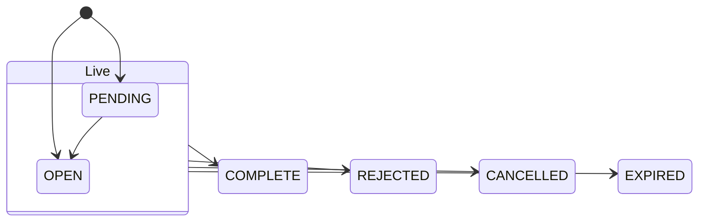

# Vocabulary

This page is the glossary of every plain string the library passes to UBI or hands back from it. The library defines no enums or named constants for these words: UBI already checks them, so a string is sent exactly as you wrote it, and a misspelling comes back as [`BadRequestError`](errors.md#badrequesterror) with UBI's own message.

UBI matches the words you send without regard to case, so `buy`, `Buy` and `BUY` all work. The library's own examples and defaults use lower case. The words UBI sends back, such as order statuses, are always spelled exactly as this page shows them.

The table below is an index of the sections on this page.

| Section | Where you meet it |
|---|---|
| [Transaction types](#transaction-types) | `place_order`, `add_to_position` and the synthetic order classes |
| [Order types](#order-types) | `place_order`, `modify_order` and the synthetic order classes |
| [Products](#products) | Orders, which use one spelling, and positions, which use another |
| [Validity](#validity) | Every order-placing member |
| [Order statuses](#order-statuses) | The `status` column of `orders`, and which property shows which |
| [Outcomes](#outcomes) | The answer to `place_order`, `modify_order` and `cancel_order` |
| [Exchanges](#exchanges) | Every constructor and discovery call |
| [Segments](#segments) | Fixed by each class, and returned in `segment` |
| [Shapes](#shapes) | Returned in `shape` |
| [Option types](#option-types) | The option constructors and the `chain` rows |
| [Intervals](#intervals) | `prices` and every analysis method that fetches candles |
| [Price reference kinds](#price-reference-kinds) | `place_order(price_reference=...)` and the price wrappers |
| [Quantity reference kinds](#quantity-reference-kinds) | `place_order(quantity_reference=...)` and the position methods |
| [Synthetic order types](#synthetic-order-types) | `place_order(synthetic=...)` and the classes in `tradingmachine.orders` |
| [Placement modes](#placement-modes) | The client's `placement_mode` |
| [Brokers](#brokers) | `carried_by`, the `broker` of a quote or an order, and `broker=` on modify and cancel |

UBI's own glossary is [Constants](https://pramodathani.github.io/unified_broker_interface/rest-api/constants/) on the UBI site, and every value here was checked against it.

## Transaction types

The transaction type is the side of an order. You send it as `transaction_type`.

| Value | Meaning |
|---|---|
| `buy` | Buy |
| `sell` | Sell |

`reduce_position` and `liquidate_position` send `sell` only as a placeholder, because UBI requires a side before its engine reads the quantity reference, and the engine replaces it with whichever side closes the position.

## Order types

The order type says how the price is set. You send it as `order_type`, and UBI refuses with HTTP 400 when the price fields do not fit it.

| Value | Meaning | Needs `price` | Needs `trigger_price` | Must not carry `price` |
|---|---|:---:|:---:|:---:|
| `market` | Trade at the best available price | | | :material-check: |
| `limit` | Trade at `price` or better | :material-check: | | |
| `sl` | Stop-loss limit: becomes a limit order at `price` once the market reaches `trigger_price` | :material-check: | :material-check: | |
| `sl-m` | Stop-loss market: becomes a market order once the market reaches `trigger_price` | | :material-check: | :material-check: |

A `price_reference` stands in for `price`, so a `limit` order can carry a reference instead of a number.

## Products

The product says how a trade is financed and how long it may be held. UBI uses two different spellings for the same idea: one for orders and one for positions. Mixing them up is the most common way to confuse the position methods, so the table below puts them side by side.

| Order product, which you send | Position product, which UBI reports | Meaning |
|---|---|---|
| `cnc` | `delivery` | Cash and carry: a delivery trade, held beyond today. The holdings methods always use it. |
| `mis` | `intraday` | Intraday: squared off by the end of the day |
| `nrml` | `carry` | Normal: a derivative position carried overnight |

The order book and the positions can also report products that `place_order` cannot send, because they include orders placed from a broker's own app. The table below lists them.

| Order product, reported only | Position product, reported only | Meaning |
|---|---|---|
| `CO` | `cover` | Cover order |
| `BO` | `bracket` | Bracket order |
| `MTF` | `margin_trading` | Margin trading facility |

A position under `cover`, `bracket` or `margin_trading` cannot be closed through UBI at all, so the position methods ignore it, and only `liquidate_all_positions` mentions it, as ignored. The `product` argument of `add_to_position`, `reduce_position` and `liquidate_position` takes the order spelling; the `product` inside a `quantity_reference` takes the position spelling. [Positions](positions.md) explains the consequences.

## Validity

The validity says how long an order stays at the exchange. You send it as `validity`, and UBI uses `day` when you leave it out.

| Value | Send | Receive | Meaning |
|---|:---:|:---:|---|
| `day` | :material-check: | :material-check: | Stays until it fills, is cancelled or the day ends |
| `ioc` | :material-check: | :material-check: | Immediate or cancel: whatever does not fill at once is cancelled |
| `GTT` | | :material-check: | Good till triggered, as a broker reports it |
| `GTC` | | :material-check: | Good till cancelled, as a broker reports it |
| `GTD` | | :material-check: | Good till date, as a broker reports it |

Good-till-triggered and good-till-time behaviour that you can send comes from UBI's engine instead, through the `gtt` and `good_till_time` synthetic types below.

## Order statuses

Every broker spells order statuses its own way, and UBI maps them onto six shared values. They arrive in the `status` column of [`orders`](orders.md), and four properties filter on them. The table below shows which property picks which status.

| Status | Finished | Property that selects it | Meaning |
|---|:---:|---|---|
| `PENDING` | | `open_orders` | Received but not yet working, such as waiting for a trigger or for the open |
| `OPEN` | | `open_orders` | Working at the exchange, including partly filled orders |
| `COMPLETE` | :material-check: | `completed_orders` | Filled in full |
| `REJECTED` | :material-check: | `rejected_orders` | Refused by the broker or the exchange |
| `CANCELLED` | :material-check: | `cancelled_orders` | Cancelled, including the rest of a partly filled order |
| `EXPIRED` | :material-check: | none; filter `orders` on its `status` column | Ended at the close of its validity without filling |

The diagram below shows the two live statuses, which `open_orders` selects together, and the four finished ones. A finished status never changes back, which is why UBI refuses to modify or cancel a finished order.

A spelling UBI does not know is passed through upper-cased, so a status outside these six can appear in `orders` and no property will select it.

## Outcomes

Every answer to placing, modifying or cancelling an order carries an `outcome` saying what happened. The table below lists them, with the HTTP status UBI answers with and what the library does with it.

| Value | HTTP status | What the library does | Meaning |
|---|---|---|---|
| `accepted` | 200 | Returns the answer | The broker took the request. The exchange can still refuse the order afterwards, so read its fate from `orders`. |
| `armed` | 202 | Returns the answer | A synthetic order is waiting for a price, and nothing has reached a broker yet |
| `scheduled` | 202 | Returns the answer | A synthetic order is waiting for a time |
| `rejected` | 422 | Raises [`OrderRejectedError`](errors.md#orderrejectederror) | The broker answered and refused |
| `unknown` | 504 | Raises [`OrderOutcomeUnknownError`](errors.md#orderoutcomeunknownerror) | The request may or may not have taken effect, so read the order book before sending it again |

## Exchanges

The exchange is the first part of every instrument's name. You send it to every constructor and discovery call, and it comes back in `exchange`, always lower case.

| Value | Exchange |
|---|---|
| `nse` | National Stock Exchange |
| `bse` | BSE |
| `mcx` | Multi Commodity Exchange |
| `ncdex` | National Commodity and Derivatives Exchange |

UBI also has an exchange called `unknown`, which holds only its `uncategorised` segment. No class in this library covers it, because UBI accepts no orders for it. Not every family is listed on every exchange; [Asset classes](../asset-classes/index.md) says which exchanges each family covers.

## Segments

A segment is one kind of instrument on one exchange. Each named class fixes its own segment, so you never type one unless you build an [`Instrument`](instruments.md#instrument) directly. UBI accepts a bare name such as `equities` and always returns it with the exchange as a prefix, such as `nse_equities`.

The table below lists all twenty-four family segments by family and kind, with the class that fixes each one.

| Kind | Equities | Fixed income | Commodities | Currencies |
|---|---|---|---|---|
| Cash | `equities` `Equity` | `fixed_income` `FixedIncome` | `commodities` `Commodity` | `currencies` `Currency` |
| Futures | `equity_futures` `EquityFutures` | `fixed_income_futures` `FixedIncomeFutures` | `commodity_futures` `CommodityFutures` | `currency_futures` `CurrencyFutures` |
| Options | `equity_options` `EquityOption` | `fixed_income_options` `FixedIncomeOption` | `commodity_options` `CommodityOption` | `currency_options` `CurrencyOption` |
| Index | `equity_indices` `EquityIndex` | `fixed_income_indices` `FixedIncomeIndex` | `commodity_indices` `CommodityIndex` | `currency_indices` `CurrencyIndex` |
| Index futures | `equity_index_futures` `EquityIndexFutures` | `fixed_income_index_futures` `FixedIncomeIndexFutures` | `commodity_index_futures` `CommodityIndexFutures` | `currency_index_futures` `CurrencyIndexFutures` |
| Index options | `equity_index_options` `EquityIndexOption` | `fixed_income_index_options` `FixedIncomeIndexOption` | `commodity_index_options` `CommodityIndexOption` | `currency_index_options` `CurrencyIndexOption` |

The three fund segments stand on their own, as the table below shows.

| Segment | Class |
|---|---|
| `exchange_traded_funds` | `ExchangeTradedFund` |
| `investment_trusts` | `InvestmentTrust` |
| `mutual_funds` | `MutualFund` |

A segment whose name ends in `_indices` is an index, and that suffix is the whole of the library's rule for what cannot be traded. UBI's twenty-eighth segment, `uncategorised`, has no class.

## Shapes

The shape says what kind of instrument a segment holds, and so which fields name one. It comes back in `shape`.

| Value | Identity fields | Segments |
|---|---|---|
| `security` | `symbol` | The cash, index and fund segments |
| `future` | `underlying_symbol`, `expiry_date` | Every `*_futures` segment |
| `option` | `underlying_symbol`, `expiry_date`, `strike_price`, `option_type` | Every `*_options` segment |

## Option types

The option type says whether an option is a call or a put. You send it as `option_type`, and UBI upper-cases it, so `ce` works too.

| Value | Meaning |
|---|---|
| `CE` | Call option |
| `PE` | Put option |

## Intervals

The interval is the length of one candle. You send it to [`prices`](market-data.md#prices) and to every analysis method that fetches its own candles, and it defaults to `day`.

| Value | Candle length |
|---|---|
| `day` | One trading day |
| `1minute`, `2minute`, `3minute`, `4minute`, `5minute` | One to five minutes |
| `10minute`, `15minute`, `20minute`, `25minute`, `30minute`, `45minute` | Ten to forty-five minutes |
| `60minute`, `120minute`, `180minute`, `240minute` | One to four hours |

An intraday range may span at most 366 days. A `day` range has no limit.

## Price reference kinds

A `price_reference` describes a price instead of stating it, and UBI's engine works the number out from the live quote when it sends the order, rounded to the tick. It is a dict with a `kind`, sent through `place_order`. The table below lists the kinds, the extra fields each reads, and the [price wrappers](price-wrappers.md) that send it.

| `kind` | Also reads | Sent by |
|---|---|---|
| `absolute` | `price`, above zero | none of the wrappers |
| `bid_level` | `level`, 1 to 5, default 1 | `buy_at_best_bid_price`, `sell_at_best_bid_price`, and the `second` to `fifth_best_bid` wrappers |
| `offer_level` | `level`, 1 to 5, default 1 | `buy_at_best_offer_price`, `sell_at_best_offer_price`, and the `second` to `fifth_best_offer` wrappers |
| `mid` | | `buy_at_mid_price`, `sell_at_mid_price` |
| `vwap` | | `buy_at_volume_weighted_average_price`, `sell_at_volume_weighted_average_price` |
| `last` | | `buy_at_last_price`, `sell_at_last_price` |
| `marketable` | `buffer_percent`, optional | `buy_at_marketable_price`, `sell_at_marketable_price` |

Any kind may also carry `buffer_percent`, `offset_percent` and `offset_ticks`. The market and limit wrappers send no reference at all. [Price and quantity references](https://pramodathani.github.io/unified_broker_interface/rest-api/price-quantity-references/) on the UBI site explains how each kind is resolved.

## Quantity reference kinds

A `quantity_reference` describes a quantity instead of stating it, and UBI's engine works it out from the positions. It is a dict with a `kind` and an optional `product`, which is spelled the positions' way, such as `intraday`.

| `kind` | Meaning | Sent by |
|---|---|---|
| `absolute` | Use the `quantity` sent | none of the library's methods |
| `add_to_position` | Use the `quantity` sent; the engine does not read the position | none; [`add_to_position`](positions.md#add_to_position) works out the side itself |
| `reduce_position` | Close part of the position, with `quantity` as a ceiling | [`reduce_position`](positions.md#reduce_position) |
| `liquidate_position` | Close the whole position and choose the side that closes it | [`liquidate_position`](positions.md#liquidate_position) |

## Synthetic order types

A `synthetic` dict makes an order one of the forty-two order types UBI's engine runs. Its `type` names the kind. The classes in `tradingmachine.orders` build the dict, and their module names spell out UBI's abbreviations; the table below maps each type to its class.

| `type` | Class | `type` | Class |
|---|---|---|---|
| `simple` | `SimpleOrder` | `peg` | `PegOrder` |
| `freeze_slicer` | `FreezeSlicerOrder` | `chaser` | `ChaserOrder` |
| `ladder` | `LadderOrder` | `post_only` | `PostOnlyOrder` |
| `grid` | `GridOrder` | `discretionary` | `DiscretionaryOrder` |
| `oto` | `OneTriggersOtherOrder` | `virtual_limit` | `VirtualLimitOrder` |
| `oco` | `OneCancelsOtherOrder` | `market_if_touched` | `MarketIfTouchedOrder` |
| `bracket` | `BracketOrder` | `limit_if_touched` | `LimitIfTouchedOrder` |
| `cover` | `CoverOrder` | `cross_instrument` | `CrossInstrumentOrder` |
| `scale_out` | `ScaleOutOrder` | `indicator_triggered` | `IndicatorTriggeredOrder` |
| `two_sided_breakout` | `TwoSidedBreakoutOrder` | `gtt` | `GoodTillTriggeredOrder` |
| `scheduled` | `ScheduledOrder` | `hidden_stop` | `HiddenStopOrder` |
| `good_till_time` | `GoodTillTimeOrder` | `candle_close_stop` | `CandleCloseStopOrder` |
| `time_stop` | `TimeStopOrder` | `trailing_stop` | `TrailingStopOrder` |
| `square_off` | `SquareOffOrder` | `trailing_entry` | `TrailingEntryOrder` |
| `twap` | `TimeWeightedAveragePriceOrder` | `atr_trail` | `AverageTrueRangeTrailOrder` |
| `vwap` | `VolumeWeightedAveragePriceOrder` | `daily_stop` | `DailyStopOrder` |
| `implementation_shortfall` | `ImplementationShortfallOrder` | `basket` | `BasketOrder` |
| `participation` | `ParticipationOrder` | `oca` | `OneCancelsAllOrder` |
| `liquidity_seeking` | `LiquiditySeekingOrder` | `legged_spread` | `LeggedSpreadOrder` |
| `iceberg` | `IcebergOrder` | `strategy_stop` | `StrategyStopOrder` |
| `accumulation` | `AccumulationOrder` | `exposure_hedge` | `ExposureHedgeOrder` |

Note that `vwap` is both a price reference kind and a synthetic type, and the two mean different things: the first prices one order at the day's average, and the second works an order over time. [Synthetic orders](synthetic-orders.md) documents each class.

## Placement modes

The placement mode says who sends orders to the brokers. It is set on UBI with `UNIFIED_BROKER_INTERFACE_API_ORDER_PLACEMENT`, and the client records what it has seen in [`placement_mode`](client.md#placement_mode).

| Value | Meaning |
|---|---|
| `direct` | UBI's default. The API worker sends the order itself, and ignores any reference or synthetic object. |
| `engine` | The API hands the order to the order engine, which resolves references and runs synthetic orders. This library needs it. |

## Brokers

Every `broker` field uses one of UBI's ten broker codes. You meet them in `carried_by`, in a quote's `broker`, in an order row, and as the optional `broker=` of `modify_order` and `cancel_order`.

| Code | Broker |
|---|---|
| `dhan` | Dhan |
| `flattrade` | Flattrade |
| `fyers` | Fyers |
| `groww` | Groww |
| `indmoney` | INDmoney |
| `kotak` | Kotak Neo |
| `shoonya` | Shoonya |
| `stoxkart` | Stoxkart |
| `wisdom_capital` | Wisdom Capital |
| `zerodha` | Zerodha |

The quote also reports a `source` of `cache` or `broker`, which says whether UBI answered from its Redis or asked a broker while you waited.
